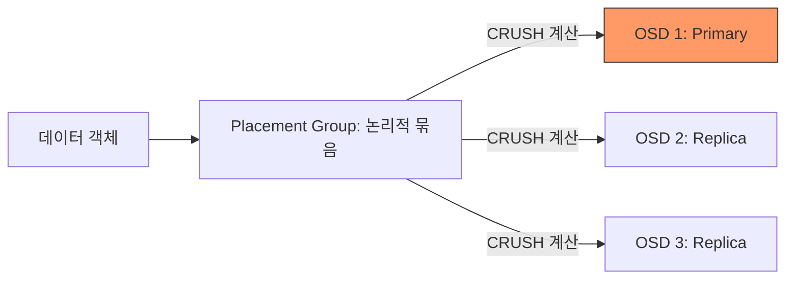

# [Step 2] 소프트웨어 정의 스토리지 (Ceph) (Lecture)

## 1. 학습 목표

- 분산 스토리지 Ceph의 핵심 아키텍처 이해
- 서비스 용도별 RBD(Block) 및 RGW(Object) 활용 차이 파악
- 데이터 복제 원리(3-Replica) 및 가용성 메커니즘 습득

## 2. Ceph 주요 컴포넌트 구성

- OSD (Object Storage Daemon): 실제 데이터 저장 및 복제 수행 (본 프로젝트: 6개 운용)
- MON (Monitor): 클러스터 상태 지도(Map) 관리 및 일관성 유지 (본 프로젝트: 3개 운용)
- MGR (Manager): 전체 클러스터 모니터링 및 대시보드 인터페이스 제공
- RGW (RADOS Gateway): Harbor 등 외부 서비스를 위한 S3 호환 인터페이스 제공

## 3. 데이터 저장 프로세스 (Mermaid)

## 4. 기술 선정 의사결정 (3-Replica vs Erasure Coding)

| 비교 항목     | 3-Replica (채택)                                                | Erasure Coding (EC)                                               |
| :------------ | :-------------------------------------------------------------- | :---------------------------------------------------------------- |
| **저장 효율** | 33% (3배 용량 필요)                                             | 60~80% (고효율)                                                   |
| **성능**      | 쓰기 작업 신속함                                                | 패리티 계산으로 인한 쓰기 지연 발생                               |
| **안정성**    | 직관적인 복구 및 빠른 속도                                      | 복잡한 계산 방식, 다수 노드 요구됨                                |
| **선정 사유** | **운영 편의성 및 신속한 장애 복구**를 최우선하여 3-Replica 선정 | 대규모 저장소에는 유리하지만 이번 프로젝트 범위에서는 복잡도 높음 |

## 5. 발표 대응 큐카드 (Q&A)

- Ceph 도입 배경 및 차별점
  - 단일 클러스터 내 블록(RBD)과 객체(RGW) 동시 지원
  - 사내 이미지 레지스트리(Harbor)와의 최적화된 호환성(S3 API)
- 장애 발생 시 대응 시나리오
  - 서버 1대 장애 시에도 3중 복제본을 통한 무중단 서비스 제공
  - 자동 재균형(Rebalance) 기능을 통한 3-Replica 상태 자가 복구 수행

---

[Step 3로 이동 →](./Step-03-Platform.md)
