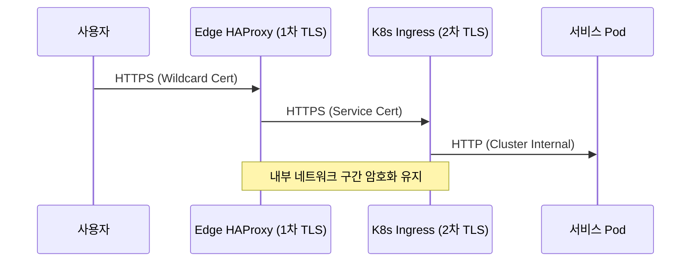

# [Step 3] 견고한 플랫폼 구축 (K8s & Security) (Lecture)

## 🎯 학습 목표

- HA(고가용성) Kubernetes 클러스터 구조 및 설계 원리 이해
- 온프레미스 K8s 핵심 구성 요소(CNI, MetalLB) 구축 역량 습득
- 자체 CA 및 이중 TLS 기반 보안 아키텍처 설계 역량 확보

---

## 1. K8s 클러스터 구조 (High Availability)

- 컨트롤 플레인 3중화를 통한 시스템 가용성 극대화 및 장애 내성 확보

| 역할                    | 수량 | 주요 데몬            | 특징                                              |
| :---------------------- | :--- | :------------------- | :------------------------------------------------ |
| **Control Plane**       | 3대  | API, etcd, Scheduler | 1대 장애 시에도 운영 지속 (Quorum 유지)           |
| **Worker (Production)** | 3대  | kubelet, containerd  | 실제 사용자 서비스(ticket-app) 구동 및 배포       |
| **Worker (System)**     | 1대  | -                    | 인프라 전용 앱(Harbor, Jenkins, ArgoCD) 격리 운영 |

---

## 2. 트래픽 진입 흐름 (Double TLS)

- 전 구간 암호화 적용을 통한 엔드투엔드 보안 경로 구축

---

## 3. 핵심 기술 선정 및 활용 (Selection)

- **MetalLB**: 온프레미스 환경 내 `LoadBalancer` 서비스 제약 해결 및 가상 IP 할당 자동화
- **cert-manager**: K8s 리소스 기반 인증서 생명주기 관리 및 자동 발급 체계 수립
- **Workload Isolation**: nodeSelector 기반 인프라 서비스와 사용자 서비스 간 노드 분리 및 상호 성능
  간섭 원천 차단

---

## 4. 발표용 큐카드 (Talking Points)

- **Q: 자체 CA 사용 시 브라우저 보안 경고 대응 방안은?**
  - "전사 PC 및 서버에 루트 인증서(ca.crt)를 신뢰할 수 있는 기관으로 사전 등록 완료함. 이를 통해
    내부 환경 내 공인 인증서 수준의 신뢰 체계 구축함."
- **Q: 이중 TLS 종료 구조 채택의 기술적 배경은?**
  - "DMZ 영역(VLAN 20)과 내부 네트워크 영역(VLAN 30)의 보안 관리 주체를 분리하고, 내부 패킷 스니핑
    등 보안 위협에 대한 방어 기제 마련함."

---

[Step 4로 이동 →](./Step-04-CICD.md)
