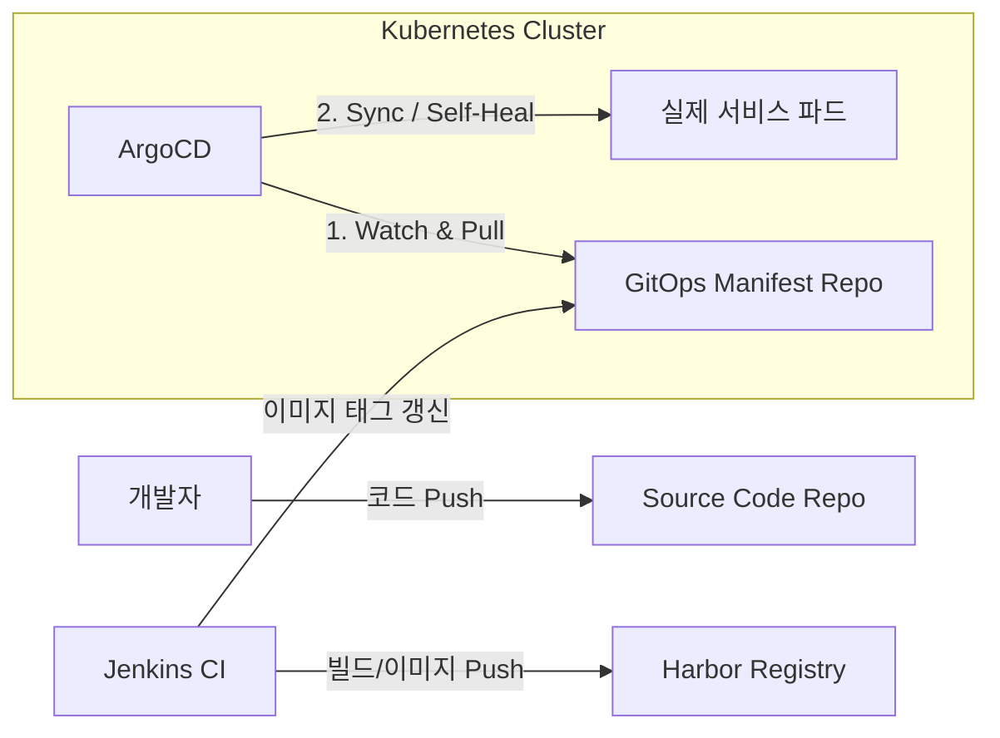

# [Step 4] 지속적 전달의 자동화 (CI/CD & GitOps) (Lecture)

1. 학습 목표
   - GitOps 철학 및 ArgoCD Pull 모델의 동작 원리 이해
   - 사설 레지스트리(Harbor) 구축 필요성 및 세부 구성 파악
   - Jenkins Agent-as-a-Pod 및 Kaniko 빌드 메커니즘 습득

2. GitOps 배포 모델 (Mermaid)
   - 전통적 Push 방식 대비 Pull 방식의 구조적 이점 및 흐름 분석

3. CI/CD 기술 스택 (Comparison)

| 도구        | 역할              | 선택 이유 (Why?)                                       |
| :---------- | :---------------- | :----------------------------------------------------- |
| **ArgoCD**  | GitOps 엔진       | 선언적 관리, 드리프트 감지, Web UI 편리성 확보         |
| **Harbor**  | 이미지 레지스트리 | RBAC 권한 관리, 취약점 스캔(Trivy), S3 백엔드 지원     |
| **Jenkins** | 빌드 자동화       | 현업 표준 도구, K8s 플러그인을 통한 동적 에이전트 활용 |
| **Kaniko**  | 이미지 빌더       | K8s 내부에서 Root 권한 없이 안전하게 이미지 빌드 수행  |

4. 핵심 아키텍처 포인트
   - App-of-Apps 패턴 적용
     - 다수의 마이크로서비스를 단일 Root 앱을 통해 통합 관리하도록 설계
   - Immutable Infrastructure 지향
     - 이미지 태그 `latest` 사용 지양 및 빌드 번호 기반 고유 태그 부여로 롤백 가시성 확보

5. 발표용 큐카드 (Talking Points)
   - Q: Jenkins 직접 배포 대신 ArgoCD를 사용하는 사유
     - 보안 및 상태 유지 목적: 배포 권한의 클러스터 내부 국한 및 실시간 상태 동기화(Self-Healing)
       기능 활용
   - Q: Kaniko 도입 배경 및 필요성
     - 보안 취약점 해결: Docker-in-Docker(DinD) 방식의 특권 권한 요구 문제 원천 차단
     - 표준 가이드 준수: 격리된 컨테이너 환경에서의 안전한 빌드 프로세스 정착

---

[Step 5로 이동 →](./Step-05-OpsCloud.md)
