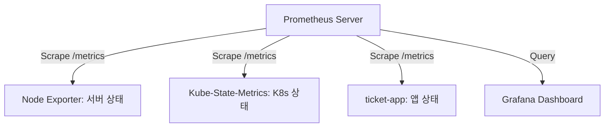

# [Step 5] 운영의 실제와 클라우드 확장 (Lecture)

🎯 학습 목표

1. Prometheus/Grafana 기반 통합 모니터링 체계 이해
2. HA 기능 검증 및 장애 대응 룬북 습득
3. AWS 하이브리드 VPN 구성 및 라우팅 원리 파악

4. 관측성 아키텍처 (Prometheus Pull 모델)

- Prometheus의 메트릭 수집 방식 이해



2. 하이브리드 클라우드 연결 (VPN)

- 온프레미스-AWS 간 통신 메커니즘 파악

```mermaid
graph LR
    subgraph "On-Premise (172.16.0.0/12)"
        pf[pfSense HA]
    end

    subgraph "AWS (10.20.0.0/16)"
        VGW[Virtual Private Gateway]
        EC2[EKS Nodes / RDS]
    end

    pf -- IPsec VPN Tunnel (NAT-T) -- > VGW
    Note over pf,VGW: Outbound NAT Bypass 필수 설정
```

3. 장애 대응 검증 리스트 (Validation)

| 검증 항목            | 방법               | 기대 결과                         |
| :------------------- | :----------------- | :-------------------------------- |
| **pfSense Failover** | Master 리부트      | 5초 이내 VIP 승계 및 통신 유지    |
| **K8s API HA**       | lb-1 서비스 중단   | 3초 이내 lb-2로 API VIP 이동      |
| **Ceph 가용성**      | OSD 한 개 중단     | 데이터 입출력 정상, Recovery 시작 |
| **AWS VPN**          | bastion에서 EC2 핑 | RTT 10ms 미만 사설망 통신 성공    |

4. 발표용 큐카드 (Talking Points)

- 모니터링 구축 시 핵심 해결 과제
  - K8s 시스템 컴포넌트(etcd, scheduler 등)의 0.0.0.0 바인딩 설정을 통한 메트릭 수집 허용
- AWS VPN 연동 시 주요 설정 사항
  - AWS 대역(10.20.0.0/16) 트래픽 대상 Outbound NAT Bypass 룰 적용

🏁 마무리 멘트 제안

- 시스템 구축을 넘어 실제 장애 상황 시뮬레이션 및 클라우드 기반 해결 과정 완수
- 고가용성 인프라 기반 대규모 접속 대응 준비 완료

---

[로드맵으로 돌아가기](../roadmap.md)
