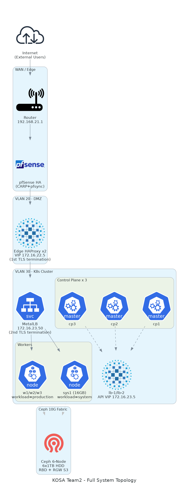
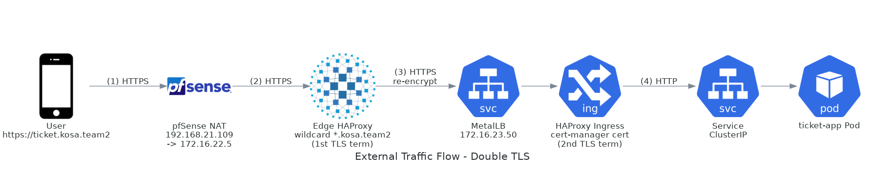
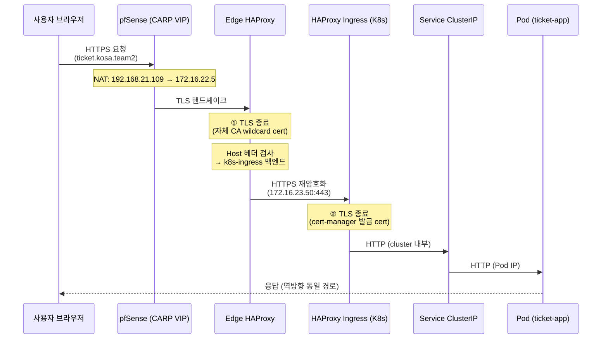
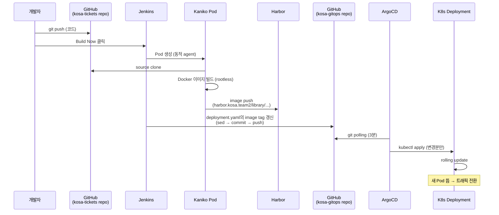

# 01. 프로젝트 개요 & 아키텍처

> **이 챕터에서 다루는 것**
> 우리가 이 인프라를 **왜** 만들었고, **어떤 큰 결정**들을 했으며, **결과로 나온 시스템**이 어떻게 생겼는지.
> 이 챕터를 읽고 나면 다른 챕터(02~12)의 세부 결정들이 왜 그렇게 되어 있는지 맥락이 잡힌다.

## 목차
1. [프로젝트 배경: T-30 오픈런 시나리오](#1-프로젝트-배경-t-30-오픈런-시나리오)
2. [요구사항 도출](#2-요구사항-도출)
3. [4가지 핵심 아키텍처 결정](#3-4가지-핵심-아키텍처-결정)
4. [전체 시스템 토폴로지](#4-전체-시스템-토폴로지)
5. [팀 역할 분담](#5-팀-역할-분담)
6. [기술 스택 선정 매트릭스](#6-기술-스택-선정-매트릭스)
7. [구축 일정 / 마일스톤](#7-구축-일정--마일스톤)
8. [설계 단계의 함정 (트러블슈팅)](#8-설계-단계의-함정-트러블슈팅)
9. [다음 챕터](#9-다음-챕터)

---

## 1. 프로젝트 배경: T-30 오픈런 시나리오

### 1.1 가상 비즈니스 컨텍스트

"KOSA 티켓"이라는 가상 회사를 운영한다고 가정한다. 평소에는 콘서트/스포츠 티켓을 차분히 판매하는 서비스인데, **인기 아티스트 콘서트 티켓 오픈 시점(T-30 ~ T+10분)** 에는 순간 트래픽이 평상시 대비 수백 배까지 폭증한다.

```
트래픽 패턴 (가상 추정)

평상시:       ▁▁▁▁▁▁▁▁▁▁▁▁▁▁▁▁▁▁▁▁▁▁  ~100 RPS
오픈 T-1:     ▁▁▁▁▁▁▁▁▁▁▁▁▁▁▁▁▁▁▁▂▃▅  ~1k RPS
오픈 T+0:     ▁▁▁▁▁▁▁▁▁▁▁▁▁▁▁▁▁▁▂▅█  ~50k RPS  ← 피크
오픈 T+10:    ▁▁▁▁▁▁▁▁▁▁▁▁▁▁▁▁▁▂▅▆▄  ~10k RPS  ← 점진 감소
오픈 T+30:    ▁▁▁▁▁▁▁▁▁▁▁▁▁▁▁▁▁▁▁▁▂▁  ~200 RPS  ← 원상복귀
```

📌 **핵심**: 트래픽이 "평상시 / 피크" 차이가 극단적으로 크다. 평상시 기준으로 캐파시티를 잡으면 피크에 죽고, 피크 기준으로 잡으면 평상시 95% 유휴 자원에 비용 낭비.

### 1.2 그래서 무엇이 필요한가

이 패턴에 맞는 인프라의 조건:

1. **평상시 비용 효율**: 자체 보유 자원(온프레)에서 충분히 돌릴 수 있어야 함
2. **피크 시 즉시 확장**: 클라우드의 사실상 무한한 자원에 burst 가능해야 함
3. **데이터 일관성**: 티켓 = 좌석 중복 판매 절대 금지. DB 일관성 강함
4. **세션/대기열**: 폭증 트래픽을 그냥 받지 말고 대기열로 흡수 (Redis 등)
5. **빠른 복구**: 장애가 나도 5분 안에 복구 (잘 되는 콘서트 한 번 망치면 신뢰 파탄)
6. **재현 가능한 인프라**: 매번 손으로 만들면 매번 다른 버그. IaC 필수.

### 1.3 학습 목표 (실제 KOSA 팀 관점)

이 프로젝트는 단순한 "서비스 운영"이 아니라 **인프라 엔지니어 학습 과정의 졸업 프로젝트** 성격이다. 그래서 가능한 한 **현업에서 실제로 쓰이는 스택**을 직접 손으로 깔고, 같은 기능을 여러 방법으로 비교해보면서 "왜 이걸 쓰는가"를 체감하는 게 중요하다.

비즈니스 가치 < 학습 가치 — 실패해도 좋고 비효율적이어도 좋다. 단, **왜 이렇게 했는지** 설명할 수 있어야 한다.

---

## 2. 요구사항 도출

비즈니스 시나리오에서 인프라 요구사항을 뽑아내면:

### 2.1 기능 요구사항 (FR)

| ID | 요구사항 | 비즈니스 근거 |
|---|---|---|
| FR-1 | 사용자 회원가입/로그인/세션 | 티켓 구매 식별 |
| FR-2 | 좌석 조회/선택/예매 (트랜잭션) | 핵심 비즈니스 |
| FR-3 | 결제 (외부 PG 연동 가정) | 비즈니스 완결성 |
| FR-4 | 관리자 — 콘서트/좌석 등록 | 운영 |
| FR-5 | 대기열 시스템 | 폭증 트래픽 흡수 |

### 2.2 비기능 요구사항 (NFR)

| ID | 요구사항 | 측정값 (목표) |
|---|---|---|
| NFR-1 | 평상시 응답 시간 | p99 < 500ms |
| NFR-2 | 피크 시 가용성 | 99% (피크 1시간 동안) |
| NFR-3 | 평상시 가용성 | 99.9% |
| NFR-4 | 복구 시간 (RTO) | 단일 노드 장애 5분 이내 |
| NFR-5 | 데이터 손실 (RPO) | 최대 5분 |
| NFR-6 | 데이터 일관성 | strong (티켓 중복 판매 0건) |
| NFR-7 | 배포 빈도 | 하루 여러 번 가능 (CI/CD) |
| NFR-8 | 보안 | 외부 직접 노출 금지, TLS 필수, 자체 CA OK |
| NFR-9 | 비용 | 평상시 자체 자원, 피크만 클라우드 |

📌 **핵심**: NFR-9가 전체 아키텍처의 가장 강한 제약. 이 한 줄이 "온프레 + AWS 하이브리드"라는 결정의 근거다.

---

## 3. 4가지 핵심 아키텍처 결정

요구사항을 만족하기 위한 큰 결정 4가지. 각각 다른 대안과 비교해보고 왜 골랐는지.

### 결정 #1: 온프레 + AWS 하이브리드 (vs Pure AWS vs Pure 온프레)

| 옵션 | 장점 | 단점 | 우리 시나리오에서 |
|---|---|---|---|
| **Pure AWS** | 운영 부담 ↓, 즉시 확장 | 평상시도 클라우드 비용, 데이터 주권 X | ❌ NFR-9 위반 (비용) |
| **Pure 온프레** | 자원 통제권 ↑, 비용 ↓ | 피크 대응 불가 (자원이 고정) | ❌ FR-2 피크 트래픽 대응 불가 |
| **하이브리드** | 평상시 비용 ↓, 피크만 burst | 두 환경 운영 = 복잡도 ↑ | ✅ NFR-9 + 피크 대응 동시 만족 |

> 💡 **왜 하이브리드인가?**
> 비유: 평상시는 자기 집에서 일하고, 친구들 30명 초대할 때만 호텔 컨퍼런스룸을 빌리는 것. 친구가 안 올 때 매달 호텔 빌리는 건 낭비.
>
> **트레이드오프**: 환경이 두 개라 학습/운영 부담이 2배 가까이 된다. 네트워크(VPN), 인증(IAM/cert), 배포(ArgoCD multi-cluster), 모니터링(Prometheus federation) 등 모든 영역에서 "어떻게 두 환경을 통합할까?"를 풀어야 함. 이 학습 자체가 인프라 엔지니어로서의 자산이라고 판단.

### 결정 #2: Kubernetes (vs VM 직접 운영 vs Docker Swarm vs Nomad)

| 옵션 | 장점 | 단점 | 우리 시나리오에서 |
|---|---|---|---|
| **VM 직접** | 단순, 학습 곡선 ↓ | 자동 스케일링/HA/롤링 배포 직접 구현 | ❌ NFR-7 빈도 배포 어려움 |
| **Docker Swarm** | 가벼움, Docker 친화 | 생태계 작음, 사실상 사양세 | ❌ 현업 채택률 ↓ |
| **HashiCorp Nomad** | 멀티 워크로드(VM/Container/Batch) | 한국 채용시장 수요 적음 | ❌ 학습 ROI ↓ |
| **Kubernetes** | 표준화, 생태계 거대, 클라우드 호환 | 학습 곡선 ↑, 운영 복잡 | ✅ 학습/실무 가치 모두 ↑ |

> 💡 **왜 K8s인가?**
> "표준이라서"가 가장 큰 이유. 모든 클라우드(EKS/GKE/AKS)가 K8s API를 제공하므로, 하이브리드 burst를 할 때 동일한 manifest를 양쪽에서 쓸 수 있다. 또 ArgoCD, Helm, cert-manager 같은 생태계가 풍부해서 우리가 직접 만들어야 할 게 적다.
>
> **트레이드오프**: 우리 4인 팀에는 과한 복잡도. K8s 컨트롤플레인만 3대(stacked etcd) 운영해야 한다. 그래도 학습 가치 + AWS EKS와의 호환 가치를 우선했다.

### 결정 #3: Ceph (vs NFS vs Longhorn vs 클라우드 스토리지)

| 옵션 | 장점 | 단점 | 우리 시나리오에서 |
|---|---|---|---|
| **NFS** | 가장 단순, 운영 부담 ↓ | SPoF (NFS 서버 1대), 성능 한계, 객체 스토리지 X | ❌ HA 불가, S3 워크로드 X |
| **Longhorn** | K8s 네이티브, 가볍게 시작 | 객체(S3) 없음, 별도 노드 군집 운영은 동일 | △ 블록만 필요하면 OK |
| **클라우드 S3** | 운영 없음, 무한 확장 | 온프레 일관성 깨짐, 평상시도 클라우드 의존 | ❌ NFR-9 위반 |
| **Ceph** | 블록(RBD) + 객체(RGW) + 파일(CephFS) 단일 클러스터, S3 호환 | 운영 복잡, 최소 4~5노드 권장 | ✅ Harbor S3 백엔드 + K8s PV 동시 충족 |

> 💡 **왜 Ceph인가?**
> 두 가지를 한 시스템으로 해결: ① K8s Pod의 PV(블록) ② Harbor 컨테이너 이미지 저장(S3 객체). NFS만 쓰면 두 번째가 불가능하고, NFS + MinIO 식으로 갈라치면 운영 시스템 두 개가 된다. Ceph는 한 클러스터에서 RBD와 RGW를 같이 제공한다.
>
> **트레이드오프**: 6노드 별도 클러스터 운영, OSD/MON/MGR/RGW 각각 이해 필요. 학습 부담 큼. 하지만 Ceph는 OpenStack/Rook/Proxmox 등 다양한 환경의 사실상 표준 분산 스토리지라 학습 가치가 매우 높다.

### 결정 #4: GitOps (ArgoCD) (vs CI에서 직접 kubectl apply)

| 옵션 | 장점 | 단점 | 우리 시나리오에서 |
|---|---|---|---|
| **CI에서 kubectl apply** | 직관적, 빠른 셋업 | git ≠ cluster, drift 발견 어려움, 권한 누출 | ❌ NFR-7 안전성 |
| **GitOps (Argo CD)** | git = single source of truth, drift 자동 감지, 권한 격리 | 컴포넌트 하나 더, 학습 필요 | ✅ 안전 + 감사성 ↑ |

> 💡 **왜 GitOps인가?**
> "git에 있는 게 진실, 클러스터는 그것의 그림자"라는 모델. 누군가 `kubectl edit`로 임의 변경해도 ArgoCD가 git 상태로 자동 복구(selfHeal). 또 CI 시스템이 클러스터 자격증명을 갖고 있지 않아도 됨 — CI는 git에 commit만 하고, ArgoCD가 클러스터 안에서 pull. 보안 + 감사성 ↑.
>
> **트레이드오프**: ArgoCD 자체를 운영해야 함. OutOfSync 같은 새로운 상태 개념을 이해해야 함. 그래도 운영 안정성 측면에서 압도적으로 유리.

---

## 4. 전체 시스템 토폴로지

### 4.1 큰 그림 (Big Picture)



```
                    ┌──────────────────────────────────────┐
                    │           외부 인터넷                  │
                    └───────────────────┬──────────────────┘
                                        │
                                  192.168.21.109
                                        │
                          ┌─────────────▼─────────────┐
                          │  pfSense HA (CARP)        │  ← VLAN 게이트웨이
                          │  방화벽 / NAT / DNS Resolver│    + L7 진입 라우팅
                          └─────┬────────────┬────────┘
                                │            │
              ┌─────────────────┘            └─────────────────┐
              │ VLAN 20 (DMZ)                  VLAN 30 (Internal)│
              │  Edge HAProxy VIP              K8s API VIP       │
              │  172.16.22.5                   172.16.23.5       │
              │                                                  │
              ▼                                                  ▼
       ┌────────────────┐                              ┌─────────────────┐
       │ Edge HAProxy   │  ── 1차 TLS 종료 ──►          │  K8s Cluster    │
       │  lb-1 (MASTER) │                              │  (CP×3 + W×4)   │
       │  lb-2 (BACKUP) │                              │                 │
       └────────────────┘                              │ ┌─────────────┐ │
                                                       │ │HAProxy      │ │
                                                       │ │Ingress      │ │ ← 2차 TLS
                                                       │ │172.16.23.50 │ │   종료
                                                       │ └──────┬──────┘ │
                                                       │        │        │
                                                       │ ┌──────▼──────┐ │
                                                       │ │  Pod들      │ │
                                                       │ │ ticket-app  │ │
                                                       │ │ harbor      │ │
                                                       │ │ argocd ...  │ │
                                                       │ └─────────────┘ │
                                                       └────┬────────────┘
                                                            │
                                                       (Ceph CSI / RGW S3)
                                                            │
                                                       ┌────▼────┐
                                                       │ Ceph 6  │   ← 10G Spine-Leaf
                                                       │ Cluster │
                                                       └─────────┘

                          [ AWS 측 — 다음 phase ]

                          VPC ─ Subnets ─ NLB ─ EC2(HAProxy)
                                       │
                                       └── EKS (Burst) ── RDS Replica
```

### 4.2 트래픽 흐름 (외부 → Pod)





📌 **핵심**: TLS가 두 번 종료된다. 외부 cert와 내부 cert가 분리되어 있어 각자 독립적으로 갱신 가능하고, 내부망 wire에도 평문이 흐르지 않는다.

### 4.3 배포 흐름 (개발자 → 운영 Pod)



📌 **핵심**: Jenkins는 클러스터에 직접 `kubectl apply` 하지 않는다. git에 commit만 하고, ArgoCD가 클러스터 안에서 pull한다 (GitOps).

### 4.4 물리/논리 매핑

```
물리 호스트                         그 위의 VM/Pod                    역할
─────────────────────────────────  ─────────────────────────────  ──────────────
kosa1 (Proxmox)                    pfSense (HA MASTER)            방화벽/라우터
                                   k8s-sys1 (16GB)                K8s sys 워커
kosa2 (Proxmox)                    pfSense (HA BACKUP)            방화벽/라우터
                                   k8s-cp2, k8s-w3, lb-1          K8s CP+W, API LB
kosa3 (Proxmox)                    k8s-cp3, k8s-w1, bastion       K8s CP+W, 운영
                                   edge-haproxy2                  Edge L7 BACKUP
kosa4 (Proxmox)                    k8s-cp1, k8s-w2, lb-2          K8s CP+W, API LB
                                   edge-haproxy                   Edge L7 MASTER
ceph1~6 (별도)                     (OSD/MON/MGR/RGW)              분산 스토리지
```

자세한 IP는 `../../CLAUDE.md`의 "현재 배포된 VM 전체 목록" 참고.

---

## 5. 팀 역할 분담

4인 팀이지만 사일로화 방지를 위해 **주담당 + 보조담당** 구조.

| 영역 | 주담당 | 보조 | 산출물 |
|---|---|---|---|
| 물리/네트워크 (pfSense, VLAN, Spine-Leaf) | A | B | 02 챕터, 네트워크 다이어그램 |
| Proxmox + VM 운영 | B | A | 03 챕터, VM 인벤토리 |
| Ceph 스토리지 | C | D | 04 챕터, Ceph 운영 룬북 |
| K8s 클러스터 (kubeadm, CNI, Ingress) | D | C | 05 챕터, Ansible playbook |
| GitOps + CI/CD (ArgoCD, Jenkins, Harbor) | A | C | 07~10 챕터, Jenkinsfile |
| 보안/TLS (자체 CA, cert-manager) | C | A | 06 챕터, CA 운영 절차 |
| 관측성 (Prometheus, Grafana) | B | D | 11 챕터, 대시보드 |
| AWS Terraform | D | B | terraform/aws/, 13 챕터(예정) |

> 💡 **왜 주/보조로 나누나?**
> 4명이 다 모든 걸 알 수는 없지만, 각 영역의 보조 담당자가 있으면 주담당이 휴가/장애 중일 때 최소한 cohesively 대응 가능. 또 chap 작성 시 보조 담당이 reviewer 역할을 하면 narrative가 다른 시각에서 한 번 더 정제된다.

---

## 6. 기술 스택 선정 매트릭스

각 영역에서 무엇을 골랐고 무엇을 안 골랐는지. 면접에서 "왜 X 안 쓰고 Y 썼어요?"에 답할 수 있는 근거.

| 영역 | 채택 | 대안 | 안 고른 이유 |
|---|---|---|---|
| **하이퍼바이저** | Proxmox VE | VMware ESXi, oVirt | 무료(GPL), 웹 UI 좋음, KVM 기반 표준 |
| **방화벽/라우터** | pfSense (FreeBSD) | OPNsense, Mikrotik, Cisco | 무료, HA 안정, 웹 UI 풍부 |
| **분산 스토리지** | Ceph | Longhorn, GlusterFS, MinIO | RBD+RGW+CephFS 통합 |
| **K8s 배포 도구** | kubeadm | Rancher, k3s, kops | 표준 부트스트랩, 학습용 적합 |
| **CNI** | Calico | Flannel, Cilium, Weave | 네트워크 정책 지원, 대규모 검증 |
| **K8s LB (베어메탈)** | MetalLB L2 | kube-vip, OpenELB | L2 가장 단순, BGP 라우터 불필요 |
| **API HA** | HAProxy + Keepalived | nginx + Keepalived, kube-vip | HAProxy backend health check 풍부 |
| **Ingress** | HAProxy Ingress (jcmoraisjr) | nginx-ingress, Traefik | HAProxy 일관성, L4/L7 모두 강함 |
| **인증서** | 자체 CA + cert-manager | Let's Encrypt, Vault | 내부 도메인이라 LE 불가, Vault는 과함 |
| **GitOps** | ArgoCD | Flux, Argo Workflows | UI 강함, App-of-Apps 패턴 친화적 |
| **CI** | Jenkins | GitHub Actions, Tekton, Drone | 학습 가치 + 온프레 자율 (GitHub 의존 X) |
| **이미지 빌더** | Kaniko | BuildKit, Buildah, Docker-in-Docker | rootless, K8s Pod 안에서 안전 |
| **레지스트리** | Harbor | Docker Registry, Nexus, GHCR | RBAC, Trivy 스캔, replication, OCI 표준 |
| **모니터링** | kube-prometheus-stack | Datadog, New Relic, Zabbix | 무료, CRD 기반, 생태계 표준 |
| **메시 (선택)** | (미사용) | Istio, Linkerd | 우리 규모에 과함, mTLS는 이중 TLS로 대체 |
| **DB** | (Percona XtraDB Cluster 예정) | PostgreSQL, CockroachDB | 학습 + AWS RDS Replica 친화 |
| **캐시/큐** | Redis Sentinel | Redis Cluster, Memcached, RabbitMQ | Sentinel은 HA + 단순 |
| **IaC** | Terraform | Pulumi, CloudFormation | 멀티 클라우드, HCL 익숙 |
| **설정 관리** | Ansible | Chef, Puppet, SaltStack | agentless, learning curve ↓ |

> 💡 **결정의 공통 패턴**
> 1. **무료/오픈소스 우선**: 학습 프로젝트라 유료 라이선스 회피
> 2. **현업 채택률 ↑**: 한국 채용시장 빈도 ↑ (커리어 ROI)
> 3. **생태계 ↑**: 문제 생겼을 때 검색하면 답이 많은 것
> 4. **단순함 우선**: 같은 기능이면 덜 화려한 것 (Istio 안 쓴 이유)

---

## 7. 구축 일정 / 마일스톤

총 14일 일정으로 진행. (실제로는 트러블슈팅으로 조금 더 걸림)

| Day | 마일스톤 | 산출물 |
|---|---|---|
| 1 | 물리 케이블링, Proxmox 4노드 설치 | Proxmox 클러스터 |
| 2 | VLAN 설계, pfSense 설치 (1대) | 네트워크 격리 |
| 3 | pfSense HA(CARP/pfsync), DHCP | 방화벽 이중화 |
| 4 | Spine-Leaf 10G 네트워크, Ceph 설치 | Ceph HEALTH_OK |
| 5 | K8s CP×3 HA, Calico, kubeconfig | `kubectl get nodes` Ready ×3 |
| 6 | K8s Worker×4, MetalLB | LB Service External IP 할당 |
| 7 | HAProxy + Keepalived (API VIP), Ceph-CSI | API VIP 페일오버 OK, PVC 생성 OK |
| 8 | Edge HAProxy HA, 자체 CA, cert-manager | `https://*.kosa.team2` 발급 |
| 9 | ArgoCD 설치, root-app, monitoring 배포 | Grafana UI 접속 |
| 10 | Harbor 설치 (Ceph RGW S3), CA 신뢰 등록 | 이미지 push 성공 |
| 11 | Jenkins 설치, JCasC, credential 설정 | Jenkins UI 접속 |
| 12 | CI/CD 파이프라인 (Kaniko + GitOps update) | end-to-end 배포 성공 |
| 13 | AWS Terraform: VPC/NLB/HAProxy EC2 | `terraform apply` OK |
| 14+ | AWS VPN, EKS, RDS Replica, Lambda burst | (진행 중) |

> ⚠️ **현실 체크**
> 거의 모든 Day에 예상치 못한 트러블슈팅이 있었다. 특히 Day 10 (Harbor s3 NoSuchBucket, x509), Day 11 (Jenkins plugin 깨짐, login 실패), Day 12 (sshagent 없음, GitHub host key)는 각각 반나절~하루씩 소비. **새로 시도하는 사람에게**: 각 챕터의 "트러블슈팅" 섹션을 *먼저* 읽고 시작하면 시간이 크게 절약된다.

---

## 8. 설계 단계의 함정 (트러블슈팅)

설계/계획 단계에서 실수하기 쉬운 것들. 본격 구축 들어가기 전에 확인.

### 8.1 CIDR 충돌

> ⚠️ **함정**: 온프레 사내망, K8s Pod CIDR, K8s Service CIDR, AWS VPC CIDR이 서로 겹치면 라우팅 지옥.

우리가 사용하는 CIDR:
- 관리망: `192.168.21.0/24`
- VLAN 10~40: `172.16.21~24.0/24`
- K8s Pod (Calico 기본): `192.168.0.0/16` ← **여기 위험!**
- K8s Service: `10.96.0.0/12`
- Ceph 10G: `10.10.10.0/24`
- AWS VPC: `10.20.0.0/16`

**문제**: K8s Pod CIDR가 `192.168.0.0/16`이면 우리 관리망 `192.168.21.0/24`와 겹친다. 해결: `kubeadm init --pod-network-cidr=192.168.128.0/17` 같이 일부만 사용하거나, 차라리 `10.244.0.0/16` 등으로 변경.

### 8.2 VLAN 게이트웨이 의존성

> ⚠️ **함정**: 모든 VLAN의 게이트웨이가 pfSense인데, pfSense VM이 올라간 Proxmox가 부팅 안 되면 클러스터 전체가 마비.

해결: 관리망(192.168.21.x)은 pfSense 의존 X. 직접 라우터에 연결. OOB(Out-Of-Band) 접근 경로 확보.

### 8.3 etcd quorum

> ⚠️ **함정**: K8s CP를 짝수 개로 만들면 split-brain. 1, 3, 5 등 홀수가 정답.

우리 선택: 3개 (1개 죽어도 quorum 유지, 2개 동시 죽으면 멈춤).

### 8.4 Ceph 최소 노드 수

> ⚠️ **함정**: Ceph 3-replica는 최소 3노드, EC k+m은 최소 k+m 노드. 부족하면 PG가 active+clean 못 됨.

우리 선택: 6노드 → 3-replica + EC 4+2 모두 가능.

### 8.5 RWO vs RWX 혼동

> ⚠️ **함정**: ceph-csi-rbd는 RWO (한 노드만 mount). 여러 Pod이 같은 PVC를 쓰려고 하면 Pending. CephFS 또는 NFS가 필요.

우리 선택: RBD만 사용. RWX 필요한 워크로드는 sys1 단일 노드에 고정 (workload-type 라벨).

### 8.6 DNS 단일 정답 없음

> ⚠️ **함정**: 어떤 DNS를 누가 쓰는지 정리 안 하면 "어떤 host에서는 되고 어떤 host에서는 안 되는" 지옥.

우리 정리:
- **외부 노트북** → pfSense Host Override (수동 등록)
- **K8s 워커 노드 OS** → netplan으로 pfSense를 nameserver 등록
- **K8s Pod** → CoreDNS (Corefile에 cluster-scope override 추가)
- **Pod 안의 클러스터 외부 해결** → CoreDNS upstream = 노드 resolv.conf = pfSense

### 8.7 TLS cert 두 번 종료의 ID 일치

> ⚠️ **함정**: Edge HAProxy의 wildcard cert와 cert-manager의 service cert는 **반드시 같은 root CA로 서명**되어야 함. 안 그러면 내부 호출(예: argocd → harbor)에서 x509 untrusted.

우리 선택: 두 cert 모두 `KOSA Team2 Internal CA`로 서명.

---

## 9. 다음 챕터

이제 큰 그림이 잡혔으니 세부로 들어간다. 추천 순서:

→ **[02. 물리 인프라 & 네트워크](02-physical-network.md)** *(예정)*

물리 장비 인벤토리, VLAN 설계 근거, Spine-Leaf 토폴로지, pfSense HA의 내부 동작 (CARP/pfsync/XMLRPC).

특정 영역에 먼저 관심이 있다면:
- K8s 깊이 → 05 챕터로 직행 (다만 01의 "4가지 결정" #2 다시 보고)
- 스토리지 → 04 챕터
- CI/CD → 07 → 08 → 09 → 10 순서로
- 보안 → 06 챕터 (TLS 이중 종료 구조 이해 필수)

---

## 부록: 참고 자료

- **Kubernetes 공식 문서** — https://kubernetes.io/docs/
- **Ceph 공식 문서** — https://docs.ceph.com/
- **ArgoCD 공식 문서** — https://argo-cd.readthedocs.io/
- **Proxmox VE Admin Guide** — https://pve.proxmox.com/wiki/
- **"Kubernetes in Action"** (Marko Lukša) — K8s 입문 정석
- **"Site Reliability Engineering"** (Google, 무료 온라인) — 운영 철학
- **"Designing Data-Intensive Applications"** (Martin Kleppmann) — 분산 시스템 원리
