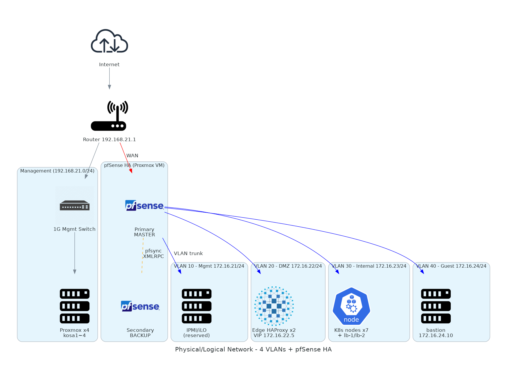
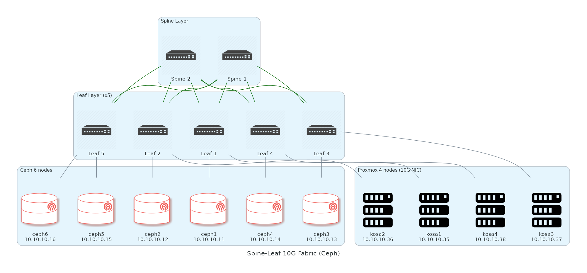

# 02. 물리 인프라 & 네트워크

> **이 챕터에서 다루는 것**
> 어떤 물리 장비로 무엇을 했고, VLAN을 왜 4개로 나눴는지, Spine-Leaf 패브릭이 왜 필요했는지, pfSense HA의 내부 동작이 어떻게 되는지.
> 네트워크가 잘못 깔리면 그 위의 모든 것이 흔들리니 가장 신중하게 설계한 영역이다.

## 목차
1. [이론 사전 지식](#1-이론-사전-지식)
2. [물리 장비 인벤토리](#2-물리-장비-인벤토리)
3. [전체 네트워크 토폴로지](#3-전체-네트워크-토폴로지)
4. [VLAN 설계 (왜 4개로 쪼갰나)](#4-vlan-설계-왜-4개로-쪼갰나)
5. [Spine-Leaf 패브릭 (Ceph 전용 10G)](#5-spine-leaf-패브릭-ceph-전용-10g)
6. [pfSense HA (CARP + pfsync + XMLRPC)](#6-pfsense-ha-carp--pfsync--xmlrpc)
7. [DNS 인프라](#7-dns-인프라)
8. [구축 절차 (단계별)](#8-구축-절차-단계별)
9. [검증](#9-검증)
10. [트러블슈팅](#10-트러블슈팅)
11. [다음 챕터](#11-다음-챕터)

---

## 1. 이론 사전 지식

### 1.1 OSI 모델과 우리 시스템

```
Layer 7  Application   ← HTTP/HTTPS (Edge HAProxy L7 분기, Ingress)
Layer 4  Transport     ← TCP/UDP (HAProxy L4, MetalLB)
Layer 3  Network       ← IP/라우팅 (pfSense, VLAN 게이트웨이)
Layer 2  Data Link     ← Ethernet/VLAN (스위치, MetalLB L2 모드)
Layer 1  Physical      ← 케이블/광 트랜시버
```

📌 우리 시스템은 L2 (VLAN), L3 (라우팅), L4 (TCP LB), L7 (HTTP LB) 전부 직접 운영한다. 클라우드만 써본 사람은 L4 이하를 잘 안 만져봐서 처음엔 어렵게 느껴진다.

### 1.2 VLAN (Virtual LAN)

**문제**: 물리 스위치 1대에 여러 부서/서비스가 연결되면 L2 트래픽이 다 섞임. 격리 안 됨, 브로드캐스트 도메인 폭증.

**해결**: VLAN — 같은 물리 스위치에서 논리적으로 분리된 L2 도메인. 각 포트에 VLAN tag(802.1Q)를 붙여 구분.

```
물리 스위치 1대 (24포트)
├── port 1~6   VLAN 10 (관리망)
├── port 7~12  VLAN 20 (DMZ)
├── port 13~18 VLAN 30 (Internal)
└── port 19~24 VLAN 40 (Guest)
```

각 VLAN은 별도 L2 도메인이라 서로 broadcast 안 보임. L3 라우팅(pfSense)을 거쳐야 통신 가능.

**Trunk port**: 한 포트로 여러 VLAN을 전달. 스위치-스위치 또는 스위치-라우터 사이에 사용.

### 1.3 Spine-Leaf 패브릭

전통적 토폴로지(Core-Aggregation-Access 3-tier)는 노드 간 통신이 코어를 거쳐야 해서 동서(East-West) 트래픽이 많은 환경(Ceph, K8s Pod 간 통신)에 부적합.

```
[Core]
  │
[Aggregation]  ← 병목
  │
[Access] ── [Access]
   │          │
[Server]   [Server]
```

**Spine-Leaf**는 모든 Leaf가 모든 Spine과 연결돼 있어 노드 간 최대 2 홉. ECMP(Equal-Cost Multi-Path)로 부하 분산.

```
[Spine 1]    [Spine 2]
   │  X  X  X  │   ← 모든 Leaf와 풀메시 연결
   │  X  X  X  │
[Leaf1] [Leaf2] [Leaf3] [Leaf4] [Leaf5]
   │       │       │       │       │
[Ceph1] [Ceph2] [Ceph3] [Ceph4] [Ceph5] [Ceph6]
```

📌 우리는 Ceph 클러스터 전용 10G 네트워크에 Spine-Leaf 적용. 일반 워크로드 트래픽과 분리해 Ceph replication이 다른 트래픽에 영향을 안 주도록.

### 1.4 CARP / pfsync / XMLRPC (pfSense HA의 3가지 기둥)

| 프로토콜 | 역할 | 동작 |
|---|---|---|
| **CARP** | VIP 공유 | 두 노드가 같은 VIP를 보유하다가 MASTER가 죽으면 BACKUP이 즉시 인수. VRRP의 BSD 변형. |
| **pfsync** | state 동기화 | NAT/세션 state 테이블을 실시간 미러. 페일오버 시 TCP 연결이 끊기지 않음. |
| **XMLRPC** | config 동기화 | 한쪽에서 룰/Host Override 등을 변경하면 자동으로 다른 쪽에 복제. |

> 💡 **왜 3개가 필요한가?**
> CARP만 있으면 페일오버는 되지만 진행 중이던 TCP 연결이 끊긴다 (state가 BACKUP에 없으니까). pfsync가 state를 미러해야 매끄럽다.
> 룰을 한쪽에서만 바꾸고 XMLRPC 없으면 페일오버 후 룰이 달라져서 "방금까지 되던 게 안 됨".

### 1.5 NAT (Network Address Translation)

내부 사설 IP를 공인 IP로 변환. 두 가지 유형:

| 유형 | 동작 | 우리 사용처 |
|---|---|---|
| **SNAT (Source NAT) / PAT** | 내부 → 외부 나갈 때 출발 IP를 공인 IP로 | 모든 outbound 트래픽 |
| **DNAT (Destination NAT) / Port Forward / 1:1 NAT** | 외부에서 들어오는 트래픽의 목적지 IP를 내부로 변환 | pfSense 외부 IP → Edge VIP (172.16.22.5) |

### 1.6 DHCP / DNS의 역할 분리

- **DHCP**: 동적 IP 할당. 우리는 VLAN 30/40에서만 활성. VLAN 10/20은 정적 IP (서버라서 안정성 우선).
- **DNS Resolver**: 도메인 이름 → IP 해석. 우리는 pfSense의 Unbound를 사용하며 Host Overrides로 내부 도메인 해석.

---

## 2. 물리 장비 인벤토리

### 2.1 네트워크 장비

| 장비 | 모델 | 수량 | 용도 |
|---|---|---|---|
| 라우터 | (외부 인터넷 회선용) | 1 | WAN 진입, 192.168.21.1 |
| 관리형 스위치 (1G) | (KOSA 지급분) | 1 | port 2 = Proxmox 4대 업링크, port 5 = 관리 노트북 4대 |
| 비관리형 스위치 (1G) | - | 2 | 보조 (테스트/임시 연결) |
| 10G 매니지드 스위치 | JTCOM JT-S508CL-8S (8포트 SFP+) | 7 | Spine 2대 + Leaf 5대 (Ceph 패브릭) |

### 2.2 컴퓨팅 노드 (Proxmox)

4대 모두 동일 사양 (kosa1 기준):

| 항목 | 사양 |
|---|---|
| 시스템 | LG B80LV.AP37B7E (TA001) |
| 마더보드 | MICRO-STAR MS-BA03L |
| OS/커널 | Debian 13 (Trixie) / Proxmox VE 6.17.13-2-pve |
| CPU | Intel Core i7-13700 (16C/24T, 8P+8E, max 5.2GHz), VMX 지원 |
| 메모리 | 32 GiB DDR4 (현재 ~75% 사용) |
| GPU | Intel UHD Graphics 770 (내장) — 헤드리스 운영 |
| 시스템 디스크 | Solidigm NVMe SSDPFKNU512GZ 476.94 GiB |
| 보조 디스크 | Toshiba HDD DT01ACA100 931.51 GiB |
| 1G NIC | Intel I219-V (eno1) — 관리망 |
| 10G NIC #1 | Intel 82599ES SFP+ (enp1s0f0) — Ceph/스토리지 (Up, 10Gbps) |
| 10G NIC #2 | Intel 82599ES SFP+ (enp1s0f1) — 예비 (Down) |

호스트별 IP:
```
kosa1   192.168.21.2  (관리)   10.10.10.35 (10G)
kosa2   192.168.21.3            10.10.10.36
kosa3   192.168.21.4            10.10.10.37
kosa4   192.168.21.5            10.10.10.38
```

### 2.3 Ceph 스토리지 노드 (별도 6대)

| 항목 | 사양 |
|---|---|
| 노드 수 | 6대 |
| 노드당 OSD 디스크 | 1 TB HDD × 1 → 총 6 OSD / 6 TB Raw |
| OSD 백엔드 | BlueStore (WAL/DB 동일 HDD) |
| 네트워크 | 10GbE Spine-Leaf 패브릭 |

상세는 [04-ceph.md](04-ceph.md) 참고.

### 2.4 관리 노트북

팀원 4명 노트북. 관리 스위치 port 5에 1G로 연결. 192.168.21.0/24 대역에서 정적/동적 IP.

---

## 3. 전체 네트워크 토폴로지

### 3.1 큰 그림



```
                            [ 인터넷 ]
                                │
                          ┌─────▼─────┐
                          │  라우터    │ 192.168.21.1
                          └─────┬─────┘
                                │
                       (192.168.21.0/24)
                                │
                  ┌─────────────┴─────────────┐
                  │                           │
              [관리 스위치 1G]            [10G 패브릭 — 별도]
                │                              │
       ┌────────┼────────┐              Spine 1 + Spine 2
       │        │        │                     │
  Proxmox 4    노트북 4    pfSense WAN          │
       │                                       │
   (각 노드에서 VLAN trunk로                Leaf 1~5
    1G NIC 통해 vmbr0 = 관리망)               │
                                       Ceph 노드 1~6
       │
       │ (Proxmox의 vmbr1 = 10G NIC)
       └── Proxmox도 10G 패브릭에 별도 연결 (Ceph 클라이언트로서)

                              │
                  ┌───────────┴────────────┐
                  │   pfSense HA (2 VM)    │
                  │   CARP + pfsync + XMLRPC│
                  └─────┬──────────────────┘
                        │ (Trunk: VLAN 10/20/30/40)
                        │
              ┌─────────┼─────────┬─────────┐
        VLAN 10       VLAN 20    VLAN 30  VLAN 40
        관리망         DMZ       Internal  Guest
        172.16.21    172.16.22  172.16.23 172.16.24
```

### 3.2 VLAN별 어떤 호스트가 있나

| VLAN | 대역 | DHCP | 호스트 |
|---|---|---|---|
| 10 (관리망) | 172.16.21.0/24 | X | (예약 — 향후 IPMI/iLO 등) |
| 20 (DMZ) | 172.16.22.0/24 | X | edge-haproxy, edge-haproxy2, **VIP 172.16.22.5** |
| 30 (Internal) | 172.16.23.0/24 | O (172.16.23.100~200) | K8s CP×3, K8s Worker×4, lb-1/2, **API VIP 172.16.23.5**, **Ingress LB 172.16.23.50** |
| 40 (Guest) | 172.16.24.0/24 | O (172.16.24.100~200) | bastion |

---

## 4. VLAN 설계 (왜 4개로 쪼갰나)

### 4.1 결정 근거

| VLAN | 이름 | 목적 | 신뢰 등급 |
|---|---|---|---|
| 10 | Management | 장비 관리 인터페이스 (IPMI/iLO 등 향후) | 최고 (분리 필수) |
| 20 | DMZ | 외부 노출 가능 호스트 (Edge HAProxy) | 중 (외부 트래픽 수용) |
| 30 | Internal | 비즈니스 워크로드 (K8s) | 높음 (외부 직접 노출 X) |
| 40 | Guest | 운영/임시 (bastion, 출장자 등) | 중 |

> 💡 **왜 4개로 나눴나?**
> 만약 한 VLAN에 모두 두면:
> - K8s 워커가 같은 broadcast 도메인에 노출돼 잠재적 공격면 ↑
> - DHCP 풀 충돌 (서버 정적 IP와 클라이언트 DHCP 풀이 같은 대역에서 관리 어려움)
> - 정책(방화벽 룰) 작성 단위가 host 단위가 됨 → 룰 수십 줄
>
> VLAN으로 쪼개면 정책이 "DMZ → Internal은 특정 포트만, Guest → DMZ는 차단" 식으로 **대역 단위로 표현** 가능.

### 4.2 CIDR 선정

```
사내망  : 192.168.21.0/24   ← 외부 인터넷 GW 직결
관리망  : 172.16.21.0/24
DMZ     : 172.16.22.0/24
Internal: 172.16.23.0/24
Guest   : 172.16.24.0/24
Ceph 10G: 10.10.10.0/24    ← 별도 물리 패브릭
AWS VPC : 10.20.0.0/16     ← 향후 VPN 라우팅
```

> 💡 **왜 172.16.x를 골랐나?**
> 사설 IP는 RFC1918에 따라 세 대역:
> - `10.0.0.0/8` — 매우 큼, Ceph 10G와 AWS에 사용
> - `172.16.0.0/12` — 중간 크기, VLAN 격리에 사용 (172.16~31.x.x)
> - `192.168.0.0/16` — 작음, 가정/소규모 라우터 기본
>
> 사내 192.168.21.x와 K8s Pod 기본 CIDR(192.168.0.0/16)이 겹치는 함정 회피하려고 VLAN은 172.16.x로 분리. AWS는 10.20.x로 두면 온프레-AWS VPN 라우팅도 충돌 없음.

### 4.3 게이트웨이 매핑

각 VLAN의 게이트웨이는 pfSense:

| VLAN | 게이트웨이 IP | pfSense 인터페이스 |
|---|---|---|
| 10 | 172.16.21.1 | OPT1 |
| 20 | 172.16.22.1 | OPT2 |
| 30 | 172.16.23.1 | OPT3 |
| 40 | 172.16.24.1 | OPT4 |

> ⚠️ **함정**: 각 VLAN의 호스트들은 자기 VLAN의 게이트웨이를 기본 게이트웨이로 설정해야 외부 통신 가능. netplan에서 잘못 적으면 outbound 안 됨.

---

## 5. Spine-Leaf 패브릭 (Ceph 전용 10G)

### 5.1 왜 별도 패브릭?

Ceph는 **두 종류의 네트워크 트래픽**을 만든다:

1. **Public Network**: 클라이언트(K8s 등) ↔ Ceph 클러스터 (read/write 요청)
2. **Cluster Network (Replication)**: OSD ↔ OSD (3-replica 복제, recovery, rebalance)

쓰기 1회 = Replication에서 3배 트래픽 발생. 만약 비즈니스 트래픽과 같은 NIC을 공유하면:
- Ceph가 비즈니스 응답성을 잡아먹음
- 또는 비즈니스 트래픽이 Ceph rebalance를 느리게 함

> 💡 **왜 10G인가?**
> 1G는 약 125 MB/s. HDD 1개의 순차 read도 100 MB/s 정도라 6 OSD가 동시에 작업하면 1G 링크가 바로 포화. 10G는 1.25 GB/s라 헤드룸이 충분. SSD/NVMe로 가면 25G 이상 필요.

### 5.2 토폴로지 (Spine 2 / Leaf 5)



```
           Spine 1                Spine 2
        (10G 8포트 SW)         (10G 8포트 SW)
        port 1~5 = Leaf 업링크 (각 Leaf로 1포트씩)
              │                      │
   ┌──────────┼──────────┬──────────┬┴──────┬──────────┐
   │          │          │          │       │          │
[Leaf1]   [Leaf2]    [Leaf3]    [Leaf4]  [Leaf5]
8포트 SW   8포트 SW    8포트 SW    8포트 SW  8포트 SW
   │          │          │          │       │
 Ceph1     Ceph2      Ceph3      Ceph4   Ceph5+Ceph6
 + Proxmox + Proxmox  + Proxmox  + Proxmox (Leaf5는 2대 수용)
```

각 Leaf 스위치는 2개 Spine 모두와 연결 (포트 1개씩 = 2 업링크). ECMP로 부하 분산.

> 💡 **왜 Spine 2개?**
> Spine 1개면 SPoF. 2개면 한쪽 죽어도 다른 쪽으로 트래픽 흐름. ECMP 활용 가능.
>
> **왜 Leaf 5개?**
> Ceph 6대 + Proxmox 4대 = 10 호스트. 한 Leaf에 2 호스트씩 분산.

### 5.3 Public vs Cluster Network 분리 (이상적)

이상적으로는 NIC 2개로 분리:
- NIC1 = Public (클라이언트와 통신)
- NIC2 = Cluster (OSD 간 복제)

현재 우리는 NIC1만 10G 사용, NIC2(enp1s0f1)는 down 상태. 향후 Cluster Network 분리 로드맵에 포함.

### 5.4 Proxmox와 Ceph 패브릭의 관계

Proxmox 노드는 두 역할:
1. **관리망(1G)** 으로 외부에서 접근
2. **10G 패브릭** 으로 Ceph 스토리지 사용 (PV mount, VM 디스크 IO)

```
Proxmox kosa1:
  eno1 (1G)      → 관리 스위치 → 라우터 → 인터넷
  enp1s0f0 (10G) → Leaf 스위치 → Ceph (10.10.10.35)
```

K8s 워커도 마찬가지로 10G NIC을 vmbr1 통해 받아서 Ceph 사용 (`10.10.10.120~123`).

---

## 6. pfSense HA (CARP + pfsync + XMLRPC)

### 6.1 구성 개요

pfSense를 **VM 2대**로 운영. 각각 다른 Proxmox 호스트 위에 (단일 호스트 다운 시도 살아남도록).

```
Proxmox kosa1                   Proxmox kosa2
  ├── pfSense Primary             ├── pfSense Secondary
  │   (CARP MASTER)                │   (CARP BACKUP)
  │   IF: VLAN 10/20/30/40         │   IF: VLAN 10/20/30/40
  │   + WAN, + pfsync IF           │   + WAN, + pfsync IF
  └── (다른 VM들...)               └── (다른 VM들...)
```

> ⚠️ **현실 vs 발표용**
> 발표용 다이어그램은 pfSense 2대를 별도 전용 어플라이언스로 그린다 (이상적인 모습).
> 실제는 Proxmox VM. 하드웨어 4대 제약으로 인한 선택.

### 6.2 CARP 동작 원리

CARP는 두 노드가 같은 VIP를 보유하다가 우선순위 높은 쪽(MASTER)이 ARP에 응답.

```
VIP: 172.16.23.1 (VLAN 30 GW)

MASTER (Primary):  "이 IP는 내 MAC ab:cd:ef:01:02:03 이야"
                   → 모든 클라이언트가 MASTER MAC으로 송신
BACKUP (Secondary): "(대기, 5초마다 MASTER 살아있는지 확인)"

[MASTER 죽음]
                ↓
BACKUP:  "이제 내가 MASTER. VIP는 내 MAC 12:34:56:78:9a:bc 야"
         → Gratuitous ARP 브로드캐스트
         → 모든 클라이언트의 ARP 테이블 갱신 → BACKUP으로 트래픽
```

페일오버 시간: 일반적으로 3~5초.

### 6.3 pfsync로 state 동기화

방화벽 state 테이블이 동기화 안 되면 페일오버 직후 TCP 연결이 끊긴다.

```
시나리오: 사용자 ↔ 웹서버 TCP 연결 진행 중

MASTER가 NAT/state 추적 중:
  state: 192.168.1.5:54321 → 10.0.0.10:443 (ESTABLISHED)

[MASTER 다운, BACKUP 인수]

BACKUP의 state 테이블 비어있으면:
  사용자 패킷 도착 → "어? 이 연결 처음 보는데?" → 차단 또는 새 연결로 처리 → TCP RST

pfsync 활성화 시:
  MASTER의 state 변경이 실시간으로 BACKUP에 미러됨
  → 페일오버 후에도 연결 유지
```

pfsync는 보통 **별도 전용 인터페이스**로 운영 (트래픽 격리 + 보안). 우리는 VLAN 10(관리망)을 공유.

### 6.4 XMLRPC config 동기화

방화벽 룰, NAT 룰, DHCP 설정, DNS Host Override 등의 설정을 한쪽에서 변경하면 자동으로 다른 쪽 복제.

```
관리자 변경 (Primary):
  Firewall → Rules → 새 룰 추가

XMLRPC 동작:
  Primary가 Secondary에 HTTPS API 호출
  → Secondary가 자기 config.xml 갱신
  → reload

[페일오버 발생 시]
  Secondary가 같은 룰셋을 갖고 있어 동일하게 작동
```

> ⚠️ **함정**: XMLRPC 동기화는 단방향. **반드시 Primary에서만 설정 변경**할 것. Secondary에서 변경하면 다음 Primary 변경 시 덮어쓰여진다.

### 6.5 우리 pfSense 인터페이스 할당

| pfSense 인터페이스 | 물리/논리 매핑 | 용도 |
|---|---|---|
| WAN | vtnet0 (192.168.21.109) | 외부 인터넷 |
| LAN | (미사용 또는 보조) | (할당만 됨) |
| OPT1 | VLAN 10 tag | 관리망 GW (172.16.21.1) |
| OPT2 | VLAN 20 tag | DMZ GW (172.16.22.1) |
| OPT3 | VLAN 30 tag | Internal GW (172.16.23.1) |
| OPT4 | VLAN 40 tag | Guest GW (172.16.24.1) |
| SYNC | 별도 또는 OPT 공유 | pfsync 전용 |

---

## 7. DNS 인프라

### 7.1 누가 무엇을 어디로 해석하나

DNS는 잘못 설정하면 디버깅 지옥. 우리 구조:

```
┌─────────────────────────────────────────────────────────┐
│ 외부 노트북                                              │
│   nameserver = 172.16.24.2 (pfSense)                    │
│   ticket.kosa.team2 ─pfSense─► 172.16.23.50 (응답)       │
└─────────────────────────────────────────────────────────┘
┌─────────────────────────────────────────────────────────┐
│ K8s 워커 노드 OS (Ubuntu)                                │
│   /etc/resolv.conf → 172.16.24.2 (pfSense)              │
│   netplan: nameservers.addresses [172.16.24.2, 1.1.1.1] │
│   search: [kosa.team2]                                  │
└─────────────────────────────────────────────────────────┘
┌─────────────────────────────────────────────────────────┐
│ K8s Pod                                                  │
│   resolv.conf → CoreDNS (kube-dns ClusterIP)            │
│   CoreDNS Corefile:                                     │
│     hosts {                                             │
│       172.16.23.50 *.kosa.team2 ...                     │
│     }                                                   │
│     forward . /etc/resolv.conf (= pfSense)              │
└─────────────────────────────────────────────────────────┘
```

### 7.2 pfSense Host Overrides (정석)

`Services → DNS Resolver → Host Overrides`에서 도메인별 IP 직접 매핑:

```
harbor   .kosa.team2  → 172.16.23.50
jenkins  .kosa.team2  → 172.16.23.50
ticket   .kosa.team2  → 172.16.23.50
grafana  .kosa.team2  → 172.16.23.50
argocd   .kosa.team2  → 172.16.23.50
```

> 💡 **왜 5개 모두 같은 IP?**
> K8s Ingress Controller는 HTTP **Host 헤더**로 어느 서비스인지 구분. 따라서 DNS는 모두 같은 LoadBalancer IP(172.16.23.50)를 가리키고, Ingress가 Host 헤더로 라우팅.
>
> 새 서비스 추가 시 DNS 한 줄만 등록하면 됨. Edge HAProxy ACL과 Ingress 리소스에 host 추가는 별도.

### 7.3 CoreDNS hosts 플러그인 (cluster pod용)

Pod에서 `*.kosa.team2` 해석이 필요한 경우 (예: argocd → harbor 호출). CoreDNS의 Corefile에 `hosts` 블록 추가:

```
.:53 {
    errors
    health
    hosts {
        172.16.23.50 harbor.kosa.team2 jenkins.kosa.team2 ticket.kosa.team2 grafana.kosa.team2 argocd.kosa.team2
        fallthrough
    }
    kubernetes cluster.local in-addr.arpa ip6.arpa { ... }
    forward . /etc/resolv.conf
    cache 30
}
```

> 💡 **왜 CoreDNS에 별도로 등록?**
> 노드의 resolv.conf만으로도 forward로 해결될 텐데 왜? — CoreDNS의 `forward`는 캐시 미스 시에만 동작, 또 응답 시간(=Pod 트래픽 지연)에 영향. `hosts` 플러그인은 즉시 응답. 또 pfSense Host Override가 어쩌다 비어있어도 Pod는 안전.

### 7.4 외부 노트북 DNS 설정

노트북이 pfSense를 DNS로 안 쓰면 `*.kosa.team2` 해석 실패. 옵션:

**옵션 1 (권장)**: 노트북 DNS = pfSense
- macOS: `시스템 설정 → 네트워크 → DNS → 172.16.24.2` 추가
- 단점: pfSense가 인터넷 도메인도 다 해석해야 함 (이미 가능)

**옵션 2 (임시)**: `/etc/hosts` 수동 등록
- 단점: 도메인 추가 때마다 모든 팀원이 수동 갱신

---

## 8. 구축 절차 (단계별)

### 8.1 사전 준비

- 라우터 외부 회선 결선, 192.168.21.0/24 NAT 동작 확인
- 관리 스위치 port 매핑 확인
- Proxmox 4노드 설치 완료 (자세한 건 [03-proxmox.md](03-proxmox.md))
- 10G 스위치 7대 결선 (Spine 2 + Leaf 5, 각 Leaf가 양 Spine과 연결)

### 8.2 pfSense Primary 설치

```bash
# Proxmox에서 pfSense ISO로 VM 생성
# (vmid=900 예시)
qm create 900 \
  --name pfsense-primary \
  --memory 2048 \
  --cores 2 \
  --net0 virtio,bridge=vmbr0 \      # WAN
  --net1 virtio,bridge=vmbr0,tag=10 \   # OPT1
  --net2 virtio,bridge=vmbr0,tag=20 \   # OPT2
  --net3 virtio,bridge=vmbr0,tag=30 \   # OPT3
  --net4 virtio,bridge=vmbr0,tag=40 \   # OPT4
  --net5 virtio,bridge=vmbr0,tag=99 \   # SYNC (별도)
  --scsi0 local-lvm:8 \
  --cdrom local:iso/pfSense-CE-2.7.2-RELEASE-amd64.iso \
  --boot order=cdrom
```

설치 후 콘솔에서 인터페이스 할당:
- WAN: vtnet0 (DHCP from 라우터, 또는 정적 192.168.21.109)
- OPT1~4: vtnet1~4 (각 VLAN의 게이트웨이 IP 정적 할당)

### 8.3 Web UI 초기 설정

브라우저에서 `https://172.16.21.1` 접속 (관리망에서):
- admin / pfsense 로그인 → 비밀번호 변경
- 시간대 Asia/Seoul
- DNS Resolver 활성화 (Unbound)
- 각 OPT 인터페이스 → 방화벽 룰 추가 (Internal → Internet allow 등)

### 8.4 pfSense Secondary 설치 + HA 설정

Secondary는 다른 Proxmox 호스트(예: kosa2)에 동일하게 VM 생성. 인터페이스 IP는 다르게:
- Primary OPT1: 172.16.21.2
- Secondary OPT1: 172.16.21.3
- VIP (CARP): 172.16.21.1

**CARP VIP 설정**: Firewall → Virtual IPs → Add
- Type: CARP
- Interface: OPT1
- Address: 172.16.21.1/24
- VHID: 1 (각 VLAN마다 다르게)
- Frequency: 1초
- Skew: 0 (Primary), 100 (Secondary) ← 낮은 쪽이 MASTER

각 VLAN마다 동일하게 VIP 생성.

**pfsync 설정**: System → High Avail. Sync
- Synchronize States: ✅
- Synchronize Interface: SYNC
- pfsync Synchronize Peer IP: (Secondary의 SYNC IF IP)

**XMLRPC 설정**: 같은 페이지
- Synchronize Config to IP: (Secondary IP)
- Remote System Username/Password
- 동기화할 항목 체크 (Firewall Rules, NAT, DHCP, DNS Resolver, ...)

> ⚠️ **순서 중요**: pfsync는 양쪽에 활성화하지만 XMLRPC는 Primary에서만 활성화. Secondary는 받기만 함.

### 8.5 DHCP 활성화 (VLAN 30/40)

Services → DHCP Server → OPT3 (VLAN 30):
- Range: 172.16.23.100 ~ 172.16.23.200
- DNS Servers: 172.16.23.1 (자신)
- Domain name: kosa.team2

VLAN 40도 동일.

> 💡 **왜 VLAN 10/20은 DHCP X?**
> 서버 환경은 IP가 바뀌면 안 됨 (NLB target, K8s 노드 등록, DNS 매핑 등). 정적 IP가 안전.

### 8.6 DNS Host Overrides

Services → DNS Resolver → Host Overrides:
- Host: harbor / Domain: kosa.team2 / IP: 172.16.23.50
- (반복: jenkins, ticket, grafana, argocd)

Apply 후 검증:
```bash
# 외부 노트북에서
nslookup harbor.kosa.team2 172.16.24.2
# Expected: 172.16.23.50
```

### 8.7 외부 진입 NAT (Port Forward)

Firewall → NAT → Port Forward:
- Interface: WAN
- Protocol: TCP
- Destination: WAN address
- Dest. Port: 443
- Redirect Target IP: 172.16.22.5 (Edge VIP)
- Redirect Target Port: 443

(80번도 동일하게 추가, HTTPS redirect용)

---

## 9. 검증

### 9.1 VLAN 격리

```bash
# VLAN 30의 호스트에서 VLAN 40 핑 (라우팅이 차단되어 있다면 실패해야 함)
ping 172.16.24.10

# 같은 VLAN 30은 직접 통신
ping 172.16.23.10
```

### 9.2 CARP 페일오버

```bash
# Primary pfSense Web UI → Diagnostics → Reboot
# 또는 SSH로 reboot

# BACKUP 노드 콘솔에서 (몇 초 후)
ifconfig | grep -A1 carp
# Expected: MASTER로 변경됨
```

VIP 인계 후 외부 트래픽 끊김 없이 흐르면 OK.

### 9.3 DNS

```bash
nslookup harbor.kosa.team2 172.16.24.2
# Expected: Address: 172.16.23.50
```

### 9.4 10G 패브릭

```bash
# Ceph 노드 간 iperf3
ceph1$ iperf3 -s
ceph2$ iperf3 -c 10.10.10.12 -t 30
# Expected: ~9.4 Gbps (10G 실효치)
```

---

## 10. 트러블슈팅

### 10.1 VLAN tag 안 먹음

**증상**: VM이 같은 VLAN의 다른 호스트와 통신 안 됨.

**확인**:
1. Proxmox에서 VM NIC 설정 확인 (`qm config <vmid>`): `tag=N` 있는지
2. vmbr0이 VLAN-aware인지 (`bridge link show`)
3. 물리 스위치 port가 trunk mode인지

**해결**: Proxmox vmbr0 설정에서 "VLAN aware" 체크 + 스위치 포트 tagged.

### 10.2 CARP split-brain

**증상**: 양쪽 다 MASTER. 트래픽 양쪽으로 흐르며 충돌.

**원인**: pfsync 링크 끊김 → 서로 상대가 죽었다고 판단.

**해결**:
1. SYNC 인터페이스 케이블/링크 상태 확인
2. SYNC IF의 방화벽 룰이 모든 트래픽 허용인지 확인
3. 강제 동기화: Primary에서 Status → CARP → Maintenance Mode toggle

### 10.3 XMLRPC 동기화 실패

**증상**: Primary에 룰 추가했는데 Secondary에 안 옴.

**확인**:
- System → HA Sync → 페이지 하단 "Last sync" 시각
- Secondary IP/credential 정확한지
- Secondary의 Web UI가 같은 VLAN에서 접근 가능한지

### 10.4 노트북에서 `*.kosa.team2` NXDOMAIN

```bash
nslookup harbor.kosa.team2
# Server: 8.8.8.8 (또는 노트북 기본 DNS)
# ** server can't find harbor.kosa.team2: NXDOMAIN
```

**원인**: 노트북이 pfSense를 DNS로 안 씀.

**해결**: 노트북 DNS 설정에 172.16.24.2 추가 (옵션 1 권장) 또는 `/etc/hosts`에 수동 등록 (임시).

### 10.5 K8s 워커에서 `*.kosa.team2` NXDOMAIN

**원인**: netplan의 nameservers에 pfSense 없음.

**해결**:
```yaml
# /etc/netplan/50-cloud-init.yaml 또는 별도 파일
network:
  version: 2
  ethernets:
    ens18:
      nameservers:
        addresses: [172.16.24.2, 1.1.1.1]
        search: [kosa.team2]
```

```bash
sudo netplan apply
```

### 10.6 K8s Pod에서만 NXDOMAIN

**원인**: CoreDNS가 노드 resolv.conf를 안 따라가거나 forward 캐시 문제.

**해결**: CoreDNS Corefile에 `hosts` 블록 추가 (위 7.3 참고).

### 10.7 Ceph 10G에서 느린 처리량

**증상**: iperf3가 1Gbps 수준.

**확인**:
- 스위치 port가 정말 10G로 linked 됐는지 (`ethtool enp1s0f0`)
- SFP+ 트랜시버 호환성 (스위치-NIC 사이)
- MTU 일치 (jumbo frame 쓰면 양쪽 다 9000)

---

## 11. 다음 챕터

→ **[03. Proxmox 가상화](03-proxmox.md)** *(예정)*

Proxmox 4노드 구성, KVM이 무엇이고 왜 골랐는지, cloud-init 자동화, VM 배치 전략 (왜 cp1/2/3가 다른 호스트에?), qemu-guest-agent의 역할.

특정 영역 우선:
- 네트워크 트러블이 잦으면 → 이 챕터 10절 반복 숙지
- 스토리지 → [04-ceph.md](04-ceph.md)
- K8s 진입 → [05-kubernetes.md](05-kubernetes.md) (단, 03/04 모르면 막혀)
