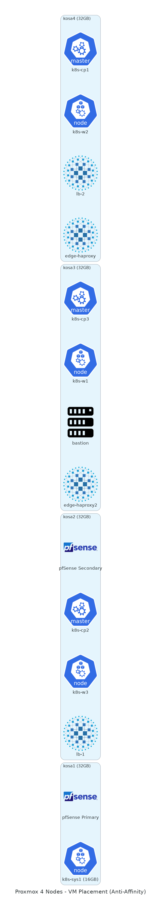

# 03. Proxmox 가상화

> **이 챕터에서 다루는 것**
> 4대의 베어메탈에 Proxmox를 깔아서 VM 12대 이상을 굴리는 방법.
> KVM이 무엇이고, cloud-init이 왜 필요하고, 어느 VM을 어느 호스트에 둘지 어떻게 결정하는지.

## 목차
1. [이론 사전 지식](#1-이론-사전-지식)
2. [왜 Proxmox인가](#2-왜-proxmox인가)
3. [Proxmox 4노드 구성](#3-proxmox-4노드-구성)
4. [VM 배치 전략](#4-vm-배치-전략)
5. [cloud-init 자동화](#5-cloud-init-자동화)
6. [qemu-guest-agent](#6-qemu-guest-agent)
7. [백업 (vzdump)](#7-백업-vzdump)
8. [구축 절차](#8-구축-절차)
9. [검증](#9-검증)
10. [트러블슈팅](#10-트러블슈팅)
11. [다음 챕터](#11-다음-챕터)

---

## 1. 이론 사전 지식

### 1.1 가상화의 두 종류

**Type 1 (Bare-metal hypervisor)**: 호스트 OS 없이 하드웨어 위에 직접. ESXi, Xen, Hyper-V.
**Type 2 (Hosted hypervisor)**: 일반 OS 위에 설치. VirtualBox, VMware Workstation.

Proxmox는 사실상 **Type 1.5** — Debian 위에 KVM 모듈을 얹은 형태지만, 부팅 시 곧바로 hypervisor 역할.

### 1.2 KVM (Kernel-based Virtual Machine)

리눅스 커널에 통합된 가상화 모듈. CPU의 가상화 명령(Intel VT-x, AMD-V)을 사용해 VM이 거의 native 속도로 실행.

```
[Guest OS (Ubuntu VM)]
         │
    [QEMU 프로세스]  ← 디바이스 에뮬레이션 (디스크/네트워크)
         │
    [KVM 커널 모듈]  ← CPU/메모리 가상화 (HW 가속)
         │
    [Linux 커널]
         │
    [물리 하드웨어]
```

📌 KVM이 CPU/메모리, QEMU가 디바이스. 둘이 짝꿍.

### 1.3 virtio paravirtualization

전통적 에뮬레이션(예: Intel e1000 NIC 흉내)은 느림. virtio는 "VM도 자기가 VM인 줄 알아" 식의 협력 드라이버 — 호스트와 직접 통신해 성능 ↑.

우리는 모든 VM의 디스크/NIC에 virtio 사용 (Proxmox 기본).

### 1.4 컨테이너 vs VM

| 비교 | VM (KVM) | 컨테이너 (Docker) |
|---|---|---|
| 격리 수준 | 강 (커널 분리) | 약 (커널 공유) |
| 부팅 시간 | 수십 초 | 1초 이내 |
| 메모리 오버헤드 | 200MB~ (OS 포함) | 수 MB |
| OS 선택 | 자유 (Windows/BSD 등도) | 호스트와 같은 커널 |
| 우리 사용처 | K8s 노드, pfSense, bastion | K8s Pod 안 (cri-o/containerd) |

📌 **둘은 경쟁이 아니라 stack**: VM 위에 K8s, K8s 위에 컨테이너.

---

## 2. 왜 Proxmox인가

### 2.1 대안 비교

| 옵션 | 라이선스 | 우리에게 |
|---|---|---|
| **VMware ESXi** | 유료 (Free 버전 EOL 2024) | ❌ 비용, 라이선스 변동 위험 |
| **Microsoft Hyper-V** | Windows Server 라이선스 | ❌ 리눅스 친화성 ↓ |
| **oVirt / RHV** | 오픈소스 / 유료 | △ RHV 유료화, oVirt 운영 복잡 |
| **OpenStack** | 오픈소스 | ❌ 4노드 운영에 과도 |
| **Proxmox VE** | GPL (오픈소스, Subscription은 선택) | ✅ 무료, 웹 UI, Debian 기반 |

> 💡 **왜 Proxmox?**
> 1. **무료 + GPL**: 학습 프로젝트에 적합
> 2. **Debian 기반**: 익숙한 리눅스 명령 그대로
> 3. **KVM + LXC 둘 다 지원**: 필요시 컨테이너도 가능
> 4. **웹 UI**: SSH 안 들어가도 일상 작업 가능
> 5. **클러스터 기능**: 4노드를 하나로 묶어 라이브 마이그레이션 가능
> 6. **국내 커뮤니티/사례 ↑**: 한글 자료 풍부

### 2.2 Proxmox VE의 구성 요소

```
proxmox-ve (메타 패키지)
├── pve-kernel  (Ubuntu Mainline 기반 커널 + KVM)
├── pve-qemu-kvm  (QEMU 패치 버전)
├── pve-container  (LXC 컨테이너)
├── pve-cluster  (corosync 기반 클러스터 데몬)
├── pveproxy  (웹 UI HTTPS proxy)
├── pvedaemon  (REST API 데몬)
└── pve-ha-manager  (HA 페일오버 매니저)
```

웹 UI: `https://<node>:8006`

---

## 3. Proxmox 4노드 구성

### 3.1 노드 인벤토리

| 노드 | 관리 IP (1G) | 10G IP | 메모리 | 역할 |
|---|---|---|---|---|
| kosa1 | 192.168.21.2 | 10.10.10.35 | 32GB | pfSense Primary, k8s-sys1 |
| kosa2 | 192.168.21.3 | 10.10.10.36 | 32GB | pfSense Secondary, k8s-cp2, w3, lb-1 |
| kosa3 | 192.168.21.4 | 10.10.10.37 | 32GB | k8s-cp3, w1, bastion, edge-haproxy2 |
| kosa4 | 192.168.21.5 | 10.10.10.38 | 32GB | k8s-cp1, w2, lb-2, edge-haproxy |

### 3.2 클러스터 구성

4노드를 하나의 Proxmox 클러스터로 묶음. 효과:
- 단일 웹 UI에서 모든 노드/VM 관리
- 라이브 마이그레이션 가능 (단, 디스크가 공유 스토리지일 때)
- HA 자동 페일오버 (옵션)

```bash
# kosa1 (첫 노드)
pvecm create kosa-cluster

# kosa2~4 (참여)
pvecm add 192.168.21.2
```

`/etc/pve/`는 모든 노드에 자동 동기화되는 분산 파일시스템(pmxcfs).

### 3.3 네트워크 브리지

각 노드에 2개 브리지:

```
vmbr0  ← eno1 (1G) ← 관리망, VLAN trunk
        │
        ├── VM의 net0 (관리망 또는 VLAN tag)
        └── 호스트 자신의 관리 IP

vmbr1  ← enp1s0f0 (10G) ← Ceph 패브릭
        │
        ├── VM의 net1 (Ceph 클라이언트용)
        └── 호스트 자신의 Ceph IP (10.10.10.x)
```

> 💡 **왜 vmbr0가 VLAN-aware?**
> Proxmox에서 한 브리지로 여러 VLAN을 trunk로 처리하려면 "VLAN aware" 옵션 필수. 그래야 VM net의 `tag=N` 옵션이 동작.

### 3.4 스토리지 풀

| 스토리지 ID | 타입 | 위치 | 용도 |
|---|---|---|---|
| local | dir | /var/lib/vz | ISO, 백업 |
| local-lvm | LVM-Thin | NVMe 일부 | VM 디스크 (로컬) |
| (예정) ceph-rbd | RBD | Ceph 클러스터 | VM 디스크 (공유, 라이브 마이그레이션용) |

> 💡 **왜 로컬 LVM-Thin이 기본?**
> Thin provisioning으로 디스크 동적 할당. 단 단일 노드 묶임 → 그 노드 죽으면 VM 마이그레이션 불가. Ceph RBD로 옮기면 진정한 HA 가능.

---

## 4. VM 배치 전략



### 4.1 SPoF 회피 원칙

K8s 컨트롤플레인 3대가 같은 Proxmox 호스트에 있으면? → 그 Proxmox 죽으면 K8s 전체 마비.

```
✗ 나쁜 배치:
  kosa1: cp1, cp2, cp3  ← 위험!
  kosa2: w1, w2
  kosa3: bastion
  kosa4: w3

✓ 좋은 배치 (우리 선택):
  kosa1: pfSense-Primary, k8s-sys1
  kosa2: pfSense-Secondary, k8s-cp2, w3, lb-1
  kosa3: k8s-cp3, w1, bastion, edge-haproxy2
  kosa4: k8s-cp1, w2, lb-2, edge-haproxy
```

각 컴포넌트의 HA 짝(예: cp1/cp2/cp3, lb-1/lb-2, edge-haproxy/2)이 **반드시 다른 호스트**에 있도록.

### 4.2 메모리 예산 (32GB 노드)

```
kosa1 (32GB) 메모리 할당 예시:
  Proxmox OS overhead:    2 GB
  pfSense Primary:         2 GB
  k8s-sys1:               16 GB
  여유:                    ~12 GB

kosa2 (32GB):
  Proxmox OS:              2 GB
  pfSense Secondary:       2 GB
  k8s-cp2:                 4 GB
  k8s-w3:                  6 GB
  lb-1:                    1 GB
  여유:                   ~17 GB
```

> ⚠️ **함정**: VM 메모리 합이 노드 RAM에 가까워지면 ballooning/스와핑 시작 → 응답성 급락. 75% 정도가 한계.

### 4.3 CPU 할당

i7-13700은 16C/24T. VM의 vCPU는 over-commit 가능하지만 적당히:

```
vCPU 할당 예 (24T 노드):
  pfSense:       2 vCPU
  k8s-cp:        2 vCPU
  k8s-worker:    4 vCPU
  k8s-sys1:      4 vCPU
  합계: VM마다 4 정도, 한 노드에 총 vCPU 16~24 정도면 안전
```

CPU type은 보통 `host` (호스트 CPU 그대로 노출) — 단, 다른 모델 노드로 마이그레이션 불가. 우리는 4노드 동일 모델이라 OK.

### 4.4 디스크 IO 분배

NVMe(local-lvm) vs HDD(보조) 선택:
- **OS 디스크**: NVMe (빠른 부팅)
- **DB 데이터**: NVMe 또는 Ceph RBD (IOPS 중요)
- **로그/덤프**: HDD (시퀀셜 쓰기)

---

## 5. cloud-init 자동화

### 5.1 cloud-init이 뭐?

VM이 처음 부팅될 때 호스트가 주입한 메타데이터(SSH 키, hostname, 네트워크 설정)를 읽어 자동 적용하는 시스템.

```
[Proxmox]
  cloud-init drive 생성 (가상 CD-ROM에 메타데이터)
        ↓
[VM 첫 부팅]
  systemd → cloud-init.service 실행
  → CD-ROM에서 user-data, meta-data, network-config 읽음
  → hostname 설정, SSH 키 추가, netplan 적용
  → 완료 후 marker 파일 작성 (다음 부팅엔 skip)
```

### 5.2 왜 필요한가

VM 12대를 손으로 ISO 띄워서 각각 설치/설정하면? 시간 + 일관성 안 맞음.

**cloud-init 워크플로우:**
1. Ubuntu cloud image (.img) 1개를 템플릿화
2. `qm clone` 으로 복제 → cloud-init 변수만 다르게
3. 부팅하면 그 변수대로 자동 설정

10초 만에 새 VM 1대 완성.

### 5.3 우리 cloud-init 설정 예

```bash
# 템플릿 생성 (한 번만)
wget https://cloud-images.ubuntu.com/jammy/current/jammy-server-cloudimg-amd64.img
qm create 9000 --name ubuntu-2204-template --memory 2048 --net0 virtio,bridge=vmbr0
qm importdisk 9000 jammy-server-cloudimg-amd64.img local-lvm
qm set 9000 --scsihw virtio-scsi-pci --scsi0 local-lvm:vm-9000-disk-0
qm set 9000 --ide2 local-lvm:cloudinit
qm set 9000 --boot c --bootdisk scsi0
qm set 9000 --serial0 socket --vga serial0
qm set 9000 --agent enabled=1,fstrim_cloned_disks=1
qm template 9000
```

```bash
# 새 VM (예: k8s-w1)
qm clone 9000 220 --name k8s-w1 --full
qm set 220 \
  --ciuser ubuntu \
  --cipassword '$6$encrypted_hash' \
  --sshkey ~/.ssh/id_ed25519.pub \
  --ipconfig0 ip=172.16.23.20/24,gw=172.16.23.1 \
  --ipconfig1 ip=10.10.10.120/24 \
  --searchdomain kosa.team2 \
  --nameserver 172.16.24.2 \
  --memory 6144 \
  --cores 4 \
  --net0 virtio,bridge=vmbr0,tag=30 \
  --net1 virtio,bridge=vmbr1
qm resize 220 scsi0 +30G
qm start 220
```

> 💡 **왜 `--agent enabled=1`을 템플릿에 박아두나?**
> qemu-guest-agent가 활성화돼야 Proxmox UI에서 VM 메모리 사용량이 정확히 표시되고, snapshot 시 fs-freeze가 가능. 템플릿에 박아두면 clone 후 따로 설정할 필요 X.

---

## 6. qemu-guest-agent

### 6.1 무엇을 해주나

VM 내부에서 도는 데몬. 호스트(Proxmox)와 virtio-serial 채널로 통신.

| 기능 | 효과 |
|---|---|
| 메모리 사용량 보고 | Proxmox UI에 정확한 RAM % 표시 (없으면 100%+로 잘못 표시) |
| IP 주소 보고 | UI의 Summary에 게스트 IP 자동 표시 |
| fs-freeze | 백업/스냅샷 시 일시적으로 파일시스템 flush+freeze → 일관성 보장 |
| Graceful shutdown | ACPI shutdown 대신 systemctl poweroff (cleaner) |

### 6.2 설치 + 활성화

```bash
# VM 내부에서
sudo apt install -y qemu-guest-agent
sudo systemctl enable --now qemu-guest-agent

# Proxmox host에서
qm set <VMID> --agent enabled=1,fstrim_cloned_disks=1
qm reboot <VMID>  # 재시작 필요
```

> ⚠️ **재시작 필요**: VM 부팅 시점에 Proxmox가 agent 채널을 활성화하므로 단순 `systemctl start qemu-guest-agent`만으로는 부족.

### 6.3 우리 모든 VM에 적용

이번 프로젝트 초기에 워커 VM들의 메모리가 100% 빨갛게 표시되는 문제가 있었다. 원인: qemu-guest-agent 없음. 모든 워커에 일괄 설치:

```bash
# bastion에서
for ip in 172.16.23.20 172.16.23.21 172.16.23.22 172.16.23.23; do
  ssh ubuntu@$ip "sudo apt install -y qemu-guest-agent && sudo systemctl enable --now qemu-guest-agent"
done

# 각 노드 Proxmox host에서 agent enable
for vmid in 220 221 222 223; do
  qm set $vmid --agent enabled=1,fstrim_cloned_disks=1
  qm reboot $vmid
done
```

---

## 7. 백업 (vzdump)

### 7.1 vzdump 동작

Proxmox 내장 백업 도구. `.vma.zst` 형태로 디스크 + 설정 한 번에 덤프.

```bash
# 즉시 백업
vzdump 220 --storage local --mode snapshot --compress zstd

# CronJob (Datacenter → Backup)
# 매일 03:00, sys 노드만, 최근 7개 유지
```

### 7.2 백업 정책 (권장)

| VM 그룹 | 빈도 | 유지 |
|---|---|---|
| pfSense | 주 1회 | 4개 |
| K8s CP (etcd 포함) | 일 1회 | 7개 |
| K8s Worker | 주 1회 | 2개 (어차피 stateless가 많음) |
| bastion | 일 1회 | 7개 (kubeconfig, ansible playbook) |
| edge-haproxy, lb | 주 1회 | 2개 (config 거의 안 바뀜) |

> 💡 **왜 K8s Worker는 백업이 가벼워도 되나?**
> 워커는 사실상 stateless. 데이터(PV)는 Ceph에, 설정은 K8s manifest에. 워커 한 대 죽어도 새 VM 만들어 `kubeadm join`하면 끝.
> 반면 etcd는 진짜 데이터(K8s 상태). CP 백업 또는 별도 etcd snapshot 필수.

---

## 8. 구축 절차

### 8.1 Proxmox 설치 (각 노드)

1. USB에 Proxmox VE 8.x ISO writing (`dd`, Rufus 등)
2. 부팅, GUI 인스톨러
3. NVMe를 시스템 디스크로 선택, ext4 또는 ZFS
4. 호스트명 (kosa1.team2 등), 관리망 IP (192.168.21.2/24), GW 192.168.21.1
5. root 비번 설정
6. 설치 완료 → 재부팅

설치 후 SSH 또는 https://192.168.21.2:8006 로 접속.

### 8.2 초기 설정 (각 노드)

```bash
# 무료 저장소 활성화 (Enterprise repo 비활성)
sed -i 's/^deb/#deb/' /etc/apt/sources.list.d/pve-enterprise.list
echo "deb http://download.proxmox.com/debian/pve bookworm pve-no-subscription" > /etc/apt/sources.list.d/pve-no-subscription.list
apt update && apt -y upgrade

# 네트워크 (vmbr1 = 10G 추가)
# /etc/network/interfaces 수정 (또는 Web UI)
auto enp1s0f0
iface enp1s0f0 inet manual

auto vmbr1
iface vmbr1 inet static
    address 10.10.10.35/24
    bridge-ports enp1s0f0
    bridge-stp off
    bridge-fd 0

systemctl restart networking
```

### 8.3 클러스터 구성

```bash
# kosa1
pvecm create kosa-cluster

# kosa2, 3, 4
pvecm add 192.168.21.2

# 검증
pvecm status
# Expected: Quorum 4, 모든 노드 online
```

### 8.4 cloud-init 템플릿 만들기

위 5.3 코드 참고. 한 번 만들면 모든 VM의 base.

### 8.5 VM 생성 (전체 12+)

bastion에서 Ansible 또는 스크립트로 일괄. (구체적인 정의는 `~/ansible/inventory/vms.yml` 참고)

---

## 9. 검증

```bash
# 클러스터 상태
pvecm status
# Expected: Quorum 4

# 노드 자원 사용률
for node in kosa1 kosa2 kosa3 kosa4; do
  ssh root@$node "free -h && uptime"
done

# VM 목록
qm list  # 각 노드에서 (자기 노드의 VM만)
# 또는 Web UI의 Datacenter view

# 모든 VM의 guest-agent 응답
for vmid in 210 211 212 220 221 222 223 230 240 241 250 251; do
  qm guest cmd $vmid network-get-interfaces 2>&1 | grep -q "ip-address" && echo "$vmid OK" || echo "$vmid FAIL"
done

# 라이브 마이그레이션 테스트 (Ceph RBD 디스크면)
qm migrate 220 kosa1 --online
```

---

## 10. 트러블슈팅

### 10.1 VM 메모리가 100%+ 빨강

**원인**: qemu-guest-agent 미설치/미활성.

**해결**: 위 6.3 코드.

### 10.2 클러스터 quorum 깨짐

**증상**: `pvecm status`에서 일부 노드 offline. `/etc/pve/` 읽기 전용.

**원인**: corosync 멀티캐스트/유니캐스트 통신 실패, 노드 시간 어긋남.

**해결**:
```bash
# 시간 동기화
systemctl status chronyd

# corosync 재시작
systemctl restart corosync pve-cluster

# 단일 노드 강제 quorum (위험, 데이터 일관성 X)
pvecm expected 1
```

### 10.3 CPU type host로 마이그레이션 실패

**증상**: `cannot migrate ... CPU model mismatch`.

**원인**: VM의 CPU type을 `host`로 설정 → 다른 CPU 모델의 노드로 이동 불가.

**해결**:
- 4노드 모두 동일 CPU면 무시
- 다른 CPU면 VM CPU type을 공통 분모 (예: `x86-64-v3`)로 변경

### 10.4 NUMA / 메모리 ballooning 이슈

**증상**: VM이 가끔 느려짐, 호스트 memory pressure.

**원인**: ballooning이 자동으로 메모리 회수.

**해결**:
- VM 메모리에 최소값 설정 (Min memory)
- 중요한 VM은 ballooning 비활성

### 10.5 cloud-init 한 번 더 돌리고 싶음

**증상**: 새 SSH 키를 주입했는데 적용 안 됨.

**원인**: cloud-init은 첫 부팅 후 marker 파일 보고 skip.

**해결**:
```bash
# VM 내부
sudo cloud-init clean --logs
sudo reboot
# 또는 그냥 새 VM clone이 더 빠를 수 있음
```

### 10.6 디스크 IO 병목 (NVMe 100%)

**원인**: 여러 VM이 동시에 디스크 작업, 또는 swap.

**해결**:
- `iostat -xz 1` 로 진단
- VM 디스크를 Ceph RBD로 이전 (IO 분산)
- 메모리 부족이 원인이면 노드 RAM 증설

### 10.7 vmbr이 VLAN tag 적용 안 함

**증상**: VM 안에서 같은 VLAN의 다른 호스트와 통신 안 됨.

**해결**:
- vmbr0의 "VLAN aware" 체크 (Web UI 또는 `/etc/network/interfaces`에 `bridge-vlan-aware yes`)
- VM net 설정에서 `tag=N` 명시

---

## 11. 다음 챕터

→ **[04. Ceph 분산 스토리지](04-ceph.md)**

Ceph가 무엇이고, OSD/MON/MGR/RGW가 각각 무엇이며, BlueStore의 내부 구조, CRUSH 알고리즘, K8s에서 RBD를 PV로 쓰는 법.
