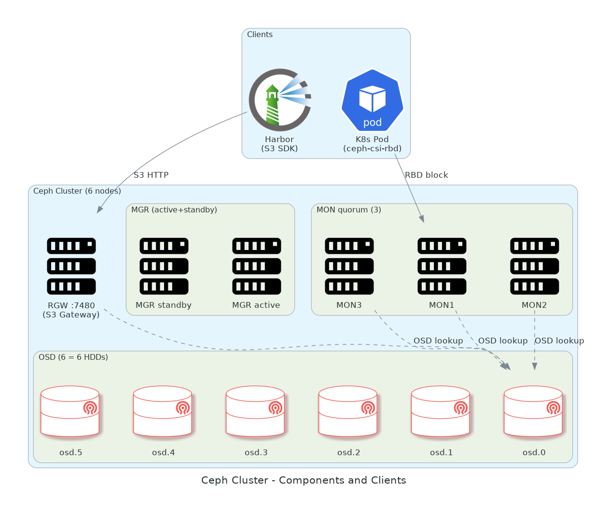

# 04. Ceph 분산 스토리지

> **이 챕터에서 다루는 것**
> 6노드 별도 클러스터로 운영하는 Ceph가 어떻게 동작하는지, 블록(RBD)·객체(RGW)·파일(CephFS)을 한 시스템으로 다 제공하는 비결, 그리고 K8s/Harbor에서 어떻게 활용하는지.

## 목차
1. [이론: 분산 스토리지](#1-이론-분산-스토리지)
2. [Ceph 컴포넌트 (OSD/MON/MGR/MDS/RGW)](#2-ceph-컴포넌트-osdmonmgrmdsrgw)
3. [CRUSH 알고리즘](#3-crush-알고리즘)
4. [BlueStore 내부 구조](#4-bluestore-내부-구조)
5. [Pool, PG, Replica vs EC](#5-pool-pg-replica-vs-ec)
6. [RBD vs RGW vs CephFS](#6-rbd-vs-rgw-vs-cephfs)
7. [우리 Ceph 설계](#7-우리-ceph-설계)
8. [K8s에서 RBD 사용 (ceph-csi)](#8-k8s에서-rbd-사용-ceph-csi)
9. [Harbor에서 RGW 사용 (S3 백엔드)](#9-harbor에서-rgw-사용-s3-백엔드)
10. [구축 절차](#10-구축-절차)
11. [운영 명령 치트시트](#11-운영-명령-치트시트)
12. [트러블슈팅](#12-트러블슈팅)
13. [다음 챕터](#13-다음-챕터)

---

## 1. 이론: 분산 스토리지

### 1.1 왜 분산 스토리지?

단일 디스크/서버에 데이터를 두면:
- 디스크 하나 죽으면 데이터 손실
- 용량/IOPS 한계 (하드웨어 1대)
- 액세스 한 서버에 집중 (병목)

분산 스토리지는 여러 노드에 데이터를 **복제 또는 erasure code**로 흩어 저장:
- 노드 N대 죽어도 살아남음
- 노드 추가 = 용량/IOPS 같이 증가 (scale-out)
- 읽기는 가까운 노드, 쓰기는 병렬

### 1.2 분산 스토리지의 3대 트레이드오프 (CAP)

| 속성 | 설명 |
|---|---|
| **Consistency** | 어느 노드에서 읽어도 같은 값 |
| **Availability** | 일부 노드 죽어도 응답 |
| **Partition tolerance** | 네트워크 분할 견딤 |

CAP 정리: 셋 다 동시에 X. Ceph는 보통 **CP** (강한 일관성, 분할 견딤) 지향.

> 💡 **왜 Ceph는 일관성을 골랐나?**
> 블록 스토리지(RBD)는 같은 디스크에서 다른 값이 보이면 데이터 손상으로 직결. 일관성 절대 필수.
> 단점: 네트워크 분할 시 minority partition은 쓰기 차단됨. 우리 환경(같은 데이터센터)에서는 거의 안 일어남.

### 1.3 다른 분산 스토리지와 비교

| 시스템 | 블록 | 객체 | 파일 | 특징 |
|---|---|---|---|---|
| **Ceph** | ✅ RBD | ✅ RGW | ✅ CephFS | All-in-one, 운영 복잡 |
| **Longhorn** | ✅ | ❌ | ❌ | K8s 네이티브, 단순 |
| **MinIO** | ❌ | ✅ | ❌ | S3 호환만, 단순 |
| **GlusterFS** | ❌ | ❌ | ✅ | 파일 위주, 성능 제약 |
| **NFS** | ❌ | ❌ | ✅ | 단순, SPoF (NFS 서버) |

> 💡 **왜 Ceph?**
> 블록(K8s PV) + 객체(Harbor S3) 두 마리 토끼. 둘을 따로 시스템 만들면 운영 시스템 2개.

---

## 2. Ceph 컴포넌트 (OSD/MON/MGR/MDS/RGW)



```
┌────────────────────────────────────────────────────┐
│                    Ceph Cluster                     │
│                                                     │
│  ┌─────────┐  ┌─────────┐  ┌─────────┐             │
│  │  MON 1  │  │  MON 2  │  │  MON 3  │ ← 클러스터 상태 │
│  └─────────┘  └─────────┘  └─────────┘   (홀수 권장)│
│                                                     │
│  ┌─────────┐    ┌─────────┐                        │
│  │  MGR 1  │    │  MGR 2  │ ← 메트릭/대시보드      │
│  └─────────┘    └─────────┘                        │
│                                                     │
│  ┌──────┐  ┌──────┐  ┌──────┐  ┌──────┐ ...        │
│  │ OSD0 │  │ OSD1 │  │ OSD2 │  │ OSD3 │ ← 디스크 1개 │
│  └──────┘  └──────┘  └──────┘  └──────┘   = OSD 1개 │
│                                                     │
│  ┌─────────┐    ┌─────────┐                        │
│  │  MDS 1  │    │  MDS 2  │ ← CephFS 메타데이터    │
│  └─────────┘    └─────────┘   (CephFS 안 쓰면 생략) │
│                                                     │
│  ┌─────────┐                                       │
│  │  RGW 1  │ ← S3/Swift API 게이트웨이             │
│  └─────────┘                                       │
└────────────────────────────────────────────────────┘
```

### 2.1 OSD (Object Storage Daemon)

**1 OSD = 1 디스크** (보통). 우리는 노드당 1TB HDD × 1 = 6 OSD.

OSD 책임:
- 자기 디스크에 객체 read/write
- 다른 OSD와 통신해서 복제 (replication)
- peer OSD가 살아있는지 heartbeat
- 자기 메모리/CPU/디스크 상태를 MON에 보고

> 💡 **왜 1디스크 = 1 OSD?**
> 한 OSD에 여러 디스크 묶으면 한 디스크 죽었을 때 OSD 전체가 죽음 (대량 데이터 재복제 필요). 1:1이 fault domain 최소화.
> SSD를 WAL/DB 분리 용도로 추가하면 그 SSD는 별도 OSD 아니고 BlueStore의 부속.

### 2.2 MON (Monitor)

클러스터의 **상태 맵**을 보관:
- OSD map (어떤 OSD가 살아있나)
- PG map (PG가 어디에 있나)
- CRUSH map (위치 계산 룰)
- MON map (MON들 자신)

**Paxos** 알고리즘으로 quorum 유지. 홀수 (3 or 5)가 표준.

> 💡 **왜 우리는 MON 수?**
> 일반적으로 3 MON이 표준. 6노드면 5 MON도 가능하나 3이 운영 단순. 우리는 3 MON.

### 2.3 MGR (Manager)

MON이 다 못 하는 일:
- Prometheus 메트릭 export
- Ceph Dashboard (Web UI)
- Telemetry, balancer, autoscaler 등 모듈

2 MGR 이상 (1 active + standby). 우리는 2.

### 2.4 MDS (Metadata Server)

**CephFS 전용**. POSIX 호환 파일시스템의 메타데이터(디렉토리 트리, inode) 관리.

우리는 CephFS 안 쓰니까 MDS 없음. RWX 필요하면 미래에 추가.

### 2.5 RGW (RADOS Gateway)

**S3/Swift API 게이트웨이**. 클라이언트는 S3 SDK로 통신, RGW가 내부적으로 RADOS object로 변환.

우리는 1 RGW (ceph1 노드에 single daemon). Harbor 백엔드.

> ⚠️ **SPoF**: RGW 1대면 그 노드/데몬 다운 시 Harbor 마비. 운영에서는 2개 이상 + 앞에 LB 권장.

---

## 3. CRUSH 알고리즘

### 3.1 문제 정의

데이터 객체 1억 개. OSD 6개. "객체 X는 어느 OSD에?"를 어떻게 결정?

**Naive 방법**: 룩업 테이블 (1억 × 6 매핑). 매번 MON에 물어봐야 함, 메모리 폭증.

**CRUSH (Controlled Replication Under Scalable Hashing)**: **계산만으로** 위치 결정. 룩업 테이블 X.

```
객체 X의 위치 = CRUSH(hash(X), CRUSH_map, pool_replica)
              ↓
            [OSD3, OSD1, OSD5]  ← 3-replica
```

### 3.2 CRUSH의 장점

1. **무상태**: 클라이언트도 CRUSH map만 있으면 직접 계산 → MON 부하 ↓
2. **결정적**: 같은 입력 = 같은 결과 (분산 환경에서 일관성)
3. **위계적**: rack/host/disk 위계 표현 → "같은 rack에 복제본 두지 마" 식 정책 가능

### 3.3 CRUSH map 예 (우리)

```
root default
├── host ceph1
│   └── osd.0 (1TB HDD)
├── host ceph2
│   └── osd.1
├── host ceph3
│   └── osd.2
├── host ceph4
│   └── osd.3
├── host ceph5
│   └── osd.4
└── host ceph6
    └── osd.5

rule replicated_rule:
  step take default
  step chooseleaf firstn 0 type host  ← 같은 host에 복제본 X
```

`chooseleaf type host` = 복제본을 서로 다른 host에 둠. 우리 환경에 적합.

> 💡 **만약 rack/row 정보를 CRUSH에 넣으면?**
> "한 랙 통째로 죽어도 데이터 보존" 같은 보장 가능. 대규모 데이터센터에서 활용.

---

## 4. BlueStore 내부 구조

### 4.1 FileStore (옛 백엔드) vs BlueStore

**FileStore (~ Luminous)**: 디스크에 XFS/ext4 파일시스템을 만들고, 객체를 파일로 저장.
- 단점: 이중 쓰기 (FS 메타데이터 + 객체 데이터), 단편화, 성능 ↓

**BlueStore (Luminous+, 우리 사용)**: 디스크에 **직접** 쓰기 (raw block).
- 자체 메타데이터 관리 (RocksDB)
- 이중 쓰기 X → 성능/일관성 ↑
- 압축/체크섬 내장

### 4.2 BlueStore 구성요소

```
BlueStore OSD:
  ├── Data partition  (실제 객체 데이터, 우리는 1TB HDD)
  ├── WAL (Write-Ahead Log)  (쓰기 일관성, 소량 SSD 권장)
  └── DB (RocksDB metadata)  (객체 위치 색인, 소량 SSD 권장)
```

우리는 WAL/DB를 데이터 HDD에 함께 둠 (SSD 없음). 단점: 메타데이터 IO가 데이터 IO와 같은 디스크 → 약간 느림.

> 💡 **향후 개선**: 노드당 SSD 1개 추가해 WAL/DB만 SSD로. HDD 데이터 IOPS 2~3배 향상 효과.

### 4.3 BlueStore의 객체 흐름

```
[클라이언트 쓰기]
  ↓
OSD primary 받음
  ↓
1. WAL에 쓰기 기록 (작은 쓰기 한정, journal 역할)
2. Data partition에 실제 데이터 쓰기 (raw block)
3. DB(RocksDB)에 메타데이터 (object id → 위치)
  ↓
복제본 OSD들에 동일 쓰기 (3-replica 시)
  ↓
모두 ACK → 클라이언트에 OK
```

---

## 5. Pool, PG, Replica vs EC

### 5.1 Pool

논리적 데이터 묶음. 각 pool마다:
- 복제 방식 (replica N개 또는 EC k+m)
- CRUSH rule
- quota (옵션)

우리 pool 예:
```
k8s-rbd     (3-replica, RBD용)   ← K8s PVC
.rgw.*      (3-replica, RGW 메타)
default.rgw.buckets.data (3-replica) ← Harbor 이미지 데이터
```

### 5.2 PG (Placement Group)

객체를 직접 OSD에 매핑하면 1억 객체 = 1억 매핑 정보. 너무 많음.

**PG**: 객체와 OSD 사이의 중간 묶음. 객체 → PG → OSD.

```
1억 객체 ─── hash ───► 1024 PG ─── CRUSH ───► OSD들
```

PG 수 = OSD 수 × ~100 / replica. 우리(6 OSD, 3-replica): 6×100/3 = **200개 정도**가 적정.
Pool마다 PG 수 따로 설정. autoscaler에 맡기는 게 보통.

### 5.3 Replica vs EC

| 방식 | 공간 효율 | 성능 | 노드 요구 |
|---|---|---|---|
| **3-replica** | 33% (1/3 사용) | 쓰기 빠름 | 최소 3 |
| **EC 4+2** | 67% (4/6 사용) | 쓰기 느림 (분할/패리티) | 최소 6 |
| **EC 8+3** | 73% | 더 느림 | 최소 11 |

우리는 6노드 → EC 4+2 가능하지만 운영 단순함 위해 **3-replica 채택**.

> 💡 **왜 우리는 EC 안 쓰나?**
> 1. **노드 수 빠듯**: EC 4+2면 노드 1대 실수로 빠지면 PG가 incomplete
> 2. **CPU 비용**: EC는 매 쓰기마다 패리티 계산
> 3. **학습 단순**: 3-replica는 디버깅 직관적
>
> 향후 데이터 ↑ 비용 절감 필요시 EC 풀 별도 추가 가능.

### 5.4 Replica = 3 의 의미

```
객체 X 쓰기:
  Primary OSD (예: osd.0) 받음
    ↓ 동시에
  Secondary OSD (osd.2)  ← 같은 PG의 다른 OSD
  Tertiary OSD (osd.4)
    ↓
  3개 다 쓰기 성공 → 클라이언트 ACK
```

**최소 1개 살아있으면 읽기 가능. 2개 살아있으면 쓰기 가능 (`min_size=2`)**.

---

## 6. RBD vs RGW vs CephFS

| API | 의미 | K8s에서 | 우리 사용 |
|---|---|---|---|
| **RBD (RADOS Block Device)** | 가상 블록 디바이스 (`/dev/rbd0` 같은) | PV (RWO) | ✅ K8s PV |
| **RGW (S3/Swift)** | HTTP API 객체 스토리지 | PV X, 앱에서 SDK로 | ✅ Harbor 이미지 |
| **CephFS** | POSIX 파일시스템 (`/mnt/cephfs`) | PV (RWX 가능) | ❌ 미사용 |

### 6.1 왜 RBD를 PV로?

K8s Pod이 디스크를 마운트하는 가장 자연스러운 방식.
- DB Pod이 `/var/lib/mysql`을 mount
- ceph-csi-rbd가 PVC 요청 받으면 RBD 이미지 생성 + 해당 노드에 `/dev/rbd0`으로 attach + Pod에 mount

### 6.2 왜 RGW를 Harbor에?

Harbor는 이미지 blob을 어딘가 저장해야 함. 옵션:
- 로컬 PVC (RBD): 단일 노드 의존, 마이그레이션 시 PV move
- S3 호환: 어디서든 접근 가능, scaling 쉬움

RGW는 사내 S3. 외부 AWS에 비용 안 들이고 같은 인터페이스.

### 6.3 왜 CephFS 안 쓰나?

CephFS는 RWX(여러 노드 동시 mount) 가능. 그런데:
- MDS 추가 운영 부담
- 우리 워크로드(K8s) 대부분이 RWO로 충분
- RWX 필요한 건 모니터링/Harbor 정도인데 sys1 단일 노드에 nodeSelector로 고정해서 우회

---

## 7. 우리 Ceph 설계

### 7.1 클러스터 사양

```
6 노드 × 1TB HDD = 6 TB raw

3-replica 풀:
  사용 가능 ≈ 6TB / 3 = 2 TB

오버헤드 (메타, journal): ~5~10%
실효 가용: ~1.8 TB
```

### 7.2 네트워크

- Public Network: 10.10.10.0/24 (10G Spine-Leaf)
- Cluster Network: 분리하지 않음 (NIC 1개 사용)

### 7.3 데몬 배치

| 노드 | OSD | MON | MGR | RGW |
|---|---|---|---|---|
| ceph1 | osd.0 | ✅ | ✅ active | ✅ |
| ceph2 | osd.1 | ✅ | ✅ standby | |
| ceph3 | osd.2 | ✅ | | |
| ceph4 | osd.3 | | | |
| ceph5 | osd.4 | | | |
| ceph6 | osd.5 | | | |

> ⚠️ **RGW SPoF**: ceph1만 RGW. 운영 권장은 2~3대 + LB.

### 7.4 K8s에서 보는 Ceph

```
[K8s 워커 노드 (10.10.10.120)]
  │
  │ ceph-csi-rbd (DaemonSet)
  │ ↓
  │ rbd map team2-rbd-block/csi-vol-xxx
  │ ↓
  │ /dev/rbd0 → mount → Pod의 /var/lib/...
  ↓
[Ceph 클러스터 (10.10.10.11~16)]
  MON quorum, OSD가 데이터 처리
```

---

## 8. K8s에서 RBD 사용 (ceph-csi)

### 8.1 ceph-csi-rbd 구성

K8s CSI 드라이버. Helm으로 설치.

```yaml
# Helm values 예
csiConfig:
  - clusterID: <fsid>
    monitors:
      - 10.10.10.11:6789
      - 10.10.10.12:6789
      - 10.10.10.13:6789

provisioner:
  nodeSelector: {}    # 어디든 OK
  replicaCount: 2
nodeplugin:
  nodeSelector: {}    # 모든 노드 (DaemonSet)
```

### 8.2 Secret (Ceph 사용자 key)

```bash
# Ceph cluster에서
ceph auth get-or-create client.k8s mon 'profile rbd' osd 'profile rbd pool=team2-rbd-block'

# 출력 예
[client.k8s]
  key = AQB...

# K8s Secret
kubectl create secret generic ceph-csi-rbd-secret -n ceph-csi-rbd \
  --from-literal=userID=k8s --from-literal=userKey=AQB...
```

### 8.3 StorageClass

```yaml
apiVersion: storage.k8s.io/v1
kind: StorageClass
metadata:
  name: team2-rbd-block
provisioner: rbd.csi.ceph.com
parameters:
  clusterID: <fsid>
  pool: team2-rbd-block
  imageFeatures: layering
  csi.storage.k8s.io/provisioner-secret-name: ceph-csi-rbd-secret
  csi.storage.k8s.io/provisioner-secret-namespace: ceph-csi-rbd
  csi.storage.k8s.io/node-stage-secret-name: ceph-csi-rbd-secret
  csi.storage.k8s.io/node-stage-secret-namespace: ceph-csi-rbd
reclaimPolicy: Delete    # PVC 삭제 시 RBD 이미지도 삭제
allowVolumeExpansion: true
```

### 8.4 PVC 생성

```yaml
apiVersion: v1
kind: PersistentVolumeClaim
metadata:
  name: my-data
spec:
  accessModes: [ReadWriteOnce]    # RBD는 RWO만
  storageClassName: team2-rbd-block
  resources:
    requests:
      storage: 10Gi
```

→ ceph-csi가 자동으로 RBD 이미지 `team2-rbd-block/csi-vol-xxx` 생성 + PV 바인딩.

---

## 9. Harbor에서 RGW 사용 (S3 백엔드)

자세한 건 [08-harbor-registry.md](08-harbor-registry.md) 참고. 여기서는 Ceph 관점만.

### 9.1 RGW 사용자 + 키

```bash
# Ceph node
radosgw-admin user create --uid=harbor --display-name="Harbor Registry"
radosgw-admin key create --uid=harbor --gen-access-key

# 출력
{
  "access_key": "ABCD1234",
  "secret_key": "xyz..."
}

# 쿼터
radosgw-admin quota set --uid=harbor --max-size=200G --max-objects=10M
radosgw-admin quota enable --uid=harbor --quota-scope=user
```

### 9.2 Bucket 수동 생성 (Harbor가 자동 안 함)

```bash
AWS_ACCESS_KEY_ID=ABCD1234 \
AWS_SECRET_ACCESS_KEY=xyz... \
aws --endpoint-url http://10.10.10.11:7480 --region us-east-1 \
  s3 mb s3://harbor-registry
```

> ⚠️ **`--region us-east-1`**: RGW는 region 개념 없지만 AWS CLI가 region 필수. `us-east-1`이 관례.

---

## 10. 구축 절차

### 10.1 cephadm으로 부트스트랩

`cephadm`은 Ceph 공식 deploy 도구 (Octopus+). Docker/podman으로 데몬 컨테이너 띄움.

```bash
# ceph1 (첫 노드)
curl --silent --remote-name --location https://github.com/ceph/ceph/raw/quincy/src/cephadm/cephadm
chmod +x cephadm
sudo ./cephadm add-repo --release quincy
sudo ./cephadm install
sudo cephadm bootstrap --mon-ip 10.10.10.11

# 출력에 dashboard URL + admin pw가 나옴
```

### 10.2 다른 노드 추가

```bash
# ceph1의 SSH key를 다른 노드들에 배포
ssh-copy-id -f -i /etc/ceph/ceph.pub root@ceph2
# ... ceph6까지

ceph orch host add ceph2 10.10.10.12
ceph orch host add ceph3 10.10.10.13
# ...

# 모든 노드에 OSD 자동 배포 (각 노드의 1TB HDD 사용)
ceph orch apply osd --all-available-devices
```

### 10.3 MON 3개로 확장

```bash
ceph orch apply mon --placement="ceph1,ceph2,ceph3"
```

### 10.4 RGW 배포

```bash
ceph orch apply rgw harbor --placement="ceph1" --port=7480
```

### 10.5 Pool 생성

```bash
ceph osd pool create team2-rbd-block 128 128
rbd pool init team2-rbd-block
```

---

## 11. 운영 명령 치트시트

```bash
# 전체 상태
ceph -s
ceph health detail

# OSD 트리
ceph osd tree

# OSD별 사용량
ceph osd df

# PG 상태
ceph pg stat
ceph pg dump_stuck

# Pool 목록 + 사용량
ceph df

# Pool에서 객체 목록 (소량일 때만)
rados -p team2-rbd-block ls

# RBD 이미지 목록
rbd -p team2-rbd-block ls

# RBD 이미지 정보
rbd info team2-rbd-block/csi-vol-xxx

# RBD watcher 확인 (stale 진단)
rbd status team2-rbd-block/csi-vol-xxx

# 클라이언트 blocklist (stale watcher 해제)
ceph osd blocklist add 10.10.10.120
ceph osd blocklist ls

# 데몬 재시작 (cephadm 환경)
ceph orch daemon restart osd.0

# Dashboard URL
ceph mgr services
```

---

## 12. 트러블슈팅

### 12.1 HEALTH_WARN: OSD down

```bash
ceph osd tree | grep down
# Identify osd.N
journalctl -u ceph-osd@N
# 디스크 SMART
smartctl -a /dev/sdX
```

원인별 대응:
- 디스크 문제: 디스크 교체 + `ceph orch daemon redeploy osd.N`
- 네트워크 문제: 노드 → MON 통신 확인
- OOM: 노드 메모리 확보

### 12.2 HEALTH_WARN: slow ops

```bash
ceph health detail
# "SLOW_OPS 5 slow ops, oldest one blocked for 60 sec ..."
```

원인: 디스크 IO bottleneck, 또는 단일 OSD가 hot.

대응: 부하 분산 (PG balancer), 디스크 SMART, RGW/RBD pool autoscale.

### 12.3 HEALTH_WARN: mons clock skew

```bash
ceph health detail
# "clock skew detected on mon.ceph2"
```

NTP 동기화 확인:
```bash
chronyc tracking
chronyc sources
# 또는 timesyncd
```

같은 NTP 서버 사용 권장. 노드 간 시간 차이 50ms 이상이면 WARN.

### 12.4 PG stuck (undersized / degraded)

```bash
ceph pg dump_stuck
ceph pg <pgid> query  # 상세
```

원인:
- OSD 부족: 새 OSD 추가
- min_size 미달: 데이터 안전성 위반, 손상 위험
- backfill 진행 중: 기다리면 됨

### 12.5 RBD watcher가 stale (K8s)

증상: Pod이 PV mount 못 함, `rbd map: device or resource busy`.

```bash
# bastion 또는 ceph-csi 컨테이너에서
rbd status team2-rbd-block/csi-vol-xxx
# 출력에 watcher IP

# 그 IP가 죽은 노드면 blocklist
ceph osd blocklist add <ip>
```

### 12.6 Full ratio 위험

```bash
ceph df
# %USED 가 85% 근접 → WARN, 95% → 클러스터 read-only
```

대응:
- OSD 추가
- 미사용 RBD 이미지 정리
- 임시 ratio 상향: `ceph osd set-full-ratio 0.97` (위험)

### 12.7 RGW NoSuchBucket

```bash
# Bucket 존재 확인
radosgw-admin bucket list

# 없으면 수동 생성 (위 9.2)
```

### 12.8 RGW connection refused

원인: RGW 데몬 다운, 또는 7480 포트 차단.

```bash
ceph orch ps --service_name=rgw.harbor
ceph orch daemon restart rgw.harbor.ceph1.xxx
```

---

## 13. 다음 챕터

→ **[05. Kubernetes 클러스터](05-kubernetes.md)**

kubeadm으로 HA 컨트롤플레인 만드는 법, Calico/MetalLB/HAProxy Ingress 선택 이유, workload-type 라벨로 sys 분리, ceph-csi 연동.
