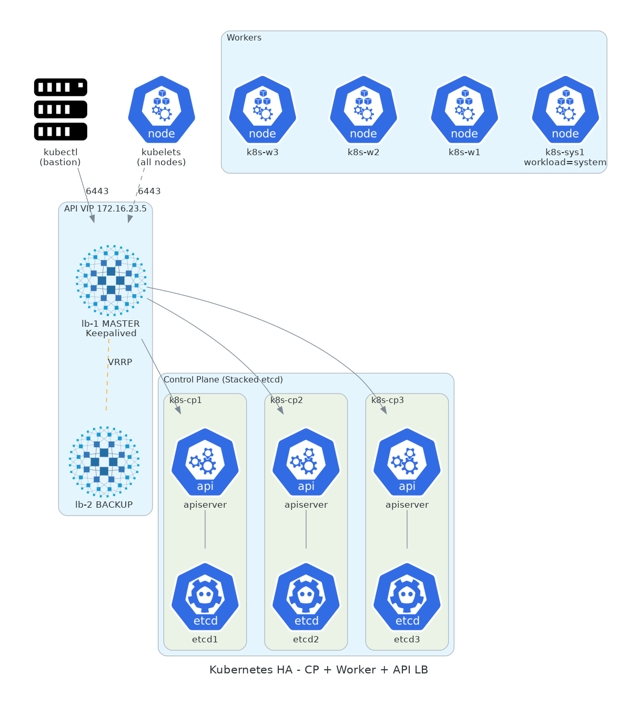

# 05. Kubernetes 클러스터

> **이 챕터에서 다루는 것**
> kubeadm으로 HA 컨트롤플레인 3대 + 워커 4대를 만든 과정. Calico/MetalLB/HAProxy Ingress를 왜 골랐고 어떻게 동작하는지.
> 베어메탈 K8s 운영의 핵심인 "API VIP", "LoadBalancer Service" 같은 개념을 처음부터 풀어낸다.

## 목차
1. [이론: K8s 아키텍처](#1-이론-k8s-아키텍처)
2. [왜 kubeadm? 왜 HA?](#2-왜-kubeadm-왜-ha)
3. [Stacked etcd vs External etcd](#3-stacked-etcd-vs-external-etcd)
4. [Calico CNI](#4-calico-cni)
5. [베어메탈 LoadBalancer 문제와 MetalLB](#5-베어메탈-loadbalancer-문제와-metallb)
6. [API VIP — HAProxy + Keepalived](#6-api-vip--haproxy--keepalived)
7. [HAProxy Ingress Controller](#7-haproxy-ingress-controller)
8. [노드 워크로드 분리 (workload-type 라벨)](#8-노드-워크로드-분리-workload-type-라벨)
9. [Ceph-CSI 연동](#9-ceph-csi-연동)
10. [구축 절차 (Ansible 흐름)](#10-구축-절차-ansible-흐름)
11. [운영 명령 치트시트](#11-운영-명령-치트시트)
12. [트러블슈팅](#12-트러블슈팅)
13. [다음 챕터](#13-다음-챕터)

---

## 1. 이론: K8s 아키텍처

### 1.1 K8s 컴포넌트 한 눈에

```
┌────────────────────── Control Plane (3 노드) ────────────────────┐
│                                                                  │
│  ┌──────────┐  ┌──────────────┐  ┌────────────┐  ┌────────────┐│
│  │ kube-    │  │ kube-        │  │ kube-      │  │   etcd     ││
│  │ apiserver│◄─┤ controller-  │  │ scheduler  │  │ (분산 KV)  ││
│  │          │  │ manager      │  │            │  │            ││
│  └────┬─────┘  └──────────────┘  └────────────┘  └────────────┘│
│       │  REST API (HTTPS 6443)                                  │
└───────┼──────────────────────────────────────────────────────────┘
        │
        │  ▲ (kubectl, 워커 kubelet 등이 모두 여기로 접근)
        │
┌───────┼─────────────────── Worker Node (1 of N) ─────────────────┐
│       │                                                          │
│   ┌───▼─────┐   ┌──────────────┐   ┌──────────────┐             │
│   │ kubelet │   │ kube-proxy   │   │  containerd  │             │
│   │ (노드   │   │ (Service →   │   │  (컨테이너   │             │
│   │  에이전트)│  │  Pod 라우팅)│   │   런타임)    │             │
│   └───┬─────┘   └──────────────┘   └──────┬───────┘             │
│       │                                    │                    │
│   ┌───▼────────────────────────────────────▼───┐                │
│   │              Pods (사용자 워크로드)         │                │
│   └────────────────────────────────────────────┘                │
└──────────────────────────────────────────────────────────────────┘
```

### 1.2 핵심 객체

| 객체 | 의미 |
|---|---|
| **Pod** | 배포 단위. 1+ 컨테이너 묶음 (같은 IP/볼륨 공유). |
| **Deployment** | Pod의 desired state 관리 (replicas, rolling update). |
| **StatefulSet** | 안정적 ID/순서/스토리지가 필요한 워크로드 (DB 등). |
| **Service** | Pod 집합에 안정적 가상 IP/DNS. ClusterIP / NodePort / LoadBalancer. |
| **Ingress** | L7 HTTP 라우팅 (Host/Path → Service). Ingress Controller 필요. |
| **ConfigMap / Secret** | 환경 변수/파일 주입. |
| **PersistentVolume / PVC** | 영구 스토리지. StorageClass로 동적 프로비저닝. |
| **Namespace** | 논리 격리 (RBAC, quota). |

### 1.3 K8s API의 reconciliation 루프

```
  ┌─────────────────┐
  │  YAML (desired) │
  └────────┬────────┘
           │ kubectl apply
           ▼
  ┌─────────────────┐
  │ etcd (저장)     │
  └────────┬────────┘
           │ controller가 watch
           ▼
  ┌─────────────────────────────────┐
  │ Controller: 현재 != desired ?   │
  │   → 차이 만큼 액션 (Pod 생성 등)│
  └─────────────────────────────────┘
           │
           ▼
  ┌─────────────────┐
  │ 실제 상태       │  → 다시 etcd에 반영 → 루프
  └─────────────────┘
```

📌 K8s의 모든 컴포넌트는 이 루프. 명령형이 아니라 선언형.

---

## 2. 왜 kubeadm? 왜 HA?

### 2.1 K8s 설치 도구 비교

| 도구 | 특징 | 우리에게 |
|---|---|---|
| **kubeadm** | 공식, 표준 부트스트랩, 수동성 ↑ | ✅ 학습 가치 ↑ |
| **kops** | AWS/GCP 위주, 클라우드 인테그레이션 | ❌ 베어메탈 X |
| **kubespray** | Ansible 기반, opinionated | △ 좋지만 kubeadm 학습 후 |
| **Rancher / RKE2** | 통합 UI, 운영 친화 | △ 학습 목적과 다소 거리 |
| **k3s / k0s** | 경량, edge용 | ❌ 풀 K8s 학습 X |

> 💡 **왜 kubeadm?**
> 표준이라서. CKAd/CKA 시험도 kubeadm. 손으로 한 번 깔아보면 "K8s 컴포넌트가 뭐가 있고 어떻게 통신하는지" 체감.

### 2.2 HA(고가용성)란

**단일 컨트롤플레인의 문제**:
- 그 노드 죽으면 `kubectl` 명령 못 함
- 새 Pod scheduling 안 됨
- Webhook (cert-manager 등) 호출 실패
- HPA 등 자동화 정지

→ etcd 백업/복구 + 새 CP 빌드까지 수십 분~수 시간 다운.

**HA**: CP 3개 → 1개 죽어도 API 계속 응답 + etcd quorum 유지.

### 2.3 왜 3개?

- 1개: HA 아님
- 2개: 짝수 → split-brain
- **3개**: 1개 다운 OK, 2개 동시 다운 시 멈춤
- 5개: 2개 다운 OK, 비용 ↑

> 💡 우리는 3 CP. 4번째 노드 추가 시 sys1처럼 **워커**로 더하지 CP로 더하지 않는다 (etcd는 홀수 유지).

---

## 3. Stacked etcd vs External etcd

### 3.1 두 모드

```
[Stacked etcd]            [External etcd]

┌──────────┐              ┌──────────┐    ┌────────┐
│   CP1    │              │   CP1    │───►│ etcd1  │
│ + etcd   │              └──────────┘    │ (별도) │
└──────────┘              ┌──────────┐    └────────┘
┌──────────┐              │   CP2    │───►┌────────┐
│   CP2    │              └──────────┘    │ etcd2  │
│ + etcd   │              ┌──────────┐    └────────┘
└──────────┘              │   CP3    │───►┌────────┐
┌──────────┐              └──────────┘    │ etcd3  │
│   CP3    │                              └────────┘
│ + etcd   │
└──────────┘

장점: 단순, 노드 수 ↓        장점: 격리, etcd 별도 튜닝 가능
단점: 같이 죽음              단점: 노드 6대 필요
```

### 3.2 우리 선택: Stacked

- 노드 수 절약 (CP 3대만)
- 학습 단순
- 우리 규모(소형 클러스터)에 충분

> ⚠️ **함정**: stacked etcd는 그 CP 노드 죽으면 etcd 멤버 1개도 같이 죽음. 3 CP → 1개 죽음은 OK, 2개 동시는 위험.

---

## 4. Calico CNI

### 4.1 CNI가 뭐?

Pod 간 네트워크 플러그인 표준. 책임:
- Pod에 IP 할당
- Pod ↔ Pod 라우팅 (같은 노드 / 다른 노드)
- NetworkPolicy 적용 (Pod-level 방화벽)

K8s 자체는 CNI를 안 제공. 플러그인 골라 설치.

### 4.2 주요 CNI 비교

| CNI | 데이터플레인 | NetPolicy | 우리에게 |
|---|---|---|---|
| **Flannel** | VXLAN overlay | 미지원 | ❌ NetPolicy 없음 |
| **Calico** | BGP / IPIP / VXLAN | 강력 | ✅ 표준, 안정 |
| **Cilium** | eBPF | 강력 + L7 | △ 학습곡선, 새 기술 |
| **Weave** | overlay | 지원 | ❌ 프로젝트 정체 |

> 💡 **왜 Calico?**
> 1. NetworkPolicy 지원 (보안 정책)
> 2. 베어메탈 표준
> 3. BGP/IPIP/VXLAN 모드 선택 가능
> 4. 한국/세계 채택률 ↑

### 4.3 우리 Calico 설정

- 모드: **IPIP** (IP-in-IP encapsulation, 기본)
- Pod CIDR: `192.168.128.0/17` (192.168.21.x 사내망 회피)
- IP Pool: 노드별 /26 자동 할당

> ⚠️ **함정**: Calico 기본 Pod CIDR(192.168.0.0/16)이 사내 관리망(192.168.21.x)과 겹치면 라우팅 지옥. kubeadm init 시 `--pod-network-cidr` 명시.

### 4.4 IPIP vs BGP

```
IPIP:  Pod 패킷을 IP 헤더로 한 번 더 감쌈 → 노드 간 라우팅
       장점: 어디서나 동작, 설정 단순
       단점: 헤더 오버헤드 (~20 bytes), MTU 신경 써야

BGP:   각 노드가 라우터처럼 Pod CIDR을 BGP로 advertise
       장점: overhead 0, 외부 라우터와 통합 가능
       단점: 외부 BGP 라우터 필요 (우리 pfSense는 안 함)
```

우리는 BGP 라우터 없으니 IPIP 채택.

---

## 5. 베어메탈 LoadBalancer 문제와 MetalLB

### 5.1 문제 정의

K8s Service 타입 `LoadBalancer`는 클라우드(AWS ELB, GCP LB)와 통합 가정. 베어메탈에서는 그냥 `<pending>` 상태.

```yaml
apiVersion: v1
kind: Service
metadata: { name: my-app }
spec:
  type: LoadBalancer    # ← 클라우드면 자동 외부 IP, 베어메탈은 ?
  ports: [{ port: 80, targetPort: 8080 }]
  selector: { app: my-app }
```

### 5.2 MetalLB의 해법

**MetalLB**: 베어메탈 K8s에서 LoadBalancer 타입을 지원하는 컨트롤러.

두 가지 모드:
- **L2 모드**: 한 노드가 외부 IP를 ARP로 알림 (VRRP 비슷)
- **BGP 모드**: 모든 노드가 외부 IP를 BGP로 advertise (외부 BGP 라우터 필요)

### 5.3 우리는 L2 모드

```yaml
# IP Pool
apiVersion: metallb.io/v1beta1
kind: IPAddressPool
metadata: { name: default, namespace: metallb-system }
spec:
  addresses:
    - 172.16.23.50/32    # ← 단일 IP, Ingress용

# L2 advertisement
apiVersion: metallb.io/v1beta1
kind: L2Advertisement
metadata: { name: default, namespace: metallb-system }
spec:
  ipAddressPools: [default]
```

> 💡 **왜 L2?**
> 우리 환경에 BGP 라우터 없음. L2는 같은 broadcast 도메인이면 즉시 동작.
>
> **트레이드오프**: L2는 한 노드만 active (failover는 가능). 진정한 부하분산은 BGP가 더 좋음. 우리 규모엔 L2 충분.

### 5.4 동작 흐름

```
1. Service type=LoadBalancer 생성 → MetalLB가 172.16.23.50 할당
2. MetalLB 컨트롤러가 임의의 노드 선택 (예: k8s-w1)
3. k8s-w1이 172.16.23.50을 자기 IP인 척 ARP 응답
4. 외부 트래픽 → k8s-w1 (그 노드의 kube-proxy iptables)
5. iptables → Service ClusterIP → Pod
```

만약 k8s-w1 죽으면 MetalLB가 다른 워커 선택 + gratuitous ARP → 페일오버.

---

## 6. API VIP — HAProxy + Keepalived



### 6.1 왜 별도 VIP?

`kubectl`, kubelet은 `https://<API-server>:6443`으로 접근. CP 3대인데 어디로 보내야?

**옵션 A**: CP1 IP를 하드코딩 → CP1 죽으면 클러스터 마비
**옵션 B**: DNS round-robin → 죽은 노드 응답까지 timeout
**옵션 C (우리)**: VIP + 백엔드 LB → 살아있는 CP로만 라우팅

### 6.2 우리 구성

```
[kubectl / kubelet]
       │
       ▼
   API VIP: 172.16.23.5
       │
       ▼
   ┌───────────────┬───────────────┐
   │ lb-1 (MASTER) │ lb-2 (BACKUP) │  ← Keepalived VRRP
   │ HAProxy:6443  │ HAProxy:6443  │
   └───────────────┴───────────────┘
       │
       │ (health-checked backend)
       ▼
   ┌──────┐ ┌──────┐ ┌──────┐
   │ CP1  │ │ CP2  │ │ CP3  │
   │ :6443│ │ :6443│ │ :6443│
   └──────┘ └──────┘ └──────┘
```

### 6.3 Keepalived (VRRP) 설정

```
# lb-1 /etc/keepalived/keepalived.conf
vrrp_instance K8S_API {
    state MASTER
    interface ens18
    virtual_router_id 51
    priority 110          # ← 높은 쪽 MASTER
    advert_int 1
    authentication { auth_type PASS; auth_pass kosa1004 }
    virtual_ipaddress { 172.16.23.5/24 }
}

# lb-2
vrrp_instance K8S_API {
    state BACKUP
    priority 100          # ← 낮음
    ... (나머지 동일)
}
```

### 6.4 HAProxy 설정

```
# /etc/haproxy/haproxy.cfg
frontend k8s-api
    bind *:6443
    mode tcp
    default_backend k8s-cp

backend k8s-cp
    mode tcp
    balance roundrobin
    option tcp-check
    server cp1 172.16.23.10:6443 check
    server cp2 172.16.23.11:6443 check
    server cp3 172.16.23.12:6443 check
```

> 💡 **왜 mode tcp?**
> 6443은 K8s API mTLS 종단. HAProxy가 L7으로 풀면 인증서가 깨짐. L4 (TCP)로 그대로 패스스루.

### 6.5 kubeadm init 시 control-plane endpoint

```bash
kubeadm init \
  --control-plane-endpoint "172.16.23.5:6443" \    # ← API VIP
  --upload-certs \
  --pod-network-cidr=192.168.128.0/17
```

이렇게 안 하면 추후 추가 CP 노드들이 어디로 join할지 모름.

---

## 7. HAProxy Ingress Controller

### 7.1 Ingress가 뭐?

L7 HTTP 라우팅. 하나의 외부 IP/포트로 여러 서비스 노출.

```
external → 172.16.23.50:443 → Ingress Controller
                                ├── Host: ticket.kosa.team2  → ticket-app Service
                                ├── Host: grafana.kosa.team2 → grafana Service
                                ├── Host: harbor.kosa.team2  → harbor-core Service
                                └── ...
```

### 7.2 Controller 선택

| Controller | 특징 | 우리에게 |
|---|---|---|
| **nginx-ingress** | 가장 보편, 기능 풍부 | △ 무난한 선택 |
| **HAProxy Ingress (jcmoraisjr)** | HAProxy 일관성 | ✅ Edge LB와 같은 기술 |
| **Traefik** | 동적 구성, K8s 친화 | △ 학습 가치 |
| **Istio Gateway** | 서비스 메시 통합 | ❌ 우리 규모 과함 |

> 💡 **왜 HAProxy Ingress?**
> Edge LB도 HAProxy. 통일하면 trouble-shoot 시 같은 도구 지식 활용. 또 HAProxy는 L4/L7 모두 강력.

### 7.3 우리 설치 (Helm)

```yaml
controller:
  service:
    type: LoadBalancer
    loadBalancerIP: 172.16.23.50   # ← MetalLB가 이 IP 할당
  ingressClassResource:
    name: haproxy
  ingressClass: haproxy
  config:
    timeout-client: "60s"
    timeout-server: "60s"
```

### 7.4 Ingress 리소스 예 (ticket-app)

```yaml
apiVersion: networking.k8s.io/v1
kind: Ingress
metadata:
  name: ticket-app
  namespace: kosa-tickets
  annotations:
    kubernetes.io/ingress.class: haproxy    # ← 옛 HAProxy Ingress 호환 필수
    cert-manager.io/cluster-issuer: kosa-ca-issuer
spec:
  ingressClassName: haproxy
  tls:
    - hosts: [ticket.kosa.team2]
      secretName: ticket-tls
  rules:
    - host: ticket.kosa.team2
      http:
        paths:
          - path: /
            pathType: Prefix
            backend:
              service: { name: ticket-app, port: { number: 80 } }
```

> ⚠️ **함정**: `jcmoraisjr/haproxy-ingress v0.16.1`은 `ingressClassName` 필드 무시. 반드시 `kubernetes.io/ingress.class: haproxy` 어노테이션도 함께 줘야 인식.

---

## 8. 노드 워크로드 분리 (workload-type 라벨)

### 8.1 문제

- ArgoCD/Prometheus/Grafana/Harbor/Jenkins는 RWO PVC 사용
- Pod이 다른 노드로 재schedule되면 PV가 이전 노드에 묶여 Multi-Attach 에러
- 비즈니스 워크로드 폭증 시 CPU/메모리 saturation으로 시스템 워크로드까지 영향

### 8.2 해법: nodeSelector

```bash
kubectl label node k8s-sys1 workload-type=system
kubectl label node k8s-w1 workload-type=production
kubectl label node k8s-w2 workload-type=production
kubectl label node k8s-w3 workload-type=production
```

각 시스템 컴포넌트의 helm values:
```yaml
nodeSelector:
  workload-type: system
```

### 8.3 효과

- 시스템 워크로드 항상 sys1로 schedule → PV가 항상 같은 노드
- production 노드 부하/장애와 격리
- sys1 RAM 16GB 풍부 (Prometheus TSDB용)

자세한 이유는 `CLAUDE.md`의 "노드 워크로드 분리" 섹션 참고.

---

## 9. Ceph-CSI 연동

상세는 [04-ceph.md](04-ceph.md) §8 참고.

요약:
1. ceph-csi-rbd Helm 설치 (DaemonSet으로 모든 워커에)
2. Secret로 Ceph 사용자 key 주입
3. StorageClass `team2-rbd-block` 정의
4. PVC가 자동으로 Ceph RBD 이미지 생성

---

## 10. 구축 절차 (Ansible 흐름)

bastion의 `~/ansible/` 에 playbook 정리. 순서:

```
01-baseline.yml          # 모든 노드 공통 (방화벽, sysctl, swap off, containerd 설치)
10-cp-init.yml           # 첫 CP에서 kubeadm init
11-cp-join.yml           # 2,3번째 CP join
20-worker-join.yml       # 워커 4대 join
30-calico.yml            # CNI 설치
31-metallb.yml           # MetalLB 설치
32-ingress.yml           # HAProxy Ingress 설치
35-metrics-exposure.yml  # kube-controller-manager 등 메트릭 포트 0.0.0.0
40-ceph-csi.yml          # ceph-csi-rbd 설치 + StorageClass
50-argocd.yml            # ArgoCD 설치 + root-app
```

각 playbook은 idempotent. 다시 돌려도 안전.

### 10.1 사전 (모든 노드)

```yaml
- name: swap off
  command: swapoff -a
- name: kernel modules
  copy:
    dest: /etc/modules-load.d/k8s.conf
    content: |
      overlay
      br_netfilter
- name: sysctl
  copy:
    dest: /etc/sysctl.d/k8s.conf
    content: |
      net.bridge.bridge-nf-call-iptables=1
      net.ipv4.ip_forward=1
- name: install containerd, kubeadm, kubelet, kubectl (v1.30)
  # ... apt repository 등록 + install ...
```

### 10.2 kubeadm init (첫 CP)

```bash
kubeadm init \
  --control-plane-endpoint "172.16.23.5:6443" \
  --upload-certs \
  --pod-network-cidr=192.168.128.0/17 \
  --kubernetes-version=v1.30.0 \
  --apiserver-cert-extra-sans=172.16.23.5,k8s.kosa.team2
```

출력에 `kubeadm join ...` 명령이 두 개 나옴 (CP용, worker용). 잘 저장.

### 10.3 추가 CP join

```bash
kubeadm join 172.16.23.5:6443 \
  --token <token> \
  --discovery-token-ca-cert-hash sha256:<hash> \
  --control-plane --certificate-key <key>
```

### 10.4 워커 join

```bash
kubeadm join 172.16.23.5:6443 \
  --token <token> \
  --discovery-token-ca-cert-hash sha256:<hash>
```

### 10.5 kubeconfig 배포

```bash
# 첫 CP에서
sudo cp /etc/kubernetes/admin.conf ~/.kube/config
chown $(id -u):$(id -g) ~/.kube/config

# bastion으로 복사
scp ~/.kube/config bastion:~/.kube/config
# (server 주소를 172.16.23.5로 확인)
```

---

## 11. 운영 명령 치트시트

```bash
# 노드 상태
kubectl get nodes -o wide
kubectl describe node <name>

# Pod 상태 (전 namespace)
kubectl get pods -A
kubectl get pods -A -o wide --sort-by=.spec.nodeName

# Pod 로그
kubectl logs -n <ns> <pod> -c <container> --tail=200
kubectl logs -n <ns> <pod> --previous   # 직전 crash 로그

# exec
kubectl exec -it -n <ns> <pod> -- bash

# YAML dump
kubectl get <resource> <name> -n <ns> -o yaml

# Service Endpoint 확인 (selector 매칭 디버그)
kubectl get endpoints -n <ns> <svc>

# Ingress 디버그
kubectl describe ingress -n <ns> <name>

# 라벨/annotation
kubectl label node <name> key=value
kubectl annotate ...

# Drain (노드 유지보수)
kubectl drain <node> --ignore-daemonsets --delete-emptydir-data
kubectl uncordon <node>

# 강제 Pod 삭제
kubectl delete pod <name> --grace-period=0 --force

# rollout
kubectl rollout restart deploy <name>
kubectl rollout status deploy <name>
kubectl rollout undo deploy <name>

# top (metrics-server 필요)
kubectl top nodes
kubectl top pods -A --sort-by=memory
```

---

## 12. 트러블슈팅

### 12.1 노드 NotReady

```bash
kubectl describe node <name>  # Conditions 섹션
# kubelet 로그
ssh <node> "journalctl -u kubelet -n 200"
```

흔한 원인:
- containerd 다운: `systemctl restart containerd`
- 디스크 풀: `/var/lib` 확인
- CNI 깨짐: Calico Pod 상태

### 12.2 kubectl 통신 안 됨 (timeout)

→ API VIP 다운 가능성. CLAUDE.md FAQ Q1 참고.

```bash
# lb-1/lb-2에서
ip addr | grep 172.16.23.5     # 어느 쪽에 VIP?
systemctl status keepalived
journalctl -u keepalived -n 50
```

### 12.3 PVC Pending → Multi-Attach

```bash
kubectl describe pvc <name>
# "Multi-Attach error: Volume is already used by pod..."

# VolumeAttachment 정리
kubectl get volumeattachment | grep <pvc>
kubectl patch volumeattachment <VA> -p '{"metadata":{"finalizers":null}}' --type=merge
kubectl delete volumeattachment <VA> --grace-period=0 --force
```

### 12.4 CSI 마운트 실패 (rbd.csi.ceph.com not found)

```bash
kubectl get csinodes -o yaml | grep -A3 <node>
# 드라이버 등록 안 됨

# 강제 재등록
kubectl delete pod -n ceph-csi-rbd -l app=ceph-csi-rbd,component=nodeplugin \
  --field-selector spec.nodeName=<node>
```

### 12.5 Pod Pending (insufficient resources)

```bash
kubectl describe pod <name>  # Events 섹션
# "0/4 nodes are available: 3 Insufficient memory."
```

대응: 노드 추가, request 줄이기, 다른 Pod evict.

### 12.6 Ingress 404

```bash
# Ingress 자체 확인
kubectl describe ingress -n <ns> <name>

# Ingress Controller 로그
kubectl logs -n ingress-haproxy -l app.kubernetes.io/name=haproxy-ingress --tail=100

# Service Endpoint
kubectl get endpoints -n <ns> <svc>   # 비었으면 selector 안 맞음
```

### 12.7 CoreDNS NXDOMAIN

cluster pod에서 `*.kosa.team2` 안 풀리면 CoreDNS Corefile hosts 추가. CLAUDE.md "운영 노하우" 참고.

### 12.8 etcd 위험 신호

```bash
# CP 노드에서
sudo ETCDCTL_API=3 etcdctl \
  --endpoints https://127.0.0.1:2379 \
  --cacert /etc/kubernetes/pki/etcd/ca.crt \
  --cert /etc/kubernetes/pki/etcd/server.crt \
  --key /etc/kubernetes/pki/etcd/server.key \
  endpoint health
```

자주 발생하는 WARN: db size 가 8GB 근접 (compaction 안 됨).
```bash
etcdctl compact <revision>
etcdctl defrag
```

---

## 13. 다음 챕터

→ **[06. 보안 & TLS](06-security-tls.md)**

자체 CA 만드는 법, cert-manager로 K8s에서 자동 발급, 이중 TLS의 진짜 동작 원리, containerd가 self-signed cert를 trust하게 만드는 법.
