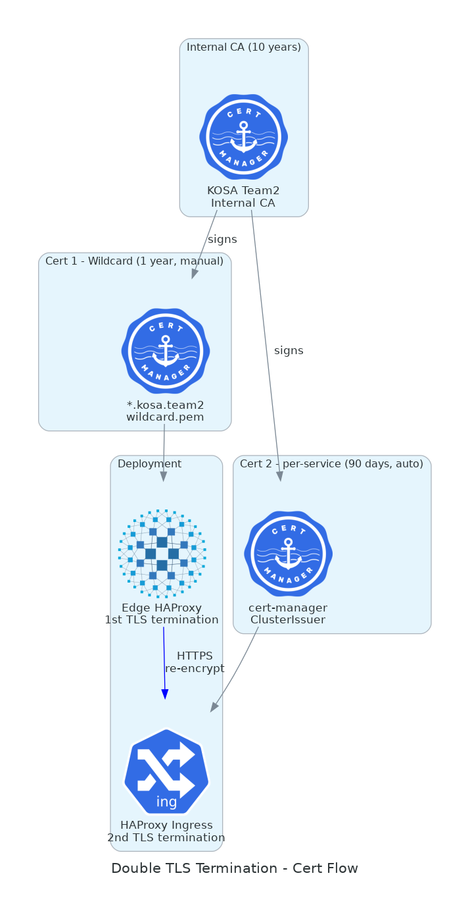

# 06. 보안 & TLS

> **이 챕터에서 다루는 것**<br> 자체 CA를 만들어서 운영하는 이유, X.509 인증서 구조, cert-manager로
> K8s에서 cert를 자동 발급/갱신하는 메커니즘, 이중 TLS의 실제 트래픽 흐름, containerd가 self-signed
> cert를 신뢰하게 만드는 법.

## 목차

1. [이론: TLS와 인증서](#1-이론-tls와-인증서)
2. [왜 자체 CA? (Let's Encrypt 안 쓰는 이유)](#2-왜-자체-ca-lets-encrypt-안-쓰는-이유)
3. [자체 CA 만들기](#3-자체-ca-만들기)
4. [cert-manager](#4-cert-manager)
5. [이중 TLS 종료의 실제 동작](#5-이중-tls-종료의-실제-동작)
6. [containerd가 self-signed cert를 신뢰하게](#6-containerd가-self-signed-cert를-신뢰하게)
7. [구축 절차](#7-구축-절차)
8. [인증서 회전 (갱신)](#8-인증서-회전-갱신)
9. [트러블슈팅](#9-트러블슈팅)
10. [다음 챕터](#10-다음-챕터)

---

## 1. 이론: TLS와 인증서

### 1.1 TLS가 푸는 문제

평문(HTTP) 통신의 문제:

- **도청**: 같은 네트워크에 있는 누구나 sniff
- **변조**: 중간에서 패킷 수정
- **사칭**: 가짜 서버에 접속해도 모름

TLS는 세 가지 모두 해결:

- 대칭키 암호 (AES 등) → 도청 방지
- HMAC → 변조 감지
- X.509 인증서 + PKI → 사칭 방지

### 1.2 TLS 핸드셰이크 (TLS 1.3 단순화)

```
Client                                Server
  │                                     │
  │──── ClientHello (지원 cipher) ───►   │
  │                                     │
  │◄─── ServerHello + Cert + KeyShare ──│  ← Cert가 X.509
  │                                     │
  │     Cert 검증 (CA chain, SAN 일치) │
  │                                     │
  │──── (암호화 시작) HTTP request ───► │
  │◄─── HTTP response ──────────────────│
```

### 1.3 X.509 인증서 구조

```
Certificate:
  Version: 3
  Serial Number: 12345
  Signature Algorithm: SHA256-RSA
  Issuer: CN=KOSA Team2 Internal CA          ← 발급자
  Validity:
    Not Before: 2026-05-01
    Not After:  2027-05-01
  Subject: CN=harbor.kosa.team2              ← 이 cert가 누구를 증명
  Public Key: <RSA 2048-bit ...>
  X509v3 extensions:
    Subject Alternative Name (SAN):           ← 매칭 도메인 목록
      DNS:harbor.kosa.team2
      DNS:*.harbor.kosa.team2
    Key Usage: Digital Signature, Key Encipherment
  Signature: <Issuer가 자기 private key로 서명>
```

📌 **핵심**: 클라이언트가 cert를 받으면 ① CA의 public key로 서명 검증 ② SAN에 hostname 매칭. 둘 다
OK여야 신뢰.

### 1.4 CA 체인 (Chain of Trust)

```
Root CA (자기 자신이 서명, 가장 신뢰)
   │
   └─ Intermediate CA (Root가 서명)
         │
         └─ End-entity Cert (Intermediate가 서명)
               │
               └─ 우리 서버
```

브라우저/OS는 Root CA를 미리 trust store에 보유. Cert 체인을 따라 올라가다 Root에 도달하면 OK.

우리는 단순화 위해 **Root CA가 End-entity cert를 직접 서명** (Intermediate 없음).

---

## 2. 왜 자체 CA? (Let's Encrypt 안 쓰는 이유)

### 2.1 Let's Encrypt 제약

LE는 **공인 도메인** 인증서 발급. ACME 챌린지로 도메인 소유 증명:

- HTTP-01: `http://yourdomain.com/.well-known/...` 파일 응답
- DNS-01: TXT 레코드 추가

문제:

1. 우리 도메인 `kosa.team2`는 **공인 등록 안 됨**. LE가 발급 거부.
2. 사내망이라 LE 서버가 우리 호스트에 접근 불가 (HTTP-01 불가).
3. DNS-01도 진짜 DNS provider API 필요 (pfSense는 LE에서 인정 안 됨).

### 2.2 옵션 비교

| 옵션                      | 우리에게                   |
| ------------------------- | -------------------------- |
| **Let's Encrypt**         | ❌ 공인 도메인 X           |
| **유료 CA (DigiCert 등)** | ❌ 비용                    |
| **HashiCorp Vault PKI**   | △ 강력하나 Vault 운영 부담 |
| **자체 CA**               | ✅ 무료, 통제권, 학습 가치 |

### 2.3 자체 CA의 트레이드오프

| 장점                     | 단점                               |
| ------------------------ | ---------------------------------- |
| 무료, 무제한 발급        | 클라이언트가 CA를 trust해야 (수동) |
| 사내 도메인 자유         | 외부 노출 사이트엔 부적합          |
| 단일 root로 통합         | CA private key 분실/유출 = 재앙    |
| cert-manager 자동화 가능 | CA 만료 시 전부 교체               |

> 💡 우리 시나리오는 사내망 + 학습용이라 자체 CA가 압도적으로 적합.

---

## 3. 자체 CA 만들기

### 3.1 CA 키/cert 생성

bastion의 `~/pki/`:

```bash
mkdir -p ~/pki && cd ~/pki

# CA private key
openssl genrsa -out ca.key 4096

# CA self-signed cert (10년)
openssl req -x509 -new -nodes -key ca.key -sha256 -days 3650 \
  -out ca.crt \
  -subj "/C=KR/ST=Seoul/O=KOSA Team2/CN=KOSA Team2 Internal CA"

# 확인
openssl x509 -in ca.crt -text -noout
```

`ca.crt`는 모든 곳에 배포. `ca.key`는 **bastion에만** + 백업 + 권한 `400`.

### 3.2 Wildcard cert 생성 (Edge HAProxy용)

```bash
# Key
openssl genrsa -out wildcard.key 2048

# CSR
cat > wildcard.cnf <<EOF
[req]
distinguished_name = req
req_extensions = v3_req
prompt = no

[req_distinguished_name]
CN = *.kosa.team2

[v3_req]
subjectAltName = @alt_names

[alt_names]
DNS.1 = *.kosa.team2
DNS.2 = kosa.team2
EOF

openssl req -new -key wildcard.key -out wildcard.csr -config wildcard.cnf

# CA로 서명 (1년)
openssl x509 -req -in wildcard.csr -CA ca.crt -CAkey ca.key \
  -CAcreateserial -out wildcard.crt -days 365 -sha256 \
  -extensions v3_req -extfile wildcard.cnf

# Edge HAProxy는 key+cert 합친 .pem 사용
cat wildcard.crt wildcard.key > wildcard.pem

# Edge HAProxy 노드(lb-1, lb-2)로 배포
scp wildcard.pem ubuntu@172.16.22.10:/etc/haproxy/certs/
scp wildcard.pem ubuntu@172.16.22.11:/etc/haproxy/certs/
ssh ubuntu@172.16.22.10 "sudo systemctl reload haproxy"
ssh ubuntu@172.16.22.11 "sudo systemctl reload haproxy"
```

> ⚠️ **wildcard 매칭 범위**: `*.kosa.team2`는 `harbor.kosa.team2`는 OK, `a.b.kosa.team2`는 X
> (1단계만). 2단계 wildcard는 별도 cert 필요.

### 3.3 클라이언트 trust 등록

각 호스트가 CA를 신뢰해야 cert 검증 통과.

```bash
# Ubuntu/Debian
sudo cp ca.crt /usr/local/share/ca-certificates/kosa-ca.crt
sudo update-ca-certificates

# macOS (노트북)
sudo security add-trusted-cert -d -r trustRoot \
  -k /Library/Keychains/System.keychain ca.crt

# Windows
# certmgr.msc → 신뢰할 수 있는 루트 인증 기관 → Import
```

브라우저에 따라 OS trust store 외 별도 import 필요할 수 있음 (Firefox 등).

---

## 4. cert-manager

### 4.1 cert-manager가 푸는 문제

K8s에서 매 서비스마다 cert를 손으로 발급/갱신하면? → 자동화 필요.

cert-manager는 K8s 컨트롤러로:

- `Certificate` 리소스를 watch
- 정의된 Issuer로 cert 자동 발급
- Secret에 저장 → Ingress/앱이 사용
- 만료 전 자동 갱신

### 4.2 Issuer vs ClusterIssuer

| 종류              | 스코프         | 우리 사용           |
| ----------------- | -------------- | ------------------- |
| **Issuer**        | namespace 한정 | X                   |
| **ClusterIssuer** | 클러스터 전역  | ✅ `kosa-ca-issuer` |

### 4.3 ClusterIssuer 설정

```yaml
apiVersion: cert-manager.io/v1
kind: ClusterIssuer
metadata:
  name: kosa-ca-issuer
spec:
  ca:
    secretName: kosa-ca-secret # ← cert-manager namespace의 Secret
```

`kosa-ca-secret`은 ca.crt + ca.key를 담은 Secret:

```bash
kubectl create secret tls kosa-ca-secret -n cert-manager \
  --cert=~/pki/ca.crt --key=~/pki/ca.key
```

### 4.4 Ingress에 cert 자동 발급

```yaml
apiVersion: networking.k8s.io/v1
kind: Ingress
metadata:
  annotations:
    cert-manager.io/cluster-issuer: kosa-ca-issuer # ← 이게 핵심
spec:
  tls:
    - hosts: [harbor.kosa.team2]
      secretName: harbor-ingress-cert # ← cert-manager가 만들 Secret 이름
  rules: [...]
```

cert-manager가:

1. Ingress의 `tls.hosts` 보고 Certificate 리소스 자동 생성
2. ClusterIssuer로 cert 발급
3. `harbor-ingress-cert` Secret에 저장
4. Ingress Controller가 그 Secret로 TLS 종료

### 4.5 갱신 정책

cert-manager 기본:

- 90일 cert면 60일 후 (만료 30일 전) 자동 갱신
- 갱신 실패 시 backoff 재시도
- Secret 자동 교체 → Ingress Controller가 새 cert로 reload

---

## 5. 이중 TLS 종료의 실제 동작



### 5.1 한 번 더 토폴로지

```
[Client]
   │ https://harbor.kosa.team2
   ▼
[pfSense] (NAT)
   │
   ▼
[Edge HAProxy] (172.16.22.5 VIP)
   │ ① TLS 종료 (wildcard.pem)
   │   → 내용 검사 (Host 헤더)
   │   → 새 TLS 연결 만듦
   ▼
[K8s Ingress LB] (172.16.23.50, MetalLB)
   │
   ▼
[HAProxy Ingress Controller]
   │ ② TLS 종료 (cert-manager 발급 cert)
   │   → HTTP로 변환
   ▼
[Service ClusterIP]
   │ HTTP (cluster 내부)
   ▼
[Pod]
```

### 5.2 왜 두 번?

| 이유                 | 설명                                                             |
| -------------------- | ---------------------------------------------------------------- |
| **신뢰 경계 분리**   | DMZ(Edge)와 Internal(K8s)의 cert를 독립 회전 가능                |
| **내부망 도청 방지** | 10G NIC tap이 있어도 평문 X                                      |
| **L7 검사 가능**     | Edge에서 Host 헤더로 분기 + 추가 검사                            |
| **백엔드 인증 검증** | Ingress가 Backend Service cert를 다시 검증 (cert-manager로 통일) |

### 5.3 두 cert 모두 같은 root CA여야 하는 이유

```
Edge cert: CN=*.kosa.team2, Issuer=KOSA Team2 CA
Ingress cert: CN=harbor.kosa.team2, Issuer=KOSA Team2 CA

⇒ 같은 CA로 서명되어 있어야:
  - Edge가 Ingress에 HTTPS로 connect 시 cert 검증 통과
  - 클러스터 내부 호출(예: ArgoCD → Harbor)도 cert-manager cert를 신뢰
```

만약 다른 CA로 서명하면 두 시스템 사이 cert 검증 실패.

### 5.4 비용

- TLS 핸드셰이크가 2번 → 첫 연결 latency +30~50ms
- CPU 비용 (AES-NI 있으면 무시 가능)
- 우리 규모(QPS 낮음): 무시 가능

---

## 6. containerd가 self-signed cert를 신뢰하게

### 6.1 문제

`docker pull harbor.kosa.team2/library/foo:1` 또는 K8s가 Harbor에서 이미지 pull 시:

```
x509: certificate signed by unknown authority
```

기본 trust store에 우리 CA가 없으니까.

### 6.2 Docker 호스트 (bastion)

```bash
# Docker 전용 cert 디렉토리
sudo mkdir -p /etc/docker/certs.d/harbor.kosa.team2
sudo cp ~/pki/ca.crt /etc/docker/certs.d/harbor.kosa.team2/ca.crt

# 시스템 trust도 (curl, kubectl 등도 영향)
sudo cp ~/pki/ca.crt /usr/local/share/ca-certificates/kosa-ca.crt
sudo update-ca-certificates

sudo systemctl restart docker
```

### 6.3 containerd (K8s 워커 노드)

```bash
# containerd config.toml에 config_path 활성화 (있으면 skip)
sudo nano /etc/containerd/config.toml
# [plugins."io.containerd.grpc.v1.cri".registry]
#   config_path = "/etc/containerd/certs.d"

# Harbor용 hosts.toml
sudo mkdir -p /etc/containerd/certs.d/harbor.kosa.team2
sudo tee /etc/containerd/certs.d/harbor.kosa.team2/hosts.toml << 'EOF'
server = "https://harbor.kosa.team2"
[host."https://harbor.kosa.team2"]
  capabilities = ["pull", "resolve"]
  ca = "/usr/local/share/ca-certificates/kosa-ca.crt"
EOF

# CA를 시스템 trust에도
sudo cp ~/pki/ca.crt /usr/local/share/ca-certificates/kosa-ca.crt
sudo update-ca-certificates

sudo systemctl restart containerd
```

> 💡 **왜 containerd는 별도 설정?** 시스템 trust만으로는 부족. containerd가 자체 cert resolution을
> 함. `/etc/containerd/certs.d/<host>/hosts.toml`이 권장 방식.

### 6.4 모든 워커에 자동화 (Ansible)

```yaml
- name: distribute CA
  copy:
    src: ~/pki/ca.crt
    dest: /usr/local/share/ca-certificates/kosa-ca.crt
  notify: update-ca

- name: containerd certs.d for harbor
  copy:
    dest: /etc/containerd/certs.d/harbor.kosa.team2/hosts.toml
    content: |
      server = "https://harbor.kosa.team2"
      [host."https://harbor.kosa.team2"]
        capabilities = ["pull", "resolve"]
        ca = "/usr/local/share/ca-certificates/kosa-ca.crt"
  notify: restart containerd

handlers:
  - name: update-ca
    command: update-ca-certificates
  - name: restart containerd
    systemd: name=containerd state=restarted
```

---

## 7. 구축 절차

### 7.1 순서

1. bastion에서 CA 생성 (§3.1)
2. wildcard cert 발급 + Edge HAProxy 배포 (§3.2)
3. CA를 모든 노드 trust store에 배포 (§3.3)
4. K8s에 cert-manager 설치 (Helm)
5. ClusterIssuer 생성 (§4.3)
6. 각 앱의 Ingress에 cert-manager annotation (§4.4)
7. containerd certs.d 설정 (§6.3) — 모든 워커
8. 검증

### 7.2 cert-manager Helm 설치

```bash
helm repo add jetstack https://charts.jetstack.io
helm install cert-manager jetstack/cert-manager \
  --namespace cert-manager --create-namespace \
  --set crds.enabled=true \
  --set nodeSelector.workload-type=system
```

ArgoCD로도 가능 (`~/kosa-gitops/apps/_applications/cert-manager.yaml`).

---

## 8. 인증서 회전 (갱신)

### 8.1 cert-manager 발급 cert

자동. 만료 30일 전 갱신 시도. Secret 교체 → Ingress Controller가 자동 reload.

수동 강제 갱신:

```bash
kubectl delete certificate <name> -n <ns>
# 재발급 됨
```

### 8.2 Edge HAProxy wildcard (1년)

수동:

```bash
# bastion에서 새 wildcard 발급
cd ~/pki
# (§3.2 명령 반복, days=365)

# 배포 + reload
scp wildcard.pem ubuntu@172.16.22.10:/etc/haproxy/certs/
scp wildcard.pem ubuntu@172.16.22.11:/etc/haproxy/certs/
ssh ubuntu@172.16.22.10 "sudo systemctl reload haproxy"
ssh ubuntu@172.16.22.11 "sudo systemctl reload haproxy"
```

캘린더에 발급일+11개월 알람 등록 권장.

### 8.3 CA 자체 (10년)

거의 신경 X. 만료 1년 전쯤:

1. 새 CA 발급
2. 모든 노드 trust store에 추가 (기존 CA도 유지, 이중 신뢰)
3. 모든 cert-manager Secret 교체
4. wildcard cert 재발급 (새 CA로 서명)
5. 기존 CA 제거

---

## 9. 트러블슈팅

### 9.1 `x509: certificate signed by unknown authority`

원인 1순위: 클라이언트(Docker/containerd/curl)가 우리 CA를 trust 안 함.

```bash
# 확인
openssl s_client -showcerts -connect harbor.kosa.team2:443 < /dev/null

# 시스템 trust 점검
ls /usr/local/share/ca-certificates/
# kosa-ca.crt 있어야

# Docker 전용
ls /etc/docker/certs.d/harbor.kosa.team2/

# containerd
cat /etc/containerd/certs.d/harbor.kosa.team2/hosts.toml
```

### 9.2 `x509: certificate is valid for X, not Y` (SAN mismatch)

cert의 SAN에 접근 hostname 없음.

```bash
# cert SAN 확인
openssl x509 -in /path/to/cert.pem -text -noout | grep -A1 "Subject Alternative Name"
```

대응: cert 재발급 (올바른 SAN 포함).

### 9.3 cert-manager가 cert 발급 안 함

```bash
kubectl describe certificate <name> -n <ns>
# Events 섹션 확인

kubectl get challenges -A    # ACME 챌린지 (우리는 ca issuer라 X)
kubectl get certificaterequests -A   # CR 생성됐는지

# cert-manager 로그
kubectl logs -n cert-manager -l app.kubernetes.io/name=cert-manager --tail=100
```

### 9.4 Ingress가 cert 못 찾음

```bash
kubectl describe ingress <name> -n <ns>
# tls.secretName이 존재하는지 확인
kubectl get secret <secretName> -n <ns>
```

### 9.5 자체 CA cert 만료 임박

```bash
openssl x509 -in ~/pki/ca.crt -noout -enddate
# notAfter=...
```

만료 1개월 전부터 알람. §8.3 절차.

### 9.6 wildcard cert 만료

증상: 브라우저에서 "이 사이트의 보안 인증서가 만료" 경고.

확인:

```bash
echo | openssl s_client -connect ticket.kosa.team2:443 2>/dev/null | \
  openssl x509 -noout -dates
```

대응: §8.2 갱신 절차.

### 9.7 cert-manager admission webhook 에러

```
internal error occurred: failed calling webhook "webhook.cert-manager.io": ...
```

원인: cert-manager-webhook Pod 상태 이상.

```bash
kubectl get pods -n cert-manager
kubectl logs -n cert-manager <webhook-pod>
```

재시작 또는 cert-manager 재배포.

---

## 10. 다음 챕터

→ **[07. GitOps & ArgoCD](07-gitops-argocd.md)**

GitOps 개념, ArgoCD 컴포넌트, App-of-Apps 패턴, Helm vs raw manifest 선택, ignoreDifferences 필수
케이스.
