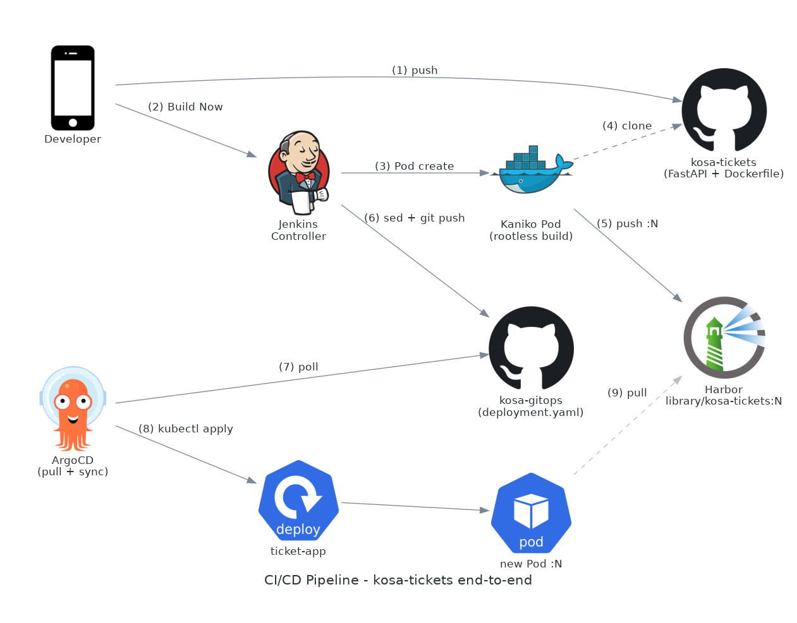
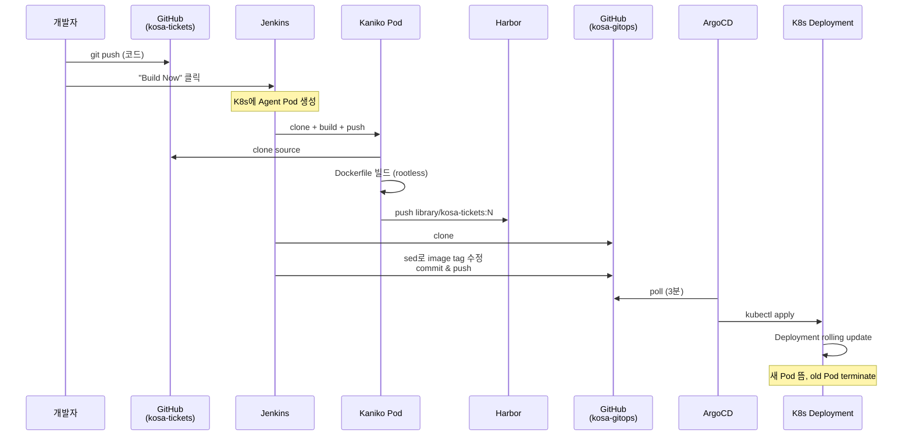

# 10. CI/CD 파이프라인 (kosa-tickets)

> **이 챕터에서 다루는 것**<br> 데모 앱 kosa-tickets의 end-to-end 배포 파이프라인. GitHub push →
> Jenkins → Kaniko build → Harbor push → GitOps repo image tag 갱신 → ArgoCD sync → K8s rollout.
> Jenkinsfile 한 줄 한 줄의 의도와 함정.

## 목차

1. [전체 흐름 한 눈에](#1-전체-흐름-한-눈에)
2. [Source repo vs GitOps repo 분리](#2-source-repo-vs-gitops-repo-분리)
3. [데모 앱: kosa-tickets](#3-데모-앱-kosa-tickets)
4. [Jenkinsfile 라인별 해설](#4-jenkinsfile-라인별-해설)
5. [ticket-app deployment.yaml의 핵심](#5-ticket-app-deploymentyaml의-핵심)
6. [GitOps repo 변경 → ArgoCD sync 흐름](#6-gitops-repo-변경--argocd-sync-흐름)
7. [검증 (build #4 사례)](#7-검증-build-4-사례)
8. [향후 자동화: GitHub Webhook](#8-향후-자동화-github-webhook)
9. [트러블슈팅](#9-트러블슈팅)
10. [다음 챕터](#10-다음-챕터)

---

## 1. 전체 흐름 한 눈에





📌 **핵심**: Jenkins는 클러스터에 `kubectl apply` 하지 않음. git에 commit만. ArgoCD가 클러스터
안에서 pull (GitOps).

---

## 2. Source repo vs GitOps repo 분리

```
kosa-tickets         ← FastAPI 코드 + Dockerfile
                       (개발자가 자주 push)

kosa-gitops          ← K8s manifest
                       (Jenkins가 image tag만 갱신)
```

### 2.1 왜 분리?

| 합치는 경우                                         | 분리하는 경우 (우리) |
| --------------------------------------------------- | -------------------- |
| 동일 repo에 코드 + manifest                         | 각자 repo            |
| CI가 같은 repo의 manifest 수정 → infinite loop 위험 | 분리되어 안전        |
| 코드 변경 = manifest 변경 동시                      | git history가 깔끔   |
| 개발자가 manifest도 봐야                            | 권한/팀 분리 가능    |

### 2.2 일반 패턴

- **kosa-tickets** (소스): 개발자 권한, code review
- **kosa-gitops** (manifest): SRE/플랫폼팀 권한, 변경 신중

### 2.3 Jenkins의 역할

소스 repo에서 빌드 → manifest repo의 image tag만 sed로 수정 → commit/push. 다른 manifest 변경은 안
함.

---

## 3. 데모 앱: kosa-tickets

### 3.1 무엇

FastAPI/Python으로 만든 회원정보 등록/출력 데모. 실제 티켓 비즈니스 로직은 아니고, 인프라 검증용.

### 3.2 Dockerfile

```dockerfile
# kosa-tickets/Dockerfile
FROM python:3.11-slim

WORKDIR /app
COPY requirements.txt .
RUN pip install --no-cache-dir -r requirements.txt
COPY . .

EXPOSE 8000
CMD ["uvicorn", "main:app", "--host", "0.0.0.0", "--port", "8000"]
```

### 3.3 헬스체크 endpoint

```python
# main.py 일부
@app.get("/healthz")
def healthz():
    return {"status": "ok"}
```

K8s readinessProbe/livenessProbe가 이 endpoint 사용.

---

## 4. Jenkinsfile 라인별 해설

```groovy
pipeline {
  agent {
    kubernetes {
      yaml '''
        apiVersion: v1
        kind: Pod
        spec:
          containers:
          # ─── 1) Kaniko 컨테이너: 이미지 빌드/push ───
          - name: kaniko
            image: gcr.io/kaniko-project/executor:v1.23.2-debug
                       # ← -debug 태그: shell 포함 (Jenkins가 exec하려면 필수)
            command: ["sleep"]
            args: ["infinity"]
                       # ← Jenkins가 컨테이너를 직접 사용하려면
                       #   메인 프로세스가 살아있어야 함
            volumeMounts:
            - name: docker-config
              mountPath: /kaniko/.docker
                       # ← Kaniko가 push할 때 docker config 위치

          # ─── 2) Git 컨테이너: clone/commit ───
          - name: git
            image: alpine/git:latest
            command: ["sleep"]
            args: ["infinity"]

          volumes:
          - name: docker-config
            projected:
              sources:
              - secret:
                  name: harbor-creds-dockerconfigjson
                  items:
                  - key: .dockerconfigjson
                    path: config.json
                       # ← Secret의 .dockerconfigjson 키를
                       #   /kaniko/.docker/config.json 으로 mount
      '''
    }
  }

  environment {
    IMAGE  = "harbor.kosa.team2/library/kosa-tickets"
    TAG    = "${env.BUILD_NUMBER}"
                       # ← Jenkins 빌드 번호 (자동 증가)
    SOURCE = "git@github.com:kosacloudteam2/kosa-tickets.git"
    GITOPS = "git@github.com:kosacloudteam2/kosa-gitops.git"
  }

  stages {
    # ─── Stage 1: 소스 clone ───
    stage('Checkout Source') {
      steps {
        container('git') {
          dir('src') {
            git url: "${SOURCE}",
                credentialsId: 'kosa-gitops-ssh',
                branch: 'main'
                       # ← SSH 키로 clone
                       #   (같은 키를 양쪽 repo에 deploy key로 등록)
          }
        }
      }
    }

    # ─── Stage 2: Kaniko 빌드 + push ───
    stage('Build & Push to Harbor') {
      steps {
        container('kaniko') {
          sh '''
            /kaniko/executor \\
              --context=src \\
              --dockerfile=src/Dockerfile \\
              --destination=${IMAGE}:${TAG} \\
              --destination=${IMAGE}:latest \\
              --skip-tls-verify
                       # ← :latest 태그도 갱신 (always pull 시 편의)
                       # --skip-tls-verify: Harbor cert를 신뢰 안 함
                       #   (production은 CA mount 권장)
          '''
        }
      }
    }

    # ─── Stage 3: GitOps repo의 image tag 갱신 ───
    stage('Update GitOps') {
      steps {
        container('git') {
          withCredentials([sshUserPrivateKey(
            credentialsId: 'kosa-gitops-ssh',
            keyFileVariable: 'SSH_KEY'
          )]) {
            sh '''
              mkdir -p ~/.ssh
              ssh-keyscan github.com >> ~/.ssh/known_hosts 2>/dev/null
                       # ← host key 등록 (없으면 verification fail)

              export GIT_SSH_COMMAND="ssh -i $SSH_KEY -o StrictHostKeyChecking=no"
                       # ← git이 사용할 SSH 명령에 우리 키 지정

              git config --global user.email "jenkins@kosa.team2"
              git config --global user.name "Jenkins CI"

              git clone ${GITOPS} gitops
              cd gitops

              sed -i "s|image: harbor.kosa.team2/library/kosa-tickets:.*|image: harbor.kosa.team2/library/kosa-tickets:${TAG}|" \\
                apps/ticket-app/deployment.yaml
                       # ← 정규식: 'image: harbor.../kosa-tickets:' 뒤의 태그만 치환

              git add -A
              git commit -m "CI: kosa-tickets ${TAG}" || echo "no changes"
                       # ← 변경 없으면 commit 실패해도 무시
              git push origin main
            '''
          }
        }
      }
    }
  }

  post {
    success {
      echo "Build #${BUILD_NUMBER} 성공"
    }
    failure {
      echo "Build #${BUILD_NUMBER} 실패"
      // 향후: Slack/이메일 알림
    }
  }
}
```

### 4.1 함정/배운 점

| 이슈                                | 해결                                                                          |
| ----------------------------------- | ----------------------------------------------------------------------------- |
| `kaniko:latest`는 shell 없음        | `kaniko:debug` 사용                                                           |
| 컨테이너 메인 프로세스 즉시 종료    | `sleep infinity`                                                              |
| `sshagent` plugin 없음              | `withCredentials([sshUserPrivateKey(...)])`                                   |
| GitHub Host key verification failed | `ssh-keyscan` 또는 글로벌 설정                                                |
| Kaniko x509 (자체 CA)               | `--skip-tls-verify` 또는 CA mount                                             |
| `s3aws: NoSuchBucket`               | Harbor bucket 수동 생성 ([08-harbor-registry.md](08-harbor-registry.md) §5.3) |

---

## 5. ticket-app deployment.yaml의 핵심

```yaml
apiVersion: apps/v1
kind: Deployment
metadata:
  name: ticket-app
  namespace: kosa-tickets
spec:
  replicas: 2
  selector:
    matchLabels: { app: ticket-app }
  template:
    metadata:
      labels: { app: ticket-app }
    spec:
      # ★ pod spec 레벨 (containers 안 X !)
      imagePullSecrets:
        - name: harbor-pull-secret

      # production 워커에만
      nodeSelector:
        workload-type: production

      containers:
        - name: ticket-app
          image: harbor.kosa.team2/library/kosa-tickets:4 # ← Jenkins가 갱신
          ports: [{ containerPort: 8000 }]

          readinessProbe:
            httpGet: { path: /healthz, port: 8000 }
            initialDelaySeconds: 5
            periodSeconds: 10

          livenessProbe:
            httpGet: { path: /healthz, port: 8000 }
            initialDelaySeconds: 30
            periodSeconds: 30

          resources:
            requests: { cpu: 50m, memory: 128Mi }
            limits: { cpu: 500m, memory: 512Mi }
```

### 5.1 imagePullSecrets의 위치

> ⚠️ **자주 틀림**: `containers[*]` 안에 두는 게 아니라 **pod spec** 레벨에 둬야 함.
>
> 잘못된 예 (작동 안 함):
>
> ```yaml
> containers:
>   - name: app
>     image: harbor.../app:1
>     imagePullSecrets: [{ name: harbor-pull-secret }] # ← X
> ```

### 5.2 harbor-pull-secret 생성

```bash
kubectl create secret -n kosa-tickets docker-registry harbor-pull-secret \
  --docker-server=harbor.kosa.team2 \
  --docker-username=admin \
  --docker-password=kosa1004
```

> 💡 **public project (library/) 인데도 필요한가?**<br> 우리 환경처럼 anonymous pull이 OK이면 굳이
> 없어도 됨. 그래도 두는 게 RBAC 정책 강화 대비 안전.

### 5.3 replicas: 2 + rolling update

기본 strategy는 RollingUpdate (maxSurge 25%, maxUnavailable 25%).

- 새 Pod 1개 뜸 → ready 되면 → old Pod 1개 terminate
- 다음 새 Pod 뜸 → old terminate
- 무중단 배포

---

## 6. GitOps repo 변경 → ArgoCD sync 흐름

```
Jenkins push (image tag 4 → 5)
       │
       ▼
GitHub: kosa-gitops/main 의 deployment.yaml 변경
       │
       ▼
  [ArgoCD가 git poll, 기본 3분 주기]
  또는 webhook 설정 시 즉시
       │
       ▼
ArgoCD: ticket-app Application → OutOfSync
       │
       │ syncPolicy.automated 켜져있으면 자동 sync
       │ selfHeal도 있으면 수동 변경도 자동 복구
       ▼
kubectl apply (변경분만)
       │
       ▼
K8s: Deployment.spec.template.spec.containers[0].image 변경
       │
       ▼
Deployment Controller: 새 ReplicaSet 생성 + rolling update
       │
       ▼
새 Pod (kosa-tickets:5) tem → ready → old Pod terminate
       │
       ▼
완료: Service Endpoint에 새 Pod IP, Ingress가 자동으로 라우팅
```

### 6.1 ArgoCD 가속 (즉시 sync)

3분 polling 대신 webhook으로 즉시:

- GitHub repo → Settings → Webhooks → `https://argocd.kosa.team2/api/webhook` (POST)
- ArgoCD가 push event 받으면 즉시 refresh

(우리 환경은 외부 GitHub → 내부 ArgoCD라 reverse-proxy/방화벽 추가 필요)

---

## 7. 검증 (build #4 사례)

실제 build #4 진행:

1. **Jenkins UI**: `kosa-tickets-ci` → Build Now → Build #4 trigger
2. **Console output**: 각 stage 진행 — Checkout / Build & Push / Update GitOps 모두 SUCCESS
3. **Harbor UI**: `library/kosa-tickets` → 태그 목록에 `4`, `latest` 등장
4. **GitOps repo**: 최신 커밋 "CI: kosa-tickets 4" + deployment.yaml에 `:4` 반영
5. **ArgoCD UI**: ticket-app → OutOfSync → Syncing → Synced + Healthy
6. **K8s**:
   ```bash
   kubectl get pods -n kosa-tickets
   # NAME                          READY   STATUS    AGE
   # ticket-app-xxx-1              1/1     Running   1m   ← 새 Pod
   # ticket-app-xxx-2              1/1     Running   1m
   # ticket-app-yyy-1              0/1     Terminating 1m   ← old
   ```
7. **브라우저**: https://ticket.kosa.team2 응답 정상

📌 **end-to-end 8분** (대부분 Kaniko 빌드 시간).

---

## 8. 향후 자동화: GitHub Webhook

현재는 수동 "Build Now". 자동 트리거하려면:

### 8.1 Jenkins 설정

- Pipeline job → "Build Triggers" → "GitHub hook trigger for GITScm polling" 체크

### 8.2 GitHub Webhook

- repo → Settings → Webhooks → Add webhook
- Payload URL: `https://jenkins.kosa.team2/github-webhook/`
- Content type: application/json
- Events: Push events

### 8.3 방화벽

외부 GitHub → 내부 Jenkins 진입 필요. pfSense NAT 또는 Edge HAProxy 통과 룰 추가.

### 8.4 보안 옵션

- Webhook secret token으로 signature 검증
- 또는 GitHub Apps + JWT 인증

---

## 9. 트러블슈팅

### 9.1 Pipeline 자체가 시작 안 됨

```bash
kubectl get pods -n jenkins
# Build Agent Pod 안 뜨면 → Jenkins K8s plugin 설정/RBAC 확인
```

### 9.2 git clone 실패 (Permission denied / Host key)

- SSH 키 등록 확인: GitHub repo Settings → Deploy keys
- Jenkins credential `kosa-gitops-ssh` 정확한지
- `ssh-keyscan github.com` 으로 known_hosts 추가

### 9.3 Kaniko build 실패: "error checking push permissions"

- harbor-creds-dockerconfigjson Secret 확인
- `kubectl get secret -n jenkins harbor-creds-dockerconfigjson -o jsonpath='{.data.\.dockerconfigjson}' | base64 -d`
  로 내용 검증
- Pod template에서 mount path 정확 (/kaniko/.docker/config.json)

### 9.4 Kaniko push 실패: x509

`--skip-tls-verify` 추가 또는 CA mount.

### 9.5 sed 결과가 안 바뀜

`deployment.yaml`의 image 라인이 정규식에 매칭 안 되는 형태일 수도. 직접 확인:

```bash
grep "image: harbor" apps/ticket-app/deployment.yaml
```

### 9.6 git push rejected

- 다른 변경이 동시에 들어왔을 수 있음 (race)
- Jenkins pipeline에 `git pull --rebase` 후 push 재시도 로직 추가
- 또는 GitOps repo의 branch protection 룰 확인

### 9.7 ArgoCD가 sync 안 함

- `argocd app get ticket-app --hard-refresh`로 강제 새로고침
- ArgoCD repo credential 확인
- Application의 `syncPolicy.automated` 켜졌는지

### 9.8 새 Pod이 ImagePullBackOff

- 워커 노드 containerd가 Harbor cert 신뢰? ([06-security-tls.md](06-security-tls.md) §6)
- 이미지가 정말 Harbor에 push 됐는지 (Harbor UI 확인)
- harbor-pull-secret 존재? (kosa-tickets namespace)

### 9.9 새 Pod이 CrashLoop

- 앱 자체 버그
- env / configmap 부족
- 로그: `kubectl logs -n kosa-tickets <pod> --previous`

### 9.10 Build #N은 됐는데 latest 안 갱신

`/kaniko/executor`에 `--destination=${IMAGE}:latest` 추가했는지 확인.

---

## 10. 다음 챕터

→ **[11. 관측성 (Prometheus/Grafana)](11-observability.md)**

K8s 클러스터 + 워크로드 메트릭 수집/시각화/알림. kube-prometheus-stack 구성, kubeadm 시스템 컴포넌트
메트릭 포트 트릭 (왜 127.0.0.1 binding을 0.0.0.0로?).
