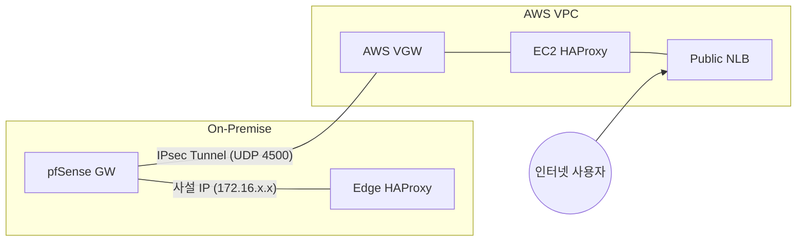

# 14. AWS 하이브리드 (VPC + Site-to-Site VPN)

> **이 챕터의 목적** 온프레미스 KOSA 인프라를 AWS와 **사설망처럼 연결**하는 단계. Phase 1(AWS 인프라
> 셋업)과 Phase 2(IPsec VPN 연결)를 다루며, Phase 3 이후(RDS Replica, EKS Karpenter, Lambda burst
> 트리거)는 별도 챕터로 분리 예정.

---

## 📌 핵심 (Master Summary)

- **목표**: 온프레 사설망(172.16.0.0/12) ↔ AWS VPC(10.20.0.0/16)를 IPsec 터널로 묶어 **같은
  사설망처럼** 통신.
- **구축 방식**: AWS Site-to-Site VPN (Static Routing) + pfSense NAT-T.
- **핵심 설정**: pfSense **Outbound NAT bypass 룰** (src IP 유지용).
- **결과**: bastion(172.16.24.10) ↔ EC2(10.20.10.121) 양방향 통신 성공 (RTT ~6ms).

---

## 1. 아키텍처 및 토폴로지

### 1.1 하이브리드 연결 개념도

### 1.2 네트워크 매핑 (실측 기준)

| 위치                | CIDR / IP               | 용도                   |
| ------------------- | ----------------------- | ---------------------- |
| **AWS VPC**         | `10.20.0.0/16`          | 하이브리드 확장 영역   |
| **On-Premise**      | `172.16.0.0/12`         | 온프레미스 전체 대역   |
| **Public IP (CGW)** | `125.131.208.229`       | 온프레미스 인터넷 출구 |
| **VGW ID**          | `vgw-0f14a420ce5d30261` | AWS VPN 종단점         |

---

## 2. Phase 1: AWS 인프라 구축 상세

재구축 시 아래 상세 가이드와
[구현 핸드북(CLI)](../../../docs/architecture/build-up/cloud_network_iac/aws-nlb-ec2-vpn-onprem-haproxyedge-cli.md)을
참고합니다.

### 2.1 보안 그룹 (Security Group) 규칙

| 그룹명            | 방향    | 프로토콜 | 포트   | 소스             | 비고          |
| ----------------- | ------- | -------- | ------ | ---------------- | ------------- |
| `kosa-sg-public`  | Inbound | TCP      | 80/443 | 0.0.0.0/0        | NLB용         |
| `kosa-sg-private` | Inbound | TCP      | 80/443 | `kosa-sg-public` | EC2 HAProxy용 |
|                   | Inbound | ICMP     | All    | `172.16.0.0/12`  | VPN 진단용    |

---

## 3. Phase 2: Site-to-Site VPN 핵심 로직

### 3.1 NAT-T (NAT Traversal)

pfSense가 ISP 라우터(NAT) 뒤에 있으므로, IKE 패킷을 UDP 4500으로 캡슐화해야 합니다. pfSense P1
설정에서 `NAT Traversal: Force` 설정을 통해 구현되었습니다.

### 3.2 ⭐ Outbound NAT Bypass (결정적 설정)

pfSense는 기본적으로 나가는 모든 트래픽을 WAN IP로 NAT 변환하지만, **AWS VPC
대역(`10.20.0.0/16`)으로 가는 트래픽은 NAT를 하지 않도록(No NAT)** 예외 룰을 최상단에 배치해야
합니다.

---

## 4. 트러블슈팅 사례 (실제 발생 기반)

### 4.1 "터널은 UP인데 Ping이 안 됨"

- **원인**: AWS Route Table에 **Route Propagation**이 꺼져 있거나, pfSense에서 NAT Bypass 룰이
  누락됨.
- **해결**: VPC Route Table에서 VGW 전파를 활성화하고, pfSense NAT 룰에서 Destination이 AWS VPC인
  경우 `DO NOT NAT`을 체크함.

### 4.2 "EC2 SSM 접속 불가"

- **원인**: Private Subnet에 배치된 EC2가 NAT Gateway를 통한 인터넷 경로가 없었음.
- **해결**: Private Route Table에 `0.0.0.0/0 -> NAT-GW` 경로 추가.

---

## 5. 비용 및 향후 계획

- **운영 비용**: 월 약 $130 (NAT GW 2대, VPN 터널 포함). 데모 종료 후 NAT GW를 삭제하여 비용 절감
  가능.
- **다음 단계**:
  - `15-aws-rds-replica.md`: DB 읽기 부하 분산.
  - `16-aws-eks-burst.md`: T-30 트래픽 대응을 위한 EKS 확장.

---

[사전 준비 가이드](../../../docs/architecture/build-up/cloud_network_iac/aws-nlb-ec2-vpn-onprem-prerequisites.md)
|
[구현 핸드북 (CLI)](../../../docs/architecture/build-up/cloud_network_iac/aws-nlb-ec2-vpn-onprem-haproxyedge-cli.md)
