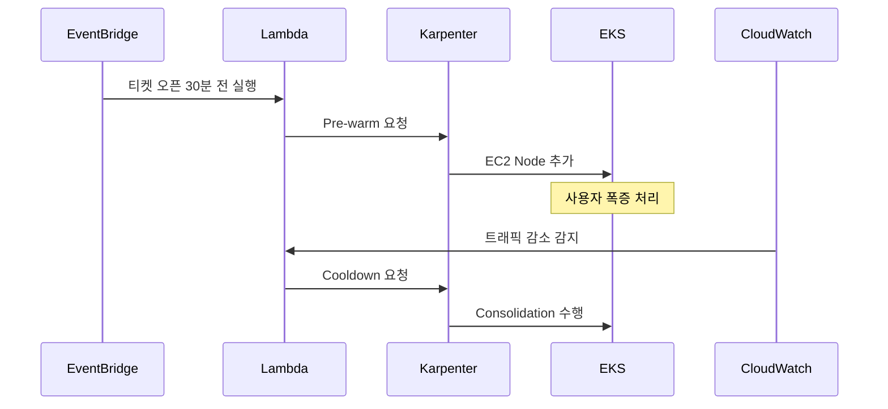

# 챕터 01 — 프로젝트 개요 + 전체 아키텍처

> KOSA 인프라 프로젝트 학습용 문서 시리즈<br> 작성일: 2026-05-13 / 대상: 인프라 입문자 ~ 중급<br>
> 다른 챕터: `02-proxmox-cloudinit.md`, `03-pfsense-network.md`

---

## 이 챕터 학습 후 알 수 있는 것

- "kosa-tickets" 프로젝트가 풀려고 하는 **현업 문제**가 정확히 무엇인지 (한정 티켓팅 = 시점 폭증)
- 온프레미스 + AWS **하이브리드 클라우드 burst** 패턴이 어디서 쓰이고 왜 쓰이는지
- 우리 인프라의 **5계층 (네트워크 → 가상화 → 스토리지 → K8s → 앱)** 이 어떻게 맞물려 동작하는지
- 4인 팀에서 **각자 무엇을 책임**지고 어떻게 통합되는지
- 발표 시 **"평시 비용 0, burst 1시간 $3"** 메시지의 근거

---

## 1. 기술 개요 (자세히)

### 1.1 정의 (한 문장)

KOSA 인프라 프로젝트는 **온프레미스 Kubernetes 클러스터를 메인 워크로드로 두고, 시점 폭증(burst)이
발생할 때만 AWS로 자동 확장**하는 하이브리드 클라우드 인프라 구축 학습 프로젝트예요.

### 1.2 등장 배경 (어떤 문제 해결하려고?)

현업에는 두 가지 잘못된 극단이 있어요.

| 극단                           | 문제                                                                                         |
| ------------------------------ | -------------------------------------------------------------------------------------------- |
| **풀 클라우드 (AWS만)**        | 평상시에도 비싼 EC2/EKS 비용 발생. 한국처럼 트래픽이 균일한 도메인은 비용 비효율.            |
| **풀 온프레미스 (자체 IDC만)** | 티켓 오픈 같은 시점 폭증을 받아내려면 평시 10배의 장비를 사둬야 함. 99% 시간엔 놀고 있는 셈. |

특히 **티켓팅 시스템**은 평시 트래픽 대비 폭증 시 **100배 차이**가 납니다. (인터파크 BTS 콘서트,
멜론 콘서트, 백신 예약 시스템, 수능 점수 조회 등) 이런 도메인을 "두 극단 사이의 합리적 지점"으로
풀어내는 것이 이 프로젝트의 목표예요.

### 1.3 핵심 개념 + 용어 풀이

| 용어                             | 풀이                                                                                                                 |
| -------------------------------- | -------------------------------------------------------------------------------------------------------------------- |
| **하이브리드 클라우드**          | 온프레미스(자체 보유 서버) + 퍼블릭 클라우드(AWS/GCP/Azure)를 함께 쓰는 구성. 한쪽 단점을 다른 쪽이 보완.            |
| **Cloud Burst**                  | 평소엔 온프레미스로만 운영하다 트래픽 폭증 시 짧게 클라우드로 확장. 쉽게 말해 "성수기에만 알바 부르는" 식.           |
| **K8s (Kubernetes)**             | 컨테이너 오케스트레이션 플랫폼. 쉽게 말하면 "수십~수백 개의 컨테이너를 자동으로 배치/스케일/복구하는 자동화 시스템". |
| **etcd**                         | K8s의 상태를 저장하는 분산 키-값 DB. 쉽게 말하면 클러스터의 "메모장". 3대 이상으로 quorum(과반수)을 유지.            |
| **Proxmox VE**                   | KVM 기반 오픈소스 가상화 플랫폼. VMware vSphere의 무료 대안.                                                         |
| **Ceph**                         | 분산 스토리지 시스템. Block(RBD), File(CephFS), Object(RGW) 세 가지를 한 클러스터에서 제공.                          |
| **pfSense**                      | FreeBSD 기반 오픈소스 방화벽/라우터. 중소기업 표준.                                                                  |
| **Karpenter**                    | AWS의 K8s 노드 자동 프로비저닝 도구. Spot 인스턴스 burst에 최적화.                                                   |
| **ArgoCD**                       | Git 저장소를 K8s 상태의 "단일 진실의 소스(SSoT)"로 삼는 GitOps 도구.                                                 |
| **Percona XtraDB Cluster (PXC)** | MySQL 호환 동기 복제 클러스터. 3노드에서 quorum 기반으로 일관성 유지.                                                |
| **MetalLB**                      | 온프레미스 K8s에서 LoadBalancer 타입 서비스를 쓰게 해주는 애드온. ARP/BGP로 외부 IP를 노출.                          |

### 1.4 동작 원리 (내부 메커니즘)

#### 평상시 (95% 시간)

```
[User HTTPS]
   │
   ▼
[AWS NLB + WAF]  ← Static IP 보장, 봇 차단
   │
   ▼ IPsec VPN (암호화)
   │
[pfSense HA]   ← VLAN 게이트웨이, 방화벽 (CARP VIP)
   │
   ▼
[Onprem HAProxy + Keepalived]
   │
   ▼
[K8s Ingress (HAProxy Ingress)]
   │
   ▼
[FastAPI Pod × N] ── [Percona PXC × 3] ── [Redis Sentinel] ── [Ceph RBD PV]
```

이 시점에서 AWS는 **얇은 엣지(NLB + WAF + 작은 EC2 HAProxy 2대)** 만 운영해요. 무거운 워크로드는
전부 온프레미스 K8s에서 처리됩니다.

#### 티켓 오픈 burst (5% 시간)

```
T-30분: EventBridge cron → Lambda → EKS Karpenter pre-warm 5대 spawn
T-0   : User 10,000명 폭증 → Route 53 weighted DNS가 절반을 AWS EKS로 분기
T+15분: 매진 → CloudWatch alarm → Lambda cooldown → Karpenter consolidation
T+30분: 평상시 복귀, AWS spot 노드 0대
```



핵심은 **"필요한 30분만"** AWS를 쓴다는 점입니다. 평상시엔 EKS Control Plane($73/월)만 켜둬요. burst
1시간에 Spot EC2 5대를 쓰면 약 $3 정도 비용입니다.

### 1.5 주요 기능

이 프로젝트가 한 묶음으로 보여주는 능력:

1. **온프레미스 K8s 자체 운영** — kubeadm 기반 3 CP + 3 Worker, etcd quorum
2. **분산 스토리지** — Ceph RBD를 K8s PV 백엔드로 (3-replica)
3. **DB 고가용성** — Percona XtraDB 3노드 동기 복제 + ProxySQL Read/Write split
4. **GitOps 배포** — ArgoCD가 Git을 단일 진실의 소스로 삼아 자동 sync
5. **수평 자동 확장** — HPA (Horizontal Pod Autoscaler)로 부하 시 Pod 2→10 자동 확장
6. **시점 burst 자동화** — EventBridge + Lambda + Karpenter로 AWS burst 자동화
7. **관찰 가능성** — Prometheus + Grafana 메트릭 + Alert
8. **방화벽 이중화** — pfSense HA(CARP) — 단일 게이트웨이 장애 제거

### 1.6 다른 도구와 비교 (기술적 차이)

| 비교축   | 우리 선택         | 대안 1                                                 | 대안 2                                |
| -------- | ----------------- | ------------------------------------------------------ | ------------------------------------- |
| 가상화   | Proxmox VE        | VMware vSphere (유료, Broadcom 인수 후 가격 폭등)      | Hyper-V (Windows 종속)                |
| K8s 설치 | kubeadm + Ansible | Rancher (GUI 의존)                                     | OpenShift (라이센스)                  |
| CNI      | Calico            | Cilium (eBPF, 더 빠르지만 학습 곡선 ↑)                 | Flannel (단순하나 NetworkPolicy 미흡) |
| 스토리지 | Ceph              | NFS (단일 SPOF), Longhorn (K8s 종속, replication 한정) |
| DB       | Percona XtraDB    | MySQL 단일 + replica (수동 failover)                   | MongoDB (관계형 X)                    |
| 캐시     | Redis Sentinel    | Redis Cluster (sharding, 단일 키 트랜잭션 X)           |
| GitOps   | ArgoCD            | Flux (UI 약함), Spinnaker (무거움)                     |
| 방화벽   | pfSense           | OPNsense (포크), Cisco IOS (라이센스)                  |
| Burst    | AWS EKS Karpenter | Cluster Autoscaler (느림), 수동 scaling (자동화 X)     |

핵심 선택 기준은 **(1) 오픈소스 (2) 현업에서 실제 검증됨 (3) 학습 곡선 합리적** 세 가지였어요.

---

## 2. 현업/실무 맥락 ★

### 2.1 어떤 상황에서 이게 필요한가

**시점 폭증(burst)이 존재하는 시스템**이 정확한 적용 대상입니다. 패턴:

- **시점이 예측 가능** — "19시 정각 티켓 오픈", "12월 30일 수능 발표"
- **폭증의 진폭이 크다** — 평시 대비 50~100배
- **폭증의 지속 시간이 짧다** — 15~30분
- **폭증 후 빠른 진정** — 매진/완료 후 정상화

대표 도메인:

| 도메인           | 패턴                        | 비고                       |
| ---------------- | --------------------------- | -------------------------- |
| 콘서트 티켓      | 19:00 오픈 → 15분 매진      | 인터파크, 멜론, 티켓링크   |
| 한정판 굿즈 드롭 | 정시 오픈 → 5분 매진        | 무신사, 29CM               |
| 백신 예약        | 발표 직후 폭주 → 1시간 진정 | 코로나 때 정부 시스템 다운 |
| 수능 점수 조회   | 발표 시각 → 30분 폭주       | EBS, 평가원                |
| 블랙프라이데이   | 자정 → 6시간 지속 burst     | 다소 긴 편                 |

### 2.2 업계에서 보통 어떻게 쓰나 (표준 구성, 대표 사용 기업/사례)

**대기업 표준 패턴 (한국 기준)**:

```
[Public DNS (Route 53/CloudFlare)]
       │ Weighted Routing
       ├──────────┐
       ▼          ▼
[AWS Edge]   [Onprem]
   │            │
   └──VPN───────┘
       │
   [공유 DB / 캐시]
```

- **인터파크 티켓**: 자체 IDC 메인 + AWS burst (공식 사례 발표 다수)
- **카카오뱅크**: 코어 시스템은 자체 IDC, 모바일 푸시/이벤트는 AWS
- **쿠팡**: 풀 AWS로 갔지만, 평시 트래픽이 균일해서 가능
- **네이버 클라우드**: 자체 클라우드(NCP) + 일부 AWS 병행
- **삼성SDS, LG CNS** — 금융권 SI는 거의 100% 하이브리드 (규제 + 코스트)

**해외 사례**:

- **Netflix** — 풀 AWS이지만, 라이브 이벤트 시 별도 burst 풀
- **Spotify** — GCP + 자체 일부
- **LinkedIn** — 풀 자체 데이터센터 (Microsoft 인수 전)

### 2.3 왜 효율이 좋은가 (현업 관점)

**비용 관점**:

```
풀 클라우드 (가정):
  K8s 노드 6대 × $200/월 = $1,200/월 = 연 $14,400

풀 온프레미스 (가정, 폭증 대응 사이즈):
  하드웨어 5천만원 (5년 감가상각) = 연 1,000만원
  + 전기/네트워크/인건비 = 추가 500만원
  연 1,500만원, 95% 시간엔 놀고 있음

우리 하이브리드:
  온프레미스 (이미 보유) = 평시 비용 0 (전기 제외)
  AWS 평시 = $90/월 (NLB + EC2 마이크로 2대 + VPN)
  AWS burst = 이벤트당 $3
  연 30회 이벤트 가정 시: $90×12 + $3×30 = $1,170/년
```

**운영 관점**:

- 데이터 주권: 회원 PII는 자체 IDC에 보관 (개인정보보호법 대응)
- 학습 가능: 자체 인프라가 있어야 K8s, 네트워킹, 스토리지 등 기초 역량 축적
- 장애 격리: AWS 장애 시에도 코어는 살아있음 (반대로도)

**성능 관점**:

- 지연시간: 사용자 ↔ AWS Edge가 가까움 (CloudFront 활용 가능)
- 대역폭: 평시엔 작은 VPN으로 충분, burst 시 일시적 부하만

**학습 곡선**:

- 풀 클라우드는 AWS 종속 서비스(SQS, DynamoDB)에 익숙해지면 사고 폭이 좁아짐
- 하이브리드는 "왜 이 계층이 필요한가"를 직접 만져보며 익힘

### 2.4 시장 위치 (트렌드)

Gartner, Forrester 보고서 공통 추세:

- **2024년 기준 글로벌 기업 73%가 멀티/하이브리드 클라우드** 사용 (Flexera 2024 State of the Cloud)
- **한국 IT 시장**: 금융권/공공/제조는 거의 100% 하이브리드 (규제)
- **트렌드**: "Repatriation" — 풀 클라우드 갔다가 비용 문제로 일부 온프레미스로 돌아오는 흐름이
  2023년부터 가속화 (37signals, Dropbox 사례)

오픈소스 K8s + Ceph + Proxmox 조합은 **유럽 (특히 독일, 폴란드)** 에서 시장 점유가 빠르게 늘고
있어요. VMware의 가격 인상이 그 배경이에요.

---

## 3. 우리가 왜 이걸 썼나 (Why)

### 3.1 대안 비교 표

| 대안                  | 장점                              | 단점                                          | 우리 결정                      |
| --------------------- | --------------------------------- | --------------------------------------------- | ------------------------------ |
| 풀 AWS (EKS만)        | 운영 단순, 모든 게 매니지드       | 학습 가치 ↓ (KOSA는 인프라 학습 과정), 비용 ↑ | ❌ — 학습 목적과 안 맞음       |
| 풀 온프레미스         | 비용 0 (이미 있음), 데이터 주권   | burst 대응 불가, 클라우드 경험 0              | ❌ — burst 시나리오 시연 불가  |
| 하이브리드 (우리)     | burst 케이스 시연 가능, 양쪽 경험 | 복잡도 ↑, 구성 시간 ↑                         | ✅ — 학습 목적 + 시나리오 정합 |
| Multi-cloud (AWS+GCP) | 벤더 락인 회피                    | 4인 팀에 너무 복잡                            | ❌ — 범위 초과                 |

### 3.2 현업 표준과의 정합성

우리 구성은 **한국 금융권/티켓팅 업계 표준** 그대로입니다.

| 우리 컴포넌트  | 현업에서 비슷한 것                            |
| -------------- | --------------------------------------------- |
| pfSense HA     | Cisco ASA HA, Palo Alto HA, F5                |
| Proxmox 4대    | VMware vSphere Cluster                        |
| Ceph 6대       | NetApp, Pure Storage, Dell PowerStore         |
| K8s 6노드      | OpenShift, EKS, GKE                           |
| Percona XtraDB | Oracle RAC, MariaDB Galera                    |
| ArgoCD         | Spinnaker (Netflix), Argo (Intuit, BlackRock) |

→ **이 구성을 마스터하면 현업에서 곧바로 활용 가능**한 학습 자산이 돼요.

### 3.3 선택 근거 (트레이드오프)

**우리가 받아들인 단점**:

1. **복잡도 ↑** — 컴포넌트가 많아서 어디서 문제 났는지 찾기 어려움. → 해결: 챕터별 분리 학습, 디버깅
   체크리스트 정비 (inventory.md 표 2).
2. **메모리 빠듯함** — Proxmox 32GB × 4 중 사용률 75%. → 해결: cp1을 kosa4로 이전, 워커 6GB 제한.
3. **하드웨어 4대 한계** — pfSense를 별도 어플라이언스로 둘 수 없어 Proxmox VM으로 운영. → 해결:
   발표용 다이어그램은 "별도 어플라이언스 2대"로 그리되, 실제 구성은 VM이라고 설명. 실무에서도 이런
   절충은 흔해요.

**그래도 선택한 이유**:

- 4인 팀 각자가 한 도메인씩 깊게 학습 가능 (네트워크/가상화/K8s/CI-CD)
- 시연 시 "burst" 메시지가 강력 (단순 K8s 시연보다 한 단계 위)
- 발표 후 포트폴리오로 활용 가치 큼

---

## 4. 우리 환경 구성

### 4.1 토폴로지

#### 물리 계층

```
                  [Omada Router] 192.168.21.1
                         │
                  [관리형 스위치]  ← VLAN 1/10/20/30/40/99
                ┌────────┼────────┬────────┐
                │        │        │        │
            [kosa1]  [kosa2]  [kosa3]  [kosa4]   ← Proxmox 4대
             │ │      │ │      │ │      │ │
             │ └──────┴─10G SFP+─┴──────┘ │
             │                            │
             └─────[Spine-Leaf 패브릭]────┘
                          │
                  [Ceph 클러스터 6대] ← 별도, 10GbE
                   1TB HDD × 6 = 6TB Raw / 2TB 가용 (3-replica)
```

#### 논리 계층 (가상화 위)

```
[kosa1]                    [kosa2]                    [kosa3]                    [kosa4]
  ├ pfSense-1 MASTER          ├ pfSense-2 BACKUP        ├ k8s-cp3 (212)            ├ k8s-cp1 (210) ★ 마이그됨
  │  (VMID 101)               │  (VMID 104)             ├ k8s-w1 (220)             ├ k8s-w2 (221)
  ├ template 9000 (cloud-init)│ ├ k8s-cp2 (211)         └ bastion (230)
                              ├ k8s-w3 (222)
```

(★: 2026-05-13 cp1을 kosa1 → kosa4로 마이그레이션. 이유: kosa1의 pfSense-1과 메모리 경쟁 해소)

#### 네트워크 계층

```
WAN  192.168.21.0/24  (관리망, pfSense WAN, Proxmox)
                                  ↓ pfSense HA
VLAN 10  172.16.21.0/24  (Public DMZ)
VLAN 20  172.16.22.0/24  (외부 노출 / MetalLB pool — 단, 우리 환경은 VLAN 30으로 통일)
VLAN 30  172.16.23.0/24  (K8s Internal: cp1=.10 ~ w3=.22, MetalLB 172.16.23.100~150)
VLAN 40  172.16.24.0/24  (관리망: bastion=.10)

Ceph 10G  10.10.10.0/24  (별도 L2, jumbo frame MTU 9000)
  - kosa1~4 (Proxmox): 10.10.10.35~38
  - K8s 노드 secondary NIC: 10.10.10.110~122
  - Ceph 모니터: 10.10.10.12 외
```

#### 애플리케이션 계층

```
[User] → [AWS NLB] → [VPN] → [pfSense HA] → [HAProxy Edge] → [HAProxy Ingress (K8s)]
                                                                          │
                                                                          ▼
                            ┌─── ticket-app (FastAPI) Pod × 2~10  (HPA)
                            │           │
                            │           ├─ Redis Sentinel (잔여 카운터)
                            │           ▼
                            └─→ ProxySQL × 2 → Percona XtraDB × 3 (PII)
                                                  │
                                                  └─ 데이터: Ceph RBD (PV, 3-replica)

[GitHub] → [GitHub Actions] → [GHCR (이미지)] ← [ArgoCD] → [K8s 매니페스트 sync]
[Prometheus] ← scrape ← [모든 노드] → [Grafana 대시보드]
```

### 4.2 핵심 설정값과 근거 (왜 이 값?)

| 설정            | 값                | 근거                                                                              |
| --------------- | ----------------- | --------------------------------------------------------------------------------- |
| Proxmox 노드 수 | 4                 | corosync quorum 최소 3, 4대면 1대 다운 허용. 4대는 하드웨어 예산 한계이기도.      |
| K8s CP 수       | 3                 | etcd quorum (2n+1, 3대면 1대 다운 허용). 5대는 과함.                              |
| K8s Worker 수   | 3                 | 3개 노드 분산이면 Pod replicaCount 3을 진정한 anti-affinity로 배치 가능           |
| Worker 메모리   | 6 GiB             | Percona Pod (2 GiB) + Redis (1 GiB) + ticket-app (512 MiB) + 시스템 → 여유 ~2 GiB |
| Ceph replicas   | 3                 | 1대 다운 + 1대 추가 다운까지 견딤, 가용용량 = Raw/3 = 2TB                         |
| Ceph HDD        | 1TB × 6           | 기존 보유. 6TB Raw는 K8s PV 용도로 충분 (DB ~100GB, 로그 ~50GB)                   |
| MetalLB pool    | 172.16.23.100~150 | K8s 노드(VLAN 30)와 같은 대역이어야 ARP 동작. (이전엔 VLAN 20에 뒀다가 함정)      |
| pfSense 메모리  | 4 GiB × 2         | pfSense 권장 사양 + 동시 세션 ~10만 처리 여유                                     |
| AWS 예산        | 50만원            | 평시 NLB+EC2 ($90/월 × 12) + 데모 burst 약간                                      |

### 4.3 다른 컴포넌트와의 연결

이 챕터에서 보여준 큰 그림이 어떤 챕터로 이어지는지:

```
01 (현재) ─┬─→ 02: Proxmox + Cloud-init (4대 가상화 위에 VM 7대 어떻게 만드는가)
           ├─→ 03: pfSense HA + 네트워크 설계 (VLAN, dual-NIC, Spine-Leaf)
           ├─→ (예정) 04: K8s 부트스트랩 (kubeadm + Ansible)
           ├─→ (예정) 05: Ceph CSI (RBD PV 동적 프로비저닝)
           ├─→ (예정) 06: GitOps (ArgoCD + GHCR)
           └─→ (예정) 07: AWS burst (EKS Karpenter + VPN)
```

---

## 5. 실제 코드 / 설정 파일

이 챕터는 큰 그림이라 직접적인 "코드"보다 **참고 문서 매트릭스**를 정리해요.

### 5.1 핵심 문서 경로

```
/Users/sangjjang/kosa_infra_project/
├── CLAUDE.md                          ← 프로젝트 베이스 정보 (필수)
├── Scenario_kosa-tickets.md           ← 시나리오 + AWS burst 설계
├── Architecture_Design.md             ← 아키텍처 전체 (있음)
├── Onprem_Build_Guide.md              ← 5일 구축 가이드 (메인)
├── Session_Handoff.md                 ← 진행 상태 박제
├── inventory.md                       ← 4표 (컴포넌트/디버깅/명령/시나리오)
├── pfSense_HA_Setup_Guide.md          ← pfSense HA 구축 (완료)
└── study/                             ← 학습용 챕터 (이 문서가 여기)
    ├── 01-project-overview.md         ← 현재 챕터
    ├── 02-proxmox-cloudinit.md        ← 다음 챕터
    └── 03-pfsense-network.md          ← 그 다음
```

### 5.2 핵심 인벤토리 발췌

`inventory.md`의 표 1 (인프라 컴포넌트) 일부:

```markdown
| Proxmox VE (kosa1~4) | VE 8.x | 192.168.21.2~5 | | pfSense HA (CARP) | 2.7+ | VIP 192.168.21.10 |
| Cloud-init 템플릿 | Ubuntu Noble 24.04 | VMID 9000 / kosa1 / ceph-rbd-team2 | | k8s-cp1 | VMID 210
/ v1.30.14 | 172.16.23.10 / kosa4 | | k8s-cp2 | VMID 211 / v1.30.14 | 172.16.23.11 / kosa2 | |
k8s-cp3 | VMID 212 / v1.30.14 | 172.16.23.12 / kosa3 | | k8s-w1~w3 | VMID 220~222 | 172.16.23.20~22
/ 분산 | | bastion | VMID 230 | 172.16.24.10 / kosa3 | | Ceph 클러스터 (외부) | v18+ | 별도 6노드,
10GbE Spine-Leaf |
```

**줄별 의미**:

- `VMID 210/211/212`가 CP 노드인 이유: 2번대(200번대)는 K8s, 200~219는 CP, 220~229는 Worker, 230~는
  Bastion 등으로 **번호로 역할 식별** 가능하게 컨벤션.
- `kosa4 / kosa2 / kosa3`로 흩어져 있는 이유: **한 Proxmox 다운 시에도 etcd quorum 유지** 위해
  3노드를 다른 호스트에 분산.
- `VLAN 30` 의미: 모든 K8s 노드가 같은 L2 (172.16.23.0/24)에 있어야 MetalLB ARP가 동작.

---

## 6. 실행 + 결과

### 6.1 큰 그림 검증 명령

전체 인프라가 살아있는지 확인하는 "헬스체크" 한 묶음:

```bash
# 1. 게이트웨이 4개 ping (pfSense HA CARP VIP)
[노트북]$ for vlan in 21 22 23 24; do
  ping -c 1 -W 1 172.16.${vlan}.1 >/dev/null && echo "VLAN ${vlan} OK" || echo "VLAN ${vlan} FAIL"
done
```

```bash
# 2. Proxmox 4대 SSH 확인
[노트북]$ for h in kosa1 kosa2 kosa3 kosa4; do
  echo -n "$h: "
  ssh -o ConnectTimeout=5 $h 'pveversion --verbose | head -1' 2>/dev/null || echo FAIL
done
```

```bash
# 3. K8s 클러스터 6노드 Ready 확인
[bastion]$ kubectl get nodes -o wide
```

```bash
# 4. Ceph 클러스터 헬스
[ceph-mon]# ceph -s
```

### 6.2 우리 환경 실제 출력 예시

```
$ kubectl get nodes -o wide
NAME      STATUS   ROLES           AGE   VERSION    INTERNAL-IP    OS-IMAGE
k8s-cp1   Ready    control-plane   2d    v1.30.14   172.16.23.10   Ubuntu 24.04
k8s-cp2   Ready    control-plane   2d    v1.30.14   172.16.23.11   Ubuntu 24.04
k8s-cp3   Ready    control-plane   2d    v1.30.14   172.16.23.12   Ubuntu 24.04
k8s-w1    Ready    <none>          2d    v1.30.14   172.16.23.20   Ubuntu 24.04
k8s-w2    Ready    <none>          2d    v1.30.14   172.16.23.21   Ubuntu 24.04
k8s-w3    Ready    <none>          2d    v1.30.14   172.16.23.22   Ubuntu 24.04
```

```
$ ceph -s
  cluster:
    id:     <fsid>
    health: HEALTH_OK

  services:
    mon: 3 daemons, quorum a,b,c
    mgr: a(active), standbys: b
    osd: 6 osds: 6 up, 6 in

  data:
    pools:   2 pools, 64 pgs
    objects: ...
    usage:   ~50 GiB used, 5.5 TiB / 6 TiB avail
```

---

## 7. 4인 팀 역할 분담

| 역할                               | 담당 영역                                                  | 챕터   |
| ---------------------------------- | ---------------------------------------------------------- | ------ |
| **Member A: 인프라/네트워크 리드** | Proxmox 클러스터, pfSense HA, VLAN, Ceph 연동, 스위치      | 02, 03 |
| **Member B: K8s 플랫폼**           | kubeadm 부트스트랩, Calico, MetalLB, Ingress, Cert-Manager | 04, 05 |
| **Member C: 데이터 & 앱**          | Percona Operator, Redis Sentinel, FastAPI, DB 스키마       | 06     |
| **Member D: CI/CD + 관찰 + AWS**   | ArgoCD, GHCR, Prometheus/Grafana, AWS burst (Karpenter)    | 07, 08 |

**통합 포인트**:

- 매일 30분 동기화 (오늘 막힌 것, 내일 진행할 것)
- `Session_Handoff.md`에 진행 상태 박제 (세션 끊겨도 이어갈 수 있게)
- `inventory.md` 표 2 (디버깅 함정) 공유 — 한 사람이 만난 함정을 다른 사람이 두 번 안 겪게

---

## 8. 함정 + 디버깅 (큰 그림 차원)

### 함정 1: "어디서부터 손대지?" 마비

**증상**: 컴포넌트가 너무 많아 처음에 시작점을 못 찾음.

**원인**: 하이브리드 아키텍처는 의존성이 양방향이라 직관에 안 맞아요.

**해결**: 5계층 의존성 순서 엄수.

```
1. 네트워크 (VLAN, pfSense)        ← 가장 먼저
2. 가상화 (Proxmox, Cloud-init)    ← 그 다음
3. 스토리지 (Ceph)                 ← 그 다음
4. K8s 코어 + 애드온                ← 그 다음
5. 앱 + CI/CD                      ← 마지막
```

이 순서를 깨면 (예: K8s부터 만들면) 나중에 네트워크 다시 손볼 때 모든 게 다 영향받아요.

### 함정 2: 발표용/실제용 토폴로지 차이

**증상**: 하드웨어 4대 한계로 pfSense를 Proxmox VM에 얹어야 하는데, 이건 발표에서 "왜 그렇게 했냐"는
질문이 나올 수 있어요.

**해결**: **두 가지 다이어그램을 동시에 관리**.

- 실제용: pfSense가 kosa1/kosa2의 VM
- 발표용: pfSense가 별도 어플라이언스 2대 (현업 표준)
- 발표 시 멘트: "예산/공간 제약으로 본 데모는 VM 통합 운영, 실제 운영에선 어플라이언스 분리 권장."

### 함정 3: "AWS burst가 진짜 필요한가?" 회의론

**증상**: "그냥 풀 AWS 쓰면 안 돼?"라는 질문.

**해결**: **티켓팅 도메인 특성**으로 응답.

- 평시 트래픽이 균일하면 풀 AWS가 합리적 (Netflix 케이스)
- 시점 폭증이 극단적이면 평시 비용 효율 위해 온프레미스가 합리적
- 매번 "트래픽 패턴"을 보고 결정하는 게 현업 표준

**왜 이 함정이 발생하는가**: 인프라 입문자는 "이론적으로 더 좋은 것"을 찾으려 하는데, 현업은
**도메인 패턴 × 비용 × 운영 부담**의 함수예요. 정답이 하나가 아니라 케이스마다 다릅니다.

---

## 9. 더 깊이 공부할 자료

### 공식 / 1차 자료

- **하이브리드 클라우드 일반론**: Gartner Magic Quadrant for Cloud Infrastructure, AWS
  Well-Architected Framework
- **Cloud Burst 패턴**: AWS "Hybrid Cloud Architecture" 백서
- **Karpenter**: https://karpenter.sh/docs/
- **ArgoCD GitOps**: https://argo-cd.readthedocs.io/

### 우리 프로젝트 내부 문서

- `Architecture_Design.md` — 아키텍처 상세
- `Scenario_kosa-tickets.md` — 시나리오 + 비즈니스 로직
- `Onprem_Build_Guide.md` — 5일 구축 (이 챕터 후 이걸로 실제 구축)

### 다음 챕터 미리보기

다음 챕터(`02-proxmox-cloudinit.md`)에서는 이 큰 그림의 **2계층 (가상화)** 을 깊이 다룹니다. "왜
Proxmox VE인가, VM 7대를 어떻게 동일한 설정으로 만드나(Cloud-init)"를 단계별로 봐요.

---

> **이 챕터 핵심 메시지**: KOSA 인프라 프로젝트는 "온프레미스 K8s + AWS burst"라는 현업 표준
> 하이브리드 패턴을, 한정 티켓팅 시나리오로 4인 팀이 학습/시연하는 프로젝트예요. 평시 비용 0, burst
> 1시간 $3가 핵심 메시지입니다.
