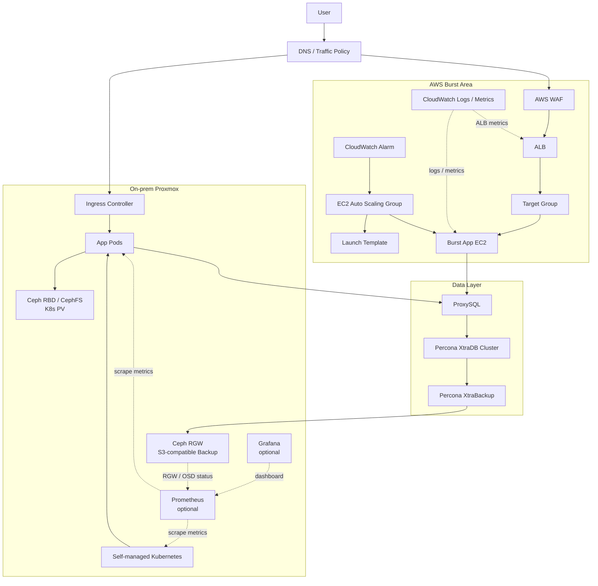
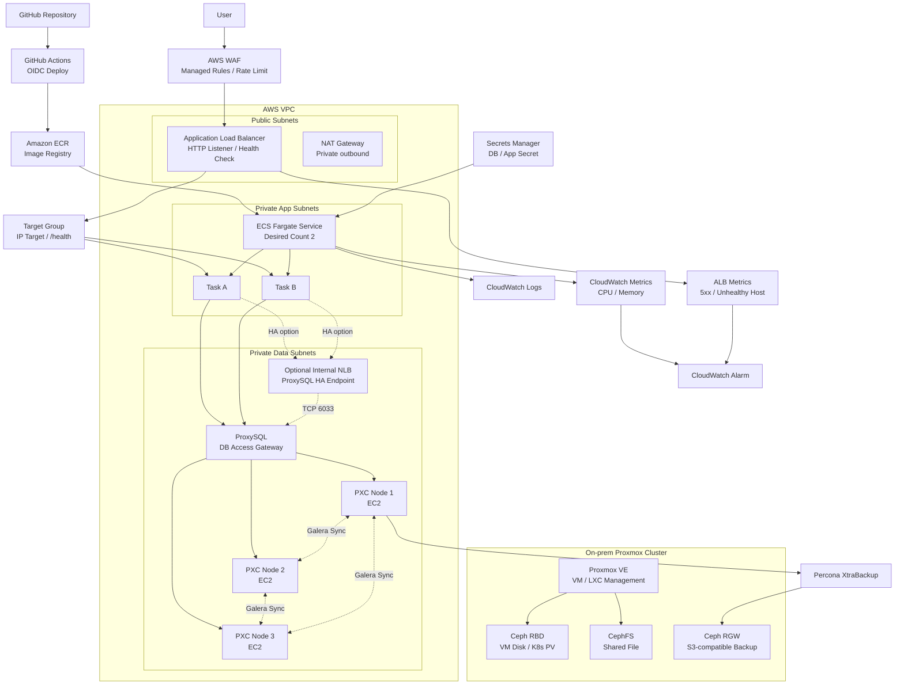
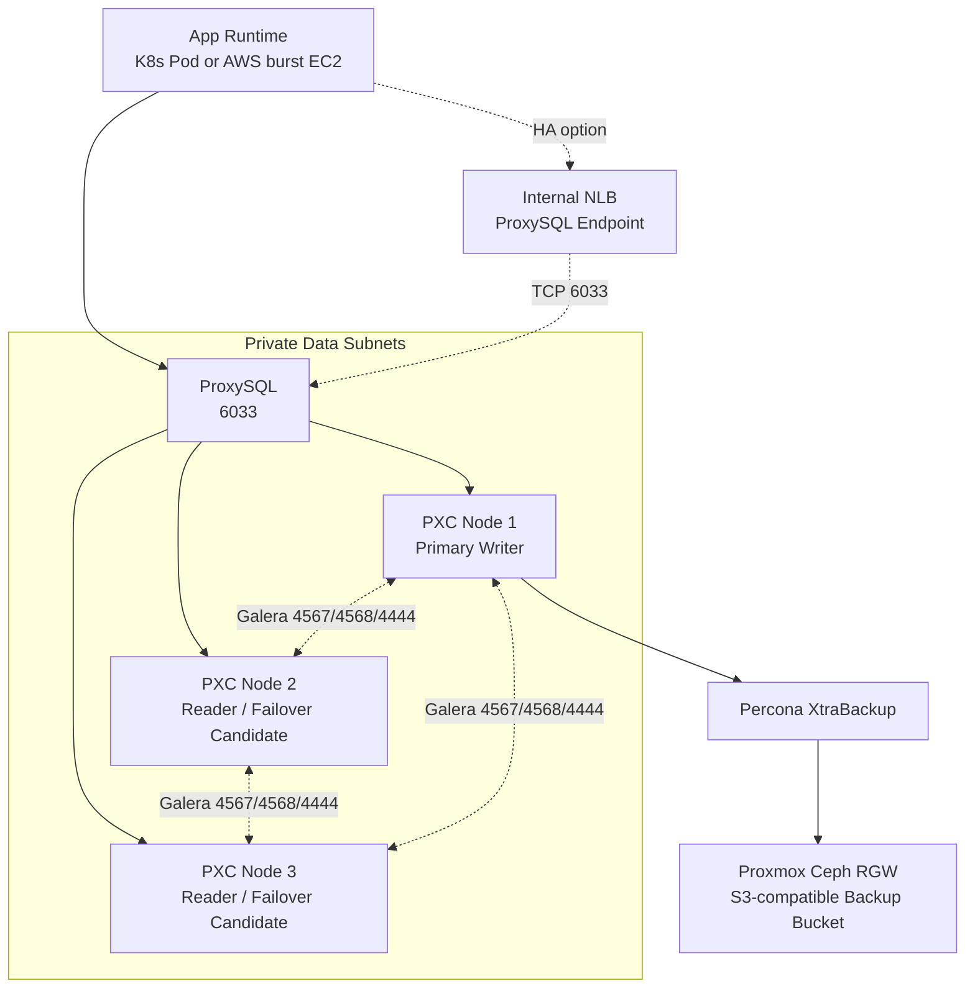
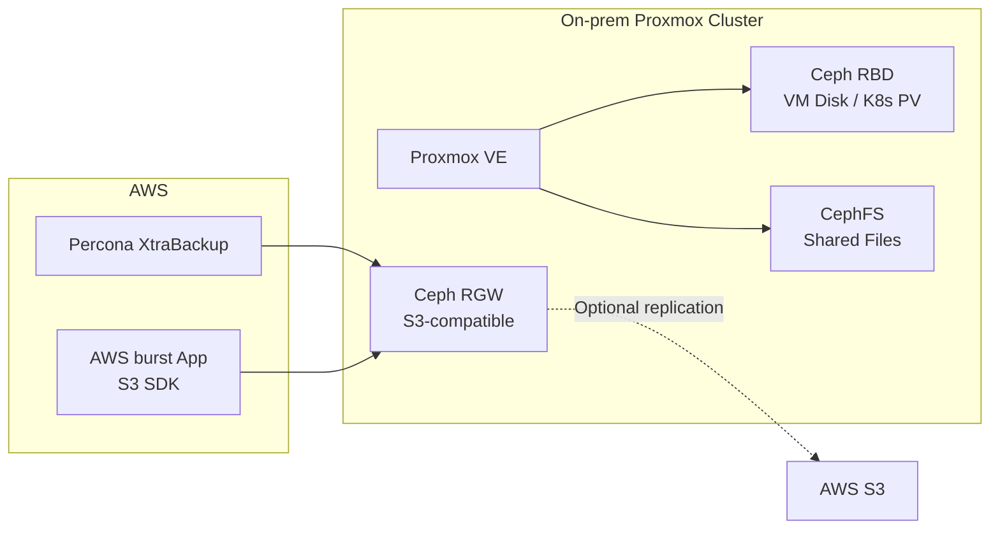
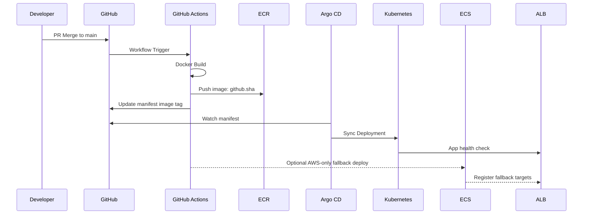
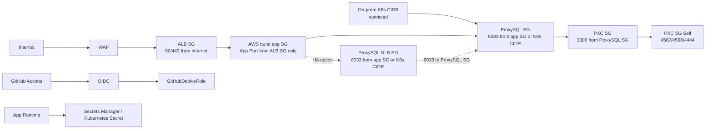

# 아키텍처 설계서

13일 구축 일정에서 구현 가능한 범위를 기준으로 작성한 팀 논의용 상세 아키텍처 문서

---

## 1. 설계 방향

## 1.1 핵심 목표

기존 애플리케이션을 클라우드 환경에 안정적으로 배포하고, 배포 자동화·보안·관측성·장애 대응·직접 운영
데이터 계층까지 포함한 운영 가능한 인프라를 구축함.

## 1.2 설계 원칙

- **반복 가능성:** 콘솔 수작업보다 Terraform과 GitHub Actions 기반 자동화를 우선함
- **최소 노출:** 외부 진입점은 애플리케이션 로드 밸런서(Application Load Balancer, ALB)로 제한하고
  애플리케이션 Task는 Private Subnet에 배치함
- **DB 내부망 고정:** ProxySQL과 Percona XtraDB Cluster(PXC) 노드는 Data Private Subnet에만 배치하고
  Public IP를 부여하지 않음
- **키 없는 배포:** 장기 Access Key 대신 GitHub Actions OpenID Connect(OIDC) 기반 임시 권한 사용
- **운영 가시성:** CloudWatch Logs/Metrics/Alarm을 기본 관측 체계로 구성함
- **관리형 DB 제외:** AWS Relational Database Service(RDS)는 사용하지 않고 Elastic Compute
  Cloud(EC2) 기반 Percona XtraDB Cluster와 ProxySQL로 DB 운영 경험을 확보함
- **스토리지 역할 분리:** Ceph는 Proxmox 기반 온프레미스 분산 스토리지로 두고, 백업·파일·온프레미스
  VM/Kubernetes 볼륨 용도를 구분해 활용함
- **비용 우선 하이브리드:** Elastic Kubernetes Service(EKS) 상시 비용을 피하고, 온프레미스
  Kubernetes와 AWS EC2 Auto Scaling burst 영역을 분리해 사용함
- **발표 가능성:** 장애 유도, 롤백, 보안 설계, 비용 선택 기준을 시연 가능한 형태로 남김

## 1.3 MVP 범위

- 온프레미스 Proxmox VM 기반 Kubernetes 직접 구성
- Kubernetes Deployment/Service/Ingress 기반 앱 실행
- Argo CD 기반 GitOps 배포
- AWS EC2 Auto Scaling Group(ASG) + Launch Template 기반 burst 영역
- AWS ALB + Target Group 기반 burst 트래픽 분산
- CloudWatch Alarm 기반 AWS EC2 scale-out/scale-in
- AWS 가상 사설 클라우드(Virtual Private Cloud, VPC) 기반 burst 네트워크
- GitHub Actions 기반 이미지 빌드/배포 자동화
- Identity and Access Management(IAM) OIDC, Security Group(SG), 웹 방화벽(Web Application Firewall,
  WAF) 기반 보안
- CloudWatch 기반 로그/지표/알람
- EC2 기반 Percona XtraDB Cluster(PXC) 3노드
- ProxySQL 1대 기본, 변수 변경 시 2대 + Internal NLB 전환
- Percona XtraBackup 기반 DB 백업
- 온프레미스 Ceph RADOS Gateway(RGW)/RADOS Block Device(RBD)/CephFS 활용 전략

기존 ECS Fargate 구성은 AWS-only 배포 플랫폼을 빠르게 검증하기 위한 대안 또는 fallback으로 유지함.
최종 MVP를 비용 우선 하이브리드 구조로 확정하면 ECS 관련 Terraform, CI/CD, Runbook은 온프레미스
Kubernetes와 AWS EC2 Auto Scaling 기준으로 재정렬해야 함.

### MVP 하이브리드 목표 구조

설명:

- 실선은 MVP 핵심 트래픽, 배포, DB 백업 경로임
- 점선은 관측성 수집 또는 선택 확장 경로임
- CloudWatch는 AWS ALB, EC2, 로그, 알람 중심 관측성임
- Prometheus/Grafana는 온프레미스 Kubernetes, 앱, Ceph 지표를 보기 위한 선택 관측성임
- PMM은 PXC/ProxySQL 상세 DB 관측성이 필요할 때 추가하는 선택 확장임

---

## 2. 전체 아키텍처

아래 다이어그램은 저장소에 먼저 구성되어 있던 AWS ECS Fargate 기반 fallback 구조임. 비용 우선
하이브리드 MVP를 최종 기준으로 적용하려면 이 영역의 Terraform, CI/CD, Runbook을 위의 목표 구조에
맞게 재정렬해야 함.

### 설명

- 사용자는 WAF와 ALB를 통해서만 애플리케이션에 접근함
- ALB는 Target Group Health Check로 정상 Task에만 트래픽 전달함
- ECS Fargate는 컨테이너 실행 환경을 제공하며 서버 패치/관리 부담을 줄임
- 애플리케이션은 ProxySQL을 통해서만 DB에 접근하고, DB 노드에 직접 접근하지 않음
- PXC는 3노드 동기식 복제 구조로 구성해 단일 DB 노드 장애에 대비함
- Ceph는 AWS 실행 경로의 주 DB 디스크가 아니라, 온프레미스 기반 백업·객체 저장소·Kubernetes PV
  용도로 사용함
- Proxmox는 온프레미스 VM/LXC와 Ceph 운영 계층이며, AWS 앱은 Ceph RBD를 직접 마운트하지 않고 RGW의
  S3 호환 API만 사용함
- ProxySQL 1대는 MVP 기준이고, 일정 여유가 있으면 Internal NLB를 통해 ProxySQL 2대 구성으로 확장함
- GitHub Actions는 OIDC로 AWS 임시 권한을 받아 ECR/ECS 배포를 수행함
- CloudWatch는 로그, 지표, 알람을 통해 장애와 성능 상태를 확인하는 기본 관측 계층임

---

## 3. 영역별 상세 설계

## 3.1 네트워크 영역

### 구성 요소

| 구성 요소           | 역할                             | MVP 구현                    |
| :------------------ | :------------------------------- | :-------------------------- |
| VPC                 | 전체 네트워크 격리 단위          | `10.20.0.0/16`              |
| Public Subnet       | 인터넷 진입점 배치               | 2개 AZ                      |
| Private App Subnet  | 애플리케이션 Task 실행           | 2개 AZ                      |
| Private Data Subnet | ProxySQL, Percona DB 노드 배치   | 3개 AZ 권장                 |
| Internet Gateway    | Public Subnet 인터넷 연결        | 필수                        |
| NAT Gateway         | Private Task의 ECR/외부 API 접근 | MVP 포함, 비용 이슈 시 논의 |
| Route Table         | Public/Private 라우팅 분리       | 필수                        |

### 설계 설명

Public Subnet에는 ALB와 NAT Gateway만 배치함. 애플리케이션 Task는 Private App Subnet에 두고,
ProxySQL과 Percona DB 노드는 Private Data Subnet에 배치함. 이 구조는 “외부 진입점, 애플리케이션 실행
영역, 데이터 영역을 분리했다”는 메시지를 명확하게 보여줌.

### 토론 포인트

- NAT Gateway 1개로 비용을 줄일지, AZ별 NAT Gateway로 가용성을 높일지 결정 필요
- 발표용 MVP에서는 단일 NAT Gateway를 사용해도 되지만, 운영 설계 설명에서는 AZ별 NAT Gateway가 더
  안전함
- HTTPS까지 구현할 경우 Route 53과 ACM 인증서 작업을 Day 10 이전에 끝내야 함
- PXC 3노드를 3개 AZ에 둘지, 비용 절감을 위해 2개 AZ + garbd 또는 3 EC2 최소 사양으로 둘지 결정 필요
- Proxmox 기반 Ceph RGW와 AWS VPC 간 백업 전송을 VPN으로 할지, 제한된 IP 기반 HTTPS(S3 호환
  엔드포인트)로 할지 결정 필요
- Proxmox 관리 UI와 Ceph 관리망은 인터넷에 공개하지 않고, AWS 앱은 RGW의 S3 호환 API만 사용하도록
  경계를 분리해야 함

### DB 내부망 원칙

- DB EC2와 ProxySQL EC2는 Public IP를 부여하지 않음
- DB 포트 `3306`, ProxySQL Client 포트 `6033`, Galera 포트 `4567/4568/4444`는 `0.0.0.0/0`에 열지
  않음
- ECS는 PXC 노드에 직접 접근하지 않고 ProxySQL `6033`으로만 접근함
- PXC 노드는 ProxySQL SG와 PXC SG 자기 자신에서 오는 트래픽만 허용함
- 운영 접속은 SSH 공개보다 SSM Session Manager 또는 제한된 Bastion 경유를 우선함

## 3.2 로드밸런싱 영역

### 구성 요소

| 구성 요소    | 역할                                      |
| :----------- | :---------------------------------------- |
| ALB          | HTTP 요청 수신, Target Group으로 전달     |
| Target Group | AWS burst app EC2 등록, Health Check 수행 |
| Listener     | HTTP 80 또는 HTTPS 443 수신               |
| Health Check | `/health` 기준 정상 앱 판별               |

### ALB를 선택한 이유

- 프로젝트 대상이 HTTP/HTTPS 웹 앱임
- 경로/호스트 기반 라우팅을 확장하기 쉬움
- WAF 연결이 간단함
- AWS EC2 Auto Scaling Group과 Target Group 연동이 자연스러움

### NLB/GWLB와 비교

| 구분 | 적합한 경우                      | 이번 프로젝트 판단             |
| :--- | :------------------------------- | :----------------------------- |
| ALB  | 웹 앱, API, WAF, L7 라우팅       | 기본 선택                      |
| NLB  | TCP/UDP, 고정 IP, 낮은 지연 시간 | DB 프록시나 TCP 서비스 확장 시 |
| GWLB | 방화벽, IDS/IPS 보안 장비 체인   | 고급 확장 설명용               |

### 내부 DB 진입점

ProxySQL을 2대 이상 구성하는 경우 앱에서 접근할 단일 엔드포인트가 필요함. 이때 **Internal NLB**를
ProxySQL 앞단에 둠.

- **MVP:** 앱 런타임 → ProxySQL 1대 → PXC 3노드
- **안정성 보완:** 앱 런타임 → Internal NLB → ProxySQL 2대 → PXC 3노드
- **Terraform 전환값:** `proxysql_count = 2`, `enable_proxysql_internal_nlb = true`
- **주의:** ProxySQL 1대는 DB 계층의 단일 장애점(SPoF)이므로 발표에서는 한계와 확장안을 함께 설명함

## 3.3 컴퓨팅/런타임 영역

### 구성 요소

| 구성 요소                  | 역할                                      |
| :------------------------- | :---------------------------------------- |
| 온프레미스 Kubernetes      | 기본 애플리케이션 실행 환경               |
| Kubernetes Deployment      | 원하는 Pod 수 유지, rolling update 제어   |
| Argo CD                    | Git 저장소 manifest를 Kubernetes에 동기화 |
| AWS EC2 Auto Scaling Group | burst 앱 인스턴스 수 조정                 |
| Launch Template            | AWS burst 앱 bootstrap과 이미지 태그 기준 |

### 설계 설명

MVP 기본 런타임은 온프레미스 Kubernetes임. Argo CD로 GitOps 배포 흐름을 보여주고, AWS는 ALB와 EC2
Auto Scaling Group 기반 burst 영역으로 분리함. EKS control plane 비용은 제외하고, ECS Fargate는
AWS-only fallback 또는 비교안으로 유지함.

### Task 기준값

| 항목                | 기본값             | 이유                          |
| :------------------ | :----------------- | :---------------------------- |
| Kubernetes replicas | 2                  | 단일 Pod 장애 시 가용성 확보  |
| AWS burst min/max   | 0 또는 1 / 팀 결정 | 비용과 시연 범위 균형         |
| Container Port      | 8080               | 샘플 앱 기준                  |
| Health Check        | `/health`          | ALB/Kubernetes 복구 판단 기준 |

## 3.4 이미지 저장소 영역

### 구성 요소

| 구성 요소      | 역할                        |
| :------------- | :-------------------------- |
| ECR Repository | Docker 이미지 저장          |
| Image Tag      | `github.sha`, `latest` 병행 |
| Scan on Push   | 이미지 취약점 기본 스캔     |

### 설계 설명

GitHub Actions는 커밋 SHA 기반 태그로 이미지를 저장함. `latest`만 사용하면 어떤 코드가 배포되었는지
추적하기 어려우므로, 발표와 장애 분석을 위해 SHA 태그를 같이 사용함.

## 3.5 데이터베이스 영역

### 선택 기준

AWS RDS는 관리형 서비스라 구축 속도와 안정성은 좋지만, 이번 프로젝트에서는 직접 운영 경험과 비용
통제, 장애 대응 시연을 위해 제외함. 대신 EC2 기반 **Percona XtraDB Cluster(PXC)**와 **ProxySQL**을
사용함.

### 구성 요소

| 구성 요소              | 역할                                                  | MVP 기준                       |
| :--------------------- | :---------------------------------------------------- | :----------------------------- |
| Percona XtraDB Cluster | MySQL 호환 동기식 DB 클러스터                         | EC2 3노드                      |
| ProxySQL               | 앱의 DB 접근 단일화, 읽기/쓰기 라우팅, 장애 노드 제외 | 기본 1대, 확장 시 2대          |
| Percona XtraBackup     | 온라인 백업 수행                                      | 일 단위 또는 발표 시 수동 백업 |
| Internal NLB           | ProxySQL 이중화 시 단일 진입점 제공                   | 선택 확장                      |
| CloudWatch Agent/PMM   | DB 노드 지표 관측                                     | CloudWatch 우선, PMM 선택      |

### DB 아키텍처

### 운영 방식

- 애플리케이션은 DB 노드 주소를 직접 알지 않고 ProxySQL endpoint만 사용함
- 쓰기 요청은 Primary Writer로 집중하고, 읽기 요청은 Reader 노드로 분산하는 Single Writer 운영을
  우선함
- PXC는 Multi-Primary가 가능하지만, 쓰기 충돌과 지연 문제가 생길 수 있으므로 프로젝트에서는 Single
  Writer 방식이 더 설명하기 쉬움
- DB 백업은 Percona XtraBackup으로 수행하고, 백업 산출물은 Ceph RGW 또는 S3 호환 저장소에 업로드함
- DB 노드 접속은 SSH 직접 접속보다 SSM Session Manager 또는 Bastion을 통한 제한 접근을 우선함

### 역할 경계

- Cloud/Network/IaC 담당은 DB EC2가 배치될 Data Private Subnet, Security Group, SSM Role, EC2
  Terraform 골격을 책임짐
- DB/Storage 담당은 EC2 위의 PXC, ProxySQL, DB 계정/권한, 백업/복구를 책임짐
- CI/CD/App Runtime 담당은 Kubernetes Secret, 환경변수, AWS burst bootstrap을 통해 ProxySQL
  endpoint에 접속하는 부분을 책임짐
- DB Security Group과 포트 정책은 Cloud/Network/IaC 담당과 DB/Storage 담당이 공동 리뷰함

### 필수 포트

| 포트 | 용도                            | 허용 범위                          |
| ---: | :------------------------------ | :--------------------------------- |
| 3306 | MySQL Client                    | ProxySQL SG → PXC SG               |
| 6033 | ProxySQL Client                 | App SG 또는 K8s CIDR → ProxySQL SG |
| 6032 | ProxySQL Admin                  | 관리 SG 또는 Bastion만             |
| 4567 | Galera Replication              | PXC 노드 간                        |
| 4568 | IST(Incremental State Transfer) | PXC 노드 간                        |
| 4444 | SST(State Snapshot Transfer)    | PXC 노드 간                        |

### ProxySQL 1대 MVP 판단 기준

ProxySQL 1대는 운영 권장 구성이 아니라 13일 구축 일정의 MVP 기준임. 처음부터 2대와 Internal NLB를
필수로 잡으면 ProxySQL 설정 동기화, Health Check, 단일 엔드포인트, 장애 전환 검증까지 DB 담당자의
작업량이 커짐. 따라서 Day 8까지는 “앱이 ProxySQL을 통해 PXC에 접속하고, PXC 장애 시 backend 제외
흐름을 설명할 수 있는 상태”를 우선 완료함.

단, 이 구조는 ProxySQL 인스턴스 장애 시 앱의 DB 접속이 중단되는 단일 장애점(SPoF)을 가짐. 발표에서는
반드시 한계로 설명하고, 일정 여유가 있으면 Terraform 변수 `proxysql_count = 2`,
`enable_proxysql_internal_nlb = true`로 Internal NLB 기반 이중화 구성을 적용함.

### 토론 포인트

- ProxySQL을 MVP 1대로 유지할지, Day 9 이후 2대 + Internal NLB로 확장할지 결정
- DB 노드를 AWS EC2에 둘지, 온프레미스에 두고 AWS 앱과 VPN으로 연결할지 결정
- 백업 저장소를 Ceph RGW만 사용할지, AWS S3를 보조 복제 대상으로 둘지 결정
- DB 모니터링을 CloudWatch Agent만으로 할지, PMM(Percona Monitoring and Management)을 추가할지 결정

## 3.6 Ceph 스토리지 영역

### Proxmox 기반 Ceph의 역할

Ceph는 이번 프로젝트에서 “AWS RDS 대체 DB 엔진”이 아니라 **온프레미스 분산 스토리지 계층**임.
Object/Block/File 인터페이스를 용도별로 나누어 사용함.

| Ceph 인터페이스         | 역할                  | 프로젝트 활용                                  |
| :---------------------- | :-------------------- | :--------------------------------------------- |
| RGW(RADOS Gateway)      | S3 호환 객체 스토리지 | DB 백업, 파일 업로드, 정적 파일 보관           |
| RBD(RADOS Block Device) | 블록 스토리지         | 온프레미스 VM 디스크, Kubernetes PVC           |
| CephFS                  | 공유 파일 시스템      | 여러 노드가 공유하는 파일, 로그/모델 파일 실험 |

Proxmox를 온프레미스 플랫폼으로 사용할 경우 역할은 다음처럼 분리함.

- **Proxmox VE:** 온프레미스 VM/LXC 실행과 클러스터 관리
- **Ceph RBD:** Proxmox VM 디스크 또는 온프레미스 Kubernetes 볼륨
- **Ceph RGW:** AWS PXC 백업과 앱 파일 업로드용 S3 호환 객체 저장소
- **CephFS:** 공유 파일 실험 또는 로그/모델 파일 저장

AWS burst 앱 또는 ECS fallback은 Proxmox/Ceph RBD를 직접 마운트하지 않음. AWS 앱은 RGW의 S3 호환
API로만 온프레미스 스토리지에 접근하는 구조를 우선함.

### 권장 활용 순서

1. **DB 백업 저장소:** Percona XtraBackup 결과를 Ceph RGW에 업로드
2. **파일 업로드 저장소:** 앱이 S3 SDK로 Ceph RGW에 파일 저장
3. **Kubernetes PV:** 온프레미스 K8s를 사용할 때 RBD 기반 PVC 제공
4. **로그 장기 보관:** Loki/ELK 장기 저장소 또는 아카이브 대상으로 사용
5. **AWS S3 보조 복제:** 중요 백업을 S3로 2차 복제하는 하이브리드 백업 구조

상세 전략은 [Ceph 활용 전략](./13_ceph_usage_strategy.md)을 따름.

### Ceph 연동 흐름

## 3.7 CI/CD 영역

### 배포 흐름

### 설계 설명

`main` 브랜치 병합 또는 수동 실행으로 이미지 빌드를 시작함. GitHub Actions는 이미지를 ECR에 push하고
Kubernetes manifest의 이미지 태그를 갱신함. Argo CD는 Git 저장소 상태를 감시하고 온프레미스
Kubernetes에 manifest를 동기화함.

AWS burst 또는 AWS-only fallback 배포가 필요하면 GitHub Actions가 OIDC로 `GitHubDeployRole`을
Assume함. 이 구조는 보안 발표 포인트로 중요함.

### 팀 논의 사항

- PR 병합 시 자동 배포할지, `workflow_dispatch` 수동 배포만 허용할지 결정
- 발표 안정성을 위해 Day 14 이후에는 수동 배포만 허용하는 방식 권장
- Argo CD 자동 동기화는 Day 13 이전 검증 후 활성화
- 실패 배포 시 자동 롤백과 수동 롤백 절차를 모두 준비

## 3.8 보안 영역

### 보안 경계

### 주요 정책

| 영역    | 정책                                                                       |
| :------ | :------------------------------------------------------------------------- |
| IAM     | GitHubDeployRole, EC2 Instance Role, 필요 시 ECS fallback Role 분리        |
| GitHub  | 장기 AWS Access Key 저장 금지                                              |
| Network | ALB만 인터넷 노출, AWS burst 앱은 ALB SG에서만 접근                        |
| DB      | 앱은 ProxySQL에만 접근, PXC 노드는 ProxySQL과 클러스터 노드 간 통신만 허용 |
| Secret  | Secrets Manager 사용, `.env` 커밋 금지                                     |
| WAF     | Managed Rule + Rate Limit 적용                                             |

### 토론 포인트

- WAF는 처음부터 Block 모드로 둘지, Count 모드로 관찰 후 Block 전환할지 결정
- `iam:PassRole` 범위를 배포에 필요한 Role로 제한해야 함
- GitHub OIDC Trust Policy는 Terraform 변수 `github_repository`를 실제 저장소명으로 설정해 제한해야
  함
- ProxySQL Admin 포트 `6032`를 운영자 전체에 열지 않고 Bastion 또는 SSM 접근으로 제한해야 함
- Ceph RGW 접근 키를 GitHub, Terraform 상태 파일, 앱 코드에 저장하지 않고 Secrets Manager 또는 CI
  Secret으로 분리해야 함

## 3.9 관측성 영역

### 구성 요소

| 대상             | 지표/로그                                 | 활용                                  |
| :--------------- | :---------------------------------------- | :------------------------------------ |
| Kubernetes       | Pod Ready, rollout, replica 상태          | 온프레미스 앱 배포와 장애 판단        |
| EC2 ASG          | CPU, 인스턴스 수, Target Health           | AWS burst 스케일링과 장애 판단        |
| ProxySQL         | 연결 수, 쿼리 라우팅, backend 상태        | DB 접근 병목과 장애 노드 확인         |
| PXC              | wsrep 상태, replication delay, disk usage | 클러스터 정합성과 장애 판단           |
| Ceph             | OSD 상태, pool 사용량, RGW 오류           | 백업 저장소와 분산 스토리지 상태 확인 |
| ALB              | Request Count, Target Response Time       | 트래픽과 지연 시간 확인               |
| ALB              | 4xx, 5xx, Unhealthy Host                  | 장애 감지                             |
| CloudWatch Logs  | stdout/stderr                             | 앱 오류 분석                          |
| CloudWatch Alarm | 임계치 알림                               | 시연과 운영 대응                      |

### 알람 기준

- ALB Target 5xx 5분 합계 5회 이상
- Unhealthy Host 1개 이상
- AWS burst EC2 CPU 70-80% 이상 지속
- Kubernetes Pod Ready 실패 또는 rollout timeout
- PXC `wsrep_cluster_status`가 `Primary`가 아님
- Ceph `HEALTH_WARN` 또는 `HEALTH_ERR` 발생

### 발표 설명 포인트

단순히 로그를 저장하는 것이 아니라, Health Check와 알람을 통해 “장애를 감지하고 복구 근거를 확보하는
구조”임을 강조함.

## 3.10 Auto Scaling 영역

### 구성 요소

| 구성 요소              | 역할                            |
| :--------------------- | :------------------------------ |
| EC2 Auto Scaling Group | AWS burst app EC2 수 조절 대상  |
| Scaling Policy         | CPU 또는 요청 수 기준 자동 확장 |
| Desired/Min/Max Size   | 최소/희망/최대 EC2 수 제한      |

### 기본 정책

- Min: 0 또는 1
- Max: 팀 비용 한도 기준
- CPU Target: 70%

### 토론 포인트

- 13일 일정에서는 AWS EC2 CPU 기준 scale-out과 scale-in 확인만 구현해도 충분함
- 발표용 부하 테스트는 과도한 비용을 막기 위해 짧게 수행함
- Memory 기반 정책은 선택 확장으로 분리 가능함
- DB 노드는 자동 증설보다 장애 복구와 백업 검증을 우선함
- PXC는 무분별한 수평 확장보다 3노드 안정성과 ProxySQL 라우팅 검증이 우선임

## 3.11 비용 영역

### 비용 발생 요소

| 리소스      | 비용 영향                        | 절감 방법                        |
| :---------- | :------------------------------- | :------------------------------- |
| NAT Gateway | 시간당 비용과 처리량 비용        | 단일 NAT 사용, 발표 후 즉시 삭제 |
| ALB         | 시간당 비용                      | 발표 후 삭제                     |
| Fargate     | CPU/Memory/실행 시간             | 256/512 기준 시작                |
| WAF         | Web ACL/Rule/요청 수             | Managed Rule 최소 구성           |
| CloudWatch  | 로그 저장/알람                   | 로그 보존 7일                    |
| EC2 DB      | PXC/ProxySQL 인스턴스 실행 시간  | 작은 인스턴스, 발표 후 정리      |
| Ceph        | 온프레미스 디스크/전력/운영 비용 | 백업/파일/PV 용도 우선순위화     |

### 팀 결정 필요

- 비용 절감을 위해 NAT Gateway를 단일 AZ에 둘지
- HTTPS/Route 53까지 구현할지
- 발표 후 전체 destroy를 수행할지
- DB 클러스터를 발표 후 유지할지, 백업 검증 후 정리할지
- Ceph 백업을 S3에 2차 복제할지, Ceph 단독으로 둘지

---

## 4. 배포 후 운영 흐름

## 4.1 정상 배포

1. PR 병합
2. GitHub Actions 실행
3. Docker 이미지 빌드
4. ECR Push
5. Kubernetes manifest image tag 갱신
6. Argo CD Application sync
7. Kubernetes rollout과 ALB Health Check 통과
8. 기존 Pod 또는 burst app 교체
9. 앱에서 ProxySQL을 통한 DB 연결 확인
10. DB 백업 작업 또는 백업 업로드 상태 확인

## 4.2 장애 발생

1. ALB Health Check 실패 또는 5xx 증가
2. CloudWatch Alarm 또는 Argo CD/Kubernetes 상태 확인
3. 신규 image tag 또는 manifest 문제 여부 확인
4. 이전 Git revision 또는 image tag로 롤백
5. 정상 응답 복구 확인
6. 원인과 복구 시간 기록

## 4.3 DB 장애 발생

1. PXC 노드 1대 중지 또는 네트워크 차단
2. ProxySQL backend 상태 확인
3. 애플리케이션 DB 요청 정상 여부 확인
4. PXC 클러스터 상태(`wsrep_cluster_status`, `wsrep_cluster_size`) 확인
5. 장애 노드 복구 후 클러스터 재합류 확인
6. 장애 중 백업/복구 영향 기록

---

## 5. 확장 아키텍처

## 5.1 HTTPS와 도메인

Route 53 Hosted Zone과 ACM 인증서를 추가하면 ALB HTTPS Listener를 구성할 수 있음. 발표 완성도는
높아지지만 DNS 전파와 인증서 검증 시간이 필요하므로 Day 8 이전에 결정해야 함.

## 5.2 S3 + CloudFront

정적 자산이 많은 앱이면 S3와 CloudFront로 오프로딩 가능함. 이번 MVP에서는 앱 배포 플랫폼이
핵심이므로 선택 확장으로 둠.

## 5.3 DB 고도화

RDS는 제외하고 EC2 기반 PXC + ProxySQL을 기본 데이터 계층으로 사용함. 안정성 보완 단계에서는
ProxySQL 2대와 Internal NLB를 추가하고, 백업은 Ceph RGW에 저장한 뒤 중요 백업만 AWS S3로 2차 복제함.

## 5.4 EKS 전환

Kubernetes 포트폴리오를 강조하기 위해 Argo CD 기반 GitOps는 MVP에 포함함. 단, EKS control plane은
비용과 일정 부담 때문에 선택 확장으로 유지함.

## 5.5 비용 우선 하이브리드 Kubernetes와 AWS EC2 버스팅

비용을 우선하면 EKS를 필수로 두지 않음. 온프레미스 Proxmox 위에 Kubernetes를 직접 구성하고, AWS는
별도의 burst 영역으로 둠. 부하가 높아지면 CloudWatch Alarm과 EC2 Auto Scaling Group이 Launch
Template 기반 EC2를 생성하고, ALB Target Group이 새 인스턴스를 포함해 트래픽을 분산함. 부하가 줄면
Auto Scaling Group이 늘어난 EC2를 종료함.

이 방식은 **단일 Kubernetes cluster의 node autoscaling**이 아니라 **온프레미스 Kubernetes + AWS EC2
Auto Scaling 기반 하이브리드 운영**임.

```mermaid
flowchart LR
    User["User"] --> TrafficPolicy["DNS / Traffic Policy<br/>weight or failover"]

    subgraph OnPrem["On-prem Proxmox"]
        K8sCP["Kubernetes Control Plane<br/>self-managed"]
        K8sNode1["K8s Worker<br/>Proxmox VM 1"]
        K8sNode2["K8s Worker<br/>Proxmox VM 2"]
        Ingress["Ingress Controller"]
        Ceph["Ceph<br/>RBD / CephFS / RGW"]
    end

    subgraph AWS["AWS Burst Area"]
        ALB["ALB"]
        ASG["EC2 Auto Scaling Group"]
        LT["Launch Template<br/>app bootstrap"]
        EC2A["Burst EC2 A"]
        EC2B["Burst EC2 B<br/>scale-out"]
        CW["CloudWatch Alarm<br/>CPU / Request"]
    end

    TrafficPolicy --> Ingress
    TrafficPolicy --> ALB
    K8sCP --> K8sNode1
    K8sCP --> K8sNode2
    Ingress --> K8sNode1
    Ingress --> K8sNode2
    K8sNode1 --> Ceph
    K8sNode2 --> Ceph
    CW --> ASG
    ASG --> LT
    ASG --> EC2A
    ASG --> EC2B
    ALB --> EC2A
    ALB --> EC2B
```

권장 판단:

- 비용이 최우선이면 EKS Hybrid가 아니라 온프레미스 Kubernetes + AWS EC2 ASG/ALB burst를 우선함
- AWS EC2가 Kubernetes worker로 자동 join하는 구조는 선택 확장으로 둠
- 기존 ECS Fargate 구성은 AWS-only fallback 또는 비교안으로 유지함
- Proxmox/Ceph는 온프레미스 노드와 스토리지 계층으로 유지하고, AWS burst 인스턴스는 상태 없는 앱
  실행 영역으로 먼저 설계함

필수 선결 조건:

- 온프레미스와 AWS VPC 간 안정적인 네트워크 연결
- DNS 또는 트래픽 분산 정책 결정
- 온프레미스 Kubernetes와 AWS burst 영역의 배포 버전 동기화 방식
- 세션과 파일 업로드를 어디에 저장할지 결정
- AWS burst 인스턴스가 DB/ProxySQL에 접근하는 네트워크 경로
- CloudWatch scale-out 기준과 scale-in 기준 정의

---

## 6. 팀 회의 체크리스트

- [ ] [Team Decision Checklist](./21_team_decision_checklist.md)의 핵심 결정 항목을 회의에서 검토
- [ ] 온프레미스와 AWS를 하나의 Kubernetes 클러스터로 묶을지, 별도 런타임으로 둘지 결정
- [ ] 온프레미스에 웹앱과 DB를 모두 둘지, DB는 AWS EC2에 둘지 결정
- [ ] AWS burst EC2를 Kubernetes worker node로 붙일지, 일반 앱 서버로 둘지 결정
- [ ] 파일/백업 저장소를 Ceph RGW로 둘지, AWS S3로 둘지 결정
- [ ] EKS와 ECS/Fargate를 선택 확장 또는 비교안으로 유지할지 결정
- [ ] NAT Gateway를 단일 구성으로 둘지, AZ별로 둘지 결정
- [ ] HTTPS/Route 53을 MVP에 포함할지 결정
- [ ] 자동 배포 트리거를 `main push`로 둘지, 수동 실행으로 제한할지 결정
- [ ] WAF를 Block 모드로 시작할지, Count 모드로 시작할지 결정
- [ ] 앱 Health Check 경로를 `/health`로 맞출 수 있는지 확인
- [ ] Day 14 이후 기능 동결 원칙 합의
- [ ] 발표 시연에서 의도적으로 만들 장애 유형 결정
- [ ] RDS 제외와 PXC + ProxySQL 채택 범위 합의
- [ ] ProxySQL 1대 MVP와 2대 이중화 중 어디까지 구현할지 결정
- [ ] Ceph RGW/RBD/CephFS 중 13일 안에 실제 구현할 범위 결정
- [ ] DB 백업을 Ceph RGW 단독으로 둘지, S3 2차 복제까지 할지 결정
