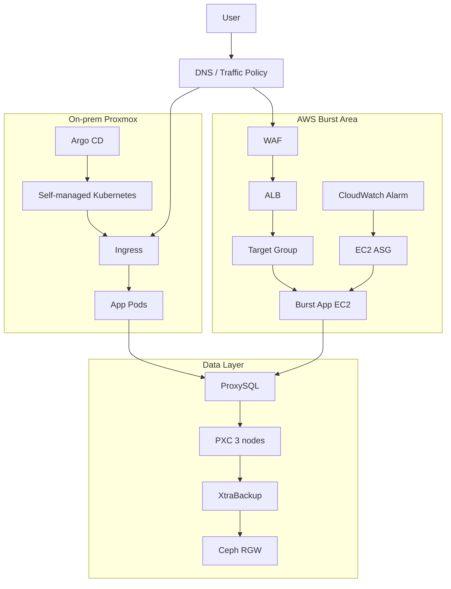

# 아키텍처 설계서 (Level 0 통합)

이 문서는 하이브리드 MVP의 **통합 개요(Level 0)**만 다룸. 세부 설계/구현/운영 절차는 Level 1/2
문서와 Runbook으로 분리함.

- 적용: 2026-05 Phase 2 슬림화 완료
- 상세 문서 정본: `docs/architecture/details/*`, `docs/architecture/build-up/*`, `docs/runbooks/*`

---

## 1. 설계 방향

### 1.1 핵심 목표

- 온프레미스 Kubernetes + AWS burst 구조로 운영 가능한 MVP 구축
- 배포 자동화(GitHub Actions + Argo CD), 보안(OIDC/WAF/SG), 관측성(CloudWatch 중심) 확보
- DB는 RDS 제외, PXC + ProxySQL + Ceph RGW 백업 경로로 운영 경험 확보

### 1.2 고정 원칙

- 외부 진입점: AWS burst는 ALB/WAF, 온프레는 Ingress 기준
- DB/ProxySQL: Data Private Subnet, Public IP 미부여
- 앱 DB 접속: PXC 직접 접속 금지, ProxySQL endpoint만 사용
- 일정: 13일 구축 + 3일 발표 준비, Day14 이후 신규 기능 동결

---

## 2. MVP 통합 아키텍처

설명:

- 기본 런타임: 온프레미스 Kubernetes
- burst 런타임: AWS EC2 ASG + ALB
- 데이터 경로: App → ProxySQL → PXC → XtraBackup → Ceph RGW

---

## 3. Level 1/2 상세 문서

### Level 1 (서브시스템)

- [Network / LB](./architecture/details/network_and_lb.md)
- [Runtime / CI-CD / Security](./architecture/details/runtime_cicd_security.md)
- [Data / Ceph / Observability / Cost](./architecture/details/data_ceph_observability_cost.md)

### Level 2 (운영 시퀀스/확장)

- [Ops Flow / Extensions](./architecture/details/ops_flow_and_extensions.md)

---

## 4. 역할별 구현 문서

- [Build-up Guide](./architecture/build-up/README.md)
- Cloud / Network / IaC: `docs/architecture/build-up/01_*`
- DB / Storage: `docs/architecture/build-up/02_*`
- CI/CD / App Runtime: `docs/architecture/build-up/03_*`
- Observability / Demo: `docs/architecture/build-up/04_*`

---

## 5. 운영 Runbook 연결

- [Deployment](./runbooks/deployment.md)
- [Rollback](./runbooks/rollback.md)
- [Monitoring](./runbooks/monitoring.md)
- [Database Storage](./runbooks/database_storage.md)
- [Incident Scenarios](./runbooks/incident_scenarios.md)

---

## 6. 선택 확장(요약)

- Route 53/ACM HTTPS
- ProxySQL 2대 + Internal NLB
- PMM/고급 관측성
- EKS 운영 전환 검토(현재 MVP 외)

상세 결정 근거는 [Architecture Decisions](./architecture/decisions/README.md) 참고.
