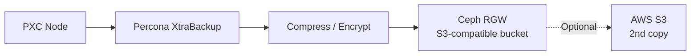
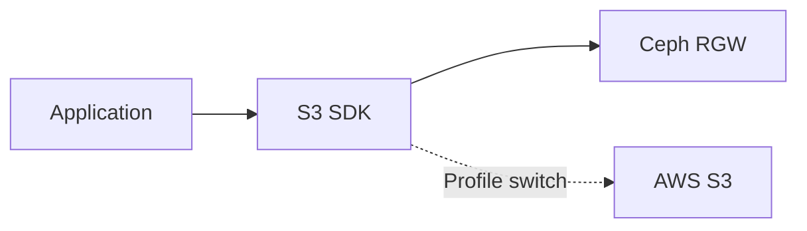
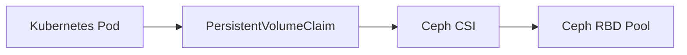
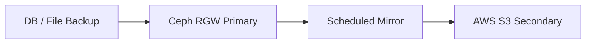

# Ceph 활용 전략

Proxmox 기반 온프레미스 Ceph를 AWS 기반 애플리케이션 배포 프로젝트와 연결해 활용하는 기준

---

## 1. 결론

Ceph는 이번 프로젝트에서 단순 백업 디스크가 아니라 **Object / Block / File 스토리지를 통합 제공하는
Proxmox 기반 온프레미스 분산 스토리지 계층**으로 사용함.

- **가장 먼저 구현할 용도:** Percona XtraBackup 결과 저장소
- **두 번째 우선순위:** 애플리케이션 파일 업로드 저장소
- **세 번째 우선순위:** 온프레미스 Kubernetes Persistent Volume
- **고급 확장:** 로그 장기 보관, AWS S3 2차 복제, DR 복구 시나리오

Proxmox 도입은 현재 온프레미스 Kubernetes + AWS EC2 burst + EC2 PXC 아키텍처와 충돌하지 않음. 단,
Proxmox는 온프레미스 VM/스토리지 운영 계층이고 AWS burst 앱의 런타임 계층이 아니므로 역할을 섞지
않음.

---

## 2. Ceph 인터페이스별 역할

| 인터페이스                       | 설명                                            | 이번 프로젝트 활용                   |
| :------------------------------- | :---------------------------------------------- | :----------------------------------- |
| **Ceph RGW(RADOS Gateway)**      | S3 호환 Object Storage API 제공                 | DB 백업, 파일 업로드, 정적 파일 저장 |
| **Ceph RBD(RADOS Block Device)** | VM/컨테이너가 디스크처럼 사용하는 Block Storage | 온프레미스 VM 디스크, K8s PVC        |
| **CephFS**                       | 여러 서버가 동시에 접근 가능한 공유 파일 시스템 | 공유 파일, 로그/모델 파일 실험       |

### Proxmox 적용 시 역할 분리

| 계층       | 역할                                         | 프로젝트 적용                         |
| :--------- | :------------------------------------------- | :------------------------------------ |
| Proxmox VE | 온프레미스 VM/LXC 실행과 클러스터 관리       | Ceph 노드, 관리 VM, 실험용 VM 운영    |
| Ceph RBD   | Proxmox VM 디스크와 온프레미스 Kubernetes PV | AWS burst 앱에서는 직접 사용하지 않음 |
| Ceph RGW   | S3 호환 객체 스토리지                        | PXC 백업 업로드와 앱 파일 업로드      |
| CephFS     | 공유 파일 시스템                             | 선택 실험 또는 장기 로그/파일 공유    |

주의:

- Proxmox 관리 UI는 인터넷에 공개하지 않음
- AWS에서 Proxmox/Ceph 관리망으로 직접 접근하지 않음
- AWS 앱은 Ceph RGW endpoint만 사용함
- Proxmox의 VM 백업과 PXC의 DB 백업은 목적이 다르므로 Percona XtraBackup을 대체하지 않음

---

## 3. 권장 활용 1: DB 백업 저장소

Percona Cluster를 직접 운영하면 백업과 복구 시연이 반드시 필요함. Ceph RGW는 S3 호환 API를
제공하므로 Percona XtraBackup 결과를 객체 저장소에 업로드하는 방식이 가장 적합함.



### 구현 기준

- 백업 파일명에 날짜와 클러스터명 포함
- 백업 업로드 후 체크섬 파일 함께 저장
- 발표 시 최소 1회 백업 생성과 목록 조회 시연
- 시간이 가능하면 별도 임시 DB 노드에 복구 리허설 수행

### 예시 명명 규칙

```text
pxc-backup/cloud-infra-dev/2026-05-02/full-backup.xbstream.gz
pxc-backup/cloud-infra-dev/2026-05-02/full-backup.sha256
```

---

## 4. 권장 활용 2: 앱 파일 업로드 저장소

애플리케이션이 사용자 파일을 저장해야 한다면 로컬 디스크에 저장하지 않고 Ceph RGW를 S3 호환 저장소로
사용함.



### 장점

- 앱은 S3 SDK만 사용하므로 Ceph RGW와 AWS S3를 환경 변수로 전환 가능
- 온프레미스 저장소를 활용해 S3 비용을 줄일 수 있음
- 발표에서 “클라우드 종속성을 낮춘 S3 호환 인터페이스”로 설명 가능

### 주의 사항

- Ceph RGW endpoint, access key, secret key는 Secrets Manager에 저장
- 인터넷을 통한 RGW 공개는 지양하고 VPN 또는 제한된 IP 기반 HTTPS 접근 권장
- presigned URL 만료 시간, CORS, multipart upload 동작은 S3와 별도 검증 필요

---

## 5. 권장 활용 3: Kubernetes Persistent Volume

온프레미스 Kubernetes 또는 향후 EKS 확장 실험에서 Ceph CSI(Container Storage Interface)를 사용해
Persistent Volume을 제공할 수 있음.



### 적합한 워크로드

- Redis 등 상태 저장 테스트 워크로드
- 온프레미스 DB 실험 볼륨
- 로그/분석용 임시 저장소

### 주의 사항

- AWS burst 앱 또는 ECS fallback은 Ceph RBD를 직접 마운트하지 않음
- AWS에서 Ceph RBD를 직접 쓰려면 네트워크 지연, 커널 모듈, 운영 복잡도가 커짐
- 따라서 AWS 앱은 RGW(S3 API)를 쓰고, 온프레미스 K8s/VM은 RBD를 쓰는 식으로 역할 분리

---

## 6. 권장 활용 4: 로그 장기 보관

CloudWatch는 AWS 앱 로그의 기본 관측 체계로 사용하고, 장기 보관 또는 분석용 로그는 Ceph에 아카이브할
수 있음.

| 로그 유형         | 기본 위치                    | 장기 보관                 |
| :---------------- | :--------------------------- | :------------------------ |
| AWS burst 앱 로그 | CloudWatch Logs              | 필요 시 Ceph RGW로 export |
| DB 로그           | EC2 local + CloudWatch Agent | Ceph RGW 아카이브         |
| Loki/ELK 로그     | 선택 구축                    | Ceph Object/File Storage  |

---

## 7. 권장 활용 5: 하이브리드 DR 복구

Ceph RGW에 저장한 백업을 AWS S3에 2차 복제하면 온프레미스 Ceph 장애에도 백업을 보존할 수 있음.



### 적용 기준

- MVP: Ceph RGW 단독 저장
- 안정성 보완: 중요 백업만 S3 2차 복제
- 운영 수준: Lifecycle, Object Lock, 암호화, 복구 리허설까지 포함

---

## 8. 사용하지 않는 것이 좋은 방식

| 방식                                       | 비추천 이유                                             |
| :----------------------------------------- | :------------------------------------------------------ |
| AWS burst 앱이 Ceph RBD 직접 사용          | AWS-온프레미스 지연과 블록 디바이스 운영 복잡도가 큼    |
| DB 실시간 데이터 디스크를 원격 Ceph에 배치 | AWS-온프레미스 지연 시간과 장애 영향이 큼               |
| Ceph RGW를 인증 없이 인터넷 공개           | 객체 저장소 전체 유출 위험                              |
| Proxmox 관리 UI를 인터넷 공개              | 관리 계층 탈취 시 VM과 스토리지 전체가 위험해짐         |
| Proxmox VM 백업을 DB 논리 백업처럼 설명    | DB 일관성과 시점 복구 관점에서 XtraBackup과 역할이 다름 |
| 2노드 Ceph 또는 2노드 PXC를 HA처럼 설명    | 쿼럼과 장애 도메인 측면에서 설득력이 약함               |

---

## 9. 13일 일정 기준 구현 추천

| 우선순위 | 구현 항목                           | 이유                             |
| :------- | :---------------------------------- | :------------------------------- |
| 1        | PXC 백업 → Ceph RGW 업로드          | DB와 Ceph를 가장 자연스럽게 연결 |
| 2        | Ceph RGW bucket 정책과 접근 키 관리 | 보안 발표 포인트 확보            |
| 3        | 앱 파일 업로드를 S3 SDK로 추상화    | S3 호환 인터페이스 장점 설명     |
| 4        | S3 2차 복제                         | 하이브리드 DR 확장 설명          |
| 5        | Ceph CSI + K8s PVC                  | 시간이 남을 때 고급 시연         |

---

## 10. 발표 문장

- “Ceph는 DB 엔진이 아니라 백업, 파일, 볼륨을 제공하는 온프레미스 분산 스토리지 계층으로 사용함.”
- “Percona XtraBackup 결과를 Ceph RGW에 저장해 RDS 없이도 백업/복구 체계를 구성함.”
- “애플리케이션은 S3 SDK를 사용하므로 Ceph RGW와 AWS S3를 환경 변수로 전환 가능함.”
- “RBD는 온프레미스 VM/Kubernetes 볼륨에 적합하고, AWS burst 앱은 RGW의 S3 API로 접근하는 구조가
  현실적임.”
