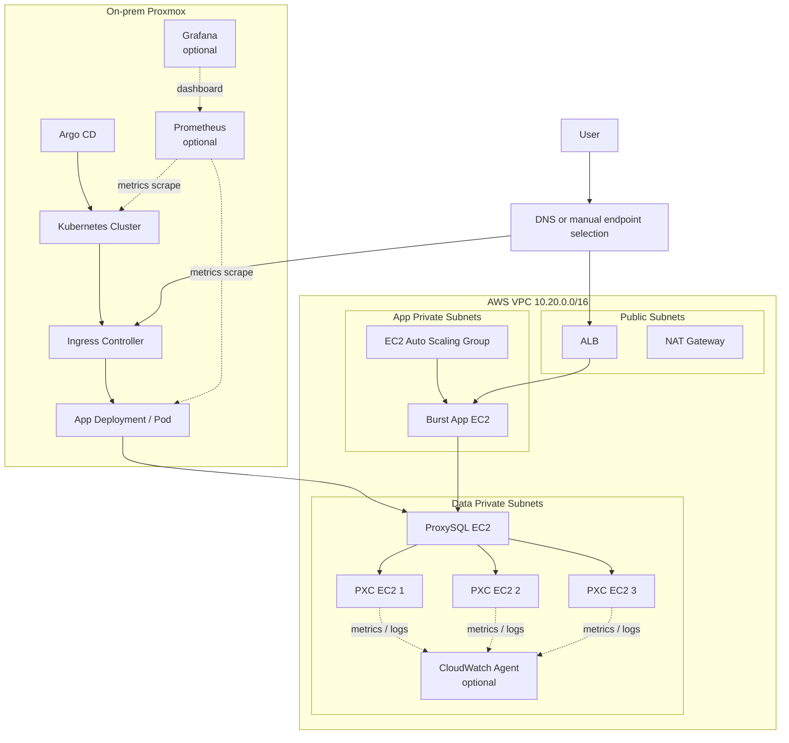

# 01 Cloud / Network / IaC 상세 구현

담당: 팀원 2

## 1. 목표

AWS 네트워크와 인프라 골격을 Terraform으로 구성함. 앱 실행 영역과 데이터 영역을 분리하고, DB EC2가
인터넷에 노출되지 않도록 내부망 접근 경계를 만듦.

## 2. 구현 범위

- VPC `10.20.0.0/16`
- Public Subnet 2개
- App Private Subnet 2개
- Data Private Subnet 3개
- Internet Gateway
- NAT Gateway 1개
- Public/Private Route Table
- ALB, Target Group, Listener
- ALB/AWS burst app/ProxySQL/PXC Security Group
- 선택: ProxySQL Internal NLB
- DB용 EC2 골격
- SSM Session Manager용 EC2 IAM Role

## 3. 네트워크 설계



설명:

- 온프레미스 Kubernetes가 기본 앱 실행 경로임
- Argo CD는 Git 저장소의 manifest를 온프레미스 Kubernetes에 동기화함
- AWS VPC는 부하 증가 시 사용할 burst 영역과 DB 계층을 포함함
- AWS burst 앱 EC2는 ALB Target Group 뒤에 배치함
- ProxySQL/PXC는 Data Private Subnet에만 배치하고 Public IP를 부여하지 않음
- Prometheus/Grafana는 온프레미스 Kubernetes와 Ceph 지표를 볼 때 추가하는 선택 관측성임
- CloudWatch Agent는 EC2 기반 PXC/ProxySQL 로그와 지표를 AWS CloudWatch로 보낼 때 사용함
- ECS Fargate는 현재 MVP 경로가 아니라 AWS-only 비교안임

## 4. 세부 구현

### 4.1 Subnet

- Public Subnet은 ALB와 NAT Gateway만 배치
- App Private Subnet은 AWS burst 앱 EC2 배치
- Data Private Subnet은 ProxySQL/PXC EC2 배치
- Data Private Subnet은 가능하면 3개 AZ에 분산

### 4.2 Security Group

| SG               | Inbound                                               | Outbound                     |
| :--------------- | :---------------------------------------------------- | :--------------------------- |
| ALB SG           | `80/443` from Internet                                | App Port to AWS burst app SG |
| AWS burst app SG | App Port from ALB SG                                  | `6033` to ProxySQL SG, `443` |
| ProxySQL SG      | `6033` from app SG or allowed on-prem CIDR            | `3306` to PXC SG, `443`      |
| PXC SG           | `3306` from ProxySQL SG, `4567/4568/4444` from PXC SG | Galera self traffic, `443`   |
| ProxySQL NLB SG  | `6033` from app SG or allowed on-prem CIDR            | `6033` to ProxySQL SG        |

### 4.3 DB EC2 골격

Cloud/Network/IaC 담당은 EC2 인스턴스 생성과 네트워크 배치까지만 책임짐.

- Public IP 비활성화
- Data Private Subnet 배치
- SSM Role 연결
- EBS 암호화
- PXC/ProxySQL 설치는 DB 담당에게 인계

### 4.4 ProxySQL Internal NLB 선택 구성

기본 MVP는 ProxySQL 1대에 앱이 직접 접근하는 구조임. 일정 여유가 있어 이중화를 적용하면 Terraform
변수로 다음을 설정함.

```hcl
proxysql_count                 = 2
enable_proxysql_internal_nlb   = true
```

이 경우 앱 담당자에게 개별 ProxySQL private IP가 아니라 `proxysql_internal_nlb_dns_name` 출력값을
전달함. NLB 모드에서는 app SG가 ProxySQL SG로 직접 나가는 규칙 대신 ProxySQL NLB SG로만 나가도록
Terraform이 전환됨.

## 5. 완료 기준

- [ ] Terraform `plan`에서 Public/App/Data Subnet 구분 확인
- [ ] DB EC2와 ProxySQL EC2에 Public IP 없음
- [ ] `0.0.0.0/0`에 DB 포트가 열려 있지 않음
- [ ] AWS burst app SG → ProxySQL SG → PXC SG 흐름이 SG 참조 기반임
- [ ] SSM Session Manager 접근 가능

## 6. 인계 자료

- Terraform output
- ALB DNS
- ProxySQL private IP 목록 또는 Internal NLB DNS
- PXC node private IP 목록
- Security Group 규칙 캡처
- `terraform plan` 결과 요약
