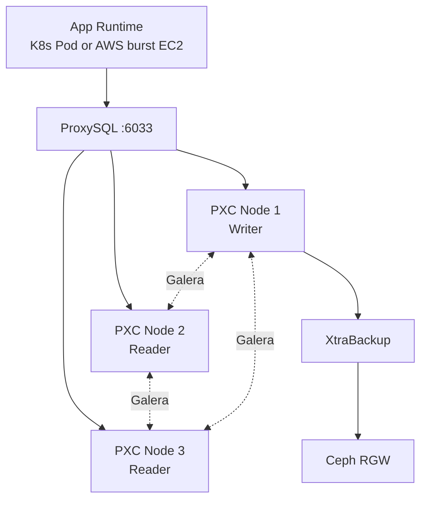

# 02 DB / Storage 상세 구현

담당: 팀원 3

## 1. 목표

AWS RDS를 사용하지 않고 EC2 기반 Percona XtraDB Cluster와 ProxySQL을 구성함. 백업은 Percona
XtraBackup으로 수행하고 Ceph RGW에 저장함.

## 2. 구현 범위

- PXC 3노드 구성
- ProxySQL 1대 기본 구성
- 일정 여유 시 ProxySQL 2대 + Internal NLB 구성
- Single Writer 운영 기준 수립
- DB 계정/권한 생성
- Percona XtraBackup 백업
- Ceph RGW 업로드
- DB 장애 시나리오 작성

## 3. 구성도

## 4. 세부 구현

### 4.1 PXC

- 3노드 구성
- `wsrep_cluster_status = Primary` 확인
- `wsrep_cluster_size = 3` 확인
- Multi-Primary보다 Single Writer 기준으로 운영

### 4.2 ProxySQL

- 앱은 ProxySQL `6033`으로만 DB 접근
- Writer hostgroup과 Reader hostgroup 분리
- 장애 노드 제외 여부 확인
- Admin 포트 `6032`는 SSM/Bastion에서만 접근

#### ProxySQL 1대 MVP 기준

ProxySQL 1대는 운영 권장 구조가 아니라 13일 구축 일정의 MVP 기준임. DB 담당자는 먼저 다음 상태를
완료해야 함.

- 앱이 DB 노드가 아닌 ProxySQL endpoint로 접속
- ProxySQL이 Writer/Reader hostgroup을 구분
- PXC 노드 1대 장애 시 backend 제외 또는 장애 범위를 설명 가능
- ProxySQL Admin 포트가 외부에 노출되지 않음

#### ProxySQL 이중화 전환 기준

Day 8까지 PXC, ProxySQL, 앱 연결, Ceph 백업이 안정화되면 다음 확장을 적용함.

- Terraform `proxysql_count = 2`
- Terraform `enable_proxysql_internal_nlb = true`
- 앱 `DB_HOST`는 개별 ProxySQL private IP가 아니라 Internal NLB DNS 사용
- 두 ProxySQL 인스턴스의 `mysql_servers`, `mysql_users`, `mysql_query_rules` 설정 일치 확인
- Internal NLB Target Group에서 두 ProxySQL 인스턴스가 healthy인지 확인

주의할 점:

- ProxySQL 2대만 만들고 단일 엔드포인트를 만들지 않으면 앱 설정과 장애 전환이 복잡해짐
- Internal NLB는 TCP 연결 가능 여부를 확인하지만, PXC backend 라우팅 정상 여부까지 보장하지 않음
- ProxySQL 설정 변경 후 `LOAD ... TO RUNTIME`, `SAVE ... TO DISK`를 누락하면 재시작 후 설정이 사라질
  수 있음

### 4.3 백업

- Percona XtraBackup 실행
- 압축 파일 생성
- 체크섬 생성
- Ceph RGW bucket 업로드
- 가능하면 복구 리허설 수행

## 5. 완료 기준

- [ ] PXC 3노드가 `Synced` 상태
- [ ] 앱이 DB 노드가 아닌 ProxySQL endpoint로 접속
- [ ] PXC 노드 1대 장애 시 장애 범위 설명 가능
- [ ] ProxySQL 1대 MVP의 단일 장애점과 2대 + Internal NLB 확장안을 설명 가능
- [ ] XtraBackup 파일과 체크섬이 Ceph RGW에 저장됨
- [ ] DB 비밀번호와 Ceph RGW key가 저장소에 없음

## 6. 인계 자료

- ProxySQL endpoint
- 앱 DB 접속용 user/password 전달 방식
- PXC 상태 확인 명령 결과
- 백업 파일 경로
- Ceph RGW bucket 경로
- 장애/복구 절차
