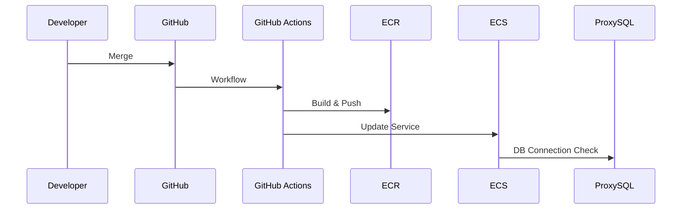

# 03 CI/CD / App Runtime 상세 구현

담당: 팀원 4

## 1. 목표

애플리케이션 이미지를 자동으로 빌드하고 ECR에 업로드한 뒤 ECS Fargate로 배포함. 앱은 ProxySQL
endpoint를 통해 DB에 연결함.

## 2. 구현 범위

- Dockerfile 검증
- ECR Repository 사용
- GitHub Actions OIDC 인증
- ECS Task Definition 갱신
- ECS Service 배포
- Secrets Manager 기반 앱 환경변수 주입
- 앱-DB 연결 확인
- 롤백 Runbook 작성

## 3. 배포 흐름

## 4. 세부 구현

### 4.1 GitHub Actions

- `AWS_DEPLOY_ROLE_ARN` Secret 사용
- 장기 Access Key 미사용
- 이미지 태그는 `github.sha`와 `latest` 병행
- 배포 안정성 확인을 위해 `wait-for-service-stability` 사용

### 4.2 ECS

- App Private Subnet 배치
- Public IP 비활성화
- ALB Target Group 연결
- Deployment Circuit Breaker 활성화
- CloudWatch Logs 연결

### 4.3 앱-DB 연결

- `DB_HOST`: ProxySQL endpoint
- `DB_PORT`: `6033`
- `DB_USER`: 앱 전용 계정
- `DB_PASSWORD`: Secrets Manager에서 주입
- 앱은 PXC 노드 IP를 직접 알지 않음

## 5. 완료 기준

- [ ] GitHub Actions로 ECR Push 성공
- [ ] ECS Service 배포 성공
- [ ] ALB Health Check 정상
- [ ] 앱 컨테이너에서 ProxySQL endpoint 접속 성공
- [ ] 배포 실패 롤백 절차 문서화

## 6. 인계 자료

- Workflow 실행 캡처
- ECR 이미지 태그
- ECS Service deployment 상태
- 앱 환경변수/Secret 목록
- 롤백 명령
