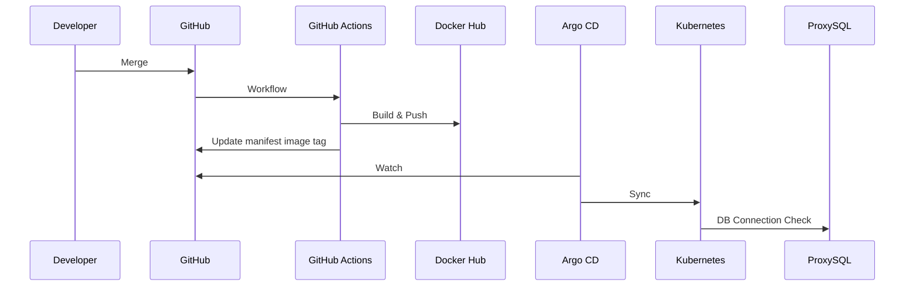

# 03 CI/CD / App Runtime 상세 구현

담당: 팀원 4

## 1. 목표

애플리케이션 이미지를 자동으로 빌드하고 Docker Hub에 업로드한 뒤 Argo CD 기반 GitOps로 온프레미스
Kubernetes에 배포함. 앱-DB 연결에 필요한 Secret/환경변수 설정을 제공하고, 연결 검증은 Observability
/ Integration / Demo 담당과 공동 수행함.

## 2. 구현 범위

- Dockerfile 검증
- Docker Hub Repository 사용
- GitHub Actions Secret 기반 Docker Hub 인증
- Kubernetes manifest 또는 Helm chart 관리
- Argo CD Application 구성
- Argo CD sync 기반 Kubernetes 배포
- AWS burst ASG refresh workflow는 수동 실행으로 분리
- Kubernetes Secret 기반 앱 환경변수 주입
- 앱-DB 연결에 필요한 설정값 전달 및 검증 지원
- 롤백 Runbook 작성

## 3. 배포 흐름

## 4. 세부 구현

### 4.1 GitHub Actions

- `DOCKERHUB_USERNAME`, `DOCKERHUB_TOKEN` Secret 사용
- AWS burst ASG refresh에도 장기 AWS Access Key 미사용
- 이미지 태그는 `github.sha`와 `latest` 병행
- manifest image tag 갱신 PR 또는 commit 생성

### 4.2 Argo CD

- 온프레미스 Kubernetes 클러스터에 설치
- Application은 저장소의 `k8s/` 또는 Helm chart 경로 추적
- MVP는 수동 sync 또는 auto-sync 중 하나 선택
- 발표 안정화 기간에는 수동 sync 우선

### 4.3 AWS burst ASG refresh

- Terraform output `app_autoscaling_group_name` 확인
- `app_image` 값과 Docker Hub 태그 일치 확인
- `Refresh AWS Burst ASG` workflow 수동 실행
- ALB Target Group Health 확인
- 비용 보호를 위해 자동 refresh는 선택 확장으로 유지

### 4.4 앱-DB 연결 설정 지원

- `DB_HOST`: ProxySQL endpoint
- `DB_PORT`: `6033`
- `DB_USER`: 앱 전용 계정
- `DB_PASSWORD`: Kubernetes Secret 또는 선택 확장 Secrets Manager에서 주입
- 앱은 PXC 노드 IP를 직접 알지 않음
- 웹 서버 기동/접속 및 DB 연결 최종 검증 주체는 Observability / Integration / Demo 담당임

## 5. 완료 기준

- [ ] GitHub Actions로 Docker Hub Push 성공
- [ ] Argo CD Application sync 성공
- [ ] Kubernetes Deployment rollout 성공
- [ ] ALB Health Check 정상
- [ ] 앱 컨테이너에서 ProxySQL endpoint 접속 설정 준비 완료
- [ ] 배포 실패 롤백 절차 문서화

## 6. 인계 자료

- Workflow 실행 캡처
- Docker Hub 이미지 태그
- Argo CD Application 상태
- Kubernetes rollout 상태
- 앱 환경변수/Secret 목록
- 롤백 명령
