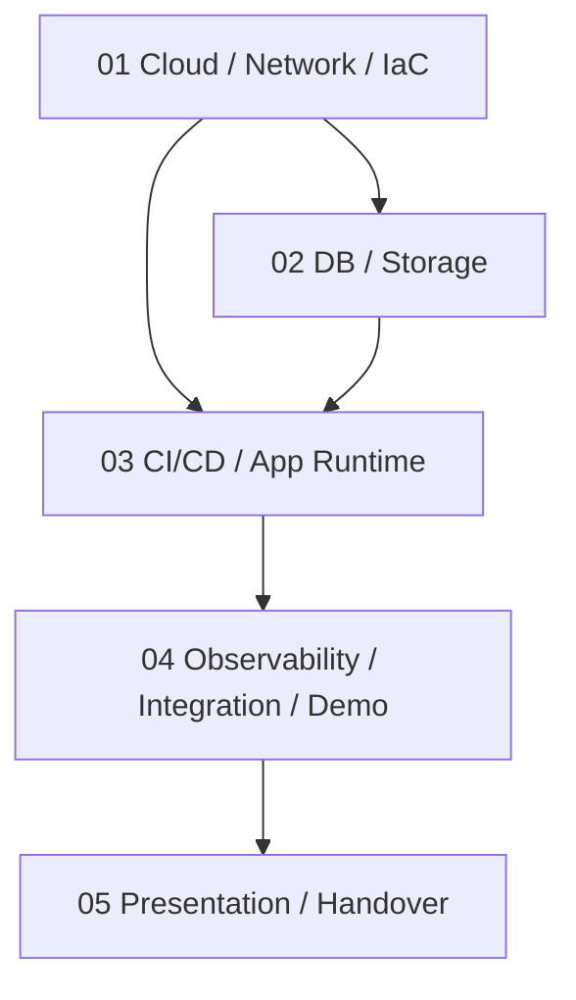

# Build-up Guide

13일 시스템 구축 + 3일 발표 준비를 위한 역할 기반 상세 구현 가이드

> 전환 안내(2026-05-09 ~ 2026-05-16): 아키텍처 조회 경로를 Level 0/1/2로 분리 중임.
>
> - 통합(Level 0): [docs/01_architecture.md](../../01_architecture.md)
> - 상세(Level 1/2): [docs/architecture/details](../details/network_and_lb.md)
>
> 본 Build-up 문서는 **역할별 구현 절차 정본**으로 계속 유지함.

---

## 1. Build-up 구조

## 2. 문서 목록

| 단계 | 담당                               | 설계/범위 문서                                               | 구현 절차 문서                                                                             | 목표                                                           |
| :--- | :--------------------------------- | :----------------------------------------------------------- | :----------------------------------------------------------------------------------------- | :------------------------------------------------------------- |
| 01   | Cloud / Network / IaC              | [01_network_iac.md](./01_network_iac.md)                     | [01_network_iac_implementation.md](./01_network_iac_implementation.md)                     | VPC, ALB, EC2 ASG, WAF, App/Data Private Subnet, DB용 EC2 골격 |
| 02   | DB / Storage                       | [02_db_storage.md](./02_db_storage.md)                       | [02_db_storage_implementation.md](./02_db_storage_implementation.md)                       | PXC, ProxySQL, XtraBackup, Ceph RGW                            |
| 03   | CI/CD / App Runtime                | [03_cicd_app_runtime.md](./03_cicd_app_runtime.md)           | [03_cicd_app_runtime_implementation.md](./03_cicd_app_runtime_implementation.md)           | GitHub Actions, Docker Hub, Argo CD, K8s manifest, 앱-DB 연결  |
| 04   | Observability / Integration / Demo | [04_observability_demo.md](./04_observability_demo.md)       | [04_observability_demo_implementation.md](./04_observability_demo_implementation.md)       | Prometheus/Grafana 또는 CloudWatch, 장애 시나리오, Runbook     |
| 05   | Presentation / Handover            | [05_presentation_handover.md](./05_presentation_handover.md) | [05_presentation_handover_implementation.md](./05_presentation_handover_implementation.md) | 발표 자료, Q&A, 비용 정리, 리소스 정리                         |

## 3. 공통 원칙

- DB와 ProxySQL은 Data Private Subnet에만 배치함
- DB 관련 포트는 인터넷에 열지 않음
- Terraform `apply`는 담당자 1명만 수행함
- 콘솔 수작업이 발생하면 Runbook에 반영함
- Day 14부터 신규 기능 추가 금지
