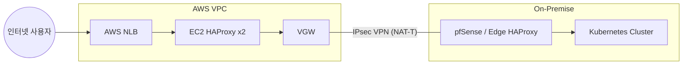

# AWS 하이브리드 연결 구현 가이드 (CLI)

> **목적**: AWS CLI를 사용하여 VPC, VPN, NLB, EC2 등 하이브리드 인프라를 구축합니다. **대상 독자**:
> 인프라 자동화 담당자, AWS CLI 익숙자 **실행 위치**: AWS CLI가 설정된 운영자 단말 (Local,
> CloudShell)

---

## 1. 아키텍처 흐름도



---

## 2. 사전 정의 및 환경 변수

구축에 필요한 공통 변수를 먼저 선언합니다.

```bash
export AWS_REGION=ap-northeast-2
export VPC_CIDR=10.20.0.0/16
export ONPREM_CIDR=172.16.0.0/12
export ADMIN_IP=$(curl -s https://ifconfig.me/ip)/32
export ONPREM_PUBLIC_IP=125.131.208.229
```

---

## 3. Phase 1: AWS 네트워크 및 EC2 구축

### 3.1 VPC 및 서브넷 생성

```bash
# VPC 생성
VPC_ID=$(aws ec2 create-vpc --cidr-block ${VPC_CIDR} --query 'Vpc.VpcId' --output text)

# Public Subnet (AZ 2a, 2c)
SUBNET_A=$(aws ec2 create-subnet --vpc-id ${VPC_ID} --cidr-block 10.20.1.0/24 --availability-zone ap-northeast-2a --query 'Subnet.SubnetId' --output text)
SUBNET_C=$(aws ec2 create-subnet --vpc-id ${VPC_ID} --cidr-block 10.20.2.0/24 --availability-zone ap-northeast-2c --query 'Subnet.SubnetId' --output text)
```

### 3.2 Security Group 및 EC2

```bash
# SG 생성
SG_ID=$(aws ec2 create-security-group --group-name kosa-sg-hybrid --description "Hybrid Edge SG" --vpc-id ${VPC_ID} --query 'GroupId' --output text)

# 인바운드 허용 (SSH, HTTPS, ICMP)
aws ec2 authorize-security-group-ingress --group-id ${SG_ID} --protocol tcp --port 22 --cidr ${ADMIN_IP}
aws ec2 authorize-security-group-ingress --group-id ${SG_ID} --protocol tcp --port 443 --cidr 0.0.0.0/0
aws ec2 authorize-security-group-ingress --group-id ${SG_ID} --protocol icmp --port -1 --cidr ${ONPREM_CIDR}
```

---

## 4. Phase 2: Site-to-Site VPN 구축

### 4.1 CGW 및 VGW 생성

```bash
# CGW 생성 (온프레미스 공인 IP)
CGW_ID=$(aws ec2 create-customer-gateway --type ipsec.1 --public-ip ${ONPREM_PUBLIC_IP} --bgp-asn 65000 --query 'CustomerGateway.CustomerGatewayId' --output text)

# VGW 생성 및 VPC Attach
VGW_ID=$(aws ec2 create-vpn-gateway --type ipsec.1 --query 'VpnGateway.VpnGatewayId' --output text)
aws ec2 attach-vpn-gateway --vpn-gateway-id ${VGW_ID} --vpc-id ${VPC_ID}
```

### 4.2 VPN Connection 생성 (Static)

```bash
VPN_ID=$(aws ec2 create-vpn-connection --type ipsec.1 --customer-gateway-id ${CGW_ID} --vpn-gateway-id ${VGW_ID} --options StaticRoutesOnly=true --query 'VpnConnection.VpnConnectionId' --output text)

# 온프레미스 라우팅 등록
aws ec2 create-vpn-connection-route --vpn-connection-id ${VPN_ID} --destination-cidr-block ${ONPREM_CIDR}
```

### 4.3 Route Propagation 활성화

**중요**: 이 단계를 수행해야 VPC 라우팅 테이블에 온프레미스 경로가 자동 등록됩니다.

```bash
RTB_ID=$(aws ec2 describe-route-tables --filters Name=vpc-id,Values=${VPC_ID} --query 'RouteTables[0].RouteTableId' --output text)
aws ec2 enable-vgw-route-propagation --route-table-id ${RTB_ID} --gateway-id ${VGW_ID}
```

---

## 5. 검증 및 상태 확인

### 5.1 VPN 터널 상태

```bash
aws ec2 describe-vpn-connections --vpn-connection-ids ${VPN_ID} \
  --query 'VpnConnections[0].VgwTelemetry[*].[OutsideIpAddress,Status,StatusMessage]' --output table
```

### 5.2 양방향 Ping 테스트

pfSense 설정(NAT Bypass) 완료 후 실행합니다.

```bash
# EC2 내부에서 온프레미스 Bastion으로
ping 172.16.24.10
```

---

[사전 준비 체크리스트](./aws-nlb-ec2-vpn-onprem-prerequisites.md) |
[콘솔 가이드](./aws-nlb-ec2-vpn-onprem-haproxyedge-console.md)
