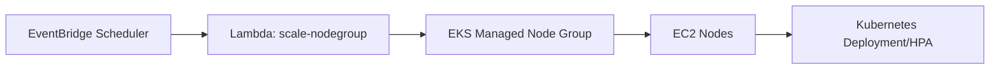

# EKS Cloud Bursting (Karpenter 미사용) A to Z

> Status: Unverified

> 목적: **EventBridge Scheduler + Lambda + EKS Managed Node Group(MNG/ASG)** 만으로 예약형 burst
> 트래픽을 대응하는 구현 절차를 정리함.

---

## 1. 이 방식이 맞는 경우 (Karpenter 미사용 기준)

아래 조건이면 Karpenter 없이도 운영 가능함.

- 피크 시간/규모를 사전에 예측 가능(예: 티켓팅 30분 전)
- 노드 타입/노드풀 구성이 단순함(1~2개 MNG)
- 운영 복잡도(추가 CRD, NodePool, 권한)를 줄이고 싶음
- 초과 피크에 대해 “즉시 무제한 확장”보다 “사전 확보 용량” 전략이 우선임

> 단, 예측을 크게 벗어나는 피크가 자주 발생하면 Karpenter 도입 검토가 필요함.

---

## 2. 아키텍처



- Scale-out 스케줄: 이벤트 30분 전
- Scale-in 스케줄: 이벤트 종료 후

---

## 3. 실행 위치와 사전 설치

## 3.1 실행 위치

- 권장: **AWS CloudShell** (AWS CLI 기본 제공)
- 대안: 로컬 PC(Windows/Linux/macOS)

## 3.2 필수 도구

- AWS CLI v2
- kubectl
- eksctl
- jq

## 3.3 설치 방법

### (A) AWS CloudShell

- `aws`, `kubectl`, `jq`는 대부분 기본 제공
- `eksctl`만 없으면 설치:

```bash
curl -sL "https://github.com/eksctl-io/eksctl/releases/latest/download/eksctl_$(uname -s)_amd64.tar.gz" | tar xz -C /tmp
sudo mv /tmp/eksctl /usr/local/bin
eksctl version
```

### (B) Windows (로컬)

```powershell
winget install --id Amazon.AWSCLI -e
winget install --id Kubernetes.kubectl -e
winget install --id MikeFarah.yq -e
```

`eksctl`:

```powershell
choco install eksctl -y
```

### (C) Linux (Ubuntu 예시)

```bash
sudo apt-get update
sudo apt-get install -y unzip curl jq
curl "https://awscli.amazonaws.com/awscli-exe-linux-x86_64.zip" -o "awscliv2.zip"
unzip awscliv2.zip
sudo ./aws/install
curl -LO "https://dl.k8s.io/release/$(curl -L -s https://dl.k8s.io/release/stable.txt)/bin/linux/amd64/kubectl"
chmod +x kubectl && sudo mv kubectl /usr/local/bin/
curl -sL "https://github.com/eksctl-io/eksctl/releases/latest/download/eksctl_$(uname -s)_amd64.tar.gz" | tar xz -C /tmp
sudo mv /tmp/eksctl /usr/local/bin
```

검증:

```bash
aws --version
kubectl version --client
eksctl version
jq --version
```

---

## 4. IAM/AWS 권한 준비

Lambda 실행 Role에 최소 아래 권한 필요:

- `eks:DescribeNodegroup`
- `eks:UpdateNodegroupConfig`
- `logs:CreateLogGroup`
- `logs:CreateLogStream`
- `logs:PutLogEvents`

운영자(수동 실행자) 권한은 EKS 생성/조회/스케줄 생성/Lambda 배포 가능해야 함.

---

## 5. 클러스터 생성 (MNG 기반)

```bash
export AWS_REGION=ap-northeast-2
export CLUSTER_NAME=ticket-burst-eks
export NODEGROUP_NAME=base-ng

eksctl create cluster \
  --name ${CLUSTER_NAME} \
  --region ${AWS_REGION} \
  --version 1.34 \
  --nodegroup-name ${NODEGROUP_NAME} \
  --node-type m6i.large \
  --nodes 2 \
  --nodes-min 2 \
  --nodes-max 20 \
  --managed
```

kubeconfig 연결:

```bash
aws eks update-kubeconfig --region ${AWS_REGION} --name ${CLUSTER_NAME}
kubectl get nodes
```

---

## 6. 앱/오토스케일 기준 배포

예시 앱:

```yaml
apiVersion: apps/v1
kind: Deployment
metadata:
  name: ticket-api
spec:
  replicas: 4
  selector:
    matchLabels:
      app: ticket-api
  template:
    metadata:
      labels:
        app: ticket-api
    spec:
      containers:
        - name: ticket-api
          image: nginx
          resources:
            requests:
              cpu: "500m"
              memory: "512Mi"
            limits:
              cpu: "1"
              memory: "1Gi"
```

```bash
kubectl apply -f ticket-api.yaml
```

> 권장: HPA를 함께 사용해 Pod 수를 탄력 조절하고, MNG는 노드 용량을 예약으로 받침.

---

## 7. Lambda로 NodeGroup 스케일 조정

## 7.1 Lambda 코드 (`lambda_function.py`)

```python
import json
import boto3

eks = boto3.client("eks")

def lambda_handler(event, context):
    cluster_name = event["clusterName"]
    nodegroup_name = event["nodegroupName"]
    min_size = int(event["minSize"])
    max_size = int(event["maxSize"])
    desired_size = int(event["desiredSize"])

    resp = eks.update_nodegroup_config(
        clusterName=cluster_name,
        nodegroupName=nodegroup_name,
        scalingConfig={
            "minSize": min_size,
            "maxSize": max_size,
            "desiredSize": desired_size
        }
    )

    return {
        "statusCode": 200,
        "body": json.dumps({
            "message": "nodegroup scaling update requested",
            "updateId": resp["update"]["id"]
        })
    }
```

패키징:

```bash
zip function.zip lambda_function.py
```

## 7.2 Lambda 생성

```bash
export ACCOUNT_ID=$(aws sts get-caller-identity --query Account --output text)
export LAMBDA_ROLE_NAME=LambdaEKSScaleRole
export LAMBDA_FUNCTION_NAME=scale-eks-nodegroup
```

Trust policy (`trust-policy.json`):

```json
{
  "Version": "2012-10-17",
  "Statement": [
    {
      "Effect": "Allow",
      "Principal": { "Service": "lambda.amazonaws.com" },
      "Action": "sts:AssumeRole"
    }
  ]
}
```

Role 생성:

```bash
aws iam create-role \
  --role-name ${LAMBDA_ROLE_NAME} \
  --assume-role-policy-document file://trust-policy.json
```

권한 정책 (`lambda-eks-scale-policy.json`):

```json
{
  "Version": "2012-10-17",
  "Statement": [
    {
      "Effect": "Allow",
      "Action": ["eks:DescribeNodegroup", "eks:UpdateNodegroupConfig"],
      "Resource": "*"
    },
    {
      "Effect": "Allow",
      "Action": ["logs:CreateLogGroup", "logs:CreateLogStream", "logs:PutLogEvents"],
      "Resource": "*"
    }
  ]
}
```

```bash
aws iam put-role-policy \
  --role-name ${LAMBDA_ROLE_NAME} \
  --policy-name LambdaEKSScalePolicy \
  --policy-document file://lambda-eks-scale-policy.json
```

Lambda 생성:

```bash
aws lambda create-function \
  --function-name ${LAMBDA_FUNCTION_NAME} \
  --runtime python3.12 \
  --handler lambda_function.lambda_handler \
  --zip-file fileb://function.zip \
  --timeout 30 \
  --role arn:aws:iam::${ACCOUNT_ID}:role/${LAMBDA_ROLE_NAME}
```

---

## 8. EventBridge Scheduler로 예약 실행

## 8.1 Scheduler가 Lambda 호출할 IAM Role

`SchedulerInvokeLambdaRole`은 `lambda:InvokeFunction` 권한 필요.

## 8.2 Scale-out 스케줄 (이벤트 30분 전)

```bash
aws scheduler create-schedule \
  --name ticket-scale-out-before-event \
  --schedule-expression "at(2026-06-01T09:30:00)" \
  --schedule-expression-timezone "Asia/Seoul" \
  --flexible-time-window Mode=OFF \
  --target '{
    "Arn": "arn:aws:lambda:ap-northeast-2:'"${ACCOUNT_ID}"':function:scale-eks-nodegroup",
    "RoleArn": "arn:aws:iam::'"${ACCOUNT_ID}"':role/SchedulerInvokeLambdaRole",
    "Input": "{\"clusterName\":\"ticket-burst-eks\",\"nodegroupName\":\"base-ng\",\"minSize\":10,\"maxSize\":30,\"desiredSize\":20}"
  }'
```

## 8.3 Scale-in 스케줄 (이벤트 종료 후)

```bash
aws scheduler create-schedule \
  --name ticket-scale-in-after-event \
  --schedule-expression "at(2026-06-01T11:00:00)" \
  --schedule-expression-timezone "Asia/Seoul" \
  --flexible-time-window Mode=OFF \
  --target '{
    "Arn": "arn:aws:lambda:ap-northeast-2:'"${ACCOUNT_ID}"':function:scale-eks-nodegroup",
    "RoleArn": "arn:aws:iam::'"${ACCOUNT_ID}"':role/SchedulerInvokeLambdaRole",
    "Input": "{\"clusterName\":\"ticket-burst-eks\",\"nodegroupName\":\"base-ng\",\"minSize\":2,\"maxSize\":20,\"desiredSize\":2}"
  }'
```

---

## 9. 검증 절차

1. Scheduler 수동 트리거(또는 임시 가까운 시각으로 생성)
2. Lambda 로그 확인

```bash
aws logs tail /aws/lambda/scale-eks-nodegroup --follow
```

3. NodeGroup 반영 확인

```bash
aws eks describe-nodegroup \
  --cluster-name ${CLUSTER_NAME} \
  --nodegroup-name ${NODEGROUP_NAME} \
  --query 'nodegroup.scalingConfig'
```

4. Kubernetes 노드 증가 확인

```bash
kubectl get nodes -o wide
```

---

## 10. 실패 시 점검 포인트

- Lambda Role에 `eks:UpdateNodegroupConfig` 누락
- Scheduler Target Role에 `lambda:InvokeFunction` 누락
- NodeGroup `maxSize`가 너무 낮아 desired 반영 불가
- 이벤트 직전 이미지 pull 지연 (사전 워밍 필요)
- DB/백엔드 연결 한계로 앱만 확장되고 처리량 증가가 없는 경우

---

## 11. 운영 권장값 (초기안)

- 평시: `min=2, desired=2, max=20`
- 피크 30분 전: `min=10, desired=20, max=30`
- 종료 후: `min=2, desired=2, max=20`

> 실제 값은 k6 부하 테스트 결과(p95, 5xx, CPU/메모리)로 보정함.

---

## 12. 언제 Karpenter로 전환할지

아래 조건이면 Karpenter 도입 검토:

- 예약치 이상 급등이 빈번함
- 인스턴스 타입 최적화/혼합(Spot+OnDemand)이 중요함
- Pending Pod 대응 속도/유연성이 핵심 요구사항임
