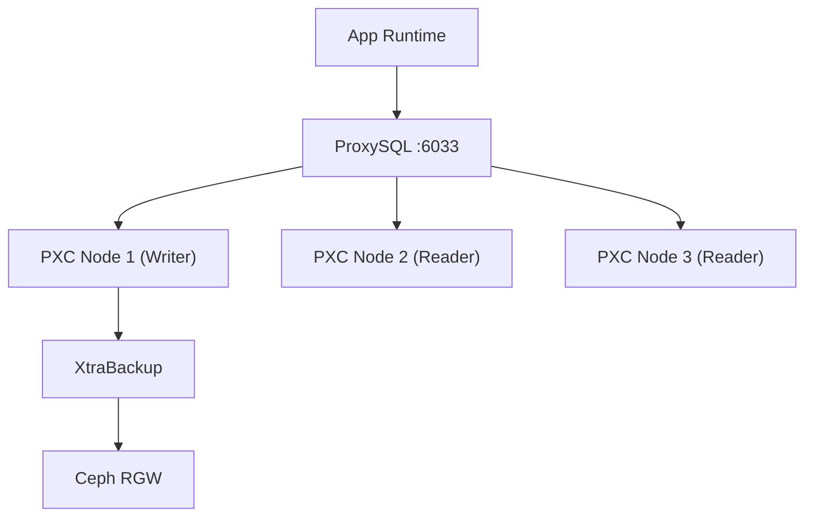

# 아키텍처 상세: Data / Ceph / Observability / Cost

이 문서는 전체 아키텍처 문서의 **Level 1(서브시스템)** 데이터 계층과 관측/비용 기준 상세임.

- Level 0(통합): [01_architecture.md](../../01_architecture.md)
- DB 운영 절차: [runbooks/database_storage.md](../../runbooks/database_storage.md)
- 모니터링 절차: [runbooks/monitoring.md](../../runbooks/monitoring.md)

## 1. 데이터 계층 도표

## 2. 도표 상세 설명

- `App Runtime → ProxySQL`은 앱의 단일 DB 접근 경로를 의미함.
- `ProxySQL → PXC1/2/3`은 쓰기/읽기 분리 라우팅의 대상 노드 집합을 의미함.
- `PXC Node 1(Writer) → XtraBackup`은 백업 기준 노드를 나타내며, 운영 시 Writer 전환 시 백업 기준도
  함께 재확인해야 함.
- `XtraBackup → Ceph RGW`는 백업 산출물을 객체 스토리지로 이관하는 보관 경로를 의미함.

## 3. 운영 포인트

- 앱은 PXC 노드 IP가 아니라 ProxySQL endpoint만 사용함.
- PXC 상태 확인은 `wsrep_cluster_status`, `wsrep_cluster_size`를 기준으로 수행함.
- 백업 파일 업로드 후 체크섬/보존 정책을 Runbook 기준으로 검증함.

## 4. 관측 기준

- ALB: 5xx, Unhealthy Host, Target Response Time
- EC2 ASG: CPU, 인스턴스 수 변화
- PXC: `wsrep_cluster_status`, `wsrep_cluster_size`
- Ceph: OSD 상태, pool 사용량, RGW 오류

## 5. 비용 기준

- NAT/ALB/WAF/EC2는 발표 시연 범위에서 최소 실행
- 로그 보존은 MVP 기준 최소화
- Day 14 이후 신규 기능보다 안정화/정리 우선
