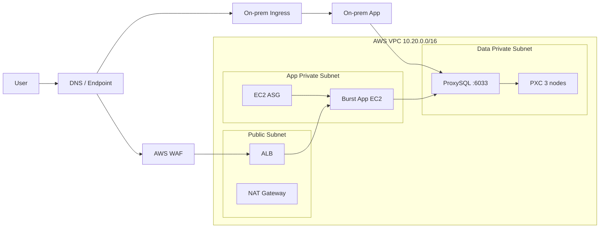

# 아키텍처 상세: Network / Load Balancing

이 문서는 전체 아키텍처 문서의 **Level 1(서브시스템)** 네트워크/진입점 상세임.

- Level 0(통합): [01_architecture.md](../../01_architecture.md)
- 역할별 구현: [Cloud / Network / IaC Build-up](../build-up/01_network_iac.md)

## 1. 경계와 책임

- 외부 진입점은 AWS burst 기준 **WAF + ALB**로 제한
- 온프레미스 앱은 Ingress를 통해 노출
- App Private Subnet(앱)과 Data Private Subnet(DB)을 분리
- ProxySQL/PXC는 Data Private Subnet 전용, Public IP 미부여

## 2. 상세 도표

## 3. 도표 상세 설명

- `User → Traffic`은 사용자 진입 정책(DNS/엔드포인트 선택) 계층임.
- `Traffic → OnPremIngress` 경로는 온프레미스 기본 런타임 진입선임.
- `Traffic → WAF → ALB` 경로는 AWS burst 진입선이며, 외부 공개는 ALB/WAF로 제한함.
- `ALB → BurstEC2`는 ALB Target Group에 등록된 burst 인스턴스만 트래픽을 받는다는 의미임.
- `On-prem App → Proxy`, `BurstEC2 → Proxy`는 두 런타임이 동일한 DB 접근 지점(ProxySQL)을 공유함을
  의미함.
- `Proxy → PXC`는 앱이 DB 노드 직접 접속 없이 프록시 경유로만 접근한다는 운영 경계를 의미함.

## 4. 운영 포인트

- ALB Health Check 실패 시 비정상 EC2는 Target Group에서 제외됨.
- ProxySQL/PXC는 Data Private Subnet 전용이며 Public IP를 부여하지 않음.
- NAT 단일 구성은 비용 우선, AZ별 NAT는 가용성 우선 선택지로 유지함.

## 5. 필수 확인

- DB 포트(`3306`, `4567/4568/4444`)는 `0.0.0.0/0` 금지
- 앱은 PXC 노드 직접 접속 금지, ProxySQL endpoint만 사용
- NAT 1개(비용) vs AZ별 NAT(가용성)는 팀 결정사항으로 유지
