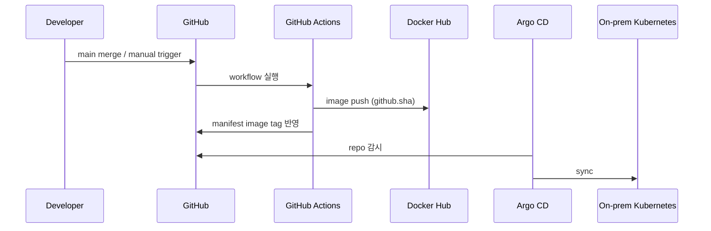

# 아키텍처 상세: Runtime / CI-CD / Security

이 문서는 전체 아키텍처 문서의 **Level 1(서브시스템)** 런타임/배포/보안 상세임.

- Level 0(통합): [01_architecture.md](../../01_architecture.md)
- 역할별 구현: [CI/CD / App Runtime Build-up](../build-up/03_cicd_app_runtime.md)
- 보안 정책: [05_security_policy.md](../../05_security_policy.md)

## 1. 배포 흐름

## 2. 도표 상세 설명

- `Dev → GH`는 코드 변경의 시작 지점이며, 자동/수동 트리거 정책이 이 단계에서 결정됨.
- `GH → GA`는 워크플로우 실행 구간으로, 빌드/태그 정책이 적용되는 구간임.
- `GA → Reg`는 이미지 아티팩트 저장 단계로, `github.sha` 태그를 기준으로 배포 추적성을 확보함.
- `GA → GH(manifest 반영)`은 배포 대상 버전을 Git에 기록해 Argo CD가 감지하도록 만드는 단계임.
- `Argo → GH → K8s`는 GitOps 동기화 경로로, 클러스터 반영 기준은 Git 상태임.

## 3. 보안 경계 요약

- GitHub Actions는 장기 키 대신 OIDC 기반 임시 권한 사용
- AWS burst 외부 진입은 WAF/ALB로 제한
- Secret은 GitHub Secret/Kubernetes Secret 우선
- 앱은 ProxySQL endpoint로만 DB 접속

## 4. 운영 포인트

- 배포 실패 시 이전 image tag 또는 Git revision으로 롤백함.
- Day 14 이후에는 수동 배포 중심으로 발표 안정화함.
- AWS burst refresh는 필요 시 수동 실행하고, 온프레미스 배포 안정화를 우선함.
