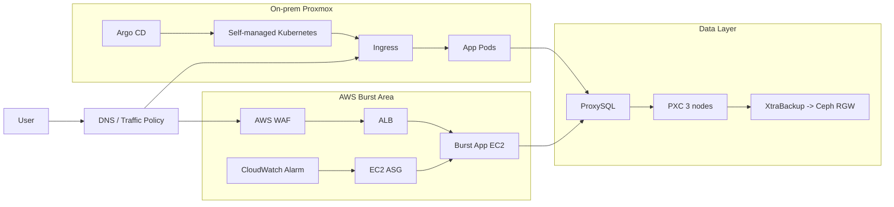

# Overall System Context (전원 필독)

공통 이해를 위한 최소 시스템 컨텍스트 다이어그램.

```mermaid
flowchart LR
    User[User] --> Entry[DNS / Traffic Policy]

    subgraph OnPrem[On-prem Proxmox]
        K8s[Self-managed Kubernetes]
        Ingress[Ingress]
        App[App Pods]
        Argo[Argo CD]
        K8s --> Ingress --> App
        Argo --> K8s
    end

    subgraph AWS[AWS Burst Area]
        WAF[AWS WAF]
        ALB[ALB]
        ASG[EC2 ASG]
        Burst[Burst App EC2]
        CW[CloudWatch Alarm]
        WAF --> ALB --> Burst
        ASG --> Burst
        CW --> ASG
    end

    subgraph Data[Data Layer]
        Proxy[ProxySQL]
        PXC[PXC 3 nodes]
        Backup[XtraBackup -> Ceph RGW]
        Proxy --> PXC --> Backup
    end

    Entry --> Ingress
    Entry --> WAF
    App --> Proxy
    Burst --> Proxy
```

## 핵심 포인트

- 기본 실행 경로는 온프레미스 Kubernetes임.
- AWS는 EC2 ASG/ALB 기반 burst 영역으로 사용함.
- 앱은 DB 노드 직접 접근 대신 ProxySQL endpoint로 접속함.
