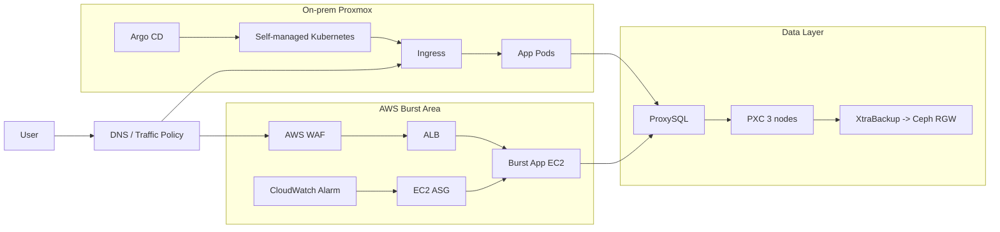

# Overall System Context (전원 필독)

공통 이해를 위한 최소 시스템 컨텍스트 다이어그램.

## 1. 범위와 비범위

- 범위: 온프레미스 기본 실행 경로, AWS burst 경로, DB/백업 핵심 연결.
- 비범위: 세부 포트/ACL, 노드별 VM 배치, 확장 기능(EKS Hybrid/운영 EKS 전환).

## 2. 컴포넌트 역할

| 컴포넌트               | 역할                              |
| :--------------------- | :-------------------------------- |
| On-prem Kubernetes     | 기본 애플리케이션 실행 경로       |
| Argo CD                | Git 선언 상태를 클러스터로 동기화 |
| AWS WAF + ALB          | AWS burst 외부 진입점             |
| EC2 ASG                | 부하 시 burst 인스턴스 자동 조절  |
| ProxySQL               | 앱의 DB 접속 단일 엔드포인트      |
| PXC 3노드              | DB 클러스터 저장/복제             |
| XtraBackup -> Ceph RGW | 백업 생성 및 객체 스토리지 저장   |

## 3. 핵심 흐름

1. 사용자 트래픽은 온프레미스 Ingress 또는 AWS WAF/ALB 경로로 진입.
2. 앱은 DB 노드에 직접 접속하지 않고 ProxySQL endpoint로만 접속.
3. DB 백업은 XtraBackup으로 생성 후 Ceph RGW에 저장.
4. AWS burst 확장은 CloudWatch Alarm 기반으로 ASG가 제어.

## 4. 보안/운영 체크포인트

- 외부 진입점은 온프레미스 Ingress 또는 AWS WAF/ALB로 제한.
- DB/ProxySQL 관리면은 공개망에 직접 노출하지 않음.
- Day14 이후 신규 기능 추가보다 시연 안정화/검증을 우선.

## 5. 연계 문서

- 아키텍처 상세: `docs/01_architecture.md`
- 역할 경계 기준: `docs/03_roles_and_work_packages.md`
- 구현 범위: `docs/04_implementation_scope.md`

## 6. 운영자 체크리스트 (5줄 요약)

- [ ] 온프레미스 Ingress와 AWS ALB/WAF 중 현재 활성 경로를 명확히 확인함.
- [ ] 앱 DB 연결이 ProxySQL endpoint 경유인지 확인함(직접 PXC 접근 금지).
- [ ] DB/ProxySQL 관리면이 인터넷에 직접 노출되지 않았는지 점검함.
- [ ] AWS burst 확장 트리거(CloudWatch Alarm)와 현재 ASG 상태를 확인함.
- [ ] Day14 이후에는 신규 변경보다 캡처/검증 안정화 작업을 우선함.
