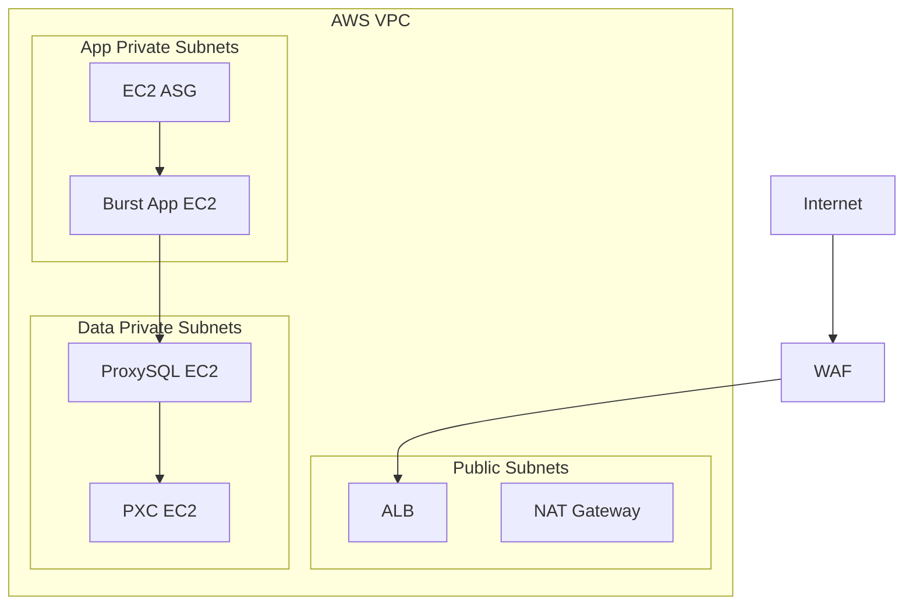

# Cloud / Network / IaC View (역할별 심화)

클라우드 네트워크(AWS)와 IaC 범위 전용 다이어그램.

```mermaid
flowchart TB
    Internet[Internet] --> WAF[WAF]
    WAF --> ALB[ALB]

    subgraph VPC[AWS VPC]
        subgraph Public[Public Subnets]
            ALB
            NAT[NAT Gateway]
        end
        subgraph AppPrivate[App Private Subnets]
            ASG[EC2 ASG]
            Burst[Burst App EC2]
            ASG --> Burst
        end
        subgraph DataPrivate[Data Private Subnets]
            Proxy[ProxySQL EC2]
            PXC[PXC EC2]
        end
    end

    Burst --> Proxy --> PXC
```

## 범위 메모

- 여기서 Network는 AWS VPC/Subnet/Route/SG 경계만 의미함.
- DB 관련 온프레미스 네트워크는 DB/Storage 담당 범위임.
