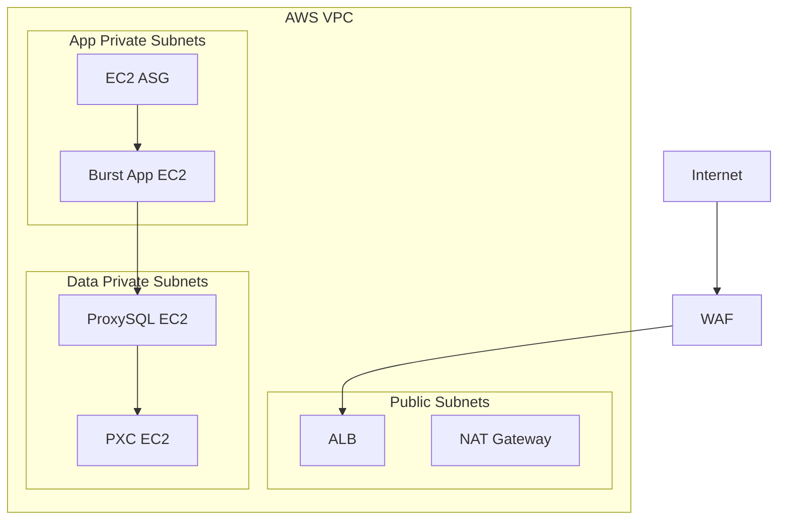

# Cloud / Network / IaC View (역할별 심화)

클라우드 네트워크(AWS)와 IaC 범위 전용 다이어그램.

## 1. 범위와 비범위

- 범위: AWS VPC, Subnet, Route, SG, ALB, ASG, Launch Template, WAF.
- 비범위: 온프레미스 DB 네트워크(pfSense/VLAN), PXC/ProxySQL 소프트웨어 설정 상세.

## 2. 컴포넌트 역할

| 컴포넌트            | 역할                                 |
| :------------------ | :----------------------------------- |
| Public Subnet       | ALB/NAT 배치, 외부 진입/egress 제어  |
| App Private Subnet  | AWS burst 앱 EC2 배치                |
| Data Private Subnet | ProxySQL/PXC 배치, 내부 DB 경계 유지 |
| WAF                 | ALB 앞단 웹 공격 완화                |
| ASG + LT            | burst 인스턴스 생성/교체/스케일      |

## 3. 핵심 트래픽 흐름

1. Internet -> WAF -> ALB -> Burst EC2
2. Burst EC2 -> ProxySQL(`6033`) -> PXC(`3306`)
3. DB/Galera 포트는 내부 경계(SG 참조)에서만 허용

## 4. 보안 경계/운영 체크포인트

- Data Private Subnet 인스턴스는 Public IP 비활성화.
- DB 관련 포트(`3306`, `4567/4568/4444`, `6032`)는 인터넷 공개 금지.
- SG는 CIDR 직접 허용보다 SG 참조를 우선해 최소 권한 유지.
- 비용 상한(NAT/ALB/EC2)과 정리 기준을 함께 관리.

## 5. 선택 확장

- ProxySQL 2대 + Internal NLB
- Route53/ACM HTTPS 고도화
- 운영용 EKS 전환 관련 네트워크 재설계(후속 과제)

## 6. 연계 문서

- `docs/architecture/build-up/01_network_iac.md`
- `docs/runbooks/deployment.md`
- `docs/05_security_policy.md`

## 7. 운영자 체크리스트 (5줄 요약)

- [ ] Data Private Subnet 인스턴스의 Public IP 비활성화 상태를 확인함.
- [ ] ALB/WAF/ASG 관련 SG 규칙이 최소 허용 원칙을 지키는지 점검함.
- [ ] DB/Galera/Admin 포트가 인터넷에 열리지 않았는지 확인함.
- [ ] NAT/ALB/EC2 비용 상한과 정리 기준을 운영 노트에 기록함.
- [ ] 선택 확장(ProxySQL Internal NLB, Route53/ACM)은 MVP와 분리해 관리함.
