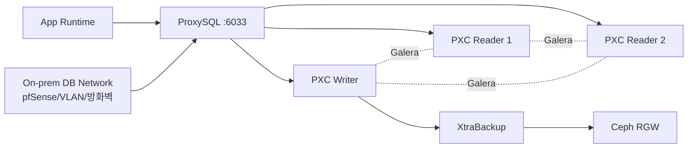

# DB / Storage View (역할별 심화)

DB/Storage 및 DB 관련 온프레미스 네트워크 관점 다이어그램.

```mermaid
flowchart LR
    App[App Runtime] --> Proxy[ProxySQL :6033]
    Proxy --> Writer[PXC Writer]
    Proxy --> Reader1[PXC Reader 1]
    Proxy --> Reader2[PXC Reader 2]

    Writer -. Galera .- Reader1
    Reader1 -. Galera .- Reader2
    Reader2 -. Galera .- Writer

    Writer --> Backup[XtraBackup]
    Backup --> RGW[Ceph RGW]

    OnPremNet[On-prem DB Network\npfSense/VLAN/방화벽] --> Proxy
```

## 범위 메모

- 앱 DB 접속 엔드포인트는 ProxySQL로 단일화함.
- PXC는 Single Writer 운영을 기본으로 함.
- 온프레미스 네트워크 책임은 DB 트래픽 기준으로 한정함.
