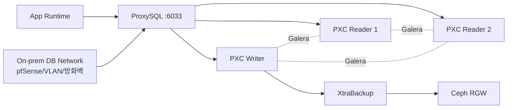

# DB / Storage View (역할별 심화)

DB/Storage 및 DB 관련 온프레미스 네트워크 관점 다이어그램.

## 1. 범위와 비범위

- 범위: ProxySQL, PXC 3노드, 백업 경로(XtraBackup -> RGW), DB 관련 온프레미스 네트워크 경계.
- 비범위: 앱 배포 파이프라인, AWS ALB/ASG 상세, Ceph 클러스터 운영 세부.

## 2. 컴포넌트 역할

| 컴포넌트           | 역할                                         |
| :----------------- | :------------------------------------------- |
| ProxySQL           | 앱 DB 접속 단일 엔드포인트, 읽기/쓰기 라우팅 |
| PXC Writer/Reader  | Single Writer 기준 트랜잭션 처리 + 복제      |
| Galera 링크        | 노드 간 상태 동기화                          |
| XtraBackup         | 백업 산출물 생성                             |
| Ceph RGW           | 백업 객체 저장소                             |
| On-prem DB Network | DB 트래픽 경계, ACL/라우팅/방화벽 적용       |

## 3. 핵심 흐름

1. 앱은 `6033`으로만 ProxySQL 접속.
2. ProxySQL이 Writer/Reader로 쿼리를 분기.
3. PXC는 Galera 복제로 클러스터 정합 유지.
4. 백업은 XtraBackup 생성 후 RGW에 업로드.

## 4. 보안 경계/운영 체크포인트

- 앱에서 PXC 노드 IP 직접 접속 금지.
- ProxySQL Admin(`6032`)은 SSM/Bastion/VPN 경로에서만 허용.
- PXC/Galera 포트는 내부 노드 간 트래픽만 허용.
- 백업 파일 무결성(체크섬)과 복구 리허설 가능성까지 확인.

## 5. 선택 확장

- ProxySQL 2대 + Internal NLB(단일 엔드포인트 구성)
- Ceph 2차 백업(S3 복제) 및 DR 확장

## 6. 연계 문서

- `docs/architecture/build-up/02_db_storage.md`
- `docs/runbooks/database_storage.md`
- `docs/13_ceph_usage_strategy.md`

## 7. 운영자 체크리스트 (5줄 요약)

- [ ] 앱이 ProxySQL(`6033`)로만 접속하고 PXC 직접 접속이 차단됐는지 확인함.
- [ ] PXC `wsrep` 상태와 Writer/Reader 분기 상태를 점검함.
- [ ] ProxySQL Admin(`6032`) 접근 경로가 SSM/Bastion/VPN으로 제한됐는지 확인함.
- [ ] XtraBackup 파일과 체크섬이 Ceph RGW에 업로드됐는지 확인함.
- [ ] ProxySQL 2대+Internal NLB는 선택 확장임을 운영 문서에 명시함.
