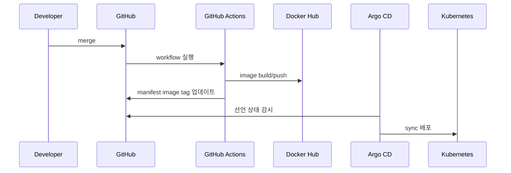

# CI/CD / App Runtime View (역할별 심화)

배포 자동화와 런타임 설정 전달 관점 다이어그램.

## 1. 범위와 비범위

- 범위: 이미지 빌드/태깅, 레지스트리 push, GitOps 동기화, Kubernetes 배포 반영.
- 비범위: DB 내부 라우팅/백업 상세, AWS 네트워크 설계 상세.

## 2. 단계별 의미

| 단계                  | 의미                              |
| :-------------------- | :-------------------------------- |
| merge                 | 배포 트리거 시작점                |
| workflow 실행         | 이미지 빌드/보안검사/태깅         |
| image push            | 실행 가능한 이미지 아티팩트 확보  |
| manifest tag 업데이트 | 선언 상태(Git)와 런타임 버전 연결 |
| Argo sync             | 선언 상태를 클러스터로 반영       |

## 3. 운영 기준

- Argo CD sync 운영은 MVP/발표 준비 기간 모두 **수동** 기준.
- auto-sync 전환은 선택 확장으로만 검토.
- 롤백은 이전 Git revision 또는 이미지 태그로 수행.

## 4. 보안/운영 체크포인트

- 장기 AWS Access Key 저장 금지(OIDC 우선).
- Secret 값은 저장소 커밋 금지, Kubernetes Secret/GitHub Secret 경유.
- 배포 성공 판단은 Argo `Synced/Healthy` + K8s rollout 상태를 함께 확인.

## 5. 연계 문서

- `docs/architecture/build-up/03_cicd_app_runtime.md`
- `docs/runbooks/deployment.md`
- `docs/05_security_policy.md`

## 6. 운영자 체크리스트 (5줄 요약)

- [ ] 이미지 태그(`github.sha`/`latest`)와 manifest 반영 상태를 함께 확인함.
- [ ] Argo CD sync 운영 기준이 수동으로 유지되는지 점검함.
- [ ] 배포 성공 판단은 Argo 상태 + K8s rollout을 동시에 확인함.
- [ ] Secret 값이 저장소에 커밋되지 않았는지 검증함.
- [ ] 롤백 기준(이전 revision/image tag)이 문서와 실제 절차에서 일치하는지 확인함.
