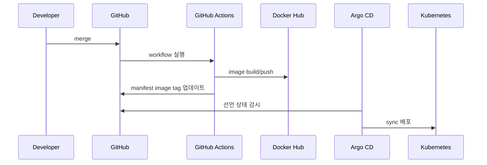

# CI/CD / App Runtime View (역할별 심화)

배포 자동화와 런타임 설정 전달 관점 다이어그램.

```mermaid
sequenceDiagram
    participant Dev as Developer
    participant GH as GitHub
    participant GA as GitHub Actions
    participant DH as Docker Hub
    participant Argo as Argo CD
    participant K8s as Kubernetes

    Dev->>GH: merge
    GH->>GA: workflow 실행
    GA->>DH: image build/push
    GA->>GH: manifest image tag 업데이트
    Argo->>GH: 선언 상태 감시
    Argo->>K8s: sync 배포
```

## 범위 메모

- CI/CD 담당은 배포 파이프라인과 Secret/환경변수 설정 전달을 책임짐.
- 웹 서버 기동/접속 및 앱-DB 연결 최종 검증은 Observability 담당이 주관함.
