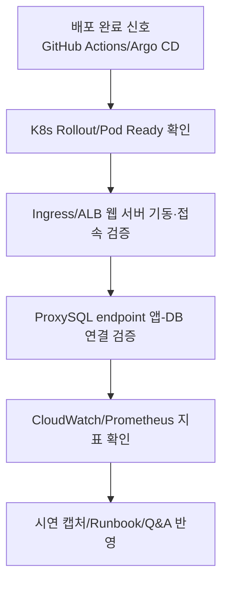

# Observability / Integration / Demo View (역할별 심화)

통합 검증, 웹 서버 접속 확인, 앱-DB 연결 검증 관점 다이어그램.

## 1. 범위와 비범위

- 범위: 배포 후 통합 확인, 웹 서버 접근성, DB 연결 검증, 관측 지표 수집, 시연 증적화.
- 비범위: 개별 IaC 리소스 생성 절차, DB 클러스터 설치 절차 상세.

## 2. 검증 단계 설명

| 단계              | 확인 포인트                                   |
| :---------------- | :-------------------------------------------- |
| K8s 상태 확인     | rollout 성공, pod ready, restart 이상 여부    |
| 웹 서버 접속 검증 | Ingress/ALB endpoint 응답, health check 상태  |
| 앱-DB 연결 검증   | ProxySQL endpoint 기준 연결/쿼리 성공 여부    |
| 지표 확인         | ALB 5xx, UnhealthyHost, EC2 CPU, DB/Ceph 상태 |
| 시연 반영         | 캡처/Runbook/Q&A에 결과 반영                  |

## 3. 운영 기준

- 웹 서버 기동/접속과 앱-DB 연결 최종 검증은 Observability 담당이 주관.
- CI/CD와 DB 담당은 설정값/접속정보/상태결과 제공으로 지원.
- Day14 이후에는 신규 기능보다 캡처/검증 안정화를 우선.

## 4. 실패 시 우선 점검 순서

1. Argo Application 상태(`Synced/Healthy`)
2. K8s rollout/events/logs
3. Ingress/ALB health
4. ProxySQL backend 상태
5. PXC/Ceph 상태 및 최근 변경 이력

## 5. 연계 문서

- `docs/architecture/build-up/04_observability_demo.md`
- `docs/runbooks/monitoring.md`
- `docs/runbooks/deployment.md`
- `docs/runbooks/database_storage.md`

## 6. 운영자 체크리스트 (5줄 요약)

- [ ] Argo `Synced/Healthy`와 K8s rollout 상태를 먼저 확인함.
- [ ] Ingress/ALB endpoint 응답과 health check 결과를 점검함.
- [ ] ProxySQL endpoint 기준 앱-DB 연결 검증 결과를 기록함.
- [ ] ALB 5xx/UnhealthyHost, EC2 CPU, DB/Ceph 지표를 교차 확인함.
- [ ] 시연 캡처/Runbook/Q&A에 검증 결과를 즉시 반영함.
