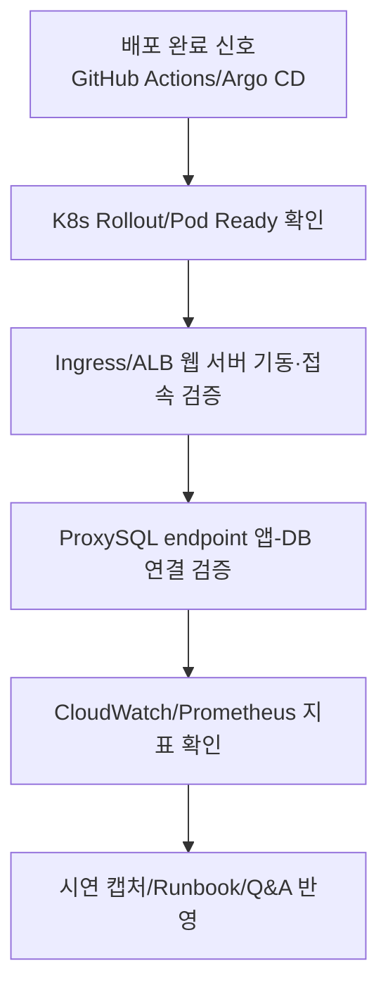

# Observability / Integration / Demo View (역할별 심화)

통합 검증, 웹 서버 접속 확인, 앱-DB 연결 검증 관점 다이어그램.

```mermaid
flowchart TB
    Deploy[배포 완료 신호\nGitHub Actions/Argo CD] --> Check1[K8s Rollout/Pod Ready 확인]
    Check1 --> Check2[Ingress/ALB 웹 서버 기동·접속 검증]
    Check2 --> Check3[ProxySQL endpoint 앱-DB 연결 검증]
    Check3 --> Metrics[CloudWatch/Prometheus 지표 확인]
    Metrics --> Demo[시연 캡처/Runbook/Q&A 반영]
```

## 범위 메모

- 웹 서버 기동/접속 검증과 앱-DB 연결 검증을 주관함.
- DB/Storage와 CI/CD 담당은 접속 정보/설정 전달로 지원함.
