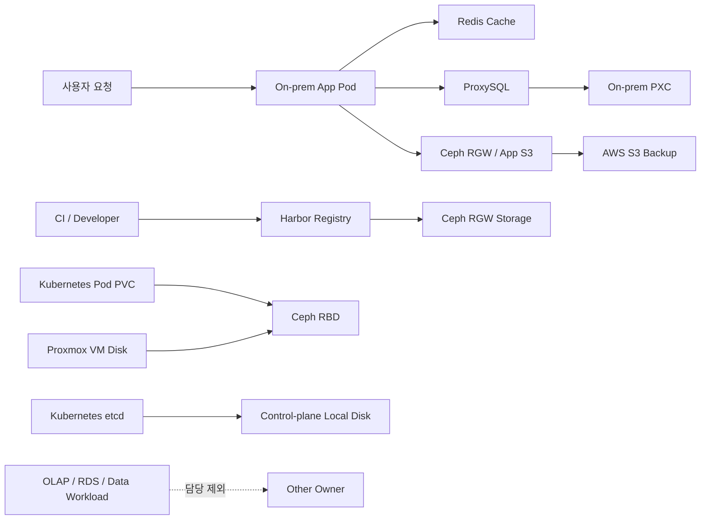
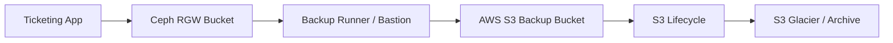

# Ceph On-prem DB Backup Redis 발표 A to Z

> 작성일: 2026-05-22 업데이트: 2026-05-24 목적: Ceph, 온프레미스 DB, 백업 정책, Redis 담당 범위 발표
> 준비 기준: `CLAUDE.md` 재사용 아님, 발표 메시지와 검증 방법 중심 정리

---

## 1. 발표 한 줄 요약

- 공연 기획 회사의 티켓팅 서비스 시나리오 기준 설명
- 사용자 요청 처리 뒤쪽의 저장소/이미지/캐시/백업 계층 설명
- 10G 온프레미스(On-premises) 기반 성능 확보 구조 설명
- Ceph RBD 기반 Kubernetes/Proxmox VM 저장소 설명
- Ceph RGW 기반 Harbor와 앱 자원 S3 연동 설명
- 온프레미스 PXC(Percona XtraDB Cluster)와 ProxySQL 경로 설명
- Redis 캐시(Cache) 기반 온프레 DB 부하 감소와 예매 상태 보조 설명
- Ceph RGW와 AWS S3 기반 정적 자원 백업 구조 설명
- etcd 로컬 디스크 유지 이유와 착오 해결 내용 설명
- AWS RDS Read Replica와 OLAP 분석 워크로드는 담당 범위 제외

---

## 2. 시나리오 전제

- 회사 유형: 공연 기획 회사
- 서비스 유형: 공연/콘서트 티켓팅 서비스
- 트래픽 특성: 예매 오픈 시점 단기 폭증
- 데이터 특성: 공연 포스터, 좌석도, 홍보 이미지, 공연 영상, 첨부 자료 다량 보유
- 기본 운영 위치: 온프레미스 Kubernetes
- AWS cloud bursting: 후속/연계 영역
- 저장소 요구: 이미지/동영상 Object Storage 확장성
- 배포 요구: 온프레 내부 image pull 안정성
- 캐시 요구: 티켓/공연 조회 반복 요청 흡수
- 백업 요구: 정적 자원 삭제/오염/장애 복구
- DB 범위: 온프레미스 PXC/ProxySQL 운영 경로
- 제외 범위: RDS Read Replica, OLAP, 데이터 워크로드 튜닝

발표 핵심:

- "공연 기획 회사는 이미지와 영상 자원이 많고, 티켓팅 시점에는 짧은 시간에 트래픽이 집중됨."
- "내 담당 범위는 온프레 저장소, 온프레 DB 경로, Redis, 백업 계층이며 데이터 워크로드와 AWS DB는
  제외함."

---

## 3. 발표 범위

| 구분        | 발표 대상                               | 핵심 질문                                      |
| :---------- | :-------------------------------------- | :--------------------------------------------- |
| Ceph RBD    | Kubernetes PVC, Proxmox VM 디스크       | 왜 block storage를 Ceph RBD로 묶었는가         |
| Ceph RGW    | Harbor storage, 앱 자원 S3              | 왜 object storage를 Ceph RGW로 두었는가        |
| On-prem DB  | PXC, ProxySQL                           | 왜 앱 DB 접속을 ProxySQL endpoint로 통제하는가 |
| Backup      | 정적 자원, DB 백업 경계, 장기 보관      | 장애 또는 삭제 후 무엇을 어디서 복구하는가     |
| Redis       | 캐시, 대기열, 예매 상태 보조            | 왜 온프레 DB 앞단에 Redis가 필요한가           |
| etcd        | Kubernetes 제어 평면 데이터             | 왜 Ceph가 아니라 로컬 디스크인가               |
| IOPS        | Ceph, RBD, DB 경로, Redis 성능          | 어떤 병목을 줄였고 어떤 한계가 남았는가        |
| 비담당/참고 | RDS Read Replica, OLAP, 데이터 워크로드 | 왜 이번 발표에서 깊게 다루지 않는가            |

---

## 4. 기술 선택과 효용가치

| 기술            | 사용 이유                               | 효용가치                                                       |
| :-------------- | :-------------------------------------- | :------------------------------------------------------------- |
| Ceph RBD        | Kubernetes PVC와 Proxmox VM 디스크 통합 | VM/PVC 이동성, 장애 대응, 저장소 운영 일원화                   |
| Ceph RGW        | Harbor image blob / 앱 Object 저장      | S3 API 호환, 대용량 정적 자원 저장, 온프레 내부 보관           |
| PXC             | 온프레 운영 DB                          | 티켓팅 OLTP 요청 처리, 운영 데이터 primary source              |
| ProxySQL        | 앱 DB 접속 endpoint                     | PXC 직접 접속 방지, writer 경로 통제, connection 관리          |
| AWS S3 Backup   | Ceph RGW 자원 2차 백업                  | 삭제/오염/장애 복구, 장기 보관, lifecycle 적용                 |
| Redis           | 캐시, 대기열, 예매 상태 보조            | 온프레 DB query 감소, connection pressure 감소, 임시 상태 관리 |
| etcd Local Disk | 제어 평면 안정성 우선                   | Ceph 장애와 Kubernetes 제어 평면 장애 분리                     |

---

## 5. 설정 선택 이유

| 설정                      | 대안                         | 현재 선택 이유                                               |
| :------------------------ | :--------------------------- | :----------------------------------------------------------- |
| Ceph RBD for K8s/VM       | 로컬 디스크, NFS             | block volume 성능/격리, VM/PVC 운영 통합                     |
| Ceph RGW for Harbor       | filesystem backend, 외부 S3  | S3 호환 object backend, 온프레 내부 registry storage         |
| Ceph S3 for app resources | DB blob 저장, 로컬 파일 저장 | 이미지/동영상 대용량 자원 분리, 앱 확장성 확보               |
| App -> ProxySQL -> PXC    | PXC 직접 접속                | DB endpoint 통제, writer 경로 관리, connection pressure 완화 |
| Redis 예매 상태 기준점    | PXC 직접 조회, 앱 로컬 상태  | 반복 조회 흡수, 임시 상태 TTL 관리, 온프레 DB 부하 감소      |
| copy-only backup          | sync-delete, 원본 tiering    | 초기 안정성, 삭제 전파 방지, 복구 검증 용이                  |
| etcd local disk           | etcd on Ceph RBD             | 제어 평면과 Ceph 장애 결합 방지                              |

---

## 6. 발표에서 잡아야 할 관점

- 트래픽 외 계층 중심
- 앱 서버보다 저장소/캐시/이미지/백업 계층 중심
- 속도보다 일관성, 복구성, 운영 가능성 중심
- 단일 기능 구현보다 장애 시 설명 가능한 구조 중심
- "Ceph 하나로 모든 데이터 해결" 표현 금지
- "Redis가 DB 대체" 표현 금지
- "ECR 미러링은 백업" 단정 금지
- "Ceph 복제는 백업" 단정 금지
- "10G 연결만으로 HDD 쓰기 성능 보장" 표현 금지
- "RDS/OLAP/데이터 워크로드까지 내 담당"처럼 들리는 표현 금지
- "DB도 Ceph로 다 해결" 표현 금지

---

## 7. 전체 구조



- RBD 저장소 축: Kubernetes PVC, Proxmox VM
- RGW 저장소 축: Harbor, 앱 S3 자원
- 온프레 DB 축: App -> ProxySQL -> PXC
- 정적 자원 백업 축: Ceph RGW -> AWS S3
- 캐시/일관성 축: Redis
- 제어 평면 예외: etcd 로컬 디스크
- 제외 축: RDS Read Replica, OLAP, 데이터 워크로드

---

## 8. 발표 순서

1. 담당 범위 정의
2. 공연 기획 회사 티켓팅 시나리오 설명
3. 기술별 선택 이유와 효용가치 설명
4. 현재 설정 선택 이유 설명
5. Ceph RBD/RGW 사용 구분 설명
6. 10G + HDD 성능 고려사항 설명
7. etcd 로컬 유지 이유 설명
8. 온프레 PXC/ProxySQL 경로 설명
9. 정적 자원 백업 정책 설명
10. Redis 도입 이유와 DB 부하 완화 설명
11. 구현 여부 검증 체크리스트 설명
12. 한계와 후속 과제 설명

---

## 8.5 IOPS/성능 발표 준비용 참조 위치

먼저 볼 곳:

- `9.0 CLAUDE.md 기준 실제 Ceph 구성`: 실제 Ceph 노드, OSD, pool 이름, RGW SPoF
- `9.5 10G 온프레미스 의미`: 10G가 도움 되는 구간
- `9.6 HDD 기반 Ceph 고려사항`: 10G와 HDD write 병목 구분
- `15. IOPS와 인프라 성능 발표 핵심`: 발표 메시지와 실측값 해석
- `25. IOPS 성능 검증`: rados bench, fio, Redis latency 측정 명령

성능 캡처 준비:

- `18.4 10G 네트워크`: `ethtool`, `iperf3`
- `18.5 HDD 쓰기 성능 검증`: `ceph osd perf`, `rados bench`, `fio`
- `21.7 온프레 DB 검증`: ProxySQL/PXC connection, `wsrep_*`, `Threads_connected`
- `23.5 Redis 유무 성능 비교`: Redis hit ratio, DB QPS, p95/p99
- `26. 발표 캡처 목록`: 발표용 화면 캡처 체크리스트

발표 Q&A 준비:

- `28. Q3 Ceph HDD인데 성능 괜찮은가`
- `28. Q9 RAM 추가가 실제로 성능을 올렸는가`
- `30. 현재 발표 리스크`
- `31. 발표 금지 표현`
- `32. 발표 추천 표현`

핵심 해석:

- 네트워크: 10G, iperf3 실측 9.4 Gbps
- Ceph write: RBD 1M seqwrite 35 MB/s
- RADOS random write: 4K randwrite 99 IOPS
- 결론: 네트워크보다 HDD 기반 Ceph write path 병목
- Redis: DB 직접 접근량과 connection pressure 감소 관점
- DB: 온프레 PXC/ProxySQL 경로까지만 설명

---

## 9. Ceph 발표 핵심

### 9.0 `CLAUDE.md` 기준 실제 Ceph 구성

물리 구성:

- Ceph 노드 6대
- 각 노드 1TB HDD 1개
- 총 raw 6TB
- OSD 6개
- OSD backend: BlueStore
- 10GbE Spine-Leaf fabric
- Ceph public/cluster network 연결

실제 pool 이름:

- K8s CSI용 RBD pool: `team2-k8s-pvc-rbd`
- 팀별 RBD pool: `rbd-team1` ~ `rbd-team4`
- RGW backend pool: `default.rgw.*`
- CephFS pool: `cephfs_metadata`, `cephfs_data`

발표 주의:

- 기존 문서의 `team2-rbd-block` 같은 pool 이름은 실제와 다를 수 있음
- 발표 캡처는 `ceph osd pool ls`와 `kubectl get sc -o yaml | grep pool` 기준 사용
- CephFS는 존재하지만 현재 발표 핵심은 RBD/RGW 중심
- RGW endpoint: `http://10.10.10.11:7480`
- RGW는 `ceph1` 단일 daemon 기준으로 기록되어 있어 서비스 SPoF
- 데이터는 Ceph pool replica로 보호되지만 RGW API endpoint는 별도 HA 필요

### 9.1 Ceph 역할

- Ceph: 분산 스토리지
- RBD(RADOS Block Device): VM 디스크, Kubernetes PVC 블록 볼륨
- RGW(RADOS Gateway): S3 호환 Object Storage, Harbor/App 자원 저장
- OSD(Object Storage Daemon): 실제 디스크 저장 담당
- MON(Monitor): 클러스터 맵 합의 담당
- MGR(Manager): 상태 관리와 메트릭 담당

### 9.2 Ceph를 온프레에 모은 이유

- 10G 내부망 활용
- Kubernetes PVC와 Proxmox VM 디스크 통합
- Harbor registry storage 내부화
- 공연 이미지/동영상 S3 자원 내부 보관
- 외부 인터넷 경유 제거
- 스토리지 장애 범위와 복구 절차 통제
- AWS 비용 발생 구간 최소화

### 9.3 공연 기획 회사에서 Ceph S3가 필요한 이유

- 공연 포스터 이미지 다량 저장
- 좌석도/배치도 이미지 저장
- 홍보 영상과 썸네일 저장
- 이벤트 페이지 정적 자원 저장
- 티켓팅 상세 페이지의 반복 조회 대상 분리
- DB에 binary 직접 저장 방지
- 앱은 object key만 저장
- S3 API 호환으로 백업/복구/이관 단순화

### 9.4 현재 활용 구조

| Ceph 기능   | 현재 활용               | 설명                           |
| :---------- | :---------------------- | :----------------------------- |
| Ceph RBD    | Kubernetes PVC          | Pod 재생성 후 데이터 유지      |
| Ceph RBD    | Proxmox VM 디스크       | VM 디스크 저장소 통합          |
| Ceph RGW    | Harbor registry storage | Harbor image blob 저장         |
| Ceph RGW/S3 | 앱 정적 자원 연결       | 공연 이미지/동영상 Object 저장 |

### 9.5 10G 온프레미스 의미

- Ceph client traffic 고속 처리
- OSD replication traffic 고속 처리
- Harbor image push/pull 내부망 처리
- 백업 원본 읽기 속도 확보
- AWS 전송 전 원본 저장소 안정화
- 단, HDD 쓰기 성능 자체 보장은 아님

### 9.6 HDD 기반 Ceph 고려사항

- 현재 Ceph OSD 디스크: HDD 기준
- 노드 간 연결: 10G 전송선 기준
- 네트워크 대역폭: 충분할 가능성
- 쓰기 성능 병목: HDD random write, seek latency 확인 필요
- `CLAUDE.md` 기준: 네트워크는 정상, HDD write path 병목
- RBD 1M seqwrite 실측: 35 MB/s
- RADOS 4K randwrite 실측: 99 IOPS
- iperf3 실측: 9.4 Gbps
- 발표 표현: "10G 네트워크 병목은 낮지만, HDD 기반 Ceph 쓰기 성능은 한계가 확인됨"
- 실서비스 전제: hot data, DB성 workload, 고 IOPS 요구 구간은 SSD/NVMe OSD 또는 고성능 디스크 전제
- 현재 발표 전제: 대용량 이미지/동영상 object 중심 workload에 적합성 설명

### 9.7 Ceph RBD/RGW 자동 이중화 개념

결론:

- Ceph RBD 자동 이중화 존재
- Ceph RGW 데이터 자동 이중화 존재
- 단, "파일 복사"가 아니라 Ceph pool, PG(Placement Group), OSD 기반 자동 분산/복제 구조
- replica size 기준 복제본 수 유지
- OSD 장애 시 self-healing으로 다른 OSD에 재복제 수행

RBD 데이터 흐름:

```text
RBD Volume
  -> Ceph Pool
  -> PG
  -> OSD1 / OSD4 / OSD7 ...
```

RGW 데이터 흐름:

```text
Application
  -> RGW endpoint
  -> RGW bucket
  -> Ceph RGW data pool
  -> PG
  -> OSD1 / OSD4 / OSD7 ...
```

replica size = 3 의미:

```text
Object A
├─ OSD1
├─ OSD4
└─ OSD7
```

RBD 이중화 의미:

- Kubernetes PVC 데이터 유지
- Proxmox VM disk 데이터 유지
- 디스크 1개 장애 시 데이터 보존
- 노드 1개 장애 시 replica 배치 조건에 따라 서비스 지속 가능
- `active+clean` 상태 복귀 시 정상 복제 상태 판단

RGW 이중화 의미:

- bucket object 데이터가 Ceph pool에 저장
- RGW object도 pool replica size 정책 적용
- Harbor image blob과 앱 Object 데이터 복제 적용
- RGW endpoint 자체는 별도 HA 구성 필요
- RGW daemon 다중 구성과 LB 연결 시 RGW 서비스 장애 대응 가능

RGW 서비스 HA 구조:

```text
LB / VIP
├─ RGW1
├─ RGW2
└─ RGW3
```

주의:

- Ceph data replica와 RGW service HA 구분
- Ceph replica는 데이터 가용성
- RGW 다중화는 S3 endpoint 가용성
- Ceph replica는 삭제/오염 복구용 백업 아님
- AWS S3 backup은 별도 복구 계층

발표 표현:

- "Ceph는 데이터를 여러 OSD에 자동 복제하여 노드 또는 디스크 장애 상황에서도 데이터 가용성을
  유지함."
- "RBD와 RGW 데이터 모두 Ceph의 분산 스토리지 구조를 기반으로 자동 복제와 self-healing 기능을
  제공함."
- "다만 RGW API endpoint 자체의 가용성은 RGW daemon 다중화와 LB 구성이 별도 필요함."

### 9.8 발표 문장

- "Ceph는 단순 백업 저장소가 아니라 VM 디스크, Pod PVC, Object Storage를 묶는 온프레 저장소 계층임."
- "공연 기획 회사 시나리오에서는 이미지와 동영상 자원이 많기 때문에 Ceph S3가 앱 자원 저장소로
  의미가 큼."
- "10G망은 스토리지 복제, 이미지 pull, 백업 원본 읽기에서 효과가 있지만, HDD 쓰기 성능은 별도 검증
  대상임."
- "Ceph 복제는 디스크/노드 장애 대응이고, 삭제나 오염 복구용 백업과는 별개임."

---

## 10. Ceph 볼륨 매핑

| 대상                   | 현재 저장소               | 이유                            | 검증 기준                        |
| :--------------------- | :------------------------ | :------------------------------ | :------------------------------- |
| Proxmox VM 일반 디스크 | Ceph RBD                  | VM 이동성, 장애 대응            | Proxmox Storage가 RBD 표시       |
| Kubernetes Pod PVC     | Ceph RBD                  | Pod 재생성 후 데이터 유지       | PV의 CSI driver 확인             |
| 앱 업로드 이미지/영상  | Ceph RGW/S3               | S3 API 호환, 앱 코드 단순화     | bucket object 생성 확인          |
| Harbor registry blob   | Ceph RGW                  | 이미지 저장소 내부화            | Harbor push 후 bucket 증가 확인  |
| etcd 데이터            | Control-plane 로컬 디스크 | 제어 평면과 Ceph 장애 결합 방지 | `/var/lib/etcd` local mount 확인 |
| DB 주 데이터           | PXC 설계 기준 확인 필요   | 고 IOPS/저지연 요구             | 실제 VM 디스크 배치 별도 확인    |

---

## 11. etcd 착오와 해결

### 11.1 착오

- "모든 저장소를 Ceph에 올리면 좋다"는 단순화
- Kubernetes etcd까지 Ceph RBD에 둘 가능성 검토
- 제어 평면 장애와 스토리지 장애 결합 위험 간과

### 11.2 문제

- Ceph 장애 시 Kubernetes 제어 평면 영향 확대
- etcd 지연 증가 시 API Server 응답성 저하
- Kubernetes가 Ceph 복구를 조율해야 하는데, etcd가 Ceph에 의존하는 순환 의존 가능성

### 11.3 해결

- etcd 데이터 디렉터리 로컬 디스크 유지
- Ceph 대상에서 etcd 제외
- VM/Pod/Object 저장소와 제어 평면 저장소 분리
- 발표 시 "Ceph 적용 범위와 예외 범위 구분" 강조

### 11.4 발표 문장

- "처음에는 모든 볼륨을 Ceph로 통합하는 관점이 있었지만, etcd는 Kubernetes 제어 평면 핵심 데이터라
  로컬 디스크로 분리함."
- "이 결정은 성능보다 장애 격리와 복구 가능성을 우선한 설계임."

---

## 12. Harbor / RGW 소비자 참고

발표 경계:

- Harbor 자체 운영은 주 담당 아님
- ECR 미러링은 주 담당 아님
- 내 발표에서는 Harbor가 Ceph RGW를 사용하는 소비자라는 점만 연결
- Harbor image blob 저장 위치와 RGW bucket 증가 확인만 Ceph 근거로 활용

### 12.1 Harbor 역할

- Harbor: 사내 자체 컨테이너 이미지 저장소
- 프로젝트별 이미지 관리
- 내부망 image push/pull
- 이미지 취약점 스캔 연계 후보
- Robot account 기반 CI/CD 연동 후보
- Ceph RGW 기반 registry storage 활용

### 12.2 Harbor를 둔 이유

- 외부 registry 의존도 감소
- 온프레 Kubernetes image pull 속도 개선
- 내부 이미지 보관 위치 통제
- 팀별 이미지 권한 관리
- 발표 환경에서 외부 네트워크 장애 영향 감소
- Ceph Object Storage 활용 사례 확보

### 12.3 왜 Ceph RGW backend인가

- 이미지 blob은 object 형태 저장에 적합
- filesystem backend보다 확장/복제 구조 설명 용이
- Harbor와 Ceph S3 활용 사례 직접 연결
- registry storage와 VM/PVC storage 역할 분리
- Harbor는 RGW, K8s/VM은 RBD로 경계 명확화

### 12.4 ECR 미러링 이유(참고/비담당)

- AWS ECR(Elastic Container Registry): AWS 내부 이미지 저장소
- AWS burst app 또는 EKS PoC에서 빠른 image pull 목적
- 온프레 Harbor를 VPN/WAN 경유로 직접 pull하는 지연 제거
- AWS 리전 내부 pull 경로 사용
- Cloud bursting cold start 시간 감소
- 온프레 장애 시 AWS 배포 이미지 확보

### 12.5 Harbor와 ECR 역할 구분

| 항목      | Harbor                      | AWS ECR                        |
| :-------- | :-------------------------- | :----------------------------- |
| 위치      | 온프레미스                  | AWS                            |
| 주 용도   | 내부 이미지 원본 저장       | AWS 실행 환경용 미러           |
| 속도 이점 | 온프레 K8s pull             | AWS burst pull                 |
| 백업 의미 | 원본 registry               | pull 가능 복제본               |
| 한계      | AWS에서 직접 pull 느림 가능 | Harbor metadata 전체 백업 아님 |

### 12.6 발표 문장

- "Harbor는 사내 자체 이미지 저장소이고, ECR은 AWS burst 환경에서 빠르게 pull하기 위한 미러임."
- "Harbor storage는 Ceph RGW를 사용해 Harbor image blob을 object 형태로 내부 보관함."
- "ECR 미러링은 단순 백업보다 배포 속도와 cold start 감소 목적이 큼."
- "Harbor 프로젝트/사용자/정책 같은 metadata 백업은 image mirror와 별도 항목임."

---

## 13. 백업 정책 발표 핵심

### 13.1 백업 대상 구분

| 데이터              | 원본             | 백업/복제 대상         | 정책                   |
| :------------------ | :--------------- | :--------------------- | :--------------------- |
| 공연 이미지/영상    | Ceph RGW/S3      | AWS S3                 | copy-only, key 유지    |
| 정적 자원           | Ceph RGW/S3      | AWS S3                 | 주기 백업, lifecycle   |
| Harbor image        | Harbor           | AWS ECR                | event 기반 replication |
| Harbor metadata     | Harbor DB/config | 별도 백업 필요         | 발표 한계 명시         |
| DB 데이터           | PXC              | XtraBackup/binlog 후보 | 현재 범위 확인 필요    |
| Kubernetes manifest | Git              | Git remote             | GitOps 기준            |
| etcd snapshot       | control-plane    | 별도 안전 저장소 후보  | 현재 범위 확인 필요    |

### 13.2 Ceph S3와 AWS S3 구조



- Ceph RGW: 운영 원본
- AWS S3: 2차 백업
- S3 Lifecycle: 장기 보관 비용 절감
- Glacier: 장기 보관, 즉시 조회 대상 아님
- key 동일성: 복구 단순화 기준

### 13.3 백업 원칙

- 원본 삭제 금지 중심 copy-only
- Ceph object key와 AWS S3 key 동일 유지
- 운영 bucket 직접 덮어쓰기 금지
- 복구 테스트 bucket 또는 prefix 우선
- 백업 credential 저장소 커밋 금지
- Harbor image mirror와 Object 백업 분리
- S3 Lifecycle 운영 bucket 무분별 적용 금지

### 13.4 발표 문장

- "공연 이미지와 동영상 같은 정적 자원은 Ceph RGW에 저장하고, AWS S3로 같은 key 구조를 유지해
  복제함."
- "복구 시 DB의 object_key를 바꾸지 않고 저장 위치만 바꿀 수 있도록 key 동일성을 유지함."
- "이미지는 S3로 중복 백업하기보다 Harbor에서 ECR로 미러링해 AWS 실행 환경의 pull 속도를 확보함."

---

## 14. 온프레 DB와 Redis 발표 핵심

### 14.1 이번 담당 범위

담당:

- Ceph
- 온프레미스 DB
- Backup
- Redis

DB 담당 범위:

- 온프레미스 PXC(Percona XtraDB Cluster)
- 온프레미스 ProxySQL
- 애플리케이션 운영 트랜잭션 경로
- DB 접속 경로, 부하, 연결 수, 장애 격리 설명

비담당 범위:

- AWS RDS Read Replica
- OLAP(Online Analytical Processing) 분석 워크로드
- admin-app 분석 쿼리 설계
- PXC -> RDS external replication
- 데이터 워크로드 튜닝
- EKS/Lambda 기반 cloud bursting trigger

발표 경계:

- "DB는 온프레미스 운영 트랜잭션 경로까지만 설명함."
- "RDS Read Replica와 OLAP 분석 워크로드는 다른 담당 영역으로 분리함."
- "Redis는 온프레 DB 앞단의 부하 완화와 예매 상태 기준점 관점에서 설명함."

### 14.2 온프레 DB 역할

- PXC: 운영 데이터의 primary source
- ProxySQL: 애플리케이션 DB endpoint
- Single Writer 기준 운영 설명
- 앱은 PXC 직접 연결 지양
- 앱은 ProxySQL endpoint 경유
- DB connection pressure 관찰 대상
- OLTP(Online Transaction Processing) 요청 처리 중심

운영 path:

```text
On-prem App
  -> ProxySQL
  -> PXC
```

설명 포인트:

- ProxySQL을 두는 이유: DB endpoint 단순화, writer 경로 통제, connection 관리
- PXC를 두는 이유: 온프레 운영 DB 고가용성 기반
- Redis를 두는 이유: 반복 조회와 임시 상태를 DB 앞단에서 흡수

### 14.3 온프레 DB와 Ceph 경계

- PXC 주 데이터: 고 IOPS, 저지연 요구
- Ceph RBD 사용 여부: 실제 VM 디스크 배치 확인 필요
- 로컬 SSD/NVMe 사용 여부: 별도 확인 필요
- Ceph RBD 사용 시: HDD 기반 latency와 random write IOPS 검증 필수
- 발표 금지: "DB도 Ceph에 올렸으니 자동으로 안전함"
- 발표 기준: DB 디스크 배치와 Ceph RBD 적용 범위 분리 설명

확인 명령 후보:

```bash
mysql -h <PROXYSQL_ENDPOINT> -P 6033 -u <USER> -p -e "SELECT @@hostname;"
mysql -h <PROXYSQL_ENDPOINT> -P 6033 -u <USER> -p -e "SHOW STATUS LIKE 'Threads_connected';"
mysql -h <PROXYSQL_ADMIN> -P 6032 -u <ADMIN_USER> -p -e "SELECT hostgroup_id,hostname,port,status FROM mysql_servers;"
```

### 14.4 DB 백업 경계

- Object backup과 DB backup 분리
- Ceph RGW -> AWS S3 backup: 정적 자원 백업
- PXC backup: XtraBackup, binlog, dump, snapshot 후보
- AWS RDS backup: 발표 담당 제외
- etcd snapshot: control-plane 운영 백업, DB 백업과 별도
- 발표 전 실제 DB backup 구현 여부 확인 필요

발표 문장:

- "정적 자원 백업은 Ceph RGW에서 AWS S3로 보내고, DB 백업은 PXC 기준으로 별도 정책이 필요함."
- "Ceph replica는 DB 백업이 아니고, DB 백업은 트랜잭션 일관성과 복구 시점 기준이 따로 필요함."

### 14.5 데이터 워크로드 제외 범위

- OLTP/OLAP 분리 개념은 참고 설명만 가능
- OLAP 분석 쿼리, admin-app, RDS Read Replica는 담당 외 영역
- 데이터 모델, index, query tuning은 담당 외 영역
- 발표에서 데이터 워크로드 성능을 내 성과로 말하지 않음
- 내 성능 발표는 Ceph I/O, ProxySQL/PXC 연결 경로, Redis hit ratio, backup throughput 중심

### 14.6 Redis 역할

- Redis: 인메모리 데이터 저장소
- DB 앞단 캐시
- 대기열 상태 저장
- 좌석 hold 후보
- rate limit 카운터 후보
- 예매 진행 상태 기준점 후보
- DB 부하 완화 계층
- 온프레 PXC 보호 계층

### 14.7 Redis를 온프레에 둔 이유

- PXC/ProxySQL과 같은 내부망 배치
- 캐시와 DB 간 지연 최소화
- 외부 managed cache 비용 제외
- 10G 내부망 기반 낮은 latency 활용
- 장애 범위와 보안 경계 통제
- 온프레 운영 DB 부하 완화 목적

### 14.8 티켓팅 서비스에서 Redis가 필요한 이유

- 공연 목록 반복 조회 흡수
- 공연 상세/좌석 상태 조회 부하 완화
- 예매 오픈 직후 읽기 트래픽 완충
- 예매 진행 상태, 좌석 hold, 대기열 token 기준점 제공
- DB 직접 접근량 감소
- ProxySQL/PXC connection pressure 감소
- PXC write/read latency 악화 완화

### 14.9 Redis 사용 효과

- 반복 조회 DB query 감소
- 인기 데이터 응답 시간 감소
- DB connection pressure 감소
- 읽기 트래픽 흡수
- 좌석 hold와 대기열 상태 기준점 확보
- TTL(Time To Live) 기반 오래된 상태 자동 만료
- DB 장애 전파 지연 완화 가능성

### 14.10 Redis와 DB 일관성 원칙

- DB: 최종 영속 저장소(Source of Truth)
- Redis: 실시간 임시 상태와 캐시 기준점
- Redis key: 좌석 hold, 예매 진행 상태, 대기열 token, idempotency key
- TTL: 좌석 hold와 임시 예매 상태 자동 만료
- 조회: Redis 확인 후 miss 시 DB 조회
- 저장/수정: DB commit 후 Redis 삭제 또는 갱신
- 삭제: DB delete 후 Redis key 삭제
- stale cache 장기 유지 방지

### 14.11 Redis Sentinel 현재 기준

`CLAUDE.md` 기준:

- Bitnami Helm 기반 Redis
- Sentinel HA 3 nodes
- quorum 2
- 1대 장애 시 failover 가능
- 이전 2 nodes + quorum 2 구성은 SPoF
- ticket-app 대기열 endpoint 동작 확인
- `LPUSH`, `RPOP`, `LLEN` 기반 FIFO 대기열 동작 확인

검증 명령:

```bash
kubectl exec -n redis kosa-redis-node-0 -c sentinel -- \
  redis-cli -p 26379 -a <REDIS_PASSWORD> sentinel get-master-addr-by-name mymaster

kubectl exec -n redis kosa-redis-node-0 -c sentinel -- \
  redis-cli -p 26379 -a <REDIS_PASSWORD> sentinel ckquorum mymaster
```

통과 기준:

- `OK 3 usable Sentinels`
- master 주소 조회 성공
- master Pod 장애 후 다른 node로 failover

### 14.12 Redis 사양 발표 항목

| 항목        | 발표 기준                               |
| :---------- | :-------------------------------------- |
| 구성        | Redis Sentinel 3 nodes                  |
| Quorum      | quorum 2                                |
| CPU         | vCPU 수                                 |
| Memory      | maxmemory, eviction policy              |
| Network     | 온프레 10G망 또는 VM NIC                |
| Persistence | RDB/AOF 사용 여부                       |
| HA          | Sentinel failover                       |
| Security    | requirepass, ACL, 내부망 접근 제한      |
| App env     | `REDIS_URL`, `REDIS_HOST`, `REDIS_PORT` |

### 14.13 발표 문장

- "DB는 AWS RDS가 아니라 온프레미스 PXC와 ProxySQL 경로까지만 설명함."
- "앱은 PXC에 직접 붙지 않고 ProxySQL endpoint를 통해 운영 DB에 접근함."
- "Redis는 DB를 대체하지 않고, 온프레 PXC 앞단에서 반복 조회와 임시 예매 상태를 흡수하는 계층임."
- "Redis Sentinel 3노드와 quorum 2 구성으로 단일 Redis 장애 시 failover가 가능하도록 구성함."
- "중요한 일관성 기준은 DB commit 이후 Redis key를 갱신하거나 삭제하고, TTL로 오래된 상태를 제한하는
  것임."

---

## 15. IOPS와 인프라 성능 발표 핵심

### 15.1 IOPS 의미

- IOPS(Input/Output Operations Per Second): 초당 입출력 처리량
- RBD random read/write 성능 기준
- DB/PVC/registry backend 체감 성능과 직접 관련
- latency와 함께 봐야 하는 지표
- IOPS만 단독 발표 금지
- throughput, p95/p99 latency, cache 적용 여부 함께 설명

### 15.2 현재 물리 구성 고려사항

- Ceph 구성 디스크: HDD
- 노드 간 연결: 10G 전송선
- 네트워크 전송속도: 실측 9.4 Gbps
- HDD write latency: 병목 확인 필요
- random write IOPS: HDD 특성상 제한 확인
- sequential object upload: 상대적으로 유리 가능성
- RBD DB성 workload: 신중한 검증 필요
- 발표 기준: "네트워크는 10G로 확보했지만, 실제 병목은 HDD 기반 Ceph write path임"

### 15.2.1 `CLAUDE.md` 기준 Ceph 실측값

실측 기준:

- 측정일: 2026-05-18
- 대상 pool: `rbd-team2`
- RBD 4K randwrite: 1,700 IOPS(cache 포함)
- RBD 4K randwrite cache off: 약 100~200 IOPS
- RBD 1M seqwrite: 35 MB/s
- RADOS 4K randwrite: 99 IOPS
- 같은 NIC iperf3: 9.4 Gbps, 약 1,175 MB/s

주의:

- 위 수치는 `CLAUDE.md` 기준 참고값
- 현재 cluster 상태, pool 이름, OSD 상태, cache 설정에 따라 변경 가능
- 발표 전 재측정 필요
- 발표 수치 확정 전 `25.1 Ceph 실측값 재검증 절차` 기준으로 캡처 확보
- 실제 pool은 `ceph osd pool ls`, `kubectl get sc -o yaml`로 재확인

해석:

- 10G network 자체는 병목 아님
- HDD OSD와 3-replica write path가 병목
- WAL/DB가 같은 HDD에 있을 때 seek thrashing 가능성
- "10G라서 Ceph도 빠름" 표현 금지
- "네트워크는 충분하지만 HDD 기반 write 성능은 제한됨" 표현 권장

개선 후보:

- SSD WAL/DB 분리
- SSD/NVMe OSD
- 고 IOPS workload 별도 배치
- DB hot path와 Ceph HDD pool 분리
- 측정값 기반 발표 수치만 사용

### 15.3 성능 개선 포인트

- 10G NIC 또는 bond 구성
- Jumbo Frame(MTU 9000) 적용 가능성
- Ceph public network와 cluster network 분리
- SSD/NVMe OSD 활용 여부
- OSD별 latency 균형
- RAM 증설에 따른 page cache/BlueStore cache 여유
- Redis 메모리 캐시 도입
- Harbor image pull 내부망 처리

### 15.4 실서비스 전제

- 현재 PoC: HDD 기반 Ceph 한계 명시
- 실제 운영: SSD/NVMe 또는 enterprise HDD 검토
- DB hot path: 로컬 SSD, NVMe, 또는 고성능 RBD 검토
- Object storage: 이미지/동영상 중심 sequential workload에 적합
- Cache layer: Redis로 반복 조회 흡수
- AWS burst layer: 이번 담당 발표에서는 참고 영역

### 15.5 RAM 카드 추가 의미

- Redis cache 용량 증가
- OS page cache 증가
- Ceph BlueStore cache 여유 증가
- Harbor registry read cache 효과 가능성
- DB buffer pool 여유 가능성
- 단, 측정 없는 수치 주장 금지

### 15.6 발표 문장

- "이번 성능 포인트는 CPU보다 I/O 경로임."
- "10G망은 충분히 확보됐지만, Ceph 쓰기 성능은 HDD와 replica write path의 영향을 받음."
- "실측 기준 RBD 1M seqwrite는 35 MB/s, RADOS 4K randwrite는 99 IOPS 수준이므로 네트워크보다 디스크
  병목으로 해석함."
- "Redis 캐시는 온프레 DB 직접 접근량을 줄여 ProxySQL/PXC connection pressure를 낮추는 역할임."
- "RAM 증설은 Redis와 스토리지 캐시 여유를 늘려 반복 조회와 object read의 체감 지연을 줄이는
  방향임."

---

## 16. 현재 저장소 기준 구현 흔적

| 영역                  | 저장소/운영 기준 확인                                                        | 현재 판정                         |
| :-------------------- | :--------------------------------------------------------------------------- | :-------------------------------- |
| FlaskApp Ceph S3 연동 | `FlaskApp/application.py`의 `get_s3_client()`, `put_object()`, `/photo/<id>` | 코드 흔적 있음                    |
| 앱 object key 저장    | `FlaskApp/database.py`의 `object_key` 조회/저장                              | Ceph RGW 사용 근거용 참고         |
| 온프레 DB 경로        | ProxySQL endpoint, PXC pod/service, `mysql_servers`                          | 실환경 명령 필요                  |
| Redis Sentinel        | `redis` namespace, Sentinel pod, quorum 확인                                 | `CLAUDE.md` 기준 검증 이력 있음   |
| Redis 앱 연동         | `REDIS_URL`, queue endpoint, Redis keyspace                                  | `CLAUDE.md` 기준 대기열 동작 확인 |
| Harbor 배포/설정      | Harbor Helm values, namespace manifest, registry secret 검색                 | Ceph RGW 소비자 관점에서만 참고   |
| Ceph live 구성        | `ceph -s`, pool 이름, OSD tree, RGW endpoint                                 | 실환경 명령 필요                  |
| 백업 자동화           | rclone/cron script, AWS S3 object count                                      | 실환경 명령 필요                  |
| etcd local            | 저장소 파일만으로 판정 불가                                                  | control-plane 명령 필요           |

---

## 17. 구현 여부 검증 A to Z

### 17.1 저장소 정적 검증

목적:

- 현재 Git 저장소에 구현 흔적 존재 여부 확인
- 발표 가능한 근거 파일 확보
- 실제 인프라 명령 전 빠른 1차 판정

명령:

```bash
rg -n --ignore-case "redis|REDIS_URL|redis-cli|cache|queue" app FlaskApp k8s infra docs
rg -n --ignore-case "proxysql|pxc|mysql_servers|6033|6032" app FlaskApp k8s infra docs
rg -n --ignore-case "S3_ENDPOINT_URL|PHOTOS_BUCKET|put_object|get_object|object_key" FlaskApp
rg -n --ignore-case "harbor|registry|ecr|replication" k8s infra docs .github
rg -n --ignore-case "ceph|rbd|rgw|storageclass|pvc" k8s infra docs
```

통과 기준:

- Redis: 앱 코드 또는 manifest에 Redis 접속 정보 존재
- On-prem DB: 앱 DB endpoint가 ProxySQL 기준
- S3: 앱 코드에 `put_object`, `get_object`, bucket 환경변수 존재
- Harbor: image registry 주소 또는 Harbor 배포 설정 존재
- Ceph: StorageClass/PVC/RGW/RBD 관련 설정 존재

현재 주의:

- FlaskApp S3 연동 흔적 존재
- Redis는 `CLAUDE.md` 기준 Sentinel 3노드와 대기열 endpoint 검증 이력 존재
- 온프레 DB는 PXC/ProxySQL 실환경 명령으로 확인 필요
- Harbor/Ceph 실구성은 Git 저장소만으로 확정 불가

---

## 18. Ceph 실환경 검증

### 18.1 클러스터 상태

Ceph 노드:

```bash
ceph -s
ceph health detail
ceph osd stat
ceph mon stat
ceph mgr stat
ceph df
ceph osd perf
```

통과 기준:

- `HEALTH_OK` 또는 원인 설명 가능한 `HEALTH_WARN`
- OSD `up/in` 개수 일치
- PG `active+clean`
- MON quorum 정상
- MGR active 존재
- nearfull/full 경고 없음
- 특정 OSD latency 편차 과도하지 않음

### 18.2 3중 복제

Ceph 노드:

```bash
ceph osd pool ls detail
ceph osd pool get <POOL_NAME> size
ceph osd pool get <POOL_NAME> min_size
ceph osd tree
```

통과 기준:

- replicated pool `size 3`
- `min_size 2` 이상
- OSD host 분산 확인

### 18.3 RBD/RGW 자동 이중화 확인

목적:

- RBD와 RGW가 별도 파일 복사가 아니라 Ceph pool replica 정책으로 이중화되는지 확인
- replica size 확인
- 실제 data pool과 OSD acting set 확인
- RGW data HA와 RGW service HA 구분 확인

#### 18.3.1 Replica Size 확인

Ceph 노드:

```bash
ceph osd pool ls detail
ceph osd pool get <RBD_POOL> size
ceph osd pool get <RBD_POOL> min_size
ceph osd pool get <RGW_DATA_POOL> size
ceph osd pool get <RGW_DATA_POOL> min_size
ceph osd tree
ceph pg stat
```

통과 기준:

- RBD pool `size 3`
- RGW data pool `size 3`
- `min_size 2` 이상
- PG 상태 `active+clean`
- OSD가 host 단위로 분산

#### 18.3.2 RBD 이중화 확인

Ceph 노드:

```bash
rbd ls -p <RBD_POOL>
rbd info -p <RBD_POOL> <RBD_IMAGE>
rbd status -p <RBD_POOL> <RBD_IMAGE>
```

RBD object placement 확인:

```bash
rbd info -p <RBD_POOL> <RBD_IMAGE> | grep block_name_prefix
rados -p <RBD_POOL> ls | grep <BLOCK_NAME_PREFIX> | head -1
ceph osd map <RBD_POOL> <RBD_OBJECT_NAME>
```

통과 기준:

- RBD image 존재
- RBD image가 대상 pool에 존재
- `ceph osd map` 결과에 여러 OSD acting set 표시
- acting set OSD가 서로 다른 host에 분산

주의:

- 운영 RBD에 쓰기 테스트 금지
- 가능하면 테스트 PVC 또는 테스트 VM 디스크 사용

#### 18.3.3 RGW 데이터 이중화 확인

Ceph 노드:

```bash
radosgw-admin bucket list
radosgw-admin bucket stats --bucket <APP_BUCKET>
radosgw-admin bucket stats --bucket <HARBOR_BUCKET>
radosgw-admin object stat --bucket <APP_BUCKET> --object <OBJECT_KEY>
```

RGW data pool 확인:

```bash
ceph osd pool ls detail | grep rgw
ceph osd pool get <RGW_DATA_POOL> size
ceph osd pool get <RGW_DATA_POOL> min_size
rados -p <RGW_DATA_POOL> ls | head -5
ceph osd map <RGW_DATA_POOL> <RGW_INTERNAL_OBJECT_NAME>
```

통과 기준:

- bucket object count/size 확인
- RGW data pool replica size 확인
- object stat 성공
- `ceph osd map` 결과에 여러 OSD acting set 표시
- Harbor push 또는 앱 object upload 후 bucket size 증가

주의:

- RGW internal object name은 S3 key와 1:1로 단순 매칭되지 않을 수 있음
- 발표 캡처는 bucket stats와 pool size 중심으로 구성 가능

#### 18.3.4 Self-Healing 확인

상태 확인:

```bash
ceph -s
ceph health detail
ceph pg stat
ceph osd tree
ceph osd df tree
```

장애 복구 흐름 관찰:

```bash
ceph -w
```

통과 기준:

- OSD 장애 후 PG가 최종적으로 `active+clean` 복귀
- degraded object 수 0 복귀
- misplaced object 수 0 복귀
- pool replica size 유지

주의:

- `ceph osd out <OSD_ID>` 같은 장애 주입은 실습/검증 환경에서만 수행
- 발표 전 운영 데이터 환경에서 임의 장애 주입 금지
- 실제 발표는 기존 장애 복구 로그 또는 `ceph -s` 정상 상태 캡처 우선

#### 18.3.5 RGW 서비스 HA 확인

RGW daemon 확인:

```bash
ceph orch ps --daemon_type rgw
ceph orch ls --service_type rgw
```

cephadm 미사용 환경 후보:

```bash
systemctl list-units | grep radosgw
ss -lntp | grep 7480
```

Kubernetes 배포형 후보:

```bash
kubectl get pod -A | grep -i rgw
kubectl get svc -A | grep -i rgw
```

LB endpoint 확인:

```bash
curl -I http://<RGW_LB_ENDPOINT>:7480
curl -I http://<RGW_NODE_1>:7480
curl -I http://<RGW_NODE_2>:7480
```

통과 기준:

- RGW daemon 2개 이상
- LB 또는 VIP가 RGW daemon 앞단에 존재
- RGW 1개 장애 시 다른 RGW로 S3 요청 처리 가능
- bucket list/object stat 요청 성공

주의:

- RGW data replica와 RGW service HA 혼동 금지
- RGW daemon 1개뿐이면 데이터는 복제돼도 S3 endpoint는 단일 장애점

### 18.4 10G 네트워크

각 Ceph/Proxmox 노드:

```bash
ip -br addr
ip -d link show
ethtool <NIC_OR_BOND>
cat /proc/net/bonding/<BOND_NAME>
```

노드 간:

```bash
iperf3 -s
iperf3 -c <PEER_IP> -P 4 -t 30
```

통과 기준:

- 10G link negotiated
- Ceph public/cluster network MTU 일관성
- bond slave link 정상
- iperf 측정값이 1G 한계보다 충분히 높음
- 단, 이 결과는 네트워크 검증이며 HDD 쓰기 성능 검증은 아님

### 18.5 HDD 쓰기 성능 검증

Ceph 노드:

```bash
ceph osd perf
rados bench -p <POOL_NAME> 60 write -b 4M -t 16 --no-cleanup
rados bench -p <POOL_NAME> 60 seq -t 16
rados bench -p <POOL_NAME> 60 rand -t 16
rados cleanup -p <POOL_NAME>
```

테스트 VM 또는 테스트 PVC:

```bash
fio --name=rbd-write-check \
  --filename=/mnt/test/fio.dat \
  --size=2G \
  --direct=1 \
  --rw=randwrite \
  --bs=4k \
  --iodepth=16 \
  --numjobs=2 \
  --runtime=60 \
  --time_based \
  --group_reporting
```

판단 기준:

- HDD random write IOPS 기록
- average latency 기록
- p95/p99 latency 기록
- OSD별 latency 편차 확인
- 발표 수치 반영 전 측정값 확보

### 18.6 RBD/StorageClass/PVC

Kubernetes 접근 노드:

```bash
kubectl get storageclass
kubectl get pvc -A
kubectl get pv
kubectl describe pv <PV_NAME>
```

Ceph 노드:

```bash
rbd ls -p <RBD_POOL>
rbd info -p <RBD_POOL> <IMAGE_NAME>
```

통과 기준:

- StorageClass provisioner가 Ceph CSI 계열
- PVC `Bound`
- PV에 RBD image handle 존재
- Ceph pool에 실제 RBD image 존재

### 18.7 Pod PVC 영속성

검증 절차:

```bash
kubectl create namespace ceph-validation
kubectl -n ceph-validation run pvc-test --image=busybox --restart=Never -- sleep 3600
kubectl -n ceph-validation exec pvc-test -- sh -c 'echo hello-ceph > /data/test.txt'
kubectl -n ceph-validation delete pod pvc-test
kubectl -n ceph-validation apply -f <동일_PVC_사용_POD_YAML>
kubectl -n ceph-validation exec pvc-test -- cat /data/test.txt
```

통과 기준:

- Pod 재생성 후 `hello-ceph` 유지
- PVC 재바인딩 정상

주의:

- 실제 YAML은 기존 StorageClass와 PVC 이름에 맞춤
- 운영 namespace에서 삭제 테스트 금지

---

## 19. etcd 로컬 검증

control-plane 노드:

```bash
sudo cat /etc/kubernetes/manifests/etcd.yaml
sudo grep -n "data-dir\\|hostPath\\|/var/lib/etcd" /etc/kubernetes/manifests/etcd.yaml
findmnt /var/lib/etcd
df -h /var/lib/etcd
lsblk
```

통과 기준:

- etcd `--data-dir=/var/lib/etcd`
- `/var/lib/etcd` hostPath 사용
- mount source가 Ceph RBD/PVC가 아닌 로컬 디스크
- control-plane local disk 사용 확인

발표 캡처:

- `etcd.yaml` hostPath 부분
- `findmnt /var/lib/etcd` 결과
- `lsblk` 로컬 디스크 결과

---

## 20. Harbor 검증

### 20.1 Harbor 배포 상태

Kubernetes 접근 노드:

```bash
kubectl get ns
kubectl -n harbor get pod -o wide
kubectl -n harbor get svc
kubectl -n harbor get ingress
helm list -n harbor
```

통과 기준:

- `harbor` namespace 존재
- core, registry, portal, jobservice, database/redis pod 정상
- service 또는 ingress endpoint 존재
- Helm release 정상

### 20.2 Harbor storage backend

Kubernetes 접근 노드:

```bash
kubectl -n harbor get secret
kubectl -n harbor get configmap
kubectl -n harbor get pod | grep registry
kubectl -n harbor exec <HARBOR_REGISTRY_POD> -- env | grep -i "storage\\|s3\\|bucket"
```

Ceph 노드:

```bash
radosgw-admin bucket list
radosgw-admin bucket stats --bucket <HARBOR_BUCKET>
```

통과 기준:

- Harbor registry storage가 Ceph RGW 사용
- Harbor push 후 bucket object count/size 증가
- Secret 값 평문 노출 없이 존재만 확인

### 20.3 Harbor push/pull

작업 노드:

```bash
docker login <HARBOR_URL>
docker tag <IMAGE>:<TAG> <HARBOR_URL>/<PROJECT>/<IMAGE>:<TAG>
docker push <HARBOR_URL>/<PROJECT>/<IMAGE>:<TAG>
docker pull <HARBOR_URL>/<PROJECT>/<IMAGE>:<TAG>
```

통과 기준:

- push 성공
- pull 성공
- Harbor UI artifact 표시
- Kubernetes image pull 성공

### 20.4 Harbor -> ECR 미러링(참고/비담당)

Harbor UI:

- Administration
- Registries
- AWS ECR registry 상태 확인
- Replications
- push-based event policy 확인
- execution 성공 이력 확인

AWS CLI:

```bash
aws ecr describe-repositories --region ap-northeast-2
aws ecr describe-images \
  --repository-name <REPOSITORY_NAME> \
  --region ap-northeast-2 \
  --query 'imageDetails[].{tags:imageTags,digest:imageDigest,pushed:imagePushedAt}' \
  --output table
```

통과 기준:

- Harbor tag와 ECR tag 일치
- digest 일치 또는 동일 이미지 확인
- ECR에서 AWS burst node pull 가능

발표 캡처:

- Harbor artifact 화면
- Replication execution 성공 화면
- ECR image tag 목록
- AWS app pull 성공 로그

---

## 21. 백업 정책 검증

### 21.1 Ceph RGW 접근

백업 실행 노드:

```bash
curl -I http://<RGW_ENDPOINT>:7480
```

통과 기준:

- HTTP 200 또는 S3 compatible 응답
- `Ceph Object Gateway` 계열 server header

### 21.2 bucket 목록과 크기

Ceph 노드:

```bash
radosgw-admin bucket list
radosgw-admin bucket stats --bucket <APP_BUCKET>
radosgw-admin bucket stats --bucket <PHOTO_BUCKET>
```

rclone 사용 노드:

```bash
rclone lsd cephteam2: --config ./rclone.conf
rclone lsf cephteam2:<APP_BUCKET> --recursive --config ./rclone.conf | head
rclone size cephteam2:<APP_BUCKET> --config ./rclone.conf
```

통과 기준:

- 대상 bucket 표시
- object count/size 확인
- AccessDenied 없음

### 21.3 AWS S3 백업 bucket

운영자 터미널:

```bash
aws s3 ls
aws s3api get-bucket-versioning --bucket <BACKUP_BUCKET>
aws s3api get-public-access-block --bucket <BACKUP_BUCKET>
aws s3api get-bucket-lifecycle-configuration --bucket <BACKUP_BUCKET>
```

통과 기준:

- backup bucket 존재
- versioning enabled
- public access block enabled
- lifecycle rule 존재 또는 미적용 사유 명확

### 21.4 dry-run

백업 실행 노드:

```bash
rclone copy cephteam2:<APP_BUCKET> aws-s3:<BACKUP_BUCKET>/<APP_BUCKET> \
  --config ./rclone.conf \
  --dry-run \
  --progress
```

통과 기준:

- 삭제 동작 없음
- 복사 대상 object 목록 확인
- 인증 오류 없음

### 21.5 실제 copy-only 검증

백업 실행 노드:

```bash
rclone copy cephteam2:<APP_BUCKET> aws-s3:<BACKUP_BUCKET>/<APP_BUCKET> \
  --config ./rclone.conf \
  --checksum \
  --progress

aws s3 ls s3://<BACKUP_BUCKET>/<APP_BUCKET>/ --recursive --summarize
```

통과 기준:

- rclone exit code 0
- AWS S3 object count 확인
- Ceph 원본 object 유지
- key 경로 동일

### 21.6 복구 테스트

검증 원칙:

- 운영 bucket 직접 덮어쓰기 금지
- restore-test bucket 또는 prefix 사용
- object count/size 비교

예시:

```bash
rclone copy aws-s3:<BACKUP_BUCKET>/<APP_BUCKET> cephteam2:<RESTORE_TEST_BUCKET> \
  --config ./rclone.conf \
  --dry-run \
  --progress
```

통과 기준:

- 복구 대상 object 목록 확인
- restore-test 경로 기준 검증 가능
- 운영 원본 미변경

---

## 21.7 온프레 DB 검증

### 21.7.1 ProxySQL endpoint 확인

애플리케이션 접근 노드:

```bash
nc -vz <PROXYSQL_ENDPOINT> 6033
mysql -h <PROXYSQL_ENDPOINT> -P 6033 -u <APP_USER> -p -e "SELECT @@hostname, @@port;"
```

통과 기준:

- ProxySQL 6033 접속 성공
- 앱 계정으로 query 성공
- 응답 DB host 확인 가능
- PXC 직접 endpoint가 아니라 ProxySQL endpoint 사용

### 21.7.2 ProxySQL routing 확인

ProxySQL admin:

```sql
SELECT hostgroup_id, hostname, port, status FROM mysql_servers;
SELECT username, default_hostgroup FROM mysql_users;
SELECT rule_id, active, match_pattern, destination_hostgroup FROM mysql_query_rules ORDER BY rule_id;
```

통과 기준:

- 앱 user의 `default_hostgroup`이 온프레 PXC hostgroup
- write/read 경로가 발표 내용과 일치
- RDS/RDS Read Replica hostgroup은 이번 담당 범위에서 제외
- 앱이 PXC node에 직접 접속하지 않음

### 21.7.3 PXC 상태 확인

PXC pod 또는 DB 노드:

```sql
SHOW STATUS LIKE 'wsrep_cluster_status';
SHOW STATUS LIKE 'wsrep_cluster_size';
SHOW STATUS LIKE 'wsrep_ready';
SHOW STATUS LIKE 'Threads_connected';
SHOW PROCESSLIST;
```

통과 기준:

- `wsrep_cluster_status = Primary`
- `wsrep_ready = ON`
- cluster size가 설계값과 일치
- connection 수와 slow query 여부 확인
- 장애 상태 없이 앱 query 처리 가능

### 21.7.4 온프레 DB 백업 확인

확인 대상:

- XtraBackup 실행 여부
- binlog 보관 여부
- dump 또는 snapshot 정책
- 백업 저장 위치
- 복구 테스트 여부

명령 후보:

```bash
ls -al <DB_BACKUP_DIR>
find <DB_BACKUP_DIR> -maxdepth 2 -type f | tail
mysql -h <PXC_ENDPOINT> -u <USER> -p -e "SHOW VARIABLES LIKE 'log_bin';"
mysql -h <PXC_ENDPOINT> -u <USER> -p -e "SHOW BINARY LOGS;"
```

통과 기준:

- 백업 파일 생성 시각 확인
- binlog 활성 여부 확인
- 복구 테스트 또는 restore dry-run 증거 확보
- Object backup과 DB backup 구분 설명 가능

주의:

- 운영 DB에 destructive query 금지
- 발표에서는 DB 백업 구현 여부와 후보 정책 구분
- AWS RDS backup은 이번 담당 범위 제외

---

## 22. FlaskApp Ceph S3 검증

### 22.1 코드 검증

저장소:

```bash
rg -n "def get_s3_client|S3_ENDPOINT_URL|PHOTOS_BUCKET|put_object|get_object|object_key" FlaskApp
```

통과 기준:

- S3 endpoint 환경변수 사용
- photo upload 시 `put_object`
- photo read 시 `get_object`
- DB에 `object_key` 저장

### 22.2 런타임 환경변수

App Pod 또는 VM:

```bash
env | grep -E "PHOTOS_BUCKET|S3_ENDPOINT_URL|S3_REGION"
```

통과 기준:

- `PHOTOS_BUCKET` 존재
- `S3_ENDPOINT_URL`이 Ceph RGW endpoint
- Access Key/Secret은 출력/캡처 금지

### 22.3 업로드 검증

앱 화면:

- 이미지 포함 데이터 추가
- 저장 후 목록/상세 이미지 표시 확인

DB:

```sql
SELECT id, object_key, full_name FROM employee ORDER BY id DESC LIMIT 5;
```

Ceph:

```bash
radosgw-admin bucket stats --bucket <PHOTO_BUCKET>
rclone lsf cephteam2:<PHOTO_BUCKET> --recursive --config ./rclone.conf | grep employee_pic | tail
```

통과 기준:

- DB row의 `object_key` 생성
- Ceph RGW bucket에 같은 key object 생성
- 앱 `/photo/<id>` 조회 성공

---

## 23. Redis 검증

### 23.1 Redis 구성 존재 여부

Kubernetes:

```bash
kubectl get deploy,statefulset,svc,configmap,secret -A | grep -i redis
kubectl get pod -A -o wide | grep -i redis
kubectl get svc -n redis
```

VM:

```bash
systemctl status redis redis-server
ss -ntlp | grep 6379
redis-cli PING
redis-cli INFO server
redis-cli INFO memory
redis-cli INFO stats
redis-cli ROLE
```

통과 기준:

- Redis process 또는 Pod 실행
- `PONG` 응답
- memory 설정 확인
- role 확인
- 접근 경로 내부망 제한

Sentinel 확인:

```bash
kubectl exec -n redis kosa-redis-node-0 -c sentinel -- \
  redis-cli -p 26379 -a <REDIS_PASSWORD> sentinel get-master-addr-by-name mymaster

kubectl exec -n redis kosa-redis-node-0 -c sentinel -- \
  redis-cli -p 26379 -a <REDIS_PASSWORD> sentinel ckquorum mymaster
```

Sentinel 통과 기준:

- Redis node 3개
- Sentinel quorum 2
- `OK 3 usable Sentinels`
- master 주소 조회 성공

### 23.2 앱 연동 여부

저장소:

```bash
rg -n --ignore-case "redis|REDIS_URL|REDIS_HOST|cache|ttl|queue" app FlaskApp k8s infra
```

App Pod 또는 VM:

```bash
env | grep -E "REDIS_URL|REDIS_HOST|REDIS_PORT"
```

통과 기준:

- 앱 코드에 Redis client 사용
- 배포 환경변수에 Redis endpoint 존재
- Redis key 생성 확인
- queue endpoint 또는 캐시 대상 endpoint 확인

### 23.3 캐시 hit/miss 검증

Redis:

```bash
redis-cli INFO stats | grep -E "keyspace_hits|keyspace_misses"
redis-cli --latency -h <REDIS_HOST> -p <REDIS_PORT>
redis-cli DBSIZE
redis-cli --scan --pattern '*'
```

앱 테스트:

```bash
curl -s http://<APP_ENDPOINT>/<CACHE_TARGET> >/dev/null
curl -s http://<APP_ENDPOINT>/<CACHE_TARGET> >/dev/null
redis-cli INFO stats | grep -E "keyspace_hits|keyspace_misses"
```

통과 기준:

- 첫 요청 miss 증가
- 두 번째 요청 hit 증가
- 응답 시간 감소
- DB query 수 감소

주의:

- 운영 Redis에서 `KEYS *` 장시간 사용 금지
- 운영 확인은 `SCAN` 사용

### 23.4 온프레 DB 일관성 보조 검증

검증 시나리오:

1. 데이터 조회
2. Redis key 생성 확인
3. DB row 수정
4. 앱 수정 API 또는 저장 기능 수행
5. Redis key 삭제 또는 갱신 확인
6. 재조회 결과 최신값 확인
7. TTL 만료 후 DB 재조회 확인

통과 기준:

- DB commit 전 cache 갱신 없음
- DB commit 후 cache invalidate 또는 refresh
- stale data 장기 유지 없음
- 좌석 hold/예매 진행 상태 key TTL 정상 동작
- ProxySQL/PXC query 수 감소 확인 가능

### 23.5 Redis 유무 성능 비교

테스트 기준:

```bash
# Redis 사용
k6 run load-test-cache-on.js

# Redis 미사용 또는 cache bypass
k6 run load-test-cache-off.js
```

비교 지표:

- p95 latency
- p99 latency
- DB QPS
- DB connection count
- Redis hit ratio
- App error rate

발표 표:

| 항목           | Redis 없음     | Redis 있음          | 효과              |
| :------------- | :------------- | :------------------ | :---------------- |
| 반복 조회 응답 | DB 직접 조회   | Redis hit           | latency 감소      |
| DB query       | 높음           | 낮음                | DB 부하 감소      |
| DB connection  | 높음           | 낮음                | ProxySQL/PXC 보호 |
| 예매 상태 보조 | DB 직접 판단   | Redis key 기준      | 임시 상태 관리    |
| 일관성         | DB 기준만 존재 | TTL/invalidate 필요 | 정책 필요         |
| 장애 리스크    | DB 단일 병목   | Redis 장애 고려     | HA 필요           |

현재 주의:

- `CLAUDE.md` 기준 Redis Sentinel 3노드 검증 이력 존재
- ticket-app 대기열 endpoint 동작 확인 이력 존재
- 발표 전 최신 `kubectl`, `redis-cli`, keyspace 캡처 재확인 필요

---

## 24. AWS 연계 검증(비담당 참고)

이번 발표 제외:

- AWS RDS Read Replica
- OLAP 분석 query
- admin-app 분석 경로
- EKS burst trigger
- Lambda scale-out trigger
- AWS app -> 온프레 DB 연결 검증

이번 발표 포함:

- AWS S3 backup bucket
- Ceph RGW -> AWS S3 copy-only backup
- S3 Lifecycle/Glacier 장기 보관 정책

발표 대응:

- "AWS DB와 데이터 분석 워크로드는 제 담당 범위가 아니므로 여기서는 온프레 PXC/ProxySQL 경로까지만
  설명함."
- "AWS는 이번 범위에서 정적 자원 백업 대상과 일부 연계 참고 영역으로만 다룸."

---

## 25. IOPS 성능 검증

### 25.1 Ceph 실측값 재검증 절차

목적:

- `15.2.1`의 수치 최신화
- pool 이름 변경 여부 확인
- cache 포함/제외 결과 구분
- 10G network와 HDD write 병목 분리

주의:

- 운영 PVC, 운영 RBD image 직접 fio 금지
- 테스트 전용 pool 또는 테스트 전용 RBD image 사용
- 업무 시간대 쓰기 부하 테스트 지양
- 결과 캡처에 날짜, 대상 pool, OSD 상태, cache 설정 포함
- `CLAUDE.md` 수치는 참고값이며 발표 직전 재측정값 우선

#### 25.1.1 대상 pool과 StorageClass 확인

Ceph 노드:

```bash
ceph -s
ceph osd pool ls
ceph osd pool ls detail
ceph osd tree
ceph osd perf
```

Kubernetes 접근 노드:

```bash
kubectl get sc
kubectl get sc -o yaml | grep -E "provisioner:|pool:|clusterID:"
```

확인 기준:

- 실제 RBD pool 이름 확인
- `rbd-team2`가 현재 대상인지 확인
- K8s CSI pool이 `team2-k8s-pvc-rbd`인지 확인
- OSD `up/in` 상태 확인
- PG `active+clean` 확인

#### 25.1.2 10G network 재검증

서버 노드:

```bash
iperf3 -s -B <SERVER_10G_IP>
```

클라이언트 노드:

```bash
ip route get <SERVER_10G_IP>
ethtool <10G_NIC>
iperf3 -c <SERVER_10G_IP> -P 4 -t 30
```

기록 항목:

- sender Gbits/sec
- receiver Gbits/sec
- retransmits
- NIC negotiated speed
- storage network interface명

판단 기준:

- 1G 한계보다 충분히 높은 값
- 10G link negotiated
- `CLAUDE.md` 기준 9.4 Gbps와 비교
- 네트워크 병목 여부 판단

#### 25.1.3 RADOS 4K write 재검증

Ceph 노드:

```bash
rados bench -p <POOL_NAME> 60 write -b 4K -t 16 --no-cleanup
rados bench -p <POOL_NAME> 60 seq -t 16
rados bench -p <POOL_NAME> 60 rand -t 16
rados cleanup -p <POOL_NAME>
```

기록 항목:

- write IOPS
- write bandwidth
- average latency
- read bandwidth
- rand read bandwidth

주의:

- `rados bench write -b 4K`는 RADOS 4K write 측정
- true random write 수치가 필요하면 fio RBD randwrite 결과와 구분
- `CLAUDE.md`의 "RADOS 4K randwrite" 표현은 실제 측정 도구 원문 확인 필요
- 발표 표기 추천: "RADOS 4K write IOPS" 또는 "측정 도구 기준 RADOS 4K write"

#### 25.1.4 테스트 RBD image 생성

Ceph 노드 또는 테스트 클라이언트:

```bash
rbd create -p <RBD_POOL> perf-rbd-test --size 4096
rbd info -p <RBD_POOL> perf-rbd-test
```

테스트 후 정리:

```bash
rbd rm -p <RBD_POOL> perf-rbd-test
```

주의:

- 운영 RBD image 사용 금지
- 테스트 image 이름에 날짜 또는 담당자명 포함 가능
- 테스트 중 장애 발생 시 즉시 중단

#### 25.1.5 RBD 4K randwrite(cache 포함) 재검증

fio RBD engine 사용 가능 환경:

```bash
fio --name=rbd-4k-randwrite-cache-on \
  --ioengine=rbd \
  --clientname=admin \
  --pool=<RBD_POOL> \
  --rbdname=perf-rbd-test \
  --rw=randwrite \
  --bs=4k \
  --iodepth=32 \
  --numjobs=4 \
  --runtime=60 \
  --time_based \
  --group_reporting
```

기록 항목:

- `write: IOPS`
- bandwidth
- average latency
- p95/p99 latency
- CPU 사용률
- `ceph osd perf` 변화

판단 기준:

- `CLAUDE.md` 기준 1,700 IOPS와 비교
- cache 포함 여부 명시
- 측정 대상 pool과 image 명시

#### 25.1.6 RBD 4K randwrite(cache off) 재검증

임시 client config 생성:

```bash
cp /etc/ceph/ceph.conf /tmp/ceph-cache-off.conf
printf '\n[client]\nrbd cache = false\n' >> /tmp/ceph-cache-off.conf
```

fio RBD engine:

```bash
fio --name=rbd-4k-randwrite-cache-off \
  --ioengine=rbd \
  --clientname=admin \
  --pool=<RBD_POOL> \
  --rbdname=perf-rbd-test \
  --conf=/tmp/ceph-cache-off.conf \
  --rw=randwrite \
  --bs=4k \
  --iodepth=32 \
  --numjobs=4 \
  --runtime=60 \
  --time_based \
  --group_reporting
```

기록 항목:

- `write: IOPS`
- bandwidth
- average latency
- p95/p99 latency
- cache off 설정 파일 캡처

주의:

- 운영 cluster 전역 `rbd cache` 설정 변경 금지
- 임시 client config로 테스트 범위 제한
- `CLAUDE.md` 기준 100~200 IOPS와 비교

#### 25.1.7 RBD 1M seqwrite 재검증

fio RBD engine:

```bash
fio --name=rbd-1m-seqwrite \
  --ioengine=rbd \
  --clientname=admin \
  --pool=<RBD_POOL> \
  --rbdname=perf-rbd-test \
  --rw=write \
  --bs=1m \
  --iodepth=16 \
  --numjobs=1 \
  --runtime=60 \
  --time_based \
  --group_reporting
```

기록 항목:

- write bandwidth MB/s
- write IOPS
- average latency
- p95/p99 latency

판단 기준:

- `CLAUDE.md` 기준 35 MB/s와 비교
- HDD sequential write 한계 판단
- 10G network 대비 실제 write path 병목 설명

#### 25.1.8 발표용 결과 표

| 항목                       | 기존 참고값  | 재측정값 | 명령/도구          | 비고                |
| :------------------------- | :----------- | :------- | :----------------- | :------------------ |
| 10G network                | 9.4 Gbps     | 측정값   | `iperf3`           | NIC/route 함께 캡처 |
| RADOS 4K write             | 99 IOPS      | 측정값   | `rados bench`      | randwrite 표현 주의 |
| RBD 4K randwrite cache on  | 1,700 IOPS   | 측정값   | `fio ioengine=rbd` | cache 설정 명시     |
| RBD 4K randwrite cache off | 100~200 IOPS | 측정값   | `fio ioengine=rbd` | 임시 config 사용    |
| RBD 1M seqwrite            | 35 MB/s      | 측정값   | `fio ioengine=rbd` | HDD write path 판단 |

발표 기준:

- 재측정값이 있으면 재측정값 우선
- 재측정 전이면 `CLAUDE.md` 수치를 참고값으로만 표현
- 수치 차이가 크면 OSD 상태, pool, cache, 테스트 block size, 동시성 차이 설명

### 25.2 Ceph pool 벤치마크

Ceph 노드:

```bash
rados bench -p <POOL_NAME> 60 write -b 4M -t 16 --no-cleanup
rados bench -p <POOL_NAME> 60 seq -t 16
rados bench -p <POOL_NAME> 60 rand -t 16
rados cleanup -p <POOL_NAME>
```

통과 기준:

- write/read throughput 기록
- latency 기록
- 테스트 object 정리
- 운영 시간대 영향 최소화

### 25.3 RBD fio

테스트 VM 또는 테스트 Pod:

```bash
fio --name=rbd-randread \
  --filename=/mnt/test/fio.dat \
  --size=2G \
  --direct=1 \
  --rw=randread \
  --bs=4k \
  --iodepth=32 \
  --numjobs=4 \
  --runtime=60 \
  --time_based \
  --group_reporting
```

쓰기 테스트:

```bash
fio --name=rbd-randwrite \
  --filename=/mnt/test/fio.dat \
  --size=2G \
  --direct=1 \
  --rw=randwrite \
  --bs=4k \
  --iodepth=32 \
  --numjobs=4 \
  --runtime=60 \
  --time_based \
  --group_reporting
```

비교 지표:

- IOPS
- bandwidth
- average latency
- p95/p99 latency
- CPU 사용률
- OSD latency

주의:

- 운영 PVC 대상 직접 fio 금지
- 테스트 전용 볼륨 사용
- 쓰기 테스트 후 정리
- HDD 기반 결과는 실서비스 목표치가 아니라 현재 PoC 한계로 설명

### 25.4 Redis latency

Redis 노드:

```bash
redis-cli --latency
redis-cli --latency-history
redis-cli INFO commandstats
redis-cli INFO memory
```

통과 기준:

- latency spike 원인 설명 가능
- memory fragmentation 과도하지 않음
- evicted_keys 급증 없음

### 25.5 발표용 성능 표

| 지표                   | Redis 없음 | Redis 있음      | 비고                 |
| :--------------------- | :--------- | :-------------- | :------------------- |
| App p95 latency        | 측정값     | 측정값          | k6 기준              |
| DB QPS                 | 측정값     | 측정값          | ProxySQL/PXC 기준    |
| Redis hit ratio        | 해당 없음  | 측정값          | `keyspace_hits` 기준 |
| RBD randread IOPS      | 측정값     | 해당 없음       | fio 기준             |
| RGW backup throughput  | 측정값     | 해당 없음       | rclone 기준          |
| ProxySQL connection    | 측정값     | 측정값          | `Threads_connected`  |
| Redis Sentinel quorum  | 해당 없음  | 측정값          | `ckquorum` 기준      |
| HDD RBD randwrite IOPS | 측정값     | 실서비스 목표값 | fio 기준             |

주의:

- 측정 전에는 숫자 빈칸 유지
- 발표 직전 임의 수치 작성 금지

---

## 26. 발표 캡처 목록

### 26.1 Ceph

- `ceph -s`
- `ceph osd tree`
- `ceph osd pool ls detail`
- `ceph df`
- `ceph osd perf`
- `ip -d link show` 또는 `ethtool` 10G 확인
- `rados bench` write/seq/rand 결과
- `fio` RBD randwrite 결과
- Proxmox Storage RBD 화면
- Kubernetes PVC/PV 화면

### 26.2 etcd

- `/etc/kubernetes/manifests/etcd.yaml`
- `/var/lib/etcd` local mount
- `findmnt /var/lib/etcd`

### 26.3 Harbor / RGW 참고

- Harbor project artifact 화면
- Kubernetes image pull 성공 이벤트
- Harbor registry storage가 Ceph RGW를 쓰는 설정 화면
- Harbor image blob bucket stats

### 26.4 Backup

- Ceph RGW bucket stats
- rclone dry-run 결과
- rclone copy 결과
- AWS S3 object count/size
- S3 Lifecycle 설정
- restore-test dry-run 결과

### 26.5 On-prem DB

- ProxySQL `mysql_servers`
- ProxySQL `mysql_users`
- ProxySQL query rule
- PXC `wsrep_cluster_status`
- PXC `wsrep_cluster_size`
- `Threads_connected`
- DB 백업 파일 또는 binlog 목록

### 26.6 Redis

- `redis-cli INFO memory`
- `redis-cli INFO stats`
- `redis-cli ROLE`
- Sentinel `get-master-addr-by-name`
- Sentinel `ckquorum`
- Redis hit/miss 변화
- 앱 응답 시간 비교
- DB query 감소 지표

---

## 27. 발표 대본

### 27.1 시작

- "시나리오는 공연 기획 회사의 티켓팅 서비스임."
- "공연 서비스는 이미지와 영상 자료가 많고, 예매 오픈 시점에 트래픽이 짧게 몰리는 특성이 있음."
- "제가 맡은 부분은 사용자 트래픽을 직접 받는 앱 레이어보다, 그 뒤에서 성능과 복구성을 받쳐주는
  저장소, 온프레 DB, 캐시, 백업 계층임."
- "키워드는 Ceph, On-prem DB, Backup, Redis 네 가지임."
- "RDS Read Replica와 OLAP 분석 워크로드는 담당 범위가 아니므로 온프레 운영 경로까지만 설명함."

### 27.2 Ceph

- "Ceph RBD는 Kubernetes PVC와 Proxmox VM 디스크에 사용함."
- "Ceph RGW는 Harbor storage와 앱의 S3 자원 연결에 사용함."
- "공연 기획 회사는 이미지와 동영상 자료가 많기 때문에 S3 호환 Object Storage를 온프레에 두는 가치가
  큼."
- "현재 디스크는 HDD이므로 10G 네트워크가 있어도 쓰기 IOPS는 측정이 필요함."
- "다만 Kubernetes 제어 평면 핵심인 etcd는 로컬 디스크에 둠."
- "etcd까지 Ceph에 올리면 스토리지 장애와 제어 평면 장애가 묶일 수 있기 때문임."

### 27.3 On-prem DB

- "DB는 AWS RDS가 아니라 온프레미스 PXC와 ProxySQL 경로까지만 설명함."
- "앱은 PXC에 직접 붙지 않고 ProxySQL endpoint를 통해 운영 DB에 접근함."
- "ProxySQL을 두는 이유는 DB endpoint를 단순화하고 writer 경로와 connection을 통제하기 위함임."
- "PXC 주 데이터가 Ceph RBD에 있는지, 로컬 SSD에 있는지는 반드시 실제 배치를 확인해서 말해야 함."

### 27.4 Backup

- "공연 이미지와 동영상 같은 정적 자원은 Ceph RGW에 저장하고 AWS S3로 copy-only 백업함."
- "삭제나 장애 복구를 위해 원본 key 구조를 유지함."
- "S3 Lifecycle은 장기 보관 비용 절감 목적이고, 즉시 조회 대상과 archive 대상은 구분함."
- "DB 백업은 정적 자원 백업과 별도이며, PXC 기준 XtraBackup이나 binlog 정책 확인이 필요함."

### 27.5 Redis

- "Redis는 DB를 대체하는 계층이 아니라 온프레 DB 앞단에서 반복 조회와 임시 상태를 흡수하는 계층임."
- "티켓팅 서비스에서는 공연 정보와 좌석 정보 조회가 반복되므로 Redis로 DB 접근량을 줄이는 가치가
  큼."
- "현재 기준은 Redis Sentinel 3노드와 quorum 2 구성으로 단일 장애 시 failover를 기대할 수 있음."
- "일관성은 DB commit 후 Redis key 갱신 또는 삭제, TTL 적용으로 관리함."

### 27.6 마무리

- "결론적으로 이 파트는 트래픽 외적인 인프라 성능 계층임."
- "Ceph는 저장소 통합, On-prem DB는 운영 트랜잭션 경로, Backup은 복구 가능성, Redis는 DB 부하 감소와
  응답 지연 감소를 담당함."

---

## 28. 예상 질문과 답변

### Q1. 왜 모든 것을 AWS에 두지 않았는가

- 온프레 10G망 활용 목적
- 내부 저장소와 DB 경로 통제
- 외부 네트워크 의존도 감소
- 발표/PoC 비용 통제
- AWS는 이번 담당 범위에서 정적 자원 2차 백업 대상으로 제한

### Q2. 왜 공연 기획 회사에 Ceph S3가 맞는가

- 이미지/동영상 정적 자원 다량 발생
- DB blob 저장 회피
- S3 API 기반 앱 연동 단순화
- 온프레 내부 보관과 AWS S3 백업 병행 가능

### Q3. Ceph HDD인데 성능 괜찮은가

- 네트워크는 10G, iperf3 실측 9.4 Gbps
- RBD 1M seqwrite 실측 35 MB/s
- RADOS 4K randwrite 실측 99 IOPS
- 병목은 네트워크보다 HDD write path로 해석
- object 중심 workload는 순차 처리 비중이 있어 설명 가능
- 고 IOPS workload는 SSD/NVMe 전제 또는 별도 배치 필요

### Q4. Ceph 복제면 백업이 필요 없는가

- 필요 있음
- Ceph 복제: 디스크/노드 장애 대응
- 백업: 삭제, 오염, 랜섬웨어, 운영 실수 복구
- 목적 자체가 다름

### Q5. Harbor/ECR은 이번 담당인가

- 주 담당 아님
- Harbor는 Ceph RGW를 사용하는 소비자 관점에서만 설명
- ECR은 AWS burst/image pull 담당 영역에 가까움
- 이번 발표에서는 Ceph RGW backend와 backup 경계만 언급

### Q6. Redis 장애 시 앱은 어떻게 되는가

- Redis가 cache-aside 구조면 DB fallback 가능
- 응답 지연과 DB 부하 증가 가능
- 현재 기준 Redis Sentinel 3노드, quorum 2 구성
- failover 캡처 필요
- Redis 장애 시 degrade 또는 DB fallback 정책 필요

### Q7. Redis 때문에 데이터 불일치가 생기지 않는가

- 가능성 있음
- DB를 최종 Source of Truth로 유지
- 실시간 예매 상태 판단은 Redis 단일 key 기준
- DB commit 후 cache invalidate 또는 refresh
- TTL 적용
- stale cache 허용 범위 정의 필요

### Q8. etcd는 왜 Ceph에 두지 않았는가

- 제어 평면과 스토리지 장애 결합 방지
- API Server 안정성 우선
- Kubernetes 복구 경로 단순화
- etcd는 로컬 디스크 기준

### Q9. RAM 추가가 실제로 성능을 올렸는가

- 측정 필요
- Redis cache hit ratio, fio, rados bench, app p95 latency로 증명
- 측정 전에는 "향상"보다 "cache 여유 확보" 표현

### Q10. DB도 Ceph에 두었는가

- 실제 배치 확인 후 답변
- PXC 주 데이터는 고 IOPS/저지연 요구
- Ceph RBD 사용 여부와 로컬 디스크 사용 여부를 명확히 구분
- Ceph 복제와 DB 백업은 별개

---

## 29. 발표 전 최종 체크리스트

| 항목            | 확인                         | 결과      |
| :-------------- | :--------------------------- | :-------- |
| Ceph 상태       | `ceph -s`                    | Pass/Fail |
| Ceph 3중 복제   | `ceph osd pool ls detail`    | Pass/Fail |
| RBD 이중화      | `rbd info`, `ceph osd map`   | Pass/Fail |
| RGW 데이터 복제 | `bucket stats`, pool `size`  | Pass/Fail |
| RGW 서비스 HA   | RGW daemon 2개 이상, LB 확인 | Pass/Fail |
| 10G 링크        | `ethtool`, `iperf3`          | Pass/Fail |
| HDD 쓰기 성능   | `fio`, `rados bench`         | Pass/Fail |
| VM RBD          | Proxmox Storage, `rbd ls`    | Pass/Fail |
| Pod PVC         | `kubectl get pvc,pv`         | Pass/Fail |
| etcd local      | `findmnt /var/lib/etcd`      | Pass/Fail |
| ProxySQL 경로   | `mysql_servers`, app query   | Pass/Fail |
| PXC 상태        | `wsrep_*`, connection count  | Pass/Fail |
| RGW object      | bucket stats                 | Pass/Fail |
| AWS S3 백업     | rclone copy, object count    | Pass/Fail |
| DB 백업         | XtraBackup/binlog/dump 확인  | Pass/Fail |
| 복구 테스트     | restore-test dry-run         | Pass/Fail |
| Redis 실행      | `redis-cli PING`             | Pass/Fail |
| Redis Sentinel  | `ckquorum`, master 조회      | Pass/Fail |
| Redis 앱 연동   | env/code/key 확인            | Pass/Fail |
| Redis 성능 차이 | k6/cache hit ratio           | Pass/Fail |

---

## 30. 현재 발표 리스크

| 리스크                  | 영향                     | 대응                                |
| :---------------------- | :----------------------- | :---------------------------------- |
| Redis 최신 캡처 부재    | 발표 근거 약화           | Sentinel/quorum/keyspace 캡처 확보  |
| 온프레 DB 배치 불명확   | DB/Ceph 경계 혼동        | ProxySQL/PXC/VM disk 배치 캡처 확보 |
| 백업 자동화 실파일 부재 | 운영성 주장 약화         | cron/rclone 실행 로그 확보          |
| Ceph 성능 해석 과장     | 10G 성능 주장 과장 위험  | 35 MB/s, 99 IOPS 실측 기준으로 설명 |
| RGW 단일 daemon         | S3 endpoint SPoF         | RGW 2개 이상 + LB 개선 과제로 명시  |
| etcd 로컬 캡처 부재     | 착오 해결 설명 근거 부족 | control-plane 캡처 확보             |

---

## 31. 발표 금지 표현

- "Ceph에 저장했으니 백업 완료"
- "Redis가 있으니 DB 일관성 자동 보장"
- "10G라서 무조건 빠름"
- "RAM 추가로 성능 몇 배 향상"
- "etcd도 Ceph에 올림"
- "RDS Read Replica를 보면 예매 상태 일관성이 자동 보장됨"
- "Redis 하나만 두면 예매 일관성 문제가 자동 해결됨"
- "10G라서 HDD 쓰기 성능도 충분함"
- "공연 이미지/영상도 DB에 넣으면 됨"
- "데이터 워크로드 성능까지 내가 담당함"
- "AWS DB까지 내가 검증함"

---

## 32. 발표 추천 표현

- "공연 기획 회사 특성상 이미지/동영상 object storage 가치가 큼"
- "Ceph 복제와 백업은 목적 분리"
- "Ceph RBD는 K8s/Proxmox VM, Ceph RGW는 Harbor/App S3 자원에 사용"
- "온프레 DB는 PXC/ProxySQL 경로까지만 설명"
- "Redis는 온프레 DB 부하 감소와 임시 상태 관리 보조"
- "Redis Sentinel 3노드와 quorum 2 기준으로 HA를 설명"
- "etcd는 제어 평면 안정성을 위해 로컬 디스크 유지"
- "10G망은 정상이나 HDD 기반 Ceph write path가 병목"
- "성능 개선은 fio, rados bench, iperf, k6로 검증"
- "현재 구현과 설계 예정 범위를 분리해 설명"

---

## 33. 최종 결론

- 시나리오: 공연 기획 회사의 티켓팅 서비스
- Ceph RBD: Kubernetes PVC와 Proxmox VM 디스크
- Ceph RGW: Harbor storage와 앱 S3 자원
- On-prem DB: PXC와 ProxySQL 운영 경로
- Backup: Ceph RGW 원본과 AWS S3 2차 백업 구조
- Redis: 온프레 DB 부하 감소, 대기열/임시 상태 보조, Sentinel HA
- etcd: Ceph 제외, 로컬 디스크 유지 대상
- HDD + 10G: 9.4 Gbps 네트워크와 35 MB/s RBD seqwrite 한계 분리 설명
- 핵심 성과: 트래픽 외 인프라 병목 완화와 복구 가능성 확보
- 발표 핵심: "공연 자원 저장, 온프레 DB 경로 통제, 백업 복구성, Redis 기반 DB 부하 감소"
