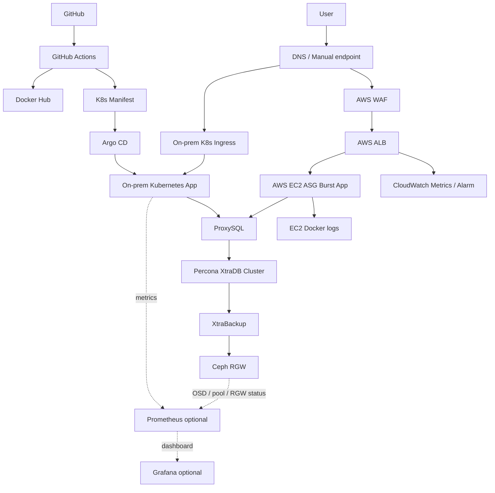
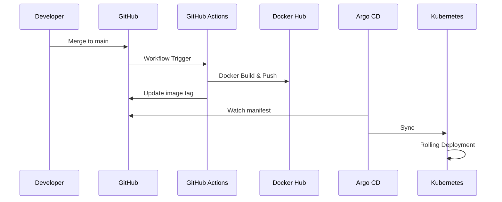

# Cloud Infra Deployment Platform

13일 구축 + 3일 발표 준비

온프레미스 Kubernetes + AWS EC2 burst 기반 하이브리드 배포 플랫폼

---

# 1. 프로젝트 목표

- 기존 애플리케이션을 클라우드 환경에 배포
- 배포 자동화, 보안, 관측성, 장애 대응까지 포함
- 4인 팀이 역할을 나누어 13일 안에 구현 가능한 MVP 완성
- 마지막 3일 동안 시연과 발표 자료 안정화

---

# 2. 구현 범위

| 영역          | 구현 내용                                     |
| :------------ | :-------------------------------------------- |
| Network       | VPC, Public/Private Subnet, ALB, SG           |
| Runtime       | 온프레미스 Kubernetes, AWS EC2 burst, Argo CD |
| CI/CD         | GitHub Actions, Docker Hub, GitOps Deploy     |
| Security      | IAM Role, WAF, Kubernetes/GitHub Secret       |
| Data          | Percona XtraDB Cluster, ProxySQL              |
| Storage       | Ceph RGW 백업, RBD/PVC 확장                   |
| Observability | CloudWatch Metrics, Alarm, K8s/EC2 logs       |
| Demo          | 장애 유도, 롤백, DB 백업 시연                 |

---

# 3. 전체 아키텍처

- 기본 앱 경로: User -> On-prem K8s Ingress -> Kubernetes App
- AWS burst 경로: User -> WAF/ALB -> EC2 ASG Burst App
- 배포 경로: GitHub Actions -> Docker Hub/Manifest -> Argo CD -> Kubernetes
- 데이터 경로: App -> ProxySQL -> PXC -> XtraBackup -> Ceph RGW
- 관측 경로: CloudWatch는 AWS, Prometheus/Grafana는 온프레미스와 Ceph 중심

---

# 4. 네트워크 설계

- Public Subnet: ALB, NAT Gateway
- Private Subnet: AWS burst 앱 EC2, ProxySQL/PXC
- ALB Security Group: 80/443 from Internet
- AWS burst app Security Group: App Port from ALB SG only
- NAT Gateway: Private 리소스의 외부 API/이미지 pull 접근 경로

---

# 5. 배포 흐름

---

# 6. 보안 설계

- GitHub Actions OIDC 기반 배포
- 장기 AWS Access Key 미사용
- IAM Role 최소 권한 분리
- WAF Managed Rule과 Rate Limit 적용
- Kubernetes/GitHub Secret으로 민감 값 분리
- Public/Private Subnet 분리

---

# 7. 관측성 설계

| 대상         | 지표                                     |
| :----------- | :--------------------------------------- |
| ALB          | Request Count, 5xx, Target Response Time |
| Target Group | UnHealthyHostCount                       |
| Argo CD      | Sync, Health                             |
| Kubernetes   | Pod Ready, Rollout                       |
| EC2 ASG      | CPU, Request                             |
| Logs         | Application stdout/stderr                |

---

# 8. 데이터/스토리지 설계

- AWS RDS 제외
- EC2 기반 Percona XtraDB Cluster 3노드
- ProxySQL로 DB 접근 단일화
- Single Writer 중심 운영
- Percona XtraBackup으로 백업 수행
- 백업 결과는 Ceph RGW에 저장
- 중요 백업은 AWS S3 2차 복제 가능

---

# 9. 장애 대응 시나리오

1. 잘못된 이미지 또는 환경 변수 배포
2. ALB Health Check 실패
3. Argo CD와 Kubernetes rollout 상태 확인
4. CloudWatch 또는 Grafana 지표로 원인 확인
5. 이전 Git revision 또는 image tag로 롤백
6. 정상 응답 복구 확인

---

# 10. 비용 최적화

- EKS 최소 PoC는 생성, 샘플 앱 배포, 삭제 검증까지만 수행
- 운영용 EKS control plane 상시 비용 제외
- AWS EC2 burst 최소/최대 용량 제한
- CloudWatch Alarm과 로그 보존 범위 최소화
- NAT Gateway 수는 비용과 가용성 균형 기준으로 결정
- 발표 후 비용 발생 리소스 정리

---

# 11. 팀 역할

| 역할                               | 책임                                          |
| :--------------------------------- | :-------------------------------------------- |
| Observability / Integration / Demo | 관측성, 통합 검증, 장애 시나리오, 발표 흐름   |
| Cloud / Network / IaC              | VPC, Subnet, ALB, SG, WAF, EC2 ASG, Terraform |
| DB / Storage                       | PXC, ProxySQL, Ceph RGW 백업                  |
| CI/CD / App Runtime                | GitHub Actions, Docker Hub, Argo CD, K8s 배포 |

---

# 12. 성과

- 수동 배포를 자동 배포로 전환
- 외부 진입점과 실행 영역 분리
- 키 없는 배포 체계 구성
- Health Check와 롤백 기반 장애 대응 가능
- RDS 없이 직접 운영 DB와 백업 저장소 구성
- 발표 가능한 시연 시나리오 확보

---

# 13. 향후 확장

- Route 53 + ACM 기반 HTTPS
- Blue/Green 배포
- S3 + CloudFront 정적 자산 오프로딩
- ProxySQL 이중화와 Internal NLB
- AWS S3 2차 백업 복제
- Ceph CSI 기반 Kubernetes PVC
- EKS 최소 PoC와 운영용 EKS 전환 검토
- AWS Load Balancer Controller(ALB Ingress Controller) 기반 외부 노출 검토
- EKS Hybrid Nodes 검토
- Private Registry 또는 Harbor 기반 온프레미스 이미지 저장소
