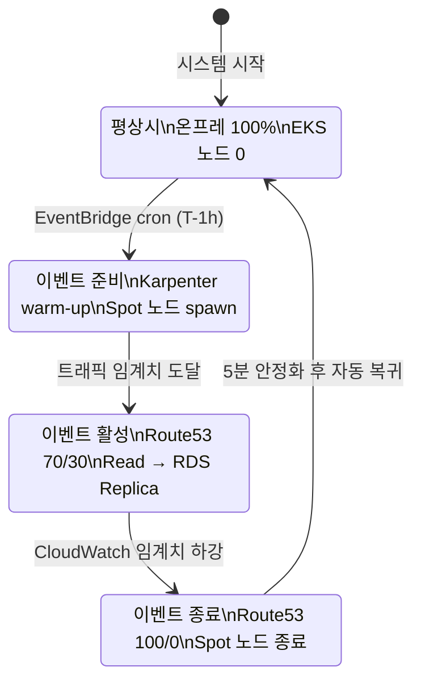
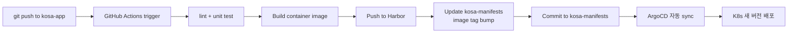

# kosa-day 아키텍처 설계

> 회원제 e-Commerce 하이브리드 클라우드 — 평상시 온프레, 이벤트 시 AWS Burst
> 시나리오: [Scenario_kosa-day.md](Scenario_kosa-day.md)
> 작성: 2026-05-12

---

## 목차

1. [전체 시스템 개요](#1-전체-시스템-개요)
2. [네트워크 설계](#2-네트워크-설계)
3. [컴퓨팅 설계 — K8s 클러스터](#3-컴퓨팅-설계--k8s-클러스터)
4. [데이터 계층 설계](#4-데이터-계층-설계)
5. [애플리케이션 설계](#5-애플리케이션-설계)
6. [저장 설계 (Ceph + S3)](#6-저장-설계-ceph--s3)
7. [IaC — Terraform + Ansible](#7-iac--terraform--ansible)
8. [CI/CD 파이프라인 설계](#8-cicd-파이프라인-설계)
9. [Burst 자동화 설계](#9-burst-자동화-설계)
10. [보안 설계 (PII 분리 포함)](#10-보안-설계-pii-분리-포함)
11. [모니터링 설계](#11-모니터링-설계)
12. [백업 / DR 설계](#12-백업--dr-설계)

---

## 1. 전체 시스템 개요

### 논리 아키텍처

```
                            [사용자]
                                │
                ┌───────────────┼───────────────┐
                │   브라우저/모바일             │
                │                               │
                ▼                               ▼
        [Cloudflare/Route53]          [CloudFront]
            (DNS routing)              (정적 CDN)
                │                               │
        weighted: 100/0 (평시)                 │
                  70/30 (이벤트)               │
                │                               │
       ┌────────┴────────┐                     │
       │                 │                     │
       ▼                 ▼                     ▼
[Onprem HAProxy]    [AWS ALB]            [S3 origin]
   ↓                    ↓
[Onprem K8s]       [AWS EKS]
4VM (CP3+W2)       Karpenter+Spot
   ↓                    ↓
[Percona PXC × 3] ────binlog────▶ [AWS RDS Replica]
   ↑                                        ↑
   │                                        │
   └─── ProxySQL (R/W 분기) ────────────────┘
   ↓
[Ceph RBD PV]
[Ceph RGW (이미지)]
```

### 운영 모드 전환



---

## 2. 네트워크 설계

### 2.1 온프레미스 VLAN

| VLAN | 용도 | Subnet | 게이트웨이 (CARP VIP) |
|---|---|---|---|
| 10 | Public (외부 노출) | 172.16.21.0/24 | 172.16.21.1 |
| 20 | DMZ (HAProxy 등) | 172.16.22.0/24 | 172.16.22.1 |
| 30 | Internal (K8s 노드, DB) | 172.16.23.0/24 | 172.16.23.1 |
| 40 | Management (Bastion) | 172.16.24.0/24 | 172.16.24.1 |
| 99 | pfSense SYNC | 10.10.99.0/24 | - |

### 2.2 온프레 IP 할당

| 호스트/VM | IP | VLAN |
|---|---|---|
| Proxmox kosa1 | 192.168.21.2 | - (관리망) |
| Proxmox kosa2 | 192.168.21.3 | - |
| Proxmox kosa3 | 192.168.21.4 | - |
| Proxmox kosa4 | 192.168.21.5 | - |
| pfSense MASTER | 172.16.X.2 | 각 VLAN |
| pfSense BACKUP | 172.16.X.3 | 각 VLAN |
| HAProxy VIP | 172.16.22.10 | VLAN 20 |
| K8s CP1 (kosa1) | 172.16.23.10 | VLAN 30 |
| K8s CP2 (kosa2) | 172.16.23.11 | VLAN 30 |
| K8s CP3 (kosa3) | 172.16.23.12 | VLAN 30 |
| K8s Worker1 (kosa3) | 172.16.23.20 | VLAN 30 |
| K8s Worker2 (kosa4) | 172.16.23.21 | VLAN 30 |
| K8s Worker3 (kosa2) | 172.16.23.22 | VLAN 30 |
| Bastion (kosa3) | 172.16.24.10 | VLAN 40 |
| Ceph public | 10.10.10.12 | 10G fabric |

### 2.3 AWS VPC 설계

```
ap-northeast-2 (Seoul) — 또는 ap-northeast-1 (Tokyo)
└── VPC: kosa-burst-vpc (10.20.0.0/16)
    │
    ├── Public Subnet (10.20.1.0/24, 10.20.2.0/24)  ─ AZ a/c
    │   ├── ALB
    │   ├── NAT Gateway
    │   └── Bastion (선택)
    │
    ├── Private Subnet (10.20.10.0/24, 10.20.11.0/24) ─ AZ a/c
    │   ├── EKS Worker Nodes (Karpenter Spot)
    │   └── RDS Read Replica
    │
    └── Internet Gateway
```

### 2.4 온프레 ↔ AWS 연결

#### 옵션 A: Site-to-Site VPN (학습용, 추천)
```
[pfSense WAN]  ─── OpenVPN/WireGuard ───  [AWS Site-to-Site VPN]
   192.168.21.1                              VPN Gateway
                                                 │
                                                 ▼
                                          VPC 10.20.0.0/16
```

#### 옵션 B: Public IP + Security Group (15일 빠른 경로)
- VPN 안 만들고 ALB + Public IP로 통신
- 단점: 모든 트래픽이 인터넷 경유
- 장점: 설정 단순, 빠름
- **추천**: 이걸로 시작, 시간 남으면 VPN으로 강화

### 2.5 DNS 설계 (Route 53)

```
kosa-day.example.com (Route 53 hosted zone)
├── @ (weighted routing)
│   ├── Record A: 100 weight → onprem-haproxy.kosa-day.example.com  
│   │             (평시: weight 100, 이벤트: 70)
│   │             → 172.16.22.10 (외부 NAT IP)
│   │
│   └── Record A: 0 weight → aws-alb-xxx.elb.amazonaws.com
│                 (평시: weight 0, 이벤트: 30)
│
├── api.kosa-day.example.com → 위와 동일 weighted
├── images.kosa-day.example.com → CloudFront → S3
└── admin.kosa-day.example.com → onprem only (관리자 패널)
```

**weight 전환 주체**: Lambda가 `aws route53 change-resource-record-sets` 호출.

---

## 3. 컴퓨팅 설계 — K8s 클러스터

### 3.1 온프레 K8s 클러스터

#### 노드 배치 (CP3 + W3, Worker 완전 분산)

```
┌──────────────────────────────────────────────────────────┐
│  Onprem K8s Cluster (kosa-onprem)                        │
│                                                          │
│  Control Plane (HA, etcd quorum 3개):                    │
│    ┌─────────────┐  ┌─────────────┐  ┌─────────────┐    │
│    │  k8s-cp1    │  │  k8s-cp2    │  │  k8s-cp3    │    │
│    │  kosa1      │  │  kosa2      │  │  kosa3      │    │
│    │  2C 4G 40G  │  │  2C 4G 40G  │  │  2C 4G 40G  │    │
│    └─────────────┘  └─────────────┘  └─────────────┘    │
│                                                          │
│  Workers (3대 → 3개 PVE 노드에 완전 분산, HA 우선):       │
│    ┌─────────────┐  ┌─────────────┐  ┌─────────────┐    │
│    │  k8s-w1     │  │  k8s-w2     │  │  k8s-w3     │    │
│    │  kosa3      │  │  kosa4      │  │  kosa2      │    │
│    │  4C 6G 80G  │  │  4C 6G 80G  │  │  4C 6G 80G  │    │
│    └─────────────┘  └─────────────┘  └─────────────┘    │
│                                                          │
│  Bastion (관리망 VLAN 40):                               │
│    ┌─────────────┐                                       │
│    │  bastion    │                                       │
│    │  kosa3      │                                       │
│    │  1C 2G 20G  │                                       │
│    └─────────────┘                                       │
└──────────────────────────────────────────────────────────┘
```

#### 메모리 분배 (Proxmox 노드별)

| Proxmox | 기존 VM | + pfSense | + K8s VM | 합계 / 32GB |
|---|---|---|---|---|
| kosa1 | ~10GB | + 4GB | + CP1 (4GB) | **18GB** |
| kosa2 | ~10GB | + 4GB | + CP2 (4GB) + W3 (6GB) | **24GB** ⚠️ |
| kosa3 | ~10GB | - | + CP3 (4GB) + W1 (6GB) + Bastion (2GB) | **22GB** |
| kosa4 | ~10GB | - | + W2 (6GB) | **16GB** |

> ⚠️ **kosa2가 가장 빡빡** (24GB/32GB). 기존 VM 사용량 정확 측정 필요.
> 만약 부담되면 W3 사양을 4GB로 줄임 (성능 약간 손해).

#### HA 효과 (Worker 완전 분산)

어느 단일 PVE 노드 다운 시 영향:

| 다운 노드 | 잃는 컴포넌트 | 남은 워커 | 클러스터 상태 |
|---|---|---|---|
| kosa1 | pfSense MASTER, CP1 | W1, W2, W3 (3대) | pfSense 페일오버, CP quorum 2/3 ✓ |
| kosa2 | pfSense BACKUP, CP2, **W3** | W1, W2 (2대) | CP quorum 2/3 ✓, 워커 67% |
| kosa3 | CP3, **W1**, Bastion | W2, W3 (2대) | CP quorum 2/3 ✓, 워커 67% |
| kosa4 | **W2** | W1, W3 (2대) | CP 영향 X, 워커 67% |

→ **어느 노드가 죽어도 워커 2/3 보존**. K8s 클러스터 운영 지속.

#### 핵심 컴포넌트
- **컨테이너 런타임**: **containerd** (K8s 1.24+ 표준)
  - Docker는 개발 머신에서 **이미지 빌드용**으로만 사용
  - K8s 노드에서 컨테이너 실행은 containerd가 담당
- **CNI**: **Calico** (NetworkPolicy 표준 지원, 안정적)
- **Ingress**: NGINX Ingress Controller
- **LoadBalancer**: MetalLB (172.16.22.50-100 풀)
- **CSI**: Ceph RBD CSI (DB PV), Ceph CephFS CSI (선택)
- **Metrics**: Metrics Server (HPA용)
- **Cluster autoscaler**: 사용 안 함 (온프레 노드 고정)

### 3.2 AWS EKS 클러스터

#### 클러스터 구성

```
┌──────────────────────────────────────────────────────────┐
│  AWS EKS Cluster (kosa-burst)                            │
│                                                          │
│  Control Plane: AWS 관리 (별도 노드 X)                   │
│                                                          │
│  Worker Nodes (Karpenter 관리, Spot Instance):           │
│    평시: 0대                                             │
│    이벤트 시: 5~10대 (t3a.medium Spot)                    │
│                                                          │
│  Karpenter NodePool:                                     │
│    - capacity-type: spot (우선) + on-demand (fallback)   │
│    - instance-type: t3a.medium, t3.medium, m5a.large     │
│    - taints: kosa-burst (스폿 노드만 burst 워크로드 배포) │
└──────────────────────────────────────────────────────────┘
```

#### Karpenter 설정 (개념)

```yaml
# NodePool — Karpenter v1
apiVersion: karpenter.sh/v1
kind: NodePool
metadata:
  name: kosa-burst-spot
spec:
  template:
    spec:
      requirements:
        - key: karpenter.sh/capacity-type
          operator: In
          values: ["spot", "on-demand"]
        - key: node.kubernetes.io/instance-type
          operator: In
          values: ["t3a.medium", "t3.medium", "m5a.large"]
      taints:
        - key: kosa-burst
          value: "true"
          effect: NoSchedule
  limits:
    cpu: 100
    memory: 200Gi
  disruption:
    consolidationPolicy: WhenUnderutilized
    expireAfter: 24h
```

> **이유**: taint를 둬서 평시엔 노드 0대로 유지. 이벤트용 워크로드만 toleration 가진다.

### 3.3 멀티 클러스터 관리

#### ArgoCD 멀티 클러스터 등록

```
ArgoCD (Onprem K8s 위)
   ├── Cluster: in-cluster (Onprem K8s)
   └── Cluster: kosa-burst (AWS EKS, kubeconfig 등록)
```

#### ApplicationSet으로 양쪽 배포

```yaml
apiVersion: argoproj.io/v1alpha1
kind: ApplicationSet
metadata:
  name: kosa-app
spec:
  generators:
  - list:
      elements:
      - cluster: in-cluster
        url: https://kubernetes.default.svc
        namespace: kosa-app
        replicas: "3"
      - cluster: kosa-burst
        url: https://eks.amazonaws.com/...
        namespace: kosa-app
        replicas: "0"   # 평시 0, 이벤트 시 Karpenter가 늘림
  template:
    metadata:
      name: 'kosa-app-{{cluster}}'
    spec:
      project: default
      source:
        repoURL: https://github.com/team/kosa-manifests
        targetRevision: HEAD
        path: kosa-app
        helm:
          parameters:
          - name: replicaCount
            value: '{{replicas}}'
      destination:
        server: '{{url}}'
        namespace: '{{namespace}}'
```

### 3.4 Horizontal Pod Autoscaler (HPA) 설계

#### 작동 흐름

```
[Metrics Server]   ← 매 15초마다 Pod CPU/Memory 수집
        │
        ▼
[HPA Controller]   ← 매 15초마다 평가 (target 대비)
        │
        ▼
[Deployment 조정]  ← replica 늘림/줄임
        │
        ▼
[새 Pod 생성]      ← 워커 노드 자원 안에서
        │ (자원 부족 시)
        ▼
[Pending Pods]     ← AWS Karpenter가 EKS 노드 spawn (이벤트 모드)
```

#### 워크로드별 HPA 정책

| 워크로드 | HPA | Target | min | max | 비고 |
|---|---|---|---|---|---|
| **app-svc** (상품/주문 FastAPI) | ✅ | CPU 60% | 3 | 15 | 주 burst 대상 |
| **members-svc** (회원, PII) | ✅ | CPU 70% | 2 | 8 | PII 보호로 max 제한 |
| **admin-svc** | ✅ | CPU 70% | 1 | 4 | 트래픽 낮음 |
| **NGINX Ingress** | ✅ | CPU 50% | 2 | 6 | 진입 부하 흡수 |
| ProxySQL | ❌ (StatefulSet) | - | 2 | 2 | HA 고정 |
| Percona PXC | ❌ | - | 3 | 3 | 클러스터 고정 |
| Redis | ❌ | - | 3 | 3 | Sentinel 고정 |
| Harbor / Prometheus / ArgoCD | ❌ | - | 1 | 1 | 인프라 컴포넌트 |

#### HPA 매니페스트 예시 (app-svc)

```yaml
apiVersion: autoscaling/v2
kind: HorizontalPodAutoscaler
metadata:
  name: app-svc-hpa
  namespace: app-public
spec:
  scaleTargetRef:
    apiVersion: apps/v1
    kind: Deployment
    name: app-svc
  minReplicas: 3
  maxReplicas: 15
  metrics:
    - type: Resource
      resource:
        name: cpu
        target:
          type: Utilization
          averageUtilization: 60   # Pod 평균 CPU 60% 넘으면 scale-up
    - type: Resource
      resource:
        name: memory
        target:
          type: Utilization
          averageUtilization: 75
  behavior:
    scaleUp:
      stabilizationWindowSeconds: 30   # 빠르게 늘림 (30초 안정화)
      policies:
        - type: Percent
          value: 100                    # 한 번에 최대 2배까지
          periodSeconds: 30
    scaleDown:
      stabilizationWindowSeconds: 300  # 천천히 줄임 (5분 안정화 → 부하 안정성)
      policies:
        - type: Percent
          value: 10
          periodSeconds: 60
```

#### 데모 흐름 (HPA + Burst 연계)

```
[Step 1] 평시:  app-svc 3 replica, CPU 30%
                │
[Step 2] JMeter 500 RPS 부하:
                replica 6 (CPU 70% → HPA scale-up)
                │
[Step 3] JMeter 1000 RPS:
                replica 10 → 워커 노드 CPU 95%
                추가 Pod이 Pending 상태
                │
[Step 4] Karpenter on EKS 발동:
                EKS Worker spawn (Spot Instance)
                Pending Pod → EKS 노드에 배치
                │
[Step 5] ProxySQL이 Read 쿼리를 AWS RDS Replica로 분기 시작
                │
[Step 6] 부하 종료:
                scaleDown 5분 stabilization 후 점진 축소
                EKS Worker Karpenter consolidation으로 종료
```

#### Pod Anti-Affinity (워커 분산)

W3 환경에서 같은 서비스 replica가 한 노드에 몰리지 않도록:

```yaml
spec:
  template:
    spec:
      affinity:
        podAntiAffinity:
          preferredDuringSchedulingIgnoredDuringExecution:
            - weight: 100
              podAffinityTerm:
                labelSelector:
                  matchLabels:
                    app: app-svc
                topologyKey: kubernetes.io/hostname
```

→ 3 replica가 3개 워커에 1개씩 분산 배치.

---

## 4. 데이터 계층 설계

### 4.1 데이터 흐름 전체도

```
[FastAPI App Pods]
         │
         ▼
   ┌────────────┐
   │ ProxySQL × 2│
   │  (R/W 분기) │
   └─────┬──────┘
         │
    ┌────┴───────────────────────────────┐
    │                                    │
    ▼ Write & 일반 Read                  ▼ 무거운 Read / 분석
[Percona PXC × 3]                  [AWS RDS Read Replica]
  (Onprem)                              (AWS)
    │                                    ▲
    │  binlog (실시간 비동기)            │
    └────────────────────────────────────┘
                  복제 lag: < 1초
```

### 4.2 Percona XtraDB Cluster (Onprem)

#### 배치
- 3개 Pod (StatefulSet)
- 각 Pod별 Ceph RBD PV (50Gi)
- topology spread: 가능하면 다른 노드에 배치 (k8s-w1, k8s-w2 + cp중 1)

#### 설정 핵심
- Multi-master (모든 노드에서 Write 가능, 하지만 ProxySQL이 1대만 hostgroup writer로 지정)
- wsrep_provider_options 튜닝 (gcache_size, gcs.fc_limit 등)
- binlog 활성화 (`log_bin = ON`, `binlog_format = ROW`, `gtid_mode = ON`)

### 4.3 ProxySQL × 2 (HA)

#### 핵심 역할
1. **R/W 분기**: SELECT → reader hostgroup, INSERT/UPDATE/DELETE → writer hostgroup
2. **쿼리 라우팅 규칙**: 무거운 쿼리 또는 분석 쿼리 → AWS RDS Replica
3. **커넥션 풀링**: 8000 client conn → 200 backend conn

#### Hostgroup 구조

| Hostgroup ID | 용도 | 멤버 |
|---|---|---|
| 10 | Writer | Percona PXC node 1 (primary) |
| 20 | Reader (Onprem) | Percona PXC node 2, 3 |
| 30 | Reader (AWS) | AWS RDS Read Replica |

#### 라우팅 규칙 예시 (query_rules 테이블)

```sql
-- Rule 1: INSERT/UPDATE/DELETE/REPLACE → Writer hostgroup (10)
INSERT INTO mysql_query_rules
  (rule_id, active, match_pattern, destination_hostgroup, apply)
VALUES
  (1, 1, '^(INSERT|UPDATE|DELETE|REPLACE) ', 10, 1);

-- Rule 2: 일반 SELECT → Onprem Reader (20)
INSERT INTO mysql_query_rules
  (rule_id, active, match_pattern, destination_hostgroup, apply)
VALUES
  (2, 1, '^SELECT ', 20, 1);

-- Rule 3: 분석 쿼리 (특정 패턴) → AWS Reader (30)
-- 이벤트 모드 + 통계 대시보드 쿼리
INSERT INTO mysql_query_rules
  (rule_id, active, match_pattern, destination_hostgroup, apply, comment)
VALUES
  (3, 1, '^SELECT.*FROM (order_stats|product_analytics|review_summary)', 30, 1,
   'Analytics queries → AWS Read Replica');

-- Rule 4: 관리자 검색 쿼리 → AWS Reader
INSERT INTO mysql_query_rules
  (rule_id, active, match_pattern, destination_hostgroup, apply, comment)
VALUES
  (4, 1, '^SELECT.*FROM (orders|products) WHERE.*LIMIT.*OFFSET', 30, 1,
   'Admin pagination → AWS');

LOAD MYSQL QUERY RULES TO RUNTIME;
SAVE MYSQL QUERY RULES TO DISK;
```

> **데모 포인트**: kubectl logs proxysql에서 "routed to 30 (aws-replica)" 로그 확인 가능.

### 4.4 Redis Sentinel

#### 배치
- Master 1 + Replica 2 + Sentinel 3 (홀수 정족수)
- 또는 단순화: Master + Replica (Sentinel 없음)
- 용도: 세션 저장, 카트 임시 저장, rate limit 카운터

### 4.5 AWS RDS Read Replica

#### 구성
- 인스턴스: db.t3.micro (소규모, 비용 절감)
- MySQL 8.0 (Percona 8.0 호환)
- AZ: ap-northeast-2a (또는 EKS 같은 AZ)
- 복제 방식: Percona binlog → AWS DMS 또는 직접 binlog 복제

#### 복제 옵션

**옵션 1: AWS DMS (Database Migration Service)**
- 지속적 복제 (CDC)
- 관리 편함
- 비용 발생 (~$30/월)

**옵션 2: 직접 binlog 복제** (추천)
- Percona PXC 노드 1대를 binlog 발행자로
- RDS에서 `CALL mysql.rds_set_external_master(...)` 로 복제 시작
- 비용 없음 (RDS 인스턴스 비용만)
- 단점: 수동 설정

```sql
-- RDS Read Replica에서 (Onprem 마스터에 연결)
CALL mysql.rds_set_external_master(
  'onprem-master.kosa-day.example.com',  -- 외부 IP/도메인
  3306,
  'repl_user',
  'repl_password',
  'mysql-bin.000001',
  4,
  0  -- SSL 사용 안 함 (운영에선 사용 권장)
);
CALL mysql.rds_start_replication;
```

---

## 5. 애플리케이션 설계

### 5.1 마이크로서비스 구조

기존 FastAPI 회원 데모를 확장하되, **단일 코드베이스 안에서 모듈 분리** (15일에 진짜 마이크로서비스 분리는 빡빡):

```
fastapi-app/
├── app/
│   ├── main.py                # FastAPI app
│   ├── config.py              # 환경 변수
│   ├── database.py            # ProxySQL 연결
│   ├── auth/                  # JWT 인증
│   │   ├── jwt.py
│   │   └── routes.py
│   ├── members/               # 회원 (PII)
│   │   ├── models.py
│   │   ├── routes.py
│   │   └── schemas.py
│   ├── products/              # 상품 (non-PII)
│   │   ├── models.py
│   │   ├── routes.py
│   │   └── schemas.py
│   └── orders/                # 주문 (혼합)
│       ├── models.py
│       ├── routes.py
│       └── schemas.py
├── requirements.txt
├── Dockerfile
└── tests/
```

### 5.2 K8s Namespace 분리

PII 보호를 위해 **두 Namespace로 분리**:

| Namespace | 포함 컴포넌트 | NetworkPolicy |
|---|---|---|
| `pii-protected` | 회원 서비스, Percona PXC | egress: AWS로 가는 트래픽 차단 |
| `app-public` | 상품, 주문, 이미지 처리 | egress: 자유 |
| `infra` | ArgoCD, Prometheus, Harbor 등 | egress: 자유 |
| `ingress` | NGINX Ingress | egress: 자유 |

> **trade-off**: 같은 FastAPI 앱이 두 namespace에 분리되어야 함. → **Deployment를 2개로 분할** (members-svc, app-svc) 또는 **단일 앱 + Sidecar로 다른 namespace 호출**.
> **추천**: 단일 코드 + 2개 Deployment (members + app), DB 접근 패턴만 다름.

### 5.3 NetworkPolicy (PII 차단)

표준 Kubernetes NetworkPolicy로 작성 (Calico가 시행). Cilium 같은 CRD 안 써도 동일한 효과.

```yaml
apiVersion: networking.k8s.io/v1
kind: NetworkPolicy
metadata:
  name: deny-pii-egress-to-aws
  namespace: pii-protected
spec:
  podSelector:
    matchLabels:
      app: members-service
  policyTypes:
    - Egress
  egress:
    # 허용: Percona PXC (같은 namespace)
    - to:
        - podSelector:
            matchLabels:
              app: percona-pxc
      ports:
        - port: 3306
          protocol: TCP
    # 허용: kube-dns
    - to:
        - namespaceSelector:
            matchLabels:
              kubernetes.io/metadata.name: kube-system
          podSelector:
            matchLabels:
              k8s-app: kube-dns
      ports:
        - port: 53
          protocol: UDP
    # 허용: 같은 namespace 내 통신 (서비스 간)
    - to:
        - namespaceSelector:
            matchLabels:
              kubernetes.io/metadata.name: pii-protected
    # 명시되지 않은 모든 egress는 차단됨 (whitelist 방식)
    # → AWS VPC (10.20.0.0/16) 자동 차단
    # → 외부 인터넷 차단
```

> **Calico 방식 동작**: NetworkPolicy에 명시된 to만 허용, 나머지는 모두 차단.
> AWS VPC 10.20.0.0/16으로의 트래픽은 자동으로 막힘.
>
> **검증**: members-service Pod에서 `curl https://aws-alb.amazonaws.com` → timeout
> **데모 명령**: `kubectl exec -n pii-protected members-svc-xxx -- curl -m 5 https://eks-endpoint.com`

#### Calico 글로벌 정책 (선택, 추가 강화)
Calico는 표준 NetworkPolicy 외에 `GlobalNetworkPolicy` CRD도 지원. 클러스터 전역 PII 보호 룰:

```yaml
apiVersion: projectcalico.org/v3
kind: GlobalNetworkPolicy
metadata:
  name: global-block-aws-from-pii
spec:
  selector: namespace == 'pii-protected'
  egress:
    - action: Deny
      destination:
        nets:
          - 10.20.0.0/16   # AWS VPC CIDR
```

표준 NetworkPolicy만으로도 충분하지만, 추가 안전망으로 사용 가능.

---

## 6. 저장 설계 (Ceph + S3)

### 6.1 Ceph 활용

| 용도 | Ceph 인터페이스 | 사용처 |
|---|---|---|
| DB PV | RBD (블록) | Percona PXC StatefulSet PVC |
| 공유 파일 (옵션) | CephFS | Harbor registry, 로그 공유 |
| 이미지 객체 저장 | RGW (S3) | 프로필 사진 |

### 6.2 Ceph Pool 설정

```bash
# 3-replica pools (안정성)
ceph osd pool create kosa-rbd 64 64 replicated
ceph osd pool create kosa-cephfs 64 64 replicated

# RGW (S3 호환)
radosgw-admin user create --uid=kosa --display-name="kosa-day app"
# 결과로 access_key, secret_key 받음 → FastAPI app의 S3 클라이언트에 사용
```

### 6.3 K8s StorageClass

```yaml
apiVersion: storage.k8s.io/v1
kind: StorageClass
metadata:
  name: ceph-rbd
  annotations:
    storageclass.kubernetes.io/is-default-class: "true"
provisioner: rbd.csi.ceph.com
parameters:
  clusterID: <ceph-cluster-id>
  pool: kosa-rbd
  imageFeatures: layering
reclaimPolicy: Delete
allowVolumeExpansion: true
```

### 6.4 AWS S3 활용

| 버킷 | 용도 |
|---|---|
| `kosa-day-velero-backups` | K8s + PV 백업 (Velero) |
| `kosa-day-static-assets` | CloudFront origin (이미지 캐시) |
| `kosa-day-logs` (옵션) | 장기 로그 보관 |

### 6.5 데이터 라이프사이클

```
회원 가입 → Percona INSERT
회원 프로필 이미지 업로드 → Ceph RGW PUT
                              ↓
                         S3 sync (선택, CDN용)
                              ↓
                         CloudFront 캐싱

회원 데이터 변경 → binlog → AWS RDS Replica (실시간)

주문 데이터 30일 이상 → S3 archive (선택, 비용 최적화)
```

### 6.6 PV / PVC 매트릭스

#### StorageClass 정의

| StorageClass | Provisioner | AccessMode | 용도 |
|---|---|---|---|
| **ceph-rbd** ⭐ default | rbd.csi.ceph.com | RWO (ReadWriteOnce) | DB, 단일 Pod PV |
| **ceph-fs** | cephfs.csi.ceph.com | RWX (ReadWriteMany) | 다중 Pod 공유 (Harbor 등) |

> **AccessMode 의미**:
> - RWO: 한 노드에서 한 Pod만 마운트 (DB 적합)
> - RWX: 여러 노드에서 동시 마운트 (파일 공유 적합)

#### 워크로드별 PVC 매트릭스

| 워크로드 | PVC 이름 | 크기 | AccessMode | StorageClass | 비고 |
|---|---|---|---|---|---|
| **Percona PXC #1** | data-pxc-0 | 50Gi | RWO | ceph-rbd | StatefulSet 자동 생성 |
| **Percona PXC #2** | data-pxc-1 | 50Gi | RWO | ceph-rbd | StatefulSet 자동 생성 |
| **Percona PXC #3** | data-pxc-2 | 50Gi | RWO | ceph-rbd | StatefulSet 자동 생성 |
| **ProxySQL #1** | proxysql-cfg-0 | 1Gi | RWO | ceph-rbd | 설정/log |
| **ProxySQL #2** | proxysql-cfg-1 | 1Gi | RWO | ceph-rbd | 설정/log |
| **Redis Master** | redis-master-0 | 5Gi | RWO | ceph-rbd | AOF 영구 저장 |
| **Redis Replica × 2** | redis-replica-{0,1} | 5Gi each | RWO | ceph-rbd | |
| **Harbor (Registry)** | harbor-registry | 100Gi | RWO 또는 RWX | ceph-rbd 또는 ceph-fs | 이미지 저장 |
| **Harbor (DB)** | harbor-db | 10Gi | RWO | ceph-rbd | PostgreSQL |
| **Prometheus** | prometheus-data | 30Gi | RWO | ceph-rbd | TSDB |
| **Grafana** | grafana-data | 5Gi | RWO | ceph-rbd | 대시보드/설정 |
| **ArgoCD** | argocd-repo | 10Gi | RWO | ceph-rbd | Git repo cache |
| **NGINX Ingress** | (Stateless) | - | - | - | PV 불필요 |
| **FastAPI (app-svc, members-svc)** | (Stateless) | - | - | - | PV 불필요 |
| **Velero** | (PV 없음) | - | - | - | 직접 S3 사용 |

**총합**: 약 **270Gi** (Ceph 가용 ~2TB 중 약 14% 사용 → 충분한 여유)

#### StatefulSet의 PVC 자동 생성 (volumeClaimTemplates)

Percona처럼 StatefulSet은 `volumeClaimTemplates`로 각 replica마다 PVC 자동 생성:

```yaml
apiVersion: apps/v1
kind: StatefulSet
metadata:
  name: percona-pxc
  namespace: pii-protected
spec:
  serviceName: percona-pxc-headless
  replicas: 3
  template:
    spec:
      containers:
        - name: pxc
          image: percona/percona-xtradb-cluster:8.0
          volumeMounts:
            - name: data
              mountPath: /var/lib/mysql
  volumeClaimTemplates:                    # 각 replica마다 PVC 자동 생성
    - metadata:
        name: data
      spec:
        accessModes: [ReadWriteOnce]
        storageClassName: ceph-rbd
        resources:
          requests:
            storage: 50Gi
```

→ 자동 생성되는 PVC 이름: `data-percona-pxc-0`, `data-percona-pxc-1`, `data-percona-pxc-2`

#### PV 동적 프로비저닝 흐름

```
1. PVC 생성됨 (kubectl apply 또는 StatefulSet 자동)
        │
        ▼
2. K8s가 StorageClass 확인 (ceph-rbd)
        │
        ▼
3. Ceph CSI 컨트롤러가 Ceph RBD image 생성
        │
        ▼
4. PV 객체가 자동 생성 → PVC와 bind
        │
        ▼
5. Pod이 PVC 마운트하면 → CSI node plugin이 rbd map
        │
        ▼
6. 컨테이너가 /var/lib/mysql에서 사용
```

#### Backup/Restore 시 PV 처리

```
Velero 백업:
  1. K8s 매니페스트 → S3 (kosa-day-velero-backups)
  2. PV 데이터 → Restic (S3에 파일 단위) 또는 Ceph RBD snapshot
  3. PVC 메타데이터 → 매니페스트에 포함

Velero 복원:
  1. velero restore create → 매니페스트 재생성
  2. PVC가 생기면 StorageClass가 새 PV 자동 생성
  3. Restic이 S3 데이터를 새 PV에 restore
  4. Pod이 새 PV 마운트
```

---

## 7. IaC — Terraform + Ansible

> 인프라 자체를 코드로 관리. **온프레와 AWS 모두 Terraform**, **VM OS/K8s는 Ansible**.
> 참고: [IaC_Setup_Guide.md](IaC_Setup_Guide.md) — 상세 사용법

### 7.1 책임 분담

| 도구 | 온프레미스 | AWS |
|---|---|---|
| **Terraform** | Proxmox VM 생성 (CP3 + W3 + Bastion = 7대) | VPC, EKS, RDS, Route 53, ALB |
| **Ansible** | OS 부트스트랩, kubeadm K8s 설치, Calico/MetalLB | 거의 안 씀 (EKS는 관리형) |
| **ArgoCD** | K8s 앱 매니페스트 배포 | EKS 앱 배포 (멀티 클러스터) |

### 7.2 디렉토리 구조

```
kosa-infra/                   ← Git repo
├── terraform/
│   ├── onprem/               ← Proxmox 측
│   │   ├── providers.tf      ← bpg/proxmox provider
│   │   ├── variables.tf
│   │   ├── main.tf           ← VM 6대 (CP3 + W2 + Bastion)
│   │   ├── outputs.tf        ← Ansible inventory 생성용
│   │   └── modules/vm/
│   │
│   ├── aws/                  ← AWS 측
│   │   ├── providers.tf      ← AWS provider
│   │   ├── variables.tf
│   │   ├── vpc.tf            ← VPC, Subnet, IGW, NAT
│   │   ├── eks.tf            ← EKS 클러스터 + Karpenter
│   │   ├── rds.tf            ← RDS Read Replica
│   │   ├── route53.tf        ← Hosted zone + weighted records
│   │   └── lambda.tf         ← Burst 자동화 Lambda
│   │
│   └── shared/               ← 두 환경 공통 변수
│
└── ansible/
    ├── ansible.cfg
    ├── inventory/
    │   ├── hosts.yml          ← Terraform output에서 자동 생성
    │   └── group_vars/
    ├── playbooks/
    │   ├── 00-bootstrap.yml   ← hostname, swap off, NTP
    │   ├── 10-k8s-prepare.yml ← containerd, 커널 모듈
    │   ├── 20-k8s-install.yml ← kubeadm/kubelet/kubectl
    │   ├── 30-k8s-init.yml    ← kubeadm init + join
    │   └── 40-k8s-addons.yml  ← Calico, MetalLB, Metrics Server
    └── roles/
```

### 7.3 Terraform 온프레 (Proxmox)

**Provider**: [`bpg/proxmox`](https://registry.terraform.io/providers/bpg/proxmox/)

**관리 대상**:
- Ubuntu 22.04 cloud-init 템플릿 (VMID 9000) 기반 clone
- K8s Control Plane × 3 (kosa1/2/3 분산)
- K8s Worker × 3 (**3개 PVE 노드 완전 분산**: kosa2/kosa3/kosa4 각 1대)
- Bastion 1대 (kosa3, VLAN 40)
- **총 7대 VM**

**관리 제외**:
- pfSense VM (이미 운영 중, 수동 관리)
- Ceph 노드 (별도 클러스터)

**파일 예시 (`terraform/onprem/main.tf`)**:
```hcl
module "k8s_control_plane" {
  source   = "./modules/vm"
  for_each = { for n in var.control_plane_nodes : n.name => n }

  name             = each.value.name
  vmid             = each.value.vmid
  pve_node         = each.value.pve_node
  template_vm_id   = 9000
  ip_address       = "172.16.23.${each.value.ip_suffix}/24"
  gateway          = "172.16.23.1"
  vlan_tag         = 30
  ...
}
```

### 7.4 Terraform AWS

**Provider**: `hashicorp/aws`

**핵심 리소스**:

```hcl
# terraform/aws/eks.tf
resource "aws_eks_cluster" "kosa_burst" {
  name     = "kosa-burst"
  role_arn = aws_iam_role.eks_cluster.arn
  version  = "1.30"

  vpc_config {
    subnet_ids = aws_subnet.private[*].id
  }
}

# Karpenter는 EKS 안에서 별도 설치
# (Helm으로, ArgoCD가 관리하거나 Terraform helm provider 사용)

# terraform/aws/rds.tf
resource "aws_db_instance" "read_replica" {
  identifier         = "kosa-day-read-replica"
  engine             = "mysql"
  engine_version     = "8.0"
  instance_class     = "db.t3.micro"
  # 외부 binlog 소스 (Onprem Percona) 와 복제 설정
}

# terraform/aws/route53.tf
resource "aws_route53_record" "onprem_weighted" {
  zone_id        = aws_route53_zone.main.zone_id
  name           = "api.kosa-day.example.com"
  type           = "A"
  set_identifier = "onprem"
  weighted_routing_policy {
    weight = 100  # 평시. Lambda가 이벤트 시 70으로 변경
  }
  ttl     = 30
  records = ["1.2.3.4"]  # 온프레 외부 IP (NAT)
}
```

### 7.5 Ansible — K8s 부트스트랩

**구성 흐름**:

```
Terraform이 VM 생성 (cloud-init으로 SSH 키 주입)
        │
        ▼
Terraform output → Ansible inventory 자동 생성 (scripts/generate-inventory.sh)
        │
        ▼
Ansible 플레이북 순차 실행:
  ├─ 00-bootstrap.yml      → 사용자, swap, sysctl, NTP
  ├─ 10-k8s-prepare.yml    → containerd 설치, 커널 모듈
  ├─ 20-k8s-install.yml    → kubeadm/kubelet/kubectl (apt hold)
  ├─ 30-k8s-init.yml       → 첫 CP init + 다른 노드 join
  └─ 40-k8s-addons.yml     → Calico CNI, MetalLB, Metrics Server
        │
        ▼
K8s 클러스터 Ready 상태
        │
        ▼
ArgoCD 부트스트랩 (helm) → 이후 모든 워크로드는 GitOps로
```

**주요 task 예시 (10-k8s-prepare.yml)**:
```yaml
- name: containerd 설치 (K8s 1.24+ 표준 런타임)
  apt:
    name: containerd
    state: present

- name: containerd cgroup driver를 systemd로 설정
  replace:
    path: /etc/containerd/config.toml
    regexp: 'SystemdCgroup = false'
    replace: 'SystemdCgroup = true'

- name: 필요 커널 모듈 로드 (br_netfilter, overlay)
  modprobe:
    name: "{{ item }}"
  loop: [overlay, br_netfilter]
```

**주요 task 예시 (40-k8s-addons.yml)**:
```yaml
- name: Calico CNI 설치 (Tigera Operator 방식)
  kubernetes.core.k8s:
    state: present
    src: https://raw.githubusercontent.com/projectcalico/calico/v3.27.0/manifests/tigera-operator.yaml

- name: Calico Installation 리소스 적용
  kubernetes.core.k8s:
    state: present
    definition:
      apiVersion: operator.tigera.io/v1
      kind: Installation
      metadata:
        name: default
      spec:
        calicoNetwork:
          ipPools:
          - blockSize: 26
            cidr: 10.244.0.0/16   # group_vars/all.yml의 pod_subnet
            encapsulation: VXLAN
```

### 7.6 IaC 적용 순서 (Day 2~3)

```
Day 1: 사전 준비
  ├─ Proxmox API 토큰 발급
  ├─ AWS 계정/IAM 사용자 + Access Key
  ├─ Ubuntu 22.04 cloud-init 템플릿 (VMID 9000) 1회 수동 생성
  └─ SSH 키 (~/.ssh/kosa_iac) 생성

Day 2: Terraform 적용
  ├─ cd terraform/onprem; terraform init; terraform apply
  │   → VM 7대 생성 (CP3 + W3 + Bastion, 약 10분)
  └─ cd terraform/aws; terraform init; terraform apply
      → VPC, EKS, RDS skeleton (30분~1시간, RDS가 가장 느림)

Day 3: Ansible 부트스트랩
  ├─ ./scripts/generate-inventory.sh
  └─ ansible-playbook playbooks/site.yml
      → K8s 5/5 Ready (30분~1시간)
```

### 7.7 IaC 핵심 원칙

1. **모든 인프라는 코드로** — 수동 클릭 금지 (pfSense는 예외, 이미 완료)
2. **시크릿 분리** — `terraform.tfvars`, `secrets.yml`은 .gitignore
3. **재현 가능성** — `terraform destroy` 후 다시 `apply`하면 동일 환경
4. **변경 추적** — 모든 변경은 git commit + PR로
5. **state 보관** — 초기엔 로컬, 안정 후 Ceph RGW(S3 호환)로 이전

### 7.8 IaC vs 수동 작업 경계

| 작업 | 도구 | 비고 |
|---|---|---|
| Proxmox cloud-init 템플릿 만들기 | 수동 (1회) | qm import 명령 |
| pfSense VM | 수동 | 이미 운영 중, 건드리지 X |
| VM 6대 생성 | **Terraform** | 매번 재현 가능 |
| K8s 설치 | **Ansible** | kubeadm 자동화 |
| CNI/MetalLB/Metrics Server | **Ansible** 또는 ArgoCD | 운영 안정화 후 ArgoCD로 이동 |
| 앱 배포 (FastAPI) | **ArgoCD** | GitOps |
| AWS VPC/EKS/RDS | **Terraform** | |
| Karpenter 설치 | Helm (ArgoCD 관리) | |
| 데모 시연 시 weight 변경 | Lambda 또는 `aws` CLI | |

---

## 8. CI/CD 파이프라인 설계

### 8.1 Git Repo 구조 (3개)

```
github.com/team-kosa/
├── kosa-app          ← 앱 코드 (FastAPI)
├── kosa-manifests    ← K8s manifests (ArgoCD watch 대상)
└── kosa-infra        ← Terraform + Ansible
```

### 8.2 CI 파이프라인 (GitHub Actions)



### 8.3 GitHub Actions workflow 골격

```yaml
# .github/workflows/build-and-deploy.yml
name: Build and Deploy
on:
  push:
    branches: [main]

jobs:
  build:
    runs-on: ubuntu-latest
    steps:
      - uses: actions/checkout@v4

      - name: Setup Python
        uses: actions/setup-python@v5
        with:
          python-version: '3.11'

      - name: Lint
        run: |
          pip install ruff
          ruff check app/

      - name: Test
        run: |
          pip install -r requirements-dev.txt
          pytest tests/

      - name: Build & Push to Harbor
        run: |
          echo ${{ secrets.HARBOR_PASSWORD }} | docker login harbor.kosa-day.example.com -u ${{ secrets.HARBOR_USER }} --password-stdin
          docker build -t harbor.kosa-day.example.com/kosa/app:${{ github.sha }} .
          docker push harbor.kosa-day.example.com/kosa/app:${{ github.sha }}

      - name: Bump manifest version
        uses: mikefarah/yq@v4
        with:
          cmd: yq -i '.image.tag = "${{ github.sha }}"' kosa-manifests/app/values.yaml

      - name: Commit to manifests repo
        run: |
          # token-based push to kosa-manifests repo
          ...
```

### 8.4 CD — ArgoCD ApplicationSet

[3.3절 참고]

평시: replica 3 (Onprem만)
이벤트 시: Karpenter가 EKS replica 자동 늘림 (Karpenter 발동 → 노드 spawn → ApplicationSet은 그대로)

---

## 9. Burst 자동화 설계

### 9.1 트리거 메커니즘

#### 방법 A: 시간 기반 (예측적, 데모 친화적)

```
EventBridge cron:
  0 23 * * 5     # 매주 금 23시 (kosa-day 발동)
  └→ Lambda: kosa-day-prep-start
       └→ Karpenter NodePool 'limits' 증가
       └→ Route 53 weight 미세 조정 (100/0 → 90/10 warm-up)

EventBridge cron:
  0 0 * * 6       # 토요일 0시 (정식 시작)
  └→ Lambda: kosa-day-start
       └→ Route 53 weight 70/30

EventBridge cron:
  0 24 * * 6     # 토요일 24시 (종료)
  └→ Lambda: kosa-day-end
       └→ Route 53 weight 100/0
       └→ Karpenter NodePool 'limits' 0으로
```

#### 방법 B: 메트릭 기반 (현업 친화적)

```
CloudWatch Alarm:
  metric: onprem-haproxy-rps > 5000
  duration: 2 minutes
  └→ SNS topic → Lambda: kosa-day-start

CloudWatch Alarm:
  metric: onprem-haproxy-rps < 1000
  duration: 10 minutes
  └→ SNS topic → Lambda: kosa-day-end
```

> **추천**: 데모용으론 **방법 A** (예측 가능, 시연 시 정확한 타이밍 가능)
> **현업용으론** 방법 B + A 결합

### 9.2 Lambda 함수 설계

#### kosa-day-start

```python
import boto3
import os

route53 = boto3.client('route53')
HOSTED_ZONE_ID = os.environ['HOSTED_ZONE_ID']
ONPREM_TARGET = os.environ['ONPREM_TARGET']  # IP or alias
AWS_TARGET = os.environ['AWS_TARGET']        # ALB DNS

def lambda_handler(event, context):
    """
    Route 53 weighted routing 변경
    Onprem 100/0 → 70/30
    """
    response = route53.change_resource_record_sets(
        HostedZoneId=HOSTED_ZONE_ID,
        ChangeBatch={
            'Comment': 'kosa-day burst start',
            'Changes': [
                {
                    'Action': 'UPSERT',
                    'ResourceRecordSet': {
                        'Name': 'api.kosa-day.example.com.',
                        'Type': 'A',
                        'SetIdentifier': 'onprem',
                        'Weight': 70,
                        'TTL': 30,
                        'ResourceRecords': [{'Value': ONPREM_TARGET}],
                    }
                },
                {
                    'Action': 'UPSERT',
                    'ResourceRecordSet': {
                        'Name': 'api.kosa-day.example.com.',
                        'Type': 'A',
                        'SetIdentifier': 'aws',
                        'Weight': 30,
                        'TTL': 30,
                        'ResourceRecords': [{'Value': AWS_TARGET}],
                    }
                },
            ]
        }
    )

    # Karpenter NodePool patching (옵션, kubectl 호출 필요)
    # 또는 미리 띄워둔 노드만 활용
    
    print(f"Route 53 updated: {response['ChangeInfo']['Id']}")
    return {'statusCode': 200, 'body': 'kosa-day started'}
```

#### kosa-day-end

```python
def lambda_handler(event, context):
    """
    Route 53 100/0 복귀
    """
    response = route53.change_resource_record_sets(
        HostedZoneId=HOSTED_ZONE_ID,
        ChangeBatch={
            'Comment': 'kosa-day burst end',
            'Changes': [
                {'Action': 'UPSERT', 'ResourceRecordSet': {
                    'Name': 'api.kosa-day.example.com.',
                    'Type': 'A',
                    'SetIdentifier': 'onprem',
                    'Weight': 100,
                    'TTL': 30,
                    'ResourceRecords': [{'Value': ONPREM_TARGET}],
                }},
                {'Action': 'UPSERT', 'ResourceRecordSet': {
                    'Name': 'api.kosa-day.example.com.',
                    'Type': 'A',
                    'SetIdentifier': 'aws',
                    'Weight': 0,
                    'TTL': 30,
                    'ResourceRecords': [{'Value': AWS_TARGET}],
                }},
            ]
        }
    )
    return {'statusCode': 200, 'body': 'kosa-day ended'}
```

### 9.3 Karpenter Consolidation

이벤트 종료 후 자동으로 EC2 노드 종료:

```yaml
spec:
  disruption:
    consolidationPolicy: WhenUnderutilized
    consolidateAfter: 5m   # 5분 사용률 낮으면 통합
    expireAfter: 24h        # 24시간 후 무조건 교체
```

> 5분간 노드에 워크로드 없으면 → 자동 종료 → 비용 절감

---

## 10. 보안 설계 (PII 분리 포함)

### 10.1 다층 보안

```
[외부]
   │
   ▼
[1] pfSense 방화벽 (WAF 기능 없음, IP rate limit)
   │
   ▼
[2] HAProxy (rate limit, basic ACL)
   │
   ▼
[3] K8s Ingress (NGINX) — TLS 종료, basic auth (admin 경로)
   │
   ▼
[4] FastAPI 미들웨어
   - JWT 검증
   - CORS
   - rate limit per user
   │
   ▼
[5] NetworkPolicy (PII namespace 격리)
   │
   ▼
[6] Database (Percona) — TLS, user/grant 분리
```

### 10.2 인증/인가

#### JWT 기반
- 로그인 → JWT access token (15분) + refresh token (7일)
- Redis에 refresh token 저장 (revocation 가능)
- HTTP header `Authorization: Bearer <token>`

#### Role
- `guest`: 비로그인 (상품 조회만)
- `member`: 일반 회원 (주문, 마이페이지)
- `admin`: 관리자 (전체 조회, 상품 관리)

### 10.3 Secrets 관리

#### Sealed Secrets
- Kubernetes Secret을 GitOps friendly하게 (암호화된 채로 git commit)
- ArgoCD가 SealedSecret 객체를 K8s Secret으로 복호화

```yaml
apiVersion: bitnami.com/v1alpha1
kind: SealedSecret
metadata:
  name: percona-credentials
  namespace: pii-protected
spec:
  encryptedData:
    DB_PASSWORD: AgC1c... (암호화된 비밀번호)
```

### 10.4 PII 컬럼 식별

DB 테이블에서 PII 컬럼은 별도 식별 (자세한 건 DB_Schema.md):
- `members.email`, `members.phone`, `members.name`, `members.address` → PII
- `members.id`, `members.created_at` → non-PII
- `orders.member_id` → 식별자 (가명 정보)
- AWS Replica에는 PII 컬럼만 마스킹된 view 제공 (선택)

---

## 11. 모니터링 설계

### 11.1 메트릭 스택

```
[Apps] → Prometheus (scrape) → Grafana (시각화)
                    │
                    └→ Alertmanager → Slack/SNS
```

### 11.2 핵심 대시보드 (Grafana)

1. **클러스터 개요**: 노드 상태, CPU/Memory, 파드 수
2. **앱 트래픽**: RPS, latency, error rate (FastAPI metrics)
3. **DB 성능**: ProxySQL QPS, Percona wsrep status, RDS replica lag
4. **Burst 상태**: Route 53 weight, EKS 노드 수, Spot vs On-demand
5. **비용 추적**: AWS Cost Explorer 데이터 → Grafana panel

### 11.3 알람 규칙

```yaml
# Prometheus AlertManager rule 예
groups:
- name: kosa-day-critical
  rules:
  - alert: PerconaNodeDown
    expr: percona_galera_status{name="wsrep_local_state"} != 4
    for: 1m
    annotations:
      summary: "Percona PXC node not in Synced state"

  - alert: BurstActiveBuFailing
    expr: rate(haproxy_backend_response_time_seconds[1m]) > 1.0
    for: 2m
    annotations:
      summary: "Response time degraded during burst"

  - alert: ReplicaLagHigh
    expr: aws_rds_replica_lag > 60
    for: 5m
    annotations:
      summary: "AWS RDS Replica lagging > 60s"
```

---

## 12. 백업 / DR 설계

### 12.1 백업 대상

| 대상 | 도구 | 보관 위치 | 보관 기간 |
|---|---|---|---|
| K8s manifest + PV | Velero | AWS S3 | 30일 |
| Percona DB dump | mysqldump cron | Ceph + AWS S3 | 7일 |
| Ceph RBD snapshot | rbd snap create | Ceph 내부 | 7일 |
| ArgoCD config | Git (이미 GitOps) | GitHub | 영구 |

### 12.2 Velero 스케줄

```yaml
apiVersion: velero.io/v1
kind: Schedule
metadata:
  name: nightly-full-backup
  namespace: velero
spec:
  schedule: "0 2 * * *"   # 매일 02시
  template:
    includedNamespaces:
      - kosa-app
      - pii-protected
      - app-public
    storageLocation: aws-s3
    ttl: 720h               # 30일
    snapshotVolumes: true
```

### 12.3 복구 시나리오

#### 시나리오 1: 단일 Pod 장애
→ K8s self-healing (자동 재시작)

#### 시나리오 2: 단일 노드 장애
→ K8s가 다른 노드에 파드 재스케줄

#### 시나리오 3: Percona PXC 1대 장애
→ ProxySQL이 healthy 노드로 라우팅
→ 장애 노드 복구 후 자동 재join (SST/IST)

#### 시나리오 4: 전체 K8s 클러스터 손상
→ Velero restore from S3
→ 단, PV 데이터 복구는 별도 (Ceph snapshot 또는 백업)
→ RTO ~ 1시간

#### 시나리오 5: Onprem 전체 다운 (극단)
→ DNS만 AWS로 100% 전환 (수동)
→ AWS RDS replica를 Master로 promote (수동)
→ 새 K8s 클러스터에서 EKS만으로 서비스
→ RTO ~ 4시간

---

## 부록: 아키텍처 결정 기록 (ADR)

| # | 결정 | 이유 |
|---|---|---|
| ADR-1 | Calico CNI 채택 | 표준 NetworkPolicy 지원, 안정적, 학습 자료 풍부, 15일 일정 적합 |
| ADR-2 | ProxySQL 사용 | R/W 분기 + AWS Replica 라우팅 + 커넥션 풀링 |
| ADR-3 | Percona PXC 3노드 | Multi-master HA, ProxySQL과 검증된 조합 |
| ADR-4 | Karpenter on EKS | Cluster Autoscaler 대비 빠르고 유연 |
| ADR-5 | Site-to-Site VPN 대신 Public IP | 15일 일정 고려, 학습 후 VPN 추가 |
| ADR-6 | NetworkPolicy로 PII 차단 | 코드 변경 없이 네트워크 레벨 강제 |
| ADR-7 | binlog 직접 복제 (vs DMS) | DMS 비용 절감, 학습 효과 |
| ADR-8 | Sealed Secrets (vs Vault) | 15일 일정, GitOps 친화적 |
| ADR-9 | containerd 런타임 (Docker는 빌드용) | K8s 1.24+ 표준, Docker는 개발 머신에서 이미지 빌드만 |
| ADR-10 | Terraform 온프레/AWS 분리 디렉토리 | provider/state 명확 분리, 독립 적용 가능 |

---

## 다음 문서

- [`IaC_Setup_Guide.md`](IaC_Setup_Guide.md): Terraform + Ansible 사용법 상세
- [`DB_Schema.md`](DB_Schema.md): 회원/상품/주문 테이블 + PII 컬럼 식별
- [`API_Specification.md`](API_Specification.md): FastAPI 엔드포인트 명세

## 변경 이력

| 일자 | 내용 |
|---|---|
| 2026-05-12 | 초안 작성 |
| 2026-05-12 | IaC 섹션 추가, CNI를 Cilium → Calico로 변경, containerd 명시 |
