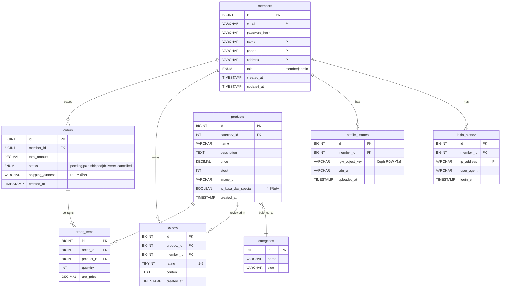

# DB 스키마 설계 — kosa-day

> MySQL 8.0 / Percona XtraDB Cluster 호환
> 작성: 2026-05-12

---

## 목차

1. [개요 — PII 분류 기준](#1-개요--pii-분류-기준)
2. [ER 다이어그램](#2-er-다이어그램)
3. [테이블 상세](#3-테이블-상세)
4. [인덱스 설계](#4-인덱스-설계)
5. [AWS RDS Replica 뷰 (PII 마스킹)](#5-aws-rds-replica-뷰-pii-마스킹)
6. [Migration 전략](#6-migration-전략)
7. [샘플 시드 데이터](#7-샘플-시드-데이터)

---

## 1. 개요 — PII 분류 기준

### PII (개인식별정보) 정의
개인정보보호법 기준으로 다음에 해당하면 PII:
- 이름, 이메일, 전화번호, 주소
- 생년월일, 성별
- 결제 정보 (카드번호 등)
- 행동 로그도 식별 가능하면 PII

### 본 프로젝트의 PII 분류

| 컬럼명 | 분류 | 처리 방침 |
|---|---|---|
| `members.email`, `members.phone`, `members.name`, `members.address` | 🔴 **순수 PII** | Onprem만, AWS Replica에서 NULL 또는 해시 |
| `members.id`, `orders.member_id` | 🟡 **가명 정보 (pseudonymous)** | AWS 가도 OK (단독으론 식별 불가) |
| `products.*`, `categories.*`, `reviews.content` | 🟢 **non-PII** | AWS 자유 사용 |
| `orders.total_amount`, `orders.created_at` | 🟢 **non-PII** | AWS 자유 사용 |
| `reviews.member_id` | 🟡 **가명 정보** | AWS OK |

> **원칙**: PII 컬럼은 Percona PXC에만 존재. AWS RDS Replica로 복제 시 View로 마스킹 또는 NULL.

---

## 2. ER 다이어그램



---

## 3. 테이블 상세

### 3.1 `members` (회원 — 🔴 PII 핵심)

```sql
CREATE TABLE members (
  id              BIGINT       NOT NULL AUTO_INCREMENT,
  email           VARCHAR(255) NOT NULL COMMENT 'PII: 이메일',
  password_hash   VARCHAR(255) NOT NULL COMMENT 'bcrypt hash',
  name            VARCHAR(100) NOT NULL COMMENT 'PII: 이름',
  phone           VARCHAR(20)  NULL     COMMENT 'PII: 전화번호',
  address         VARCHAR(500) NULL     COMMENT 'PII: 주소',
  role            ENUM('member', 'admin') NOT NULL DEFAULT 'member',
  status          ENUM('active', 'inactive', 'banned') NOT NULL DEFAULT 'active',
  email_verified  BOOLEAN      NOT NULL DEFAULT FALSE,
  created_at      TIMESTAMP    NOT NULL DEFAULT CURRENT_TIMESTAMP,
  updated_at      TIMESTAMP    NOT NULL DEFAULT CURRENT_TIMESTAMP
                              ON UPDATE CURRENT_TIMESTAMP,
  PRIMARY KEY (id),
  UNIQUE KEY uk_email (email),
  KEY idx_role (role),
  KEY idx_created_at (created_at)
) ENGINE=InnoDB
  DEFAULT CHARSET=utf8mb4
  COMMENT='회원 정보 (PII 포함, Onprem 전용)';
```

**접근 제한**:
- 이 테이블에 직접 SELECT 가능한 K8s namespace: `pii-protected`만
- AWS Replica에는 마스킹된 view만 노출 (5장 참고)

---

### 3.2 `profile_images` (프로필 이미지 메타)

```sql
CREATE TABLE profile_images (
  id               BIGINT       NOT NULL AUTO_INCREMENT,
  member_id        BIGINT       NOT NULL,
  rgw_object_key   VARCHAR(500) NOT NULL COMMENT 'Ceph RGW 객체 경로',
  cdn_url          VARCHAR(500) NULL     COMMENT 'CloudFront URL (선택)',
  file_size_bytes  INT          NOT NULL,
  mime_type        VARCHAR(50)  NOT NULL,
  uploaded_at      TIMESTAMP    NOT NULL DEFAULT CURRENT_TIMESTAMP,
  PRIMARY KEY (id),
  KEY idx_member_id (member_id),
  CONSTRAINT fk_profile_member
    FOREIGN KEY (member_id) REFERENCES members(id) ON DELETE CASCADE
) ENGINE=InnoDB
  DEFAULT CHARSET=utf8mb4
  COMMENT='회원 프로필 이미지 (RGW 메타)';
```

**Note**: 실제 이미지 파일은 Ceph RGW S3 bucket에 저장. DB엔 경로만.

---

### 3.3 `categories` (상품 카테고리 — 🟢 non-PII)

```sql
CREATE TABLE categories (
  id          INT          NOT NULL AUTO_INCREMENT,
  name        VARCHAR(100) NOT NULL,
  slug        VARCHAR(100) NOT NULL,
  parent_id   INT          NULL COMMENT '계층 구조 (트리)',
  created_at  TIMESTAMP    NOT NULL DEFAULT CURRENT_TIMESTAMP,
  PRIMARY KEY (id),
  UNIQUE KEY uk_slug (slug),
  KEY idx_parent (parent_id)
) ENGINE=InnoDB
  DEFAULT CHARSET=utf8mb4
  COMMENT='상품 카테고리';
```

---

### 3.4 `products` (상품 — 🟢 non-PII)

```sql
CREATE TABLE products (
  id                    BIGINT        NOT NULL AUTO_INCREMENT,
  category_id           INT           NOT NULL,
  name                  VARCHAR(255)  NOT NULL,
  description           TEXT          NULL,
  price                 DECIMAL(10,2) NOT NULL,
  stock                 INT           NOT NULL DEFAULT 0,
  image_url             VARCHAR(500)  NULL,
  is_kosa_day_special   BOOLEAN       NOT NULL DEFAULT FALSE
                                       COMMENT 'kosa-day 이벤트 한정 상품',
  view_count            INT           NOT NULL DEFAULT 0,
  status                ENUM('available', 'sold_out', 'discontinued')
                                       NOT NULL DEFAULT 'available',
  created_at            TIMESTAMP     NOT NULL DEFAULT CURRENT_TIMESTAMP,
  updated_at            TIMESTAMP     NOT NULL DEFAULT CURRENT_TIMESTAMP
                                       ON UPDATE CURRENT_TIMESTAMP,
  PRIMARY KEY (id),
  KEY idx_category (category_id),
  KEY idx_kosa_day (is_kosa_day_special, status),
  KEY idx_price (price),
  FULLTEXT KEY ft_name_desc (name, description),
  CONSTRAINT fk_product_category
    FOREIGN KEY (category_id) REFERENCES categories(id)
) ENGINE=InnoDB
  DEFAULT CHARSET=utf8mb4
  COMMENT='상품 (AWS Replica 자유 사용 가능)';
```

---

### 3.5 `orders` (주문 — 🟡 가명 정보 + 🔴 부분 PII)

```sql
CREATE TABLE orders (
  id                BIGINT        NOT NULL AUTO_INCREMENT,
  member_id         BIGINT        NOT NULL COMMENT '가명: members.id 참조',
  total_amount      DECIMAL(12,2) NOT NULL,
  status            ENUM('pending', 'paid', 'shipped', 'delivered', 'cancelled', 'refunded')
                                  NOT NULL DEFAULT 'pending',
  shipping_address  VARCHAR(500)  NULL COMMENT 'PII: 배송 주소 스냅샷',
  shipping_phone    VARCHAR(20)   NULL COMMENT 'PII: 배송 전화번호',
  payment_method    ENUM('card', 'bank_transfer', 'point')
                                  NULL,
  paid_at           TIMESTAMP     NULL,
  created_at        TIMESTAMP     NOT NULL DEFAULT CURRENT_TIMESTAMP,
  updated_at        TIMESTAMP     NOT NULL DEFAULT CURRENT_TIMESTAMP
                                  ON UPDATE CURRENT_TIMESTAMP,
  PRIMARY KEY (id),
  KEY idx_member (member_id),
  KEY idx_status (status, created_at),
  KEY idx_created (created_at),
  CONSTRAINT fk_order_member
    FOREIGN KEY (member_id) REFERENCES members(id)
) ENGINE=InnoDB
  DEFAULT CHARSET=utf8mb4
  COMMENT='주문 (PII 부분 포함 - shipping)';
```

> **결정**: shipping 정보(주소/전화)는 회원 가입 후 변경 가능. 주문 시점의 정보를 스냅샷으로 저장. → PII로 분류.

---

### 3.6 `order_items` (주문 항목 — 🟢 non-PII)

```sql
CREATE TABLE order_items (
  id           BIGINT        NOT NULL AUTO_INCREMENT,
  order_id     BIGINT        NOT NULL,
  product_id   BIGINT        NOT NULL,
  quantity     INT           NOT NULL,
  unit_price   DECIMAL(10,2) NOT NULL COMMENT '주문 시점 가격 (스냅샷)',
  PRIMARY KEY (id),
  KEY idx_order (order_id),
  KEY idx_product (product_id),
  CONSTRAINT fk_oi_order
    FOREIGN KEY (order_id) REFERENCES orders(id) ON DELETE CASCADE,
  CONSTRAINT fk_oi_product
    FOREIGN KEY (product_id) REFERENCES products(id)
) ENGINE=InnoDB
  DEFAULT CHARSET=utf8mb4
  COMMENT='주문 항목';
```

---

### 3.7 `reviews` (리뷰 — 🟢 non-PII)

```sql
CREATE TABLE reviews (
  id           BIGINT       NOT NULL AUTO_INCREMENT,
  product_id   BIGINT       NOT NULL,
  member_id    BIGINT       NOT NULL COMMENT '가명: 작성자 식별',
  rating       TINYINT      NOT NULL COMMENT '1-5',
  title        VARCHAR(255) NULL,
  content      TEXT         NULL,
  helpful_count INT         NOT NULL DEFAULT 0,
  created_at   TIMESTAMP    NOT NULL DEFAULT CURRENT_TIMESTAMP,
  PRIMARY KEY (id),
  KEY idx_product (product_id, created_at),
  KEY idx_member (member_id),
  KEY idx_rating (rating),
  CONSTRAINT fk_review_product
    FOREIGN KEY (product_id) REFERENCES products(id) ON DELETE CASCADE,
  CONSTRAINT fk_review_member
    FOREIGN KEY (member_id) REFERENCES members(id),
  CONSTRAINT chk_rating CHECK (rating BETWEEN 1 AND 5)
) ENGINE=InnoDB
  DEFAULT CHARSET=utf8mb4
  COMMENT='상품 리뷰 (AWS Replica 분석용)';
```

---

### 3.8 `login_history` (로그인 이력 — 🔴 PII)

```sql
CREATE TABLE login_history (
  id           BIGINT       NOT NULL AUTO_INCREMENT,
  member_id    BIGINT       NOT NULL,
  ip_address   VARCHAR(45)  NOT NULL COMMENT 'PII: IPv4/IPv6',
  user_agent   VARCHAR(500) NULL,
  login_at     TIMESTAMP    NOT NULL DEFAULT CURRENT_TIMESTAMP,
  result       ENUM('success', 'failed_password', 'failed_locked')
                            NOT NULL,
  PRIMARY KEY (id),
  KEY idx_member_time (member_id, login_at DESC),
  CONSTRAINT fk_login_member
    FOREIGN KEY (member_id) REFERENCES members(id) ON DELETE CASCADE
) ENGINE=InnoDB
  DEFAULT CHARSET=utf8mb4
  COMMENT='로그인 이력 (PII: IP)';
```

> **정책**: 90일 이후 IP 마스킹 (`192.168.1.X`로 마지막 옥텟 제거).

---

## 4. 인덱스 설계

### 핵심 쿼리 패턴과 대응 인덱스

| 쿼리 패턴 | 인덱스 |
|---|---|
| 회원 로그인 (email 검색) | `members.uk_email` |
| 상품 카테고리별 조회 + 가격 정렬 | `products(category_id, price)` |
| kosa-day 특별 상품 조회 | `products(is_kosa_day_special, status)` |
| 회원의 최근 주문 조회 | `orders(member_id, created_at DESC)` |
| 상품 검색 (자연어) | `products FULLTEXT(name, description)` |
| 상품별 리뷰 최신순 | `reviews(product_id, created_at DESC)` |
| 관리자 — 미발송 주문 조회 | `orders(status, created_at)` |

### 인덱스 주의사항
- **Percona PXC는 PK가 반드시 있어야 함** (multi-master 충돌 해소)
- AUTO_INCREMENT 사용 시 `wsrep_auto_increment_control=ON` 설정
- FULLTEXT 인덱스는 ngram 파서 사용 (한글 검색):
  ```sql
  ALTER TABLE products ADD FULLTEXT KEY ft_name_desc (name, description) WITH PARSER ngram;
  ```

---

## 5. AWS RDS Replica 뷰 (PII 마스킹)

### 원칙
- Percona의 모든 테이블이 binlog로 RDS에 복제됨
- **RDS에서는 PII 컬럼을 직접 SELECT 못 하게 view로 제한**
- 앱은 RDS 접근 시 view만 사용

### View 정의

```sql
-- RDS Read Replica에서 실행 (또는 Percona에 만들어도 됨)

-- 1) members → 가명화된 view
CREATE OR REPLACE VIEW v_members_safe AS
SELECT
  id,
  CONCAT('user_', id) AS pseudonym,     -- 가명 ID
  role,
  status,
  created_at,
  updated_at
FROM members;

-- 2) orders → shipping 정보 제거
CREATE OR REPLACE VIEW v_orders_safe AS
SELECT
  id,
  member_id,
  total_amount,
  status,
  payment_method,
  paid_at,
  created_at,
  updated_at
  -- shipping_address, shipping_phone 제외
FROM orders;

-- 3) reviews → 그대로 (member_id는 가명 식별자)
-- 별도 view 불필요

-- 4) login_history → AWS로 복제 안 함 (binlog filter)
```

### binlog filter 설정 (RDS 측)

```sql
-- RDS는 직접 my.cnf 수정 불가 → 파라미터 그룹에서 설정
-- 또는 외부 도구(DMS, MaxScale)로 필터링

-- Percona 측 (이게 더 안전)
-- /etc/mysql/my.cnf:
[mysqld]
binlog-do-db = kosa_day
replicate-ignore-table = kosa_day.login_history
replicate-ignore-table = kosa_day.profile_images
# (이미지 메타는 RDS에 필요 없음)
```

### 앱의 ProxySQL 라우팅 시 주의

```sql
-- 절대 금지: members 테이블 직접 SELECT를 AWS로 라우팅하면 PII 유출
-- ProxySQL rule:
INSERT INTO mysql_query_rules
  (rule_id, active, match_pattern, destination_hostgroup, apply, comment)
VALUES
  -- members 테이블은 무조건 Onprem (writer hostgroup 또는 onprem reader)
  (5, 1, '^SELECT.*FROM\\s+(members|profile_images|login_history)',
   20, 1, 'PII tables → Onprem only'),

  -- 안전 view만 AWS로
  (6, 1, '^SELECT.*FROM\\s+v_(members_safe|orders_safe)',
   30, 1, 'Safe views → AWS Replica');
```

---

## 6. Migration 전략

### 도구
- **Alembic** (Python SQLAlchemy 표준)
- 또는 **Flyway** (Java 기반, 더 안정적)

### 마이그레이션 흐름

```
1. 개발자가 모델 변경 (FastAPI 코드)
       ↓
2. alembic revision --autogenerate -m "add review helpful_count"
       ↓
3. alembic upgrade head (local DB)
       ↓
4. git commit
       ↓
5. GitHub Actions: alembic upgrade head (staging)
       ↓
6. ArgoCD: production 배포 (init container에서 alembic upgrade head)
```

### Multi-master 주의

Percona PXC는 DDL이 cluster-wide로 적용됨:
- TOI (Total Order Isolation): 짧은 DDL — 모두 잠시 멈춤
- RSU (Rolling Schema Upgrade): 긴 DDL — 노드별 순차 적용

대량 데이터 마이그레이션은 RSU로:
```sql
SET SESSION wsrep_OSU_method = 'RSU';
ALTER TABLE big_table ADD COLUMN new_col VARCHAR(100);
SET SESSION wsrep_OSU_method = 'TOI';
```

---

## 7. 샘플 시드 데이터

### 카테고리

```sql
INSERT INTO categories (name, slug) VALUES
  ('도서', 'books'),
  ('굿즈', 'goods'),
  ('전자기기', 'electronics'),
  ('의류', 'clothing');
```

### 상품 (kosa-day 한정 포함)

```sql
INSERT INTO products (category_id, name, description, price, stock, is_kosa_day_special)
VALUES
  -- 일반 상품
  (1, '도커 완전 정복', '컨테이너 입문서', 35000, 100, FALSE),
  (1, 'Kubernetes 운영 가이드', 'K8s 실전 가이드', 42000, 50, FALSE),
  (3, '기계식 키보드 (87키)', '체리 청축', 159000, 30, FALSE),

  -- kosa-day 특별 상품
  (2, '[kosa-day] KOSA 한정 후드티', '한정 100장', 49000, 100, TRUE),
  (3, '[kosa-day] 무선 마우스 50%', '한정 200개', 15000, 200, TRUE),
  (1, '[kosa-day] 베스트셀러 3권 묶음', '70% 할인', 25000, 50, TRUE);
```

### 더미 회원 (테스트용)

```sql
INSERT INTO members (email, password_hash, name, phone, address, role)
VALUES
  ('admin@kosa-day.local', '$2b$12$...', '관리자', '010-0000-0000', '서울시', 'admin'),
  ('user1@example.com', '$2b$12$...', '홍길동', '010-1234-5678', '서울시 강남구', 'member'),
  ('user2@example.com', '$2b$12$...', '김영희', '010-2345-6789', '경기도 성남시', 'member');
-- ...JMeter 부하용으로 1000명 정도 시드 추가
```

### 더미 데이터 자동 생성 스크립트 (Python)

```python
# scripts/seed_data.py
from faker import Faker
import mysql.connector
import bcrypt

fake = Faker('ko_KR')

def seed_members(conn, n=1000):
    cur = conn.cursor()
    for _ in range(n):
        email = fake.email()
        name = fake.name()
        phone = fake.phone_number()
        address = fake.address()
        pw = bcrypt.hashpw(b'password123', bcrypt.gensalt()).decode()
        cur.execute("""
          INSERT INTO members (email, password_hash, name, phone, address, role)
          VALUES (%s, %s, %s, %s, %s, 'member')
        """, (email, pw, name, phone, address))
    conn.commit()

if __name__ == '__main__':
    conn = mysql.connector.connect(
        host='proxysql.kosa-day.svc.cluster.local',
        user='kosa_app',
        password='...',
        database='kosa_day'
    )
    seed_members(conn, 1000)
```

---

## 부록: 정량적 데이터 (참고)

| 항목 | 평시 | 이벤트 시 |
|---|---|---|
| 회원 수 | ~1,000 | (변동 없음) |
| 일평균 주문 | ~50 | ~5,000 (100배) |
| RPS | ~10 | ~1,000 |
| DB Read QPS | ~50 | ~5,000 |
| DB Write QPS | ~5 | ~500 |
| 활성 세션 | ~20 | ~2,000 |

→ 이 숫자가 JMeter 시나리오 설계의 기준.

---

## 변경 이력

| 일자 | 내용 |
|---|---|
| 2026-05-12 | 초안 작성 |
